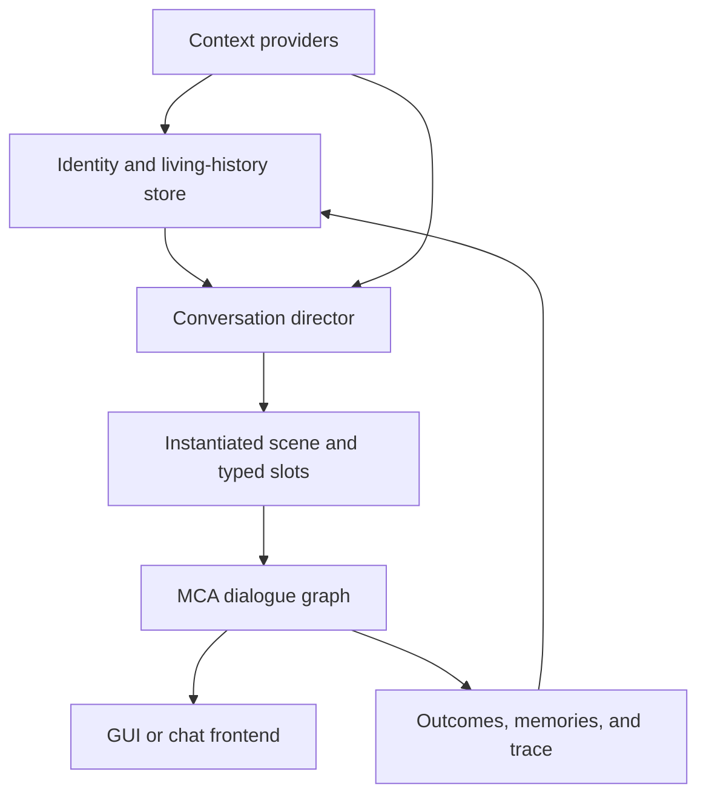
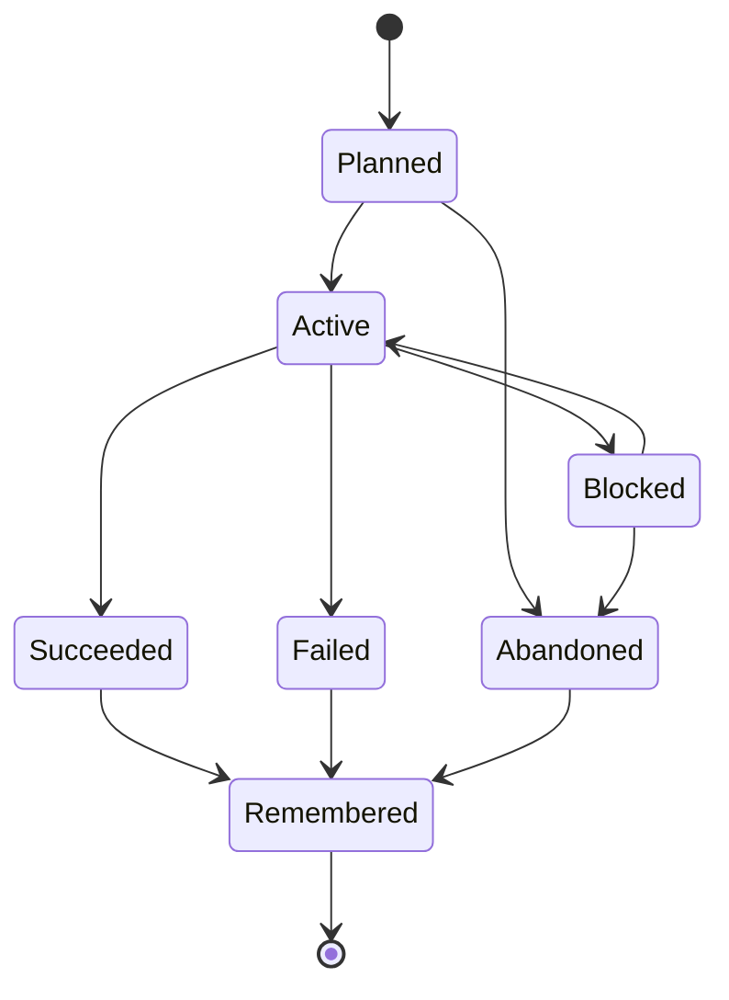

# MCA: Conversations — Living Histories and Dynamic Dialogue Expansion Specification

> **Second-generation implementation plan for coding agents**
>
> Target repository: [`otectus/MCAConversations`](https://github.com/otectus/MCAConversations)
>
> Completed baseline reviewed: commit [`023e00c`](https://github.com/otectus/MCAConversations/commit/023e00c3472d02f6bc6e489a668b506559f88019), release 1.4.0
>
> MCA Reborn compatibility reference: branch [`1.20.1`](https://github.com/Luke100000/minecraft-comes-alive/tree/1.20.1), commit [`4d82455`](https://github.com/Luke100000/minecraft-comes-alive/commit/4d824551b30654e5792e19e84f3933e3e3d90ea2)
>
> Review date: 2026-08-26

This document begins **after** the coherence-first overhaul in
`MCAConversations-Coherence-and-Expansion-Spec.md`. That work is the new baseline, not unfinished
business. Do not spend this release recreating beat contracts, splitting the old semantic funnels,
giving every profession six pages, or adding the first callback to each standard topic. Those things
now exist.

The next problem is subtler and larger: two farmers with the same personality can still have much
the same conversational life. They may choose different variants, but neither has accumulated a
specific working week, a stable preference, an opinion of a named neighbour, a remembered
disagreement, a personal history, or a reason to raise one subject instead of another. The next
expansion must turn the excellent static corpus into a **bounded, deterministic, data-driven living
conversation system** without becoming an LLM, inventing facts, or abandoning MCA's dialogue
engine.

---

## 1. Required outcome

The release succeeds when a player can know villagers as individuals rather than as combinations of
profession, personality, age, and heart threshold.

After several in-game weeks, the player should be able to say all of the following truthfully:

- “Mara is the farmer who trusts old seed, worries about the east field, and still remembers that I
  dismissed the blight until it spread.”
- “Tomas and Mara are both farmers, but Tomas talks first about prices and tools while Mara talks
  about soil, family land, and whether the village will eat.”
- “The librarian resumed the damaged-volume problem we discussed three days ago; the reply buttons
  referred to the actual volume and its current state, not to a generic book problem.”
- “A guard interrupted our usual small talk because something happened on the night watch, and the
  next conversation acknowledged what I promised to do.”
- “When I returned after a long absence, my spouse, my child, a close friend, and a hostile villager
  reacted differently for reasons consistent with our shared histories.”
- “Every offered answer still made literal, emotional, temporal, and referential sense after the
  exact line on screen.”

The governing rule is:

> **Variation must come from who this villager is, what has happened, what is happening now, and what
> the two speakers remember—not from a larger random synonym bag.**

### 1.1 Definitions used throughout this plan

| Term | Required meaning |
|---|---|
| **Coherent** | Every reply answers the exact preceding speech act, preserves its facts, resolves its referents, matches its emotional state, and does not assume an event or promise that never happened. |
| **Villager-specific** | Selection or wording is caused by stable identity, profession details, family/social ties, lived events, or shared player history—not merely a random variant or a personality prefix. |
| **Dynamic** | Conversation changes when time, activity, location, episode state, relationships, events, or prior choices change. |
| **Engaging** | The exchange creates curiosity, agency, consequence, humor, intimacy, disagreement, or useful information; it is not a questionnaire followed by interchangeable acknowledgements. |
| **Persistent** | A later exchange can accurately resume a prior subject with the right participants, state, tense, privacy, and player commitment. |
| **Bounded** | CPU, save size, candidate count, memory growth, and content combinations have explicit caps and deterministic pruning. |

---

## 2. Verified baseline and the new ceiling

### 2.1 The completed 1.4.0 baseline

The reviewed head is one commit beyond the previous audit baseline and represents a very large
implementation, not a partial draft.

| Measure at `023e00c` | Verified value |
|---|---:|
| Dialogue question nodes | 555 |
| Player buttons | 2,105 |
| Beat contracts | 2,448 |
| Reply contracts | 2,058 |
| English keys | 8,937 |
| Brazilian Portuguese keys | 8,937 |
| Profession profiles | 37 |
| Chat intents | 1,549 |
| Referenced `say` pools | 2,367 |
| Personality-overlaid referenced pools | 418 (17.7%) |
| Java production classes | 172 |
| Java test classes | 90 |
| Dialogue JSON files | 555 |

The previous overhaul added or changed roughly 110,000 lines across 300 files. It established:

- explicit beat and reply meaning;
- zero uncontracted routes in the shipped corpus;
- profession-specific pages and six standard work subjects for all 37 professions;
- relationship bands in place of scattered raw heart gates;
- voice-family-authored signature overlays expanded into all 21 personality namespaces;
- declared callbacks for existing arcs and callbacks for work plus seven standard topics;
- full GUI-to-chat reply reachability;
- deterministic adjacency and coverage reports;
- structural, localization, parity, callback, depth, profession, and reload-resilience tests.

Preserve all of this. The next architecture extends it.

### 2.2 What the current state models can and cannot remember

| Existing mechanism | What it does well | Ceiling that matters now |
|---|---|---|
| `ConversationSession` | Keeps the current topic, offer, beat, subject, stance, outcome, up to 24 semantic facts, and eight recent beats. | It is transient, per player, and intentionally loses all semantic detail at timeout/restart. It cannot resume a concrete person, object, cause, or work episode. |
| `ProgressRecord` | Persists daily budgets, decision IDs, up to 32 numeric arcs, 128 milestones, and 32 exclusive choices. | It stores identifiers and integers, not typed episodes, participants, timestamps, privacy, provenance, values, or narrative state. “Arc 2” cannot explain what actually happened. |
| MCA `LongTermMemory` | Provides durable or expiring boolean-like keys and player-scoped gates. | It is a string-to-expiry map. It cannot safely store a named target, changing project state, belief confidence, or a player's actual promise. |
| Disposition vector | Tracks trust, respect, warmth, attraction, tension, and familiarity per villager/player. | It tells how a villager feels about the player, not why, what topic caused it, or what should be said next. |
| `InteriorityProfile` | Supplies personality baselines and stance biases. | A personality affects reaction math but does not create a stable hobby, value, habit, work method, private conflict, or history. |
| `VoiceFamily` | Gives six coherent approaches to high-salience wording. | Voice answers **how** a line is said. It must not be mistaken for **what this individual has lived**. |
| `ProfessionProfile` | Declares archetype, materials, risks, beneficiaries, detailed subjects, and callback types. | Coverage currently requires six generic work pages. The six additional profession-specific subjects in every profile are valuable data, but they are not yet a living sequence of projects and outcomes. |
| Gossip log | Detects and reports village events with retention and told-state. | Events are stories in a village log, not individual observations with source, confidence, privacy, competing interpretations, or social consequences. |

### 2.3 The most important verified content gap

Every profession profile declares at least twelve subjects. Six are a standard scaffold:
`current_task`, `craft`, `risk`, `village_value`, `learning`, and `aspiration`. Six more are genuinely
profession-specific: farmers have `crop_health`, `soil`, `harvest`, `pests`, `inherited_land`, and
`trade_prices`; librarians have `acquisition`, `catalogue`, `damaged_volume`, `literacy`,
`local_history`, and `quiet`; guards have `patrol`, `shift_fatigue`, `recent_threat`, `equipment`,
`weak_points`, and `protecting_named`.

The present profession test correctly guarantees at least six opener pages. It does **not** yet
prove that every detailed subject is authored, that a subject changes state, that the villager has a
specific current project, or that a callback refers to the same object and outcome. The profile is a
rich taxonomy attached to a mostly static six-page conversation.

That is the first place the new system should become visibly alive.

### 2.4 The new failure modes to prevent

The old release's central failure was a semantic non-sequitur. The next release can be mechanically
adjacent and still fail in more advanced ways:

1. **False memory** — “You said you would bring iron” when the player offered sympathy, not iron.
2. **Identity drift** — the same villager has mutually exclusive preferences on different days with
   no change event.
3. **State drift** — a project is “still blocked” after a success callback already resolved it.
4. **Referent drift** — “How is she?” after the named person died, moved away, or was never named.
5. **Temporal drift** — “tomorrow's harvest” after the deadline or “again” on a first encounter.
6. **Knowledge leakage** — a villager discusses a private disclosure they could not know.
7. **Combinatorial sameness** — thousands of generated lines that are one template with nouns
   swapped, giving statistical volume without characterization.
8. **Random initiative** — villagers interrupt the player with low-value chatter because a timer
   fired, rather than because there is something salient to say.
9. **Untrackable promises** — the game lets a player promise an action it has no way to observe, then
   arbitrarily judges it kept or broken.
10. **Localization by fragments** — English-shaped concatenation produces broken Portuguese grammar.

Every later section supplies a structural answer to one or more of these.

---

## 3. Product requirements and non-goals

### 3.1 Non-negotiable requirements

1. Keep MCA's dialogue JSON and selection path authoritative for the actual exchange.
2. Keep the system deterministic and datapack-driven. No online service, generative model, or opaque
   runtime text generation may be required.
3. Preserve all 1.4.0 semantic contracts and fail any new route that is less checkable.
4. Give every persistent callback a typed subject, state, timestamp, and participant set.
5. Separate stable identity from personality voice, acute emotion, profession, and player-specific
   relationship.
6. Never invent a world fact when the relevant integration is absent or a compat read fails.
7. Let an unknown value degrade to a neutral, honest line—not to a confident fabricated detail.
8. Keep GUI and chat mode behaviorally equivalent. Group conversation may begin as chat-only, but
   dyadic choices and consequences must stay identical across both frontends.
9. Maintain complete English and Brazilian Portuguese key/placeholder parity in every namespace.
10. Keep existing saves valid and preserve existing arcs, milestones, disposition, memories, and
    affection budgets.
11. Keep MCA and optional mods behind compatibility interfaces and runtime binding. Do not restore
    compile-time MCA links.
12. Bound save growth, selection work, social graph size, event retention, and all generated content.
13. Expose trace output sufficient to explain **why this villager raised this subject now**.
14. Ship vertical slices that are playable and testable; do not land a giant unused state model.

### 3.2 Explicit non-goals

- Do not build a general natural-language AI.
- Do not synthesize arbitrary sentences from fragments.
- Do not simulate an economy, farming, manufacturing, or relationship network in more detail than
  the conversation can observe and use.
- Do not create one complete dialogue tree per personality × profession × age × relationship × mood.
- Do not expose hidden numerical scores or “personality trait cards” in ordinary play.
- Do not turn every conversation into a quest or reward faucet.
- Do not make villagers omniscient about chunks, players, or residents they have no route to know.
- Do not replace authored dialogue with a procedural grammar.
- Do not punish players for commitments the game could not track.
- Do not treat raw line count as the quality target.

---

## 4. Player-experience principles

### 4.1 Recognition before novelty

A callback to a real shared event is more valuable than a never-before-seen generic line. Selection
must prefer a coherent unresolved thread or a salient personal callback before cold random novelty.

### 4.2 Specificity must have a source

Every concrete detail must come from one of five places:

1. stable villager profile;
2. current world/MCA context;
3. an observed event;
4. an explicit player choice or self-disclosure;
5. a datapack-authored neutral fallback.

The trace must name the source. “Selected because farmer” is not enough when the line names a wet
field, a sister, or an old promise.

### 4.3 Individuality is selection plus continuity

Different wording helps, but the strongest distinction is that villagers choose different subjects,
care about different aspects of the same work, remember different moments, and respond to the player
through different histories.

### 4.4 Disagreement is content

An engaging villager is not one who always rewards the nicest-looking button. Stable values should
create respectful disagreement, humor that lands differently, competing village interpretations,
and repairable friction. Hostility must remain authored, bounded, and intelligible.

### 4.5 Privacy is a relationship mechanic

A guarded villager may know a fact and decline to share it. Another may share the public part but not
the source. A third may be wrong. These are distinct states, not generic “no” variants.

### 4.6 The villager may have an agenda

The player should not always perform an interview. A villager may ask for an opinion, check whether a
promise was kept, revisit a disagreement, tell the player something first, or decline because their
attention is elsewhere. Initiative is earned by salience and relationship, not by spam probability.

---

## 5. Target architecture

The new layer should plan a conversation scene from structured state, then hand that scene to the
same contracted MCA dialogue engine that exists today.



### 5.1 Responsibility boundaries

| Component | Owns | Must not own |
|---|---|---|
| Context providers | Read-only facts about the villager, player, world, village, activity, and optional integrations. | Narrative state or dialogue consequences. |
| Identity service | Stable, deterministic personal anchors and slow life changes. | Acute mood, player-specific trust, or random daily topics. |
| Living-history store | Typed episodes, commitments, player claims, social opinions, and resumable threads. | Raw dialogue graph topology or translated prose. |
| Conversation director | Candidate generation, eligibility, scoring, repetition control, and scene choice. | Writing sentences or bypassing beat/reply contracts. |
| Scene catalog | Authored scene templates, slot requirements, semantic frames, routes, and content ownership. | World queries or persistence implementation. |
| MCA dialogue graph | Buttons, result selection, consequences, and frontend parity. | Long-lived scene planning or hidden procedural text generation. |
| Compiler and lints | Generate runtime JSON/lang/intents and prove static and instantiated invariants. | Runtime state mutation. |

### 5.2 Architectural rule: parameterize facts, not meanings

It is safe for one contracted scene to say “the **east field** is too wet” or “the **orchard** is too
wet” if both variants establish the same typed condition: `worksite moisture = wet`. It is **not**
safe for one pool to say “the field is too wet” and another variant to say “the harvest was saved,”
because those lines require different replies and episode states.

When meaning differs, route through a distinct beat. When only a typed noun, name, amount, location,
or date differs, use a slot.

---

## 6. Layered individuality model

Individuality must compose from layers with different scopes and update rates.

| Layer | Examples | Scope | Update cadence |
|---|---|---|---|
| Stable identity | interests, values, work style, conversational habit, comfort, aversion, origin motif | villager | generated once; explicit life-event migration only |
| Life history | former profession, mentor, formative event, family milestones, moved village | villager | on observed life event |
| Social position | family ties, coworkers, trusted neighbour, rivalry, responsibility | villager↔villager or derived relation | on relation/event change; bounded |
| Shared player history | promises, disclosures, disagreements, repairs, visits, player claims | villager↔player | on authored choice or observed action |
| Current episode | project, obstacle, deadline, success, failure, unresolved question | villager or villager↔player | event/state transition |
| Acute context | activity, place, time, weather, health, nearby people, carried object | conversation snapshot | captured at entry/turn |
| Relationship state | hearts, band, disposition axes, spouse/family status | villager↔player | existing systems |
| Voice | personality namespace, voice family, age voice | villager | MCA state; wording only |

### 6.1 `VillagerIdentityRecord`

Create a versioned, bounded profile keyed by villager UUID. It should contain identifiers, not prose:

```java
public record VillagerIdentityRecord(
        int schemaVersion,
        long profileSeed,
        String originMotif,
        Set<String> interests,
        Set<String> values,
        Set<String> comforts,
        Set<String> aversions,
        String workStyle,
        String socialStyle,
        String disclosureStyle,
        Optional<String> formativeEvent,
        Optional<String> formerProfession,
        long lastLifeChangeDay
) {}
```

Recommended hard caps per villager:

- two interests;
- two values;
- one comfort and one aversion;
- one work, social, and disclosure style;
- one active formative-event motif;
- one former-profession token, with older career history compressed to a milestone.

These anchors are enough to make repeated selection distinctive without constructing a simulated
personality inventory.

### 6.2 Deterministic generation

Generate a profile lazily on first meaningful interaction using a stable seed derived from world
seed, villager UUID, and profile schema—not from current day, name, position, or player UUID.

The generator must:

1. gather eligible tokens by age, profession/archetype, personality, traits, family state, biome or
   village context;
2. choose from weighted candidates with a seeded RNG;
3. enforce incompatibility and redundancy rules;
4. persist the chosen tokens so future balance changes do not rewrite existing villagers;
5. record the generation version;
6. leave an existing profile unchanged unless an explicit migration says otherwise.

Profile generation must never infer sensitive identity from a profession or personality. A cleric is
not automatically devout in a particular way; an outlaw is not automatically cruel; a “sensitive”
villager is not fragile; a nitwit is not incompetent. Tokens describe conversational concerns, not
diagnoses or stereotypes.

### 6.3 Identity token taxonomy

Start with a deliberately finite catalog.

| Token family | Example tokens | What it changes |
|---|---|---|
| Interests | local_history, animals, mechanisms, cooking, exploration, music, gardening, games, stories, weather | Optional topic availability, examples, questions asked back. |
| Values | duty, independence, tradition, mercy, precision, hospitality, ambition, fairness, privacy, curiosity | Scene weighting and how disagreements resolve. |
| Comforts | early_morning, crowded_table, rain_on_roof, orderly_tools, familiar_route | Positive small talk and recovery beats. |
| Aversions | waste, lateness, boasting, crowds, silence, risk_without_reason, gossip, disorder | Boundaries, humor fit, and low-stakes conflict. |
| Work styles | methodical, improvising, teaching, solitary, collaborative, perfectionist, pragmatic | Which profession subjects recur and what kind of help is welcome. |
| Social styles | host, listener, mediator, storyteller, challenger, observer | Initiative and named-person scene weighting. |
| Disclosure styles | direct, reciprocal, sideways, gradual, humorous, reluctant | Route shape, not mere adjectives in prose. |
| Origin motifs | village_born, joined_family, followed_work, returned_home, displaced, traveller_settled | Life/history scenes, only when compatible with observed residency. |

### 6.4 Identity changes without identity drift

Only explicit transitions may alter stable anchors:

- age-stage change may replace one childhood interest with an adult form while preserving a
  “used_to” milestone;
- profession change updates work style eligibility and writes former profession;
- marriage, parenthood, bereavement, or moving villages may add a formative-event motif;
- an authored arc may transform one value expression, but must not silently flip the underlying
  value;
- datapack migration may rename a token through an alias table, never reroll the profile.

---

## 7. `ConversationContextSnapshot` 2.0

The previous plan called for a context snapshot; the next implementation needs a single immutable
object that every selector, condition, trace, and template reads. Never let each condition query MCA
independently and receive subtly different answers within one click.

### 7.1 Required fields

| Domain | Snapshot fields |
|---|---|
| Speaker | villager UUID/name, age group/stage, personality, voice family, traits, health band, infection band, pregnancy state when safely available |
| Work | exact profession ID, display name, archetype, current brain activity, assigned chore, workstation/workplace, relevant tool/material summary, profession-change history |
| Place | dimension, biome family, village ID/name, named/typed building, home/workplace/meeting/outdoors flag, coarse location token |
| Time | game day, time band, season, holiday, days since last conversation, days since first known, deadline relation |
| Weather | clear/rain/storm, sheltered/exposed, profession relevance |
| Player | UUID/name, health/injury band, held/carried salient tags, relationship band, hearts, disposition, spouse/family relation, recent absence |
| Social | named family relations, nearby conversation participants, relevant coworker/beneficiary, bounded opinion edges |
| Narrative | active threads, selected episode, commitments due, recent topics/beats, salient memories, unresolved rupture |
| Village | population band, recent event, notable building change, safety/spirit/need signals when a supported integration supplies them |
| Capabilities | which provider supplied each optional field and whether it is `KNOWN`, `UNKNOWN`, or `UNAVAILABLE` |

### 7.2 Provider boundary

Define a narrow, version-tolerant interface:

```java
public interface ConversationContextSource {
    String id();
    ContextCapabilities capabilities();
    void contribute(ContextSnapshotBuilder builder, ContextRequest request);
}
```

Recommended sources:

- `VanillaContextSource` — time, weather, biome, health, held items, nearby entities;
- `McaContextSource` — personality, mood, profession ID, family, residence, workplace, activity,
  chore, inventory summary, infection and MCA relationship data;
- `ConversationHistoryContextSource` — identity, episodes, commitments, player claims, threads;
- `VillageEventContextSource` — current gossip/event log and resident/building changes;
- `TownsteadContextSource` — optional needs, schedule, skills, life stage, roots, buildings, spirit;
- other optional integrations, each isolated in its own adapter.

### 7.3 MCA signals that are feasible but not yet exposed through `McaCompat`

The reviewed MCA 1.20.1 code already exposes useful methods behind its changing package root:

| MCA surface | Conversation use |
|---|---|
| `VillagerEntityMCA#getProfessionId` | Stable exact profession context and profession-change detection. |
| `VillagerBrain#getCurrentJob` | Assigned chore and player-assigned-work conversations. |
| Minecraft brain activity/schedule | Whether the villager is working, meeting, idle, resting, or panicking. |
| `Residency#getWorkplace`, `getHome`, `getHomeVillage` | Worksite/home/location-aware scenes. |
| `VillagerEntityMCA#getInventory` | Coarse, tag-based tool/material observations—never exact economic claims. |
| `FamilyTreeNode` parents, siblings, partner, children, deceased state, profession | Named family scenes and safe referent validation. |
| `Village` residents, buildings, population, reputation | Named neighbours and village-change context. |
| `Building#getType` and bounds | Smithy/library/home/inn context without block-by-block simulation. |
| `VillagerBrain#getMood`, grief, panic | Cause-compatible acute-state selection. |
| traits, infection progress, age stage | Existing and expanded health/age-sensitive dialogue. |

Extend `McaBinding`/`McaHandles` through capabilities. Preserve the current rule: unresolved members
become unknown/no-op values; no ordinary caller guards package roots or reflects directly.

### 7.4 Snapshot consistency

- Capture once when a topic or initiative scene begins.
- Refresh only fields explicitly marked volatile at a turn boundary.
- Pin the chosen episode, participant names, and semantic slots for the life of the scene.
- If a named entity disappears mid-scene, end gracefully; do not retarget the slot to another person.
- A trace must serialize the snapshot fields actually consulted, not every available world value.

---

## 8. Living-history persistence

Do not overload `ProgressRecord` or MCA's string memories with structured narrative data. Add a
separate, versioned `ConversationHistorySavedData`, pinned to the overworld like the existing
progress and disposition stores.

### 8.1 Record families

| Record | Key | Purpose |
|---|---|---|
| `VillagerIdentityRecord` | villager UUID | Stable personal anchors and slow life history. |
| `EpisodeRecord` | episode UUID or deterministic key | A concrete work, personal, social, or village situation with lifecycle state. |
| `SharedThreadRecord` | villager UUID + player UUID + thread ID | What this pair is discussing, what is owed, and which scene may resume it. |
| `CommitmentRecord` | villager UUID + player UUID + commitment ID | A trackable player or villager promise with due/observed/resolution state. |
| `PlayerClaimRecord` | villager UUID + player UUID + claim type | Something the player explicitly said about themselves, with source and correction history. |
| `SocialOpinionRecord` | speaker villager UUID + target villager UUID | Bounded directional opinion with cause, confidence, privacy, and expiry. |
| `TopicRecencyRecord` | villager UUID + player UUID | Recent subjects, scenes, outcomes, and initiative cooldowns. |

### 8.2 `EpisodeRecord`

```java
public record EpisodeRecord(
        UUID id,
        String kind,
        String subject,
        EpisodeState state,
        UUID ownerVillager,
        Set<UUID> participants,
        Map<String, NarrativeValue> payload,
        String source,
        PrivacyLevel privacy,
        Confidence confidence,
        int salience,
        long createdDay,
        long updatedDay,
        OptionalLong dueDay,
        OptionalLong expiresDay,
        Set<String> witnessedBy,
        Set<String> consumedMilestones
) {}
```

`NarrativeValue` must be a closed tagged union: localized token, registry ID, UUID reference, integer
band, date, boolean, or enum token. Never persist arbitrary translated prose.

### 8.3 Episode lifecycle



Not every episode uses every state. A scene template declares its allowed transitions, expiry, and
which observations can advance it. Runtime code must reject an undeclared transition and leave the
old state intact.

### 8.4 Shared threads

A thread is not a second dialogue tree. It is a small persistent frame that selects which authored
resume scene is eligible.

Minimum fields:

- thread template ID;
- topic and subject;
- bound episode ID, if any;
- last completed scene and outcome;
- outstanding conversational obligation;
- player stance and any introduced typed claim;
- next eligible day and expiry day;
- privacy and participant references;
- status: `OPEN`, `WAITING_ON_WORLD`, `WAITING_ON_PLAYER`, `READY_TO_RESUME`, `RESOLVED`, `LAPSED`,
  `RUPTURED`;
- resume count and last-mentioned day.

### 8.5 Trackable commitments only

A commitment template must declare its resolver:

| Resolver | Example |
|---|---|
| `gift_tag_received` | Bring any item in `forge:ingots/iron`; observed through the existing gift path. |
| `quest_state` | Complete or fail a real MCA: Quests objective. |
| `visit_after_day` | Return after a stated day; observed by interaction time. |
| `conversation_choice` | Speak to the same villager and choose a declared follow-up. |
| `event_observed` | A supported event log records the relevant village change. |
| `manual_neutral` | The promise is acknowledged but never judged; used only when prose avoids claiming success/failure. |

If no resolver exists, the button must be phrased as willingness, hope, or discussion—not “I promise
I will do X.”

### 8.6 Player claims and correction

The game may remember only what the player explicitly selected or typed through a bound semantic
intent. Store the claim type, value token, originating reply/intent, day, and confidence
`SELF_REPORTED`. A later contradiction opens a clarification scene; it must not silently overwrite
the old claim or accuse the player of lying by default.

Examples suitable for bounded storage:

- preferred food family;
- likes/dislikes rain;
- values directness or privacy;
- has been to a named dimension/biome only when observed or explicitly claimed;
- intends to help with one current episode;
- family/home preference expressed in a relationship topic.

Do not store free-form chat text as a personal profile.

### 8.7 Social opinions

An opinion is directional and caused:

```text
speaker = Mara
target = Tomas
axis = reliability
value = -2
cause = episode.harvest_help.late
confidence = witnessed
privacy = discreet
expires = 12 days
```

Create edges only for family relations, shared work, a directly observed event, or an authored
conversation consequence. Never generate the full resident-by-resident Cartesian product.

### 8.8 Caps, decay, and compression

Recommended initial limits:

| Collection | Cap |
|---|---:|
| Active/blocked episodes per villager | 6 |
| Remembered resolved episodes per villager | 24 |
| Open threads per villager/player pair | 8 |
| Commitments per villager/player pair | 8 |
| Player claims per villager/player pair | 16 |
| Explicit social-opinion edges per villager | 16 |
| Topic/scene recency entries per pair | 32 |

Pruning order must be deterministic: expired low-salience, resolved and already consumed, oldest
neutral, then lowest salience. Never prune an open commitment, unresolved rupture, active episode,
or thread referenced by another live record. A resolved episode may compress to a milestone token
before its payload is removed.

### 8.9 Save-size guardrail

Add a serialization-size test with realistic worst cases: at least 200 villagers, 20 active
villager/player pairs each, maximum bounded records, Unicode names, optional integration payloads,
and migrated legacy arcs. The test should fail on an agreed compressed NBT budget rather than merely
logging the size.

---

## 9. Conversation director

The director decides **which authored scene is most appropriate now**. It does not write prose, pick
an unchecked answer, or apply consequences. Its output is a frozen `ConversationPlan` consumed by a
static, contracted dialogue route.

### 9.1 Candidate pipeline

Run these stages in order:

1. **Index lookup** — retrieve candidates by topic/initiative kind, profession/archetype, age, and
   required capability. Do not scan the complete scene catalog.
2. **Hard eligibility** — remove candidates whose relationship, privacy, episode state, participants,
   context fields, integration, cooldown, or slot requirements are unsatisfied.
3. **Semantic eligibility** — prove the scene's opening beat can bind all referents and facts and
   that its response page is contracted for the instantiated frame.
4. **Continuity priority** — separate due commitments, ready threads, unresolved ruptures, active
   episodes, callbacks, fresh context, and cold evergreen material.
5. **Scoring** — calculate transparent additive terms.
6. **Repetition suppression** — apply subject, scene, opening-pool, and rhetorical-shape penalties.
7. **Deterministic choice** — choose by score, using seeded weighted selection only within a small
   near-top band.
8. **Freeze** — bind scene ID, route, slots, episode/thread references, and selection explanation into
   one immutable plan.

### 9.2 Suggested scoring model

Use integer points and log every non-zero term:

```text
score = base_priority
      + due_obligation
      + unresolved_continuity
      + episode_salience
      + acute_context_fit
      + stable_identity_fit
      + relationship_fit
      + personality_selection_fit
      + social_relevance
      + novelty
      - scene_recency
      - subject_recency
      - rhetorical_recency
      - interruption_cost
      - interaction_fatigue
```

Rules:

- A hard ineligibility is never represented by a giant negative weight.
- `due_obligation` and `unresolved_continuity` may outrank novelty; they may not bypass privacy,
  rupture, or context gates.
- Personality provides a preference, not exclusivity. Preserve the existing “thumb on the scale,
  never a rail” rule.
- A relationship score may allow deeper detail, but it cannot manufacture the underlying event.
- `interruption_cost` is high while working, grieving, panicking, sleeping, fighting, or already in a
  conversation unless an urgent authored scene explicitly fits that state.
- Use the same plan in GUI and chat. Do not reroll because a player closed and reopened the screen.

### 9.3 Determinism and reroll resistance

Derive the choice seed from:

```text
world seed
villager UUID
player UUID (omit for villager-global episodes)
conversation day
selection purpose
eligible-candidate fingerprint
thread/episode revision
```

Cache the selected plan for the session and store a short plan nonce in any persistent thread it
opens. Changing language, reconnecting, or switching frontend must not change the semantic scene.
Changing the world state enough to alter eligibility may invalidate it at the next turn boundary,
but that invalidation must be traced.

### 9.4 Repetition is more than a duplicate key

Track four levels:

| Level | Example | Suppression |
|---|---|---|
| Exact scene | `work.farmer.crop_health.blocked` | Strong until its episode state changes. |
| Subject family | crop health | Moderate across several days. |
| Rhetorical shape | “tell me the problem → offer help → thanks” | Moderate even when nouns differ. |
| Topic | work | Light; do not hide a due work callback because work was discussed yesterday. |

Give each scene an authored `shape` token such as `problem_solve`, `reminisce`, `debate`,
`teach_back`, `confide`, `celebrate`, `repair`, `plan`, or `observe`. This prevents nominally
different content from feeling like the same exchange.

### 9.5 Continuity queue

When the player opens the hub, sort resumable items into:

1. rupture or boundary requiring acknowledgement;
2. overdue player/villager commitment;
3. episode that visibly changed state;
4. thread ready to resume;
5. high-salience shared memory not mentioned recently;
6. fresh contextual scene;
7. identity-weighted evergreen scene.

Only the first eligible item in each category should compete. A villager with eight open threads
must not flood the menu.

### 9.6 Explainability

Extend trace output with:

- candidate count before/after hard filters;
- rejected candidate and first decisive reason;
- every score component for the finalists;
- selected identity/context/memory tokens;
- bound slot values and their provenance;
- episode/thread revision and transition;
- recency penalties;
- deterministic seed/fingerprint;
- route, beat contract, buttons, outcomes, and consequences as today.

Add `/conversations trace last`, `/conversations trace candidates`, and a file export that redacts
nothing from the local operator but never dumps raw free-form player chat because that is not stored.

---

## 10. Semantic contracts v2: discourse frames and typed slots

The existing contracts prove stance, polarity, openness, facts, and outcome compatibility. Keep their
JSON valid. Add optional v2 fields only where a dynamic scene needs more precision.

### 10.1 New beat fields

| Field | Purpose |
|---|---|
| `frame` | Typed predicate under discussion, such as `work_problem`, `opinion`, `memory`, `plan`, `request`, `status_change`. |
| `slots` | Required typed values and accepted fallback behavior. |
| `referents` | Entity/object aliases introduced by the line and safe for replies to use. |
| `temporal_frame` | `past`, `current`, `future`, `habitual`, or an episode-relative state. |
| `epistemic` | `observed`, `reported`, `inferred`, `rumoured`, `uncertain`, or `fictional_play`. |
| `privacy` | Publicness of the information, distinct from conversational openness. |
| `obligations` | What kind of response the line makes relevant: answer a question, acknowledge, decide, clarify, promise, repair, or no obligation. |
| `episode_states` | Episode states in which the beat tells the truth. |
| `consumes` | Thread obligation/memory mention consumed by playing this beat. |
| `produces` | Typed episode/thread facts produced independently of translated wording. |
| `shape` | Rhetorical form used by repetition control. |

### 10.2 New reply fields

| Field | Purpose |
|---|---|
| `answers_obligation` | Exact obligation(s) this reply fulfills. |
| `targets_frame` | Which predicate or question it answers. |
| `uses_referents` | Referents the wording presupposes. |
| `claim` | Typed player self-report introduced by the choice. |
| `commitment` | Trackable commitment template and resolver. |
| `epistemic_move` | believe, doubt, ask_source, suspend_judgment, correct, or withhold. |
| `privacy_move` | keep_private, permit_sharing, ask_permission, or publicize. |
| `temporal_move` | ask_past, ask_current, ask_next, defer, or close. |

### 10.3 New invariants

The build must enforce:

1. Every non-exit reply fulfills at least one obligation or explicitly performs a permitted topic
   move.
2. Every `uses_referents` name is introduced by all inbound frames that can show the button.
3. A `current` response cannot follow every inbound episode state if some are terminal.
4. “Still,” “again,” “yet,” “finally,” “before,” and “after” require compatible temporal metadata.
5. A claim marked `observed` must have a provider; `rumoured` must have a source or an explicit
   anonymous-source token.
6. A private frame cannot route to a publicizing reply unless boundary testing is explicitly allowed
   and the outcome handles the breach.
7. A commitment reply must name a registered resolver or be `manual_neutral` with non-judgmental
   future prose.
8. A scene bound to a dead, absent, or unresolved UUID must use its declared fallback route.
9. A slot's fallback may be less specific, never semantically different.
10. Every locale variant under one pool preserves frame, temporal, epistemic, and privacy parity.

### 10.4 Scene schema

Author dynamic content as a scene that points to ordinary dialogue routes:

```json
{
  "scenes": {
    "work.farmer.crop_health.blocked": {
      "purpose": "topic:work",
      "shape": "problem_solve",
      "profile": {
        "profession": "minecraft:farmer",
        "subjects_any": ["crop_health", "pests"]
      },
      "context": {
        "episode_kind": "work.crop_problem",
        "episode_state": ["active", "blocked"],
        "required_slots": {
          "crop": "localized_token",
          "problem": "localized_token",
          "worksite": "location_token"
        }
      },
      "selection": {
        "base_priority": 20,
        "identity_values": ["duty", "precision", "tradition"],
        "max_mentions_per_7_days": 2,
        "cooldown_days": 1
      },
      "route": {
        "question": "conversations.scene.work.farmer.crop_problem.respond",
        "opening_beat": "work.farmer.crop_problem.blocked"
      },
      "frame": {
        "predicate": "work_problem",
        "temporal": "current",
        "epistemic": "observed",
        "privacy": "ordinary",
        "referents": {
          "problem": "slot:problem",
          "worksite": "slot:worksite"
        },
        "obligations": ["acknowledge_or_ask"]
      },
      "episode": {
        "on_open": "mark_discussed",
        "allowed_transitions": ["blocked->active", "blocked->abandoned"],
        "resume_scenes": [
          "work.farmer.crop_health.recovered",
          "work.farmer.crop_health.failed"
        ]
      },
      "fallback": "work.farmer.current_task.evergreen"
    }
  }
}
```

The compiler should generate the static router result, session/scene directive, required beat and
reply contracts, chat bindings, and report entries. Authors still write the actual dialogue page and
locale lines.

### 10.5 Runtime plan

```java
public record ConversationPlan(
        String sceneId,
        String questionId,
        String openingBeatId,
        Map<String, NarrativeValue> slots,
        Optional<UUID> episodeId,
        Optional<String> threadId,
        ContextFingerprint context,
        SelectionExplanation explanation
) {}
```

Store the plan in `ConversationSession`. Persist only episode/thread changes and commitment results,
not the whole snapshot.

### 10.6 New datapack-facing conditions and actions

Prefer a small orthogonal vocabulary:

| ID | Kind | Role |
|---|---|---|
| `conversations_scene` | condition/action | Test or begin the preselected scene; never independently reroll. |
| `conversations_profile` | condition | Test stable identity tokens or work style. |
| `conversations_context` | condition | Test snapshot fields with explicit unknown behavior. |
| `conversations_episode` | condition/action | Test and transition a bound typed episode. |
| `conversations_thread` | condition/action | Test, open, advance, lapse, rupture, or resolve a shared thread. |
| `conversations_commitment` | condition/action | Create or resolve a registered trackable commitment. |
| `conversations_claim` | condition/action | Test or record an explicit player claim. |
| `conversations_opinion` | condition/action | Read or adjust a bounded caused social opinion. |
| `conversations_recent` | condition | Check scene/subject/shape recency. |

Do not create one custom condition per interest, episode kind, or profession.

### 10.7 Unknown-value semantics

Every condition that reads optional context must declare one of:

- `unknown: fail` — candidate is ineligible;
- `unknown: neutral` — contribute no preference;
- `unknown: fallback` — select a named honest fallback;
- `unknown: error` — valid only in tests/authoring, never shipped for optional data.

Silently treating unknown as false is sometimes correct but must be authored, because “not
pregnant” and “pregnancy data unavailable” are not the same fact.

---

## 11. Conversation flow, initiative, and natural topic movement

### 11.1 Initiative classes

| Initiative | Example | Eligibility |
|---|---|---|
| Greeting callback | “You came back. I was going to ask about the wall.” | Ready thread, normal attention, daily cap. |
| State change | “The book dried, mostly.” | Episode changed since last mention. |
| Due commitment | “You said after the market. Is now after enough?” | Trackable commitment due; relationship-appropriate. |
| Acute concern | “You're bleeding. Sit down.” | Current player state; overrides ordinary small talk. |
| Shared event | “They named the baby.” | Villager knows event; salience/privacy allow. |
| Opinion request | “You know tools. Tell me if this handle is wrong.” | Identity/profession fit; no implied expertise unless observed or claimed. |
| Repair | “About yesterday—are we leaving it there?” | Unresolved rupture and suitable time. |
| Low-stakes personal | “Rain like this makes me think of home.” | Stable comfort/origin plus current rain; low interruption cost. |

### 11.2 Anti-spam policy

- At most one unsolicited full initiative per villager/player per day by default.
- Urgent acute-state lines and true episode state changes may bypass the daily chance but not a short
  real-time cooldown.
- Suppress while panicking, fighting, sleeping, pathing to safety, trading with someone else, or
  performing a time-critical chore unless the scene explicitly concerns that state.
- A player “stop talking” mute blocks ordinary initiative and callbacks but not essential vanilla/MCA
  safety behavior.
- Ambient one-line barks do not open a decision page unless the player responds or interacts.
- Never surface more than one outstanding item in the initial hub.

### 11.3 NPC questions and player self-disclosure

Add scenes in which the villager asks a bounded question. The reply page may include:

- a direct claim;
- a nuanced or uncertain claim;
- reciprocal curiosity;
- humor or deflection;
- a privacy boundary;
- exit.

The next villager line must answer the chosen claim, not merely return to their own story. Persist only
the typed claim attached to the selected reply contract.

### 11.4 Topic bridges

Natural conversations do not always return to the category menu. A beat may advertise up to two
semantic bridges, for example:

- work risk → worries;
- a named beneficiary → people/neighbour;
- inherited craft → memories/life;
- village repair → work offer;
- season → food/festival;
- player promise → relationship future;
- grief → family memory.

A bridge is eligible only if its target opener can bind the current facts and the source beat leaves
the subject open. It opens a distinct contracted page with a clear button such as “Was that who
taught you?”—never an invisible automatic jump that changes subject under the player.

### 11.5 Pause and resume

Leaving, timeout, danger, sleep, or target switching ends the live session but may pause a persistent
thread. On return:

- do not reopen the exact button page;
- select an authored resume opener based on thread status and elapsed days;
- summarize only facts the player already heard;
- provide “Remind me,” “I remember,” “That changed,” and exit when appropriate;
- lapse trivial threads after their expiry; preserve commitments and ruptures by policy.

### 11.6 Group conversation

Treat group scenes as a later vertical slice, initially in chat mode only. A `GroupConversationSession`
must bind one lead villager and at most two respondents. Every interjection needs a contract relative
to the prior line and a knowledge source.

Allowed first group shapes:

- corroborate or qualify a public event;
- friendly disagreement over a low-stakes preference;
- coworker adds a profession-specific detail;
- family member remembers an event differently;
- bystander enforces privacy (“That's not yours to tell”).

Do not allow free-for-all ambient response selection. Turn order, participant eligibility, and a hard
three-speaker cap are part of the scene.

---

## 12. Profession conversations 2.0

The first overhaul changed “one generic work page” into six authored pages per profession. The next
goal is a **working life**: a villager has a preferred aspect of the trade, a current episode, a
method, named dependencies, outcomes, and career history.

### 12.1 Minimum living-work pack per profession

Every one of the 37 profiles must provide:

1. six existing scaffold subjects retained;
2. all six profession-specific profile subjects used by at least one scene;
3. at least three current-episode families, each with active, changed, and resolved/failed forms;
4. one work-method disagreement driven by work style or value;
5. one named beneficiary/coworker/customer scene with safe anonymous fallback;
6. one worksite/time/weather/season scene when the profession supports it;
7. one mistake or uncertainty scene—villagers must not all be infallible experts;
8. one teaching scene and one scene where the villager asks the player's view;
9. one trackable offer/help path or an explicit reason the trade has none;
10. one career-history scene and profession-change callback;
11. at least four durable episode outcomes beyond the existing generic aspiration arc;
12. full contract, chat, locale, voice-salience, and trace coverage.

These are scene-family floors, not line quotas. A family can have several beats and variants.

### 12.2 Daily work episode generation

On the first eligible work interaction of a day:

1. inspect profession profile, identity work style, current activity/chore, worksite, season/weather,
   recent village events, and existing active episode;
2. resume an active episode when truthful;
3. otherwise select a compatible episode template with a stable daily seed;
4. keep it ephemeral unless it becomes salient through discussion, a state change, or a commitment;
5. persist the concrete payload only when the player can later refer to it;
6. never claim material production or depletion unless an integration actually observed it.

“I am fitting a guard's cuirass” may be a narrative episode selected from profession and a named
guard. “The village consumed twelve iron” is an economy claim and must not be invented.

### 12.3 Same profession, different person

Two farmers should differ through a composition such as:

| Dimension | Mara | Tomas |
|---|---|---|
| Work style | methodical | improvising |
| Value | duty/tradition | independence/fairness |
| Preferred detailed subjects | soil, inherited land | tools, trade prices |
| Current episode | wet east field | beetroot buyer dispute |
| Named tie | child helps count sacks | fletcher depends on reeds |
| Shared player history | player dismissed blight warning | player brought a hoe |
| Voice | quiet | bright |

The scene catalog is shared; the bound facts and selection history are not.

### 12.4 Complete profession expansion matrix

The “distinct episode anchors” below are mandatory content directions derived from the shipped
profiles. They are not permission to reduce a profession to those three examples.

| Profession | Distinct episode anchors | Contextual hook | Durable callback anchor |
|---|---|---|---|
| `minecraft:farmer` | crop health, soil decision, pests, inherited land, prices | rain/season, field/workplace, village food | crop recovered/failed; warning heeded; player help |
| `minecraft:fisherman` | catch scarcity, tackle failure, remembered spot, solitude | rain/storm, water proximity, time of day | catch result; repaired gear; shared/kept fishing spot |
| `minecraft:shepherd` | flock count, lambing, lost animal, pasture, attachment | weather, nearby animals, season | named animal outcome; predator problem; player returned |
| `minecraft:fletcher` | feather/shaft supply, balance test, rush order, ethics | tool/material tags, guard demand | batch result; order delivered; objection remembered |
| `minecraft:librarian` | acquisition, catalogue dispute, damaged volume, literacy, local history | library building, rain/damp, named reader | book recovered/lost; reader helped; history corrected |
| `minecraft:cartographer` | blank region, survey route, landmark accuracy, traveller report | player's observed biome/dimension, weather | route surveyed; map wrong/right; discovery shared |
| `minecraft:cleric` | ingredient shortage, illness, grief care, limits of healing, overwork | health/grief, chapel, time | ingredient received; patient outcome; boundary respected |
| `minecraft:armorer` | fitting, damage pattern, repair queue, fuel, responsibility | guard nearby, smithy, carried armor tag | commission state; repeated damage explained; survivor named |
| `minecraft:weaponsmith` | temper, commission, dangerous customer, ethics, named blade | smithy, weapon tag, village threat | blade named; commission outcome; moral line remembered |
| `minecraft:toolsmith` | wear pattern, repair backlog, prototype, misuse, supply | held tool tag, workplace, work activity | tool repaired; prototype succeeded/failed; advice tested |
| `minecraft:butcher` | preservation, feast demand, waste, cleanliness, inherited recipe | season/holiday, food storage context | feast outcome; shortage resolved; recipe shared privately |
| `minecraft:leatherworker` | curing, dye, waterproofing, complaints, apprenticeship | rain, leather item tag, workplace | custom piece aged; order returned; apprentice progress |
| `minecraft:mason` | foundation, crack, quarry, structural risk, monument | named building, frost/rain, village change | crack worsened/repaired; building completed; warning recalled |
| `minecraft:nitwit` | errands, observation, stigma, freedom, quiet help, calling | idle/meeting activity, named neighbour | observation proved useful; errand outcome; calling considered |
| `minecraft:none` | between trades, apprenticeship, failed attempt, admiration, choice | profession change, nearby worksites | trade considered/taken/refused; mentor named; old wish recalled |
| `mca:guard` | patrol, shift fatigue, sighting, equipment, weak point, protected person | day/night watch, panic, village boundary/building | threat resolved; weak point fixed; missed/kept watch promise |
| `mca:archer` | sightline, ammunition, wind, restraint, tower watch | weather, tower/building, time | sighting confirmed; supply restored; shot withheld/taken |
| `mca:adventurer` | last journey, next destination, ruins, companion, supplies, exaggeration | player biome/dimension history, absence | expedition returned/lapsed; discovery; story challenged |
| `mca:mercenary` | contract, payment, loyalty, moral line, wound, reason to stay | threat/reputation, health, village relation | contract result; line held/broken; stayed/left intention |
| `mca:cultist` | ritual, omen, meeting, recruitment, doubt, forbidden knowledge | holiday/night/weather, privacy | omen interpreted; doubt deepened/resolved; secret kept |
| `mca:outlaw` | wanted status, safe route, grudge, fence, trust, redemption | standing/reputation, location privacy | route used/exposed; trust kept/broken; work/apprenticeship found |
| `morevillagers:enderian` | End finding, pearl behavior, gaze safety, artifact, isolation | observed End travel, artifact tags | specimen lost/found; theory tested; warning followed |
| `morevillagers:engineer` | prototype, failure, automation, maintenance, iteration | redstone/tool tags, building change | prototype state; failure explanation; suggestion tested |
| `morevillagers:florist` | bloom season, bees, rare flower, arrangement, occasion | season/weather/holiday, flower tags | bloom result; arrangement delivered; occasion remembered |
| `morevillagers:hunter` | track, population, ethics, hide, predator, restraint | nearby threat/biome, carried drops | quarry outcome; sighting corroborated; restraint remembered |
| `morevillagers:miner` | seam, supports, depth, sounds, torches, shared find | underground/biome history, material tag | seam result; close call; support warning followed |
| `morevillagers:netherian` | portal, heat route, barter, landmark, misunderstanding | Nether history, portal proximity | route mapped; expedition result; landmark confirmed |
| `morevillagers:oceanographer` | current, ruin, guardian, specimen, dive, sea myth | ocean biome history, weather, artifact tag | dive result; artifact recovered; myth supported/challenged |
| `morevillagers:woodworker` | grain, seasoning, beam, order, sustainable cutting, home | named building, rain, wood tag | piece commissioned; tree chosen; building aged |
| `chefsdelight:delightchef` | menu, kitchen leadership, technique, ingredient quality, feast, signature dish | holiday, kitchen building, food tags | dish received; event outcome; criticism remembered |
| `chefsdelight:delightcook` | daily meals, nutrition, shortage, leftovers, pace, being overlooked | time/meal band, village need | shortage resolved; meal reaction; credit given/withheld |
| `iceandfire:scribe` | manuscript, translation, preservation, commission, secrecy | library, artifact/book tags, damp | passage recovered; commission delivered; secret protected |
| `ars_nouveau:shady_wizard` | wares, components, sourcing, failed spell, warranty, expertise | magic-item tags and mod presence | item worked/failed; solution promised; expertise exposed/proved |
| `vampirism:hunter_expert` | tracking, training, tools, signs, civilian safety, exhaustion | night, threat state, mod presence | threat outcome; novice progress; warning followed |
| `vampirism:priest` | rites, afflicted person, mercy, supply, counsel, limits | health/affliction, chapel, privacy | incident outcome; person counselled; supply delivered |
| `vampirism:vampire_expert` | blood art, night work, client secrecy, appetite ethics, research, daylight | time, privacy, mod state | case result; boundary kept; research finding |
| `werewolves:werewolf_expert` | moon phase, preparation, treatment, containment, stigma, family impact | calendar/moon, family relation, mod state | moon date passed; person outcome; family promise kept |

### 12.5 Career history and profession changes

Detect a profession ID change through the context source. Record old/new ID, day, and whether it was
first employment, apprenticeship, promotion-like change, loss, or unknown. Do not infer cause without
an observed provider or explicit conversation.

Required scenes:

- considering a trade before change;
- first days in a new trade;
- comparison with the former trade;
- pride, uncertainty, or regret consistent with identity and prior choices;
- former coworker/customer callback;
- unemployed/nitwit paths that retain dignity and specificity;
- optional-mod profession disappearing on load: technical fallback, not an in-world firing story.

### 12.6 Work help must close the loop

Every help offer lands in one of four categories:

1. trackable commitment with a real resolver;
2. immediate conversational help, such as advice or keeping confidence;
3. optional quest handoff when the integration supplies one;
4. honest non-commitment wording.

No work scene may thank the player for fetching, building, killing, repairing, or visiting something
unless the resolver observed it.

---

## 13. Expansion matrix for all 28 existing topics

Every existing topic needs a second-generation pass. “Dynamic source” means a real profile, context,
event, or history value; it does not mean substituting a random noun.

| Topic | New individualized/dynamic sources | Required continuing shape | Primary coherence hazard |
|---|---|---|---|
| `day` | current activity, sleep/work schedule, recent episode, comfort/aversion, elapsed absence | morning intention → later outcome; ordinary-day detail remembered briefly | saying the day was quiet during panic, grief, injury, or an active crisis |
| `checkin` | acute emotion with cause, health/infection, current thread, days since last seen | check-in can discover a state, respect “fine,” or resume after delay | generic encouragement after grief, anger, injury, or a boundary |
| `food` | stable food preference, dietary trait, profession, season, household/holiday, explicit player claim | preference debate, recipe memory, meal callback, trackable gift | offering “some” when no food was named; treating dietary traits as jokes |
| `weather` | profession relevance, shelter/location, comfort/aversion, remembered storm event | forecast concern → post-weather callback; low-stakes preference exchange | claiming crop/roof damage without observation; repetitive filler |
| `season` | work cycle, local tradition, birthday/life stage, origin motif, calendar source | anticipation → event day → recollection | two installed calendars contradicting; festival lines on ordinary days |
| `work` | full profession matrix, work style, current episode, worksite, beneficiary, career history | active project/problem → player stance/help → changed outcome | six static pages replayed as if each day were new |
| `work_offer` | current activity, real chore/quest, episode resolver, capability availability | ask → clarify terms → accept/decline → observed close | promise or reward not connected to a real task |
| `village` | home building, recent construction/loss, population band, stable value, origin, named place | opinion of place → concrete concern/pride → callback after change | generic praise/complaint that ignores visible village state |
| `people` | social style, bounded opinions, family/coworker ties, recent shared event | general view → named example with privacy → optional disagreement | omniscient gossip; interchangeable “people are people” answers |
| `neighbour` | selected known resident, relation type, directional opinion, family context | how they know each other → current concern → later outcome | retargeting `%name%`; speaking of dead/absent residents as present |
| `rumors` | event provenance, confidence, source chain, privacy, competing interpretation | hear → question source/truth/privacy → propagation or restraint callback | presenting rumor as fact; leaking source; judging privacy without tracking |
| `standing` | MCA/village reputation, named incident, speaker opinion vs public view, change over time | public standing → speaker's own view → action/repair result | one villager claiming to speak for everyone; stale incident tense |
| `news` | observed event, villager knowledge, named participants, recency, emotional relevance | report → response → later consequence or correction | same buttons for death, celebration, ambiguity, and scandal |
| `noticed` | player injury/carried tags, villager state, visible activity, absence, unresolved rupture | observation → player confirms/deflects → contextual response | invasive certainty about hidden states; “you seem fine” after acute context |
| `life` | origin motif, career history, age transition, family milestone, formative event | chapter disclosure → reciprocal question → later remembered interpretation | randomly changing backstory; child/adult experiences conflated |
| `dreams` | stable interest/value, current opportunity, work aspiration, prior support stance | dream named → obstacle/first step → changed/lapsed dream | claiming progress with no event; relentless positivity after honest doubt |
| `hopes` | family/village/work episode, value, confidence, changing conditions | hope → player response → fulfilled/deferred/transformed callback | treating hope as promise or objective fact |
| `regrets` | authored life-history motif, real episode failure, relationship rupture | guarded mention → chosen depth → repair/acceptance without erasure | generating serious regret randomly; pushing after refusal |
| `secret` | finite authored secret motifs, privacy ownership, knowledge source, entrusted player | entrust/decline → confidentiality state → breach/kept/never-judged outcome | procedural sensationalism; other villagers learning without propagation |
| `feelings` | relationship band, disposition cause memories, unresolved conflict, attraction eligibility | name current feeling → negotiate meaning/boundary → later shift | hearts used as a complete emotion; romance where ineligible |
| `happy` | specific shared memory, current relationship episode, family/home context | gratitude or joy about **what** → reciprocal response → callback | generic “we are happy” detached from shared history |
| `firstmet` | stored first meaningful interaction, initial profile impression, later correction | compare two memories → agree/disagree → relationship meaning | pretending exact memory when old saves lack evidence |
| `future` | home/village preference, family plans, career episodes, explicit player claim | option comparison → tentative/committed stance → revisit after change | turning tentative talk into a binding promise; impossible housing claims |
| `worries` | specific active episode, family concern, health/work/village state, preferred support style | identify worry → listen/help/inform → outcome or continued uncertainty | advice page after “I only need you to listen”; solved without resolver |
| `checkin_child` | age stage, current activity, parent/player history, school/play/work interest, family event | child initiates/answers → parent stance → confidence or repair callback | infantilizing teens; adult-child route confusion; generic parenting reward |
| `ask_parent` | child's observed event, value conflict, family relation, prior promises | concrete question → honest/deflective answer → later understanding | child asks about event that never happened; punitive “right” answer |
| `memories` | stored shared episode, family-tree event, holiday, former home/work, correction state | recall → compare versions → preserve disagreement or shared meaning | fabricated first meeting; memory agreement forced by affection |
| `fears` | stable aversion, current threat, prior scar/support, privacy and disclosure style | fear → boundary/support/challenge → changed coping or persistent fear | “fear cured” by one nice reply; random severe trauma generation |

### 13.1 Depth requirements after this pass

| Depth | Dynamic requirement |
|---|---|
| Quick | At least three context/identity families, one ask-back, one recent-state variation, and strong repetition suppression. Persistence is optional and short-lived. |
| Standard | At least four episode/social/context families, three resumable state changes, named-detail support, and two distinct rhetorical shapes. |
| Deep | At least three disclosure levels, stable identity/history anchors, privacy rules, correction/uncertainty, and an authored long-term outcome that does not promise total resolution. |
| Relationship | Shared-history binding, reciprocal player claim, disagreement/repair, family/partner eligibility, and callbacks sensitive to elapsed time and actual commitments. |
| Service | Real resolver or honest no-task fallback, terms before commitment, idempotent outcome, and no affection farming. |

### 13.2 Cross-topic continuity

A memory belongs to a subject and may be relevant in several topics. The same work failure might
appear as:

- a concrete status in `work`;
- an acute emotion in `checkin`;
- a village consequence in `news`;
- a fear of repeating it in `fears`;
- a later career chapter in `life`.

Each scene must view the same episode from its own frame. Do not copy the same lines into five topics,
and do not independently advance the episode from each topic.

---

## 14. New topic families and a dynamic hub

Do not simply add ten permanent buttons to each category. Add a few stable entries plus contextually
surfaced subjects.

### 14.1 New stable topics

| Topic | Category | Purpose |
|---|---|---|
| `interests` | Personal | Hobbies, fascinations, comforts, and things the villager seeks out when work is over. |
| `values` | Personal | Low- and medium-stakes opinions that can produce principled disagreement. |
| `routine` | Chit-Chat | Habits, favorite time/place, daily rhythms, and why today differs. |
| `origin` | Personal | Authored, compatible origin motifs and former home/work; gated like life history. |
| `place` | Village | Named home, workplace, landmark, or building and what it means to the villager. |
| `player` | Relationships | Villager asks about the player using only observed facts or bounded self-disclosures. |
| `shared_history` | Relationships | A selector for one salient event the pair actually share. |

### 14.2 Dynamic entries

The hub may surface at most three dynamic entries above ordinary categories:

1. **Continue: _short localized subject_** — highest-priority ready thread;
2. **What's on your mind?** — director-selected initiative candidate, phrased neutrally so it does
   not reveal a private subject in the menu;
3. **Ask about _named public referent_** — current episode, event, person, or place the player has
   already learned.

Dynamic labels must not expose hidden secrets, diagnose an emotion, or name a person the player has
not heard about.

### 14.3 Topic eligibility and discovery

- A stable topic may be visible but yield a guarded, age-appropriate answer.
- A dynamic topic is visible only if its scene can fully bind now.
- Deep identity tokens should be discovered through conversation, not shown as a character sheet.
- A discovered subject can become a menu label, chat synonym, or callback anchor.
- Forgetting a low-salience episode removes the dynamic entry but not the stable topic.

---

## 15. Personality, voice, emotion, and relationship

These dimensions must cooperate without collapsing into one “villager type.”

### 15.1 Four separate jobs

| Mechanism | Question it answers |
|---|---|
| Stable identity | What does this villager care about and remember? |
| Personality/interiority | Which approaches tend to fit, and how readily do they react? |
| Voice family/overlay | How do they phrase a high-salience line? |
| Acute emotion and relationship | How does this particular exchange land now, with this player? |

Do not use voice-family membership to assign the same interests or histories to every member. A
gloomy villager may love festivals; a peppy villager may value privacy; a crabby villager may be an
excellent mediator. The expression differs without making the fact predictable.

### 15.2 Extend interiority cautiously

Optional new `InteriorityProfile` fields may tune selection and route rhythm:

```json
{
  "initiative_bias": {"callback": 4, "small_talk": -3, "ask_back": 2},
  "disclosure_pacing": "gradual",
  "answer_length": "brief",
  "repair_style": "plain",
  "humor_modes": ["dry", "self_directed"],
  "topic_bias": {"work": 2, "people": -2}
}
```

Guardrails:

- no bias may make a required subject unreachable;
- no personality gets only hostile or only agreeable routes;
- answer length controls pool choice, never truncates translated strings;
- humor mode is ineligible on acute grief, injury, or a closed boundary unless the exact scene
  authors it;
- unknown custom personality falls back to neutral selection and plainspoken voice.

### 15.3 Emotion with cause

The present mood/state vocabulary can say grieving, elated, annoyed, smitten, proud, or worn. Add a
small `AffectFrame` in the context snapshot:

```text
primary = anxious
intensity = moderate
cause = episode:guard.weak_gate
target = village
since = day 42
```

It may be derived from an observed state or episode, not rolled freely. Cause allows the director to
select the correct subject; intensity controls openness and initiative. Mixed emotion is represented
by one primary plus one optional secondary token, never a long numerical psychology model.

### 15.4 Relationship history, not just relationship level

Relationship band and disposition remain gates and check inputs. Add caused memories for high-impact
changes:

- trust increased because a confidence was kept;
- respect decreased because a work warning was mocked;
- warmth increased through repeated visits;
- tension remains because an apology was not accepted;
- attraction was expressed, declined, reciprocated, or left ambiguous.

The cause selects dialogue; the numeric vector still supplies magnitude. Do not double-apply
consequences when recording the cause.

### 15.5 Voice coverage target

The current 17.7% raw overlay coverage already includes all designated signature beats. The next pass
should prioritize:

- initiative openers;
- episode state-change callbacks;
- identity revelations;
- named social conflict;
- ask-back reactions to player claims;
- profession method disputes and mistakes;
- topic bridges;
- rupture and repair, retained from the current tier.

Target at least **30% raw referenced-pool coverage** and at least **90% salience-weighted coverage**,
where weights are declared by scene tier. A raw percentage may not be met by overlaying terminal
small-talk filler. Continue authoring six voice families and expanding to all 21 namespaces.

---

## 16. Named social life

### 16.1 Derived relationships first

Use MCA family-tree and village data as authoritative for:

- parent, child, sibling, grandparent, partner/spouse;
- deceased relations;
- village co-residency;
- profession of a named family member;
- home village and known resident names.

Do not persist a duplicate family graph. Cache a snapshot and invalidate it when the source changes.

### 16.2 Authored social roles

Beyond kinship, create bounded observed roles:

- coworker or supply dependency;
- customer/beneficiary;
- mentor/apprentice;
- trusted neighbour;
- recurring disagreement;
- person cared for;
- person avoided;
- shared-event participant.

Every role needs a cause and expiry/persistence policy. “Random rival” without an event or profile
source is not sufficient.

### 16.3 Knowledge and provenance

For any tellable event, track:

| Field | Examples |
|---|---|
| Knowledge source | witnessed, participant, family, coworker, told_by UUID, public notice, unknown rumor |
| Confidence | certain, likely, uncertain, doubted |
| Privacy | public, ordinary, discreet, confidential, speaker_only |
| Share permission | may_name, may_describe_anonymously, may_not_share |
| Distortion | none, omitted_detail, mistaken_interpretation—authored only |

Villagers do not need a general belief engine. These fields exist only on retained episodes/events.

### 16.4 Rumor propagation

If propagation is implemented:

1. run it only on the existing low-frequency village sweep or a conversation consequence;
2. select a bounded number of eligible edges;
3. preserve event ID and source chain;
4. decrement confidence and salience;
5. honor privacy/share permission;
6. cap chain length;
7. never propagate private player claims unless the player explicitly permitted it or an authored
   breach consequence occurred;
8. allow later correction to reference the same event ID.

### 16.5 Social contradiction

Two villagers may interpret a public event differently because of values, knowledge, or role. They
may not disagree about immutable source facts unless one frame is explicitly uncertain or mistaken.

Good:

- “The new wall is necessary” versus “the wall makes us look afraid.”
- “Tomas missed the shift” versus “Tomas was caring for his child.”

Bad:

- one villager says the wedding happened and another confidently says it did not when the event log
  is authoritative;
- a random contradiction exists only to create drama.

---

## 17. World and village dynamics

### 17.1 Event ingestion

Normalize observed changes into typed `NarrativeEvent`s:

```java
public record NarrativeEvent(
        UUID id,
        String type,
        long day,
        OptionalInt villageId,
        Set<UUID> participants,
        Map<String, NarrativeValue> payload,
        String source,
        PrivacyLevel privacy,
        int baseSalience
) {}
```

Potential sources:

- MCA marriage, divorce, birth, death, arrival, departure, profession change;
- village building added, removed, damaged/changed when safely observable;
- raid/threat aftermath and villager injury;
- completed/failed quest;
- accepted gift and need impact when observed;
- player absence/return measured per relationship;
- season/holiday transition;
- Townstead life-stage, need, skill, profession, building, and spirit changes when installed;
- other integrations through their own capability-gated adapter.

### 17.2 No event, no claim

Weather can select a “this rain makes work difficult” scene. It cannot select “the rain ruined my
roof” without a roof/building episode or an authored explicitly hypothetical frame. A player holding
iron can prompt “Is that iron?” but not “You brought the iron I asked for” unless a commitment/gift
resolver matches.

### 17.3 Village culture

Create a small deterministic `VillageCultureRecord` keyed by stable village ID, using tokens such as:

- one local tradition;
- one public value;
- one common work concern;
- one place/landmark motif;
- one festival custom;
- one current public debate.

It must be shared by residents of that village, migrated on village merge, and treated as unknown for
unhoused wanderers. Individual villagers may endorse, question, or ignore a culture token based on
their identity. Culture creates common ground without making every resident agree.

### 17.4 Location-aware dialogue

Use coarse semantic locations, not raw coordinates in content:

- home;
- own workplace;
- another profession's workplace;
- meeting place;
- inn/tavern;
- village edge/watch;
- outdoors/field/water;
- away from home village;
- unknown.

Location may change selection and slots. It must not hide every normal topic when unknown.

### 17.5 Optional Townstead content

The repository already has an extensive runtime boundary and config surface but no Townstead dialogue
files at the reviewed head. Treat player-facing Townstead content as a distinct optional pack, not as
an assumption in base scenes.

Recommended vertical slices:

- need crisis → appropriate concern/help → observed recovery or continued need;
- schedule interruption → later apology/resume;
- skill gained → work pride/teaching callback;
- life-stage/birthday → family and memory scenes;
- roots/origin → place and belonging;
- building/spirit change → village opinions with disagreement.

Every slice requires an absent-mod simulation proving identical base behavior.

---

## 18. Hub, chat mode, localization, and presentation

### 18.1 Hub design

Preserve the six-category hub and add a narrow “current conversation” band:

```text
Continue: The damaged ledger
What's on your mind?
Ask about: Tomas's night watch
────────────────────────────
Chit-Chat · Profession · Village
Events · Personal · Relationships
```

Only eligible entries appear. Use localized, player-known labels. If the thread subject is private
and not yet named, show “Continue our conversation,” not the secret in the menu.

### 18.2 Reply labels

Buttons must be complete, specific player utterances or unmistakable speech-act labels. Avoid:

- “Interesting.”
- “Go on.” when the villager closed the subject;
- “Help” when the action could mean advice, materials, confidentiality, or a quest;
- “Why?” when several propositions are present.

Prefer:

- “Did the damp reach the bindings?”
- “I can bring iron before tomorrow.”
- “I believe you, but I won't repeat it.”
- “I meant the plan, not your ability.”

### 18.3 Chat-intent scaling

The current one-intent-per-button guarantee is excellent, but 1,549 manually bound intents will not
scale linearly with dynamic scenes. Add a compiler-generated contextual intent layer:

1. exact button label normalized automatically;
2. curated paraphrases authored beside the reply contract;
3. stance-family phrases inherited only while the exact page is active;
4. slot synonyms generated from localized token aliases;
5. numeric quick reply retained;
6. active-page bindings outrank global topic openers;
7. ambiguous high-scoring replies open a clarification prompt rather than guessing.

Do not globally register “yes,” “help,” “why,” or a person's first name as a complete intent.

### 18.4 Typed player input

Free text may bind only to an authored intent/claim template. It may populate a closed slot when the
matcher can resolve a known name, topic, or token, but it may not create an arbitrary episode fact.

Examples:

- “I like rain” → authored `claim.weather_preference=rain_like`;
- “Ask Tomas” → known resident UUID slot if Tomas is uniquely resolved;
- “I'll bring 12 iron tomorrow” → match the authored iron commitment, but persist only its supported
  tag and deadline band—not the unvalidated arbitrary sentence;
- unrecognized personal prose → ordinary chat/no match, not stored.

### 18.5 Localization rules for dynamic slots

- Localize complete sentences, never concatenate translated fragments.
- A slot supplies a `Component`, name, number, or locale token; its surrounding grammar lives in the
  locale line.
- Maintain placeholder signature parity across base and every overlay.
- Prefer repeated full templates over a mini grammar that cannot handle Portuguese agreement.
- Give named-person templates a neutral construction when gender/case is unavailable.
- Every generated scene must render in `en_us` and `pt_br` adjacency reports with representative
  slot values.
- Do not translate names, registry IDs, or player-entered labels as if they were locale keys.

### 18.6 TTS and visible-surface parity

The same instantiated semantic scene and bound slots must reach panel, chat, TTS, and bystanders.
Variant wording may be client-selected only when all variants have exact semantic parity, as today.
If v2 ever allows variant-specific slot order or emphasis, choose the concrete variant once and share
it across surfaces.

### 18.7 Accessibility and pacing

- Keep most choice pages at three to five meaningful replies plus exit.
- Put “Remind me” on callbacks whose concrete detail may be several real days old.
- Avoid time-sensitive auto-advance while the player reads.
- Keep acute-state lines concise.
- Do not encode required meaning solely by color, heart particles, or TTS inflection.
- Preserve chat-mode numeric reply selection.

---

## 19. Content authoring and compilation

The current runtime corpus is already large: 555 dialogue files, a roughly 703 KB base work-contract
file, and thousands of locale and intent entries. The next scale cannot be maintained by copying raw
runtime JSON blocks.

### 19.1 Introduce an authoring source tree

Recommended layout:

```text
src/content/
  catalog/
    topics.yaml
    scene_shapes.yaml
    tokens.yaml
  identity/
    interests.yaml
    values.yaml
    comforts.yaml
    origins.yaml
    constraints.yaml
  professions/
    base/
      farmer.yaml
      librarian.yaml
      ...
    morevillagers/
    chefsdelight/
    ars_nouveau/
    iceandfire/
    vampirism/
    werewolves/
  scenes/
    chitchat/
    personal/
    relationships/
    social/
    village/
    events/
  threads/
  commitments/
  voice_families/
  locales/
    en_us/
    pt_br/
```

YAML is only a recommendation for readable authoring. JSON is acceptable if comments, source
locations, schemas, and deterministic ordering are preserved. Runtime output remains the JSON/lang
shape MCA loads.

### 19.2 Generated runtime output

The compiler should emit:

```text
src/generated/resources/
  data/mcaconversations/dialogues/
  data/mcaconversations/conversation_beats/
  data/mcaconversations/conversation_scenes/
  data/mcaconversations/profession_profiles/
  data/mcaconversations/chat_intents/
  assets/mca_dialogue*/lang/
```

Either include `src/generated/resources` in the Gradle resource set or copy into a build directory.
Do not overwrite hand-authored runtime files in place during development.

### 19.3 Source-of-truth rule

Once a domain is migrated, generated files carry a header/manifest entry and must never be edited by
hand. The build must fail when generated output differs from a clean compilation of sources.

Migration may be incremental by domain:

1. new identity/dynamic scenes;
2. profession packs;
3. voice-family overlays;
4. contextual chat intents;
5. existing legacy runtime files only if the conversion is lossless.

Do not block the whole feature on converting all 555 existing dialogues to a new DSL.

### 19.4 Compiler stages

1. parse sources with file/line diagnostics;
2. resolve token aliases and optional-mod ownership;
3. validate identity/profile constraints;
4. expand profession/archetype templates into authored profession scenes;
5. expand six voice-family sources into 21 namespaces;
6. instantiate dialogue/beat/reply/scene definitions;
7. derive exact-label and contextual chat intents;
8. validate locale key and placeholder parity;
9. build graph and semantic indexes;
10. run static and representative-slot lints;
11. write stable, sorted JSON;
12. emit a source map from every generated key back to its authoring file and scene.

### 19.5 Reuse rules

Reusable templates may share:

- mechanical route shapes;
- contract skeletons;
- registered commitment resolvers;
- generic exit/repair affordances;
- context predicates;
- voice-family approach guidelines.

They may not automatically share:

- profession-specific opening prose;
- concrete risk, material, beneficiary, method, or callback wording;
- identity revelations;
- named social interpretations;
- deep-topic disclosures;
- culturally or grammatically sensitive locale text.

The compiler should detect when two profession expansions produce identical base prose for a
non-exempt high-salience scene.

### 19.6 Content ownership

Every source file declares:

- owning namespace/mod;
- required integration capability;
- topics and professions it extends;
- locale completeness policy;
- source schema version;
- whether it is base, optional, or datapack example content.

An optional profession pack must remain removable as a unit, preserving the isolation test added in
1.4.0.

### 19.7 Reports to generate

Add to the existing adjacency and coverage artifacts:

| Report | Required contents |
|---|---|
| `scenes.md` | Every scene, purpose, eligibility, route, slots, fallback, state transitions, and source file. |
| `identity-coverage.md` | Token counts, eligibility, conflicts, topic usage, selection distributions, and dead tokens. |
| `profession-living-coverage.md` | All 37 profiles × detailed subjects × episode states × callbacks × locale/voice/chat coverage. |
| `threads.md` | Every thread lifecycle, obligations, resume scenes, lapse and resolution paths. |
| `memory-schema.md` | Record versions, caps, indexes, migrations, serialized-size fixture results. |
| `initiative.md` | Initiative scenes, salience, interruptibility, cooldown, and suppression rules. |
| `dynamic-transcripts.en_us.md` | Representative fully instantiated conversations. |
| `dynamic-transcripts.pt_br.md` | Same scenarios rendered independently in Portuguese. |
| `selection-distribution.md` | Seeded simulations by profession/personality/identity/context and repetition rates. |
| `compat-capabilities.md` | Required/optional provider methods and probe result expectations. |

All reports must be deterministic and diffable.

---

## 20. Advanced dialogue writing standard

### 20.1 The seven checks for every adjacency

Read every villager line followed by every visible player reply and ask:

1. **Literal** — does the reply address something actually stated or asked?
2. **Referential** — do all pronouns and demonstratives resolve to the same person/object/event?
3. **Temporal** — do tense and words like “still,” “again,” and “tomorrow” fit the episode state?
4. **Epistemic** — does the reply treat observation, report, rumor, and uncertainty correctly?
5. **Emotional** — is tone possible after the exact outcome, especially rupture, grief, joy, and
   fear?
6. **Privacy** — does the reply respect or intentionally test the established boundary?
7. **Agency** — is the player choosing a meaningful move rather than guessing which generic approval
   button the author rewards?

A scene fails if any one possible pairing fails.

### 20.2 Identity specificity test

For a line claimed as personalized, ask what data changed it.

Weak:

> “Work is busy today.”

Stronger but still profession-only:

> “The repair queue is long today.”

Villager-specific:

> “I put your pick behind the cracked mattock. I know you said not to rush it; I am trying not to.”

The last line binds profession, current episode, a relevant object, and remembered player stance. It
must appear only when all are true.

### 20.3 Memory honesty test

Every callback must answer:

- What record is being recalled?
- Which speaker knows it?
- Did this player hear or cause it?
- What changed since then?
- What detail is safe to repeat?
- What neutral fallback appears if a participant/value cannot resolve?

Avoid “Remember when…” as a generic callback prefix. The remembered content should be evident in the
sentence.

### 20.4 Questions must create obligations

If the villager asks a question, the response page must contain actual answers. It may also contain a
clarification, boundary, deflection, reciprocal question, or exit. It may not contain three comments
that ignore the question.

If the player asks a question, at least one result must answer it directly or explicitly decline,
challenge its premise, say the answer is unknown, or ask for clarification. A topic-changing answer
that pretends to respond is a non-sequitur.

### 20.5 Specific disagreement

Disagreement should identify the proposition:

| Avoid | Prefer |
|---|---|
| “I don't agree.” | “A faster harvest is not worth stripping that field twice.” |
| “You're wrong.” | “Tomas missed the watch, yes. He was also sitting with his feverish child.” |
| “That's silly.” | “A map that reassures you and gets you lost is worse than no map.” |

The reply buttons must let the player engage the reason, concede, clarify, press, or leave.

### 20.6 Humor rules

- Humor must reveal viewpoint, relieve tension appropriately, or create reciprocal play.
- Never put a comic variant in the same semantic pool as an acute serious disclosure if the available
  replies would read differently.
- Avoid giving every bright/playful villager constant jokes.
- A player humor choice needs a non-humorous paraphrase in chat matching only if it is truly the same
  stance.
- Humor after grief, injury, fear, or a boundary is authored scene-by-scene, never inherited.

### 20.7 Deep-topic rules

- Do not procedurally assign graphic trauma, abuse, addiction, or mental illness.
- Keep fears, regrets, and secrets within the tone of MCA/Minecraft unless a separately labeled
  content pack deliberately expands tone.
- A supportive reply does not cure grief, fear, conflict, or regret.
- A refusal is content; respect it and offer a future-safe route.
- Relationship intimacy permits specificity, not ownership of the villager's disclosure.

### 20.8 Variant rules

Variants under one pool must preserve:

- frame and predicate;
- episode state;
- referents and slot requirements;
- temporal and epistemic status;
- privacy;
- openness and obligations;
- intensity band;
- consequence-compatible tone.

Variants should differ in image, detail, rhythm, or approach—not simply contractions and synonyms.

### 20.9 Consequence rules

- Hearts and disposition change because of the player's stance and history, not because the player
  discovered a button.
- Curiosity is not inherently kind; privacy and timing matter.
- Practical help is not inherently welcome; support-style preference and trackability matter.
- Respectful disagreement may improve respect while lowering warmth in the same exchange.
- An apology may reduce tension without restoring lost affection or erasing the incident.
- Repeating a high-value callback cannot repeatedly pay.
- Social opinion changes require a cause and must not write dozens of graph edges.

### 20.10 Bad-to-good adjacency examples

#### Work episode

Bad:

> Villager: “The west frame finally held.”
>
> Player options: “What went wrong?” · “I can bring materials.” · “Don't give up.”

Good:

> Villager: “The west frame finally held. Your extra braces bought me the night I needed.”
>
> Player options: “Then the braces did their job.” · “What will you reinforce next?” · “You solved
> it; I only carried wood.” · “I'm glad it held.” · “I should go.”

#### Rumor

Bad:

> Villager: “I heard Tomas left.”
>
> Player: “Everyone should hear about this.”

Good:

> Villager: “His sister says Tomas left before dawn. She did not say why.”
>
> Player options: “Did she mean to make that public?” · “So we know he left, not why.” · “Do you
> believe he chose to go?” · “I won't repeat it.” · “Let's leave it there.”

#### Player claim

Bad:

> Villager: “Do you like it here?”
>
> Player: “Yes.”
>
> Villager: “I knew you were a village person.”

Good:

> Villager: “Do you like it here, or do you only stop between roads?”
>
> Player options: “This village feels like home.” · “I like it, but I still need the road.” · “I
> haven't decided.” · “I'd rather hear what it is to you.” · “That's mine to keep.”

Each result stores only its authored claim and responds to its nuance.

---

## 21. Test and validation plan

The existing test suite is a major asset. Add tests alongside it; do not replace deterministic
content lint with subjective sampling.

### 21.1 New unit and content tests

| Proposed test | Must prove |
|---|---|
| `IdentityProfileDeterminismTest` | Same seed/schema gives the same valid profile; unrelated context does not reroll it. |
| `IdentityConstraintTest` | No incompatible, redundant, age-inappropriate, or stereotype-banned token combinations. |
| `IdentityMigrationTest` | Token aliases and schema upgrades preserve existing identity. |
| `IdentityDistributionTest` | No profession/personality collapses to one dominant profile; collision and token-frequency bounds hold. |
| `ContextSnapshotConsistencyTest` | Providers are read once per snapshot and every consumer sees the same values. |
| `ContextUnknownSemanticsTest` | Unknown/unavailable fields take their declared fail/neutral/fallback path. |
| `McaContextCapabilityProbeTest` | Every new handle resolves or degrades correctly on all supported MCA jars/package roots. |
| `EpisodeSchemaTest` | Every episode kind has legal payload, privacy, state set, and transitions. |
| `EpisodeTransitionTest` | Undeclared/regressive/terminal transitions are rejected; idempotent repeats do not duplicate effects. |
| `EpisodeReferentialIntegrityTest` | Missing/dead/renamed UUID references follow authored fallback behavior. |
| `ThreadLifecycleTest` | Open, wait, resume, lapse, rupture, repair, and resolve paths are reachable and bounded. |
| `CommitmentResolverTest` | Every commitment has a registered resolver; observation maps to the correct state once. |
| `NoUntrackablePromiseLintTest` | Promise wording/contracts cannot ship without resolver or neutral policy. |
| `PlayerClaimProvenanceTest` | Claims arise only from exact authored replies/intents and contradiction opens clarification. |
| `SocialOpinionBoundTest` | Edge count, causes, expiry, directionality, and pruning are correct. |
| `KnowledgePrivacyTest` | Event propagation respects source, confidence, permission, and chain cap. |
| `ConversationDirectorEligibilityTest` | Hard gates never become score hacks and every selected scene was eligible. |
| `ConversationDirectorDeterminismTest` | Reopen/frontend/language changes cannot reroll semantic selection. |
| `ConversationDirectorPriorityTest` | Ruptures, due commitments, changed episodes, and ready threads order correctly. |
| `ConversationDirectorRepetitionTest` | Exact scene, subject, shape, and topic recency penalties behave independently. |
| `SceneSlotTypeTest` | Every required slot binds the declared type or takes a named fallback. |
| `SceneSourceMapTest` | Every generated route/key traces to one authoring source. |
| `DiscourseObligationLintTest` | Every non-exit reply fulfills an obligation or permitted topic move. |
| `ReferentLintTest` | Every reply referent exists on every inbound route. |
| `TemporalParityLintTest` | Tense/state markers are compatible across inbound beats and locale variants. |
| `EpistemicPrivacyLintTest` | Certainty and sharing moves are compatible with the frame. |
| `DynamicVariantParityTest` | All variants preserve v2 frame/slot/obligation metadata. |
| `ProfessionDetailedSubjectCoverageTest` | All 37 profiles author every detailed subject, not merely six generic pages. |
| `ProfessionEpisodeCoverageTest` | Minimum active/change/resolution, mistake, teaching, social, career, and callback families exist. |
| `DynamicTopicDepthTest` | All 28 topics meet the new dynamic requirement for their depth class. |
| `InitiativeSuppressionTest` | Work, panic, sleep, mute, cooldown, and fatigue suppress the right initiatives. |
| `GroupAdjacencyTest` | Every interjection answers the preceding line and every speaker knows the fact. |
| `ContextualChatParityTest` | Every generated non-exit reply matches exact label, curated phrase, and number only on the correct page. |
| `DynamicLocaleRenderTest` | Representative slots render in both locales with matching placeholders and no raw tokens. |
| `HistoryNbtRoundTripTest` | All record families round-trip, preserve caps, and tolerate unknown/malformed entries. |
| `HistorySaveBudgetTest` | Worst-case bounded fixture remains within the agreed serialized-size budget. |
| `AtomicDynamicReloadTest` | Broken identity/scene/thread data keeps the last valid snapshot; intentional empty packs remain valid. |

### 21.2 Property and mutation tests

Generate combinations rather than hand-selecting only happy paths:

- every episode state × allowed scene × reply;
- known/unknown/unavailable for every optional slot;
- living/deceased/missing/renamed participants;
- privacy level × player stance;
- confidence × epistemic move;
- relationship band × disposition extreme × personality bias;
- first conversation, immediate repeat, next day, long absence;
- GUI/chat entry and session interruption;
- supported/unsupported optional mod.

Use mutation fixtures that deliberately:

- remove a referent;
- change `resolved` to `active` in one locale variant;
- give a private scene a global chat phrase;
- add an unregistered commitment resolver;
- let an episode transition backward;
- share a high-salience profession line verbatim;
- make a dynamic selector reroll on reopen;
- delete an anonymous fallback;
- cause an optional provider to throw.

Every mutation should be caught by a named test.

### 21.3 Transcript scenario suite

Ship expected transcripts for at least these scenarios:

1. Two farmers, same personality, different identity and active episode.
2. Same farmer before rain, during rain, and after a crop outcome.
3. Librarian's damaged volume: first mention, player help, success, failure, and “remind me.”
4. Guard night sighting with a named archer who corroborates in group chat.
5. Unemployed villager considers, accepts, and later leaves a profession.
6. Work promise with item-tag resolver: pending, fulfilled, overdue, impossible/removed integration.
7. Player expresses a food preference, contradicts it later, and clarifies without being accused.
8. Rumor told as uncertain, kept private, leaked through authored breach, then corrected.
9. Named neighbour dies between first mention and resume.
10. Resident moves away while a thread is open.
11. Child, teen, adult child, parent, spouse, friend, stranger, tense, and hostile return after absence.
12. Introverted villager declines detail; player respects boundary; later voluntary disclosure.
13. Peppy villager in grief receives no inherited humor line.
14. Crabby villager responds warmly in plainspoken voice to a real kept promise.
15. Same event discussed under work, news, worries, and life without duplicate prose or state advance.
16. A player is injured during ordinary check-in and acute concern supersedes the planned scene.
17. A villager is interrupted by danger and later resumes without reopening the stale button page.
18. Two villagers disagree about a wall's meaning while agreeing it was built.
19. Confidential player claim never propagates.
20. Public village event propagates with lower confidence and retained source chain.
21. Unknown profession gets honest generic work dialogue and no invented episode materials.
22. Optional profession present, absent, and removed from an existing save.
23. Townstead need crisis present and absent with byte-for-byte equivalent base selection when absent.
24. MCA 7.6 and both supported 7.7 package roots produce the same snapshot semantics.
25. English and Portuguese adjacency reports render every sample with natural full-sentence templates.

### 21.4 Pairwise simulation matrix

At minimum vary:

- 37 professions;
- all supported personalities/aliases and six voice families;
- four age groups;
- eight relationship bands;
- principal acute states;
- six work styles and six disclosure styles;
- episode lifecycle states;
- privacy/confidence levels;
- time/weather/season/location bands;
- first/repeat/callback/absence contexts;
- GUI/chat/group frontend;
- optional integrations present/absent/degraded.

Use pairwise generation for the full grid and exhaustive generation where a safety invariant depends
on three interacting dimensions.

### 21.5 Human editorial review

Mechanical correctness is necessary, not sufficient. For each release candidate:

1. generate complete English and Portuguese dynamic transcript books;
2. assign scenes by domain to reviewers;
3. read every response page under every representative inbound frame;
4. mark literal, emotional, temporal, privacy, voice, and localization issues separately;
5. review repeated phrases and rhetorical shapes across the whole corpus;
6. play at least five seeded villagers for multiple in-game weeks;
7. record bugs as scene/route/frame IDs, not screenshots alone;
8. regenerate reports after every fix.

### 21.6 Performance and scale budgets

Start with operation-count guarantees, then pin wall-clock budgets on the project's CI hardware:

- no full resident or scene-corpus scan per tick;
- candidate index returns at most 128 scenes before hard filtering and at most 32 before scoring;
- family/social derivation is on interaction or existing low-frequency sweep, never resident²;
- one context snapshot per scene start and bounded volatile refresh per turn;
- at most 16 explicit social edges per villager;
- at most three group speakers;
- history write only on mutation, not on read/selection;
- selection allocation and timing benchmark recorded in coverage report;
- synthetic 200-villager/4,000-active-pair history remains within a documented compressed NBT budget;
- malformed or future-version data fails soft without repeated log spam.

---

## 22. Migration, compatibility, and configuration

### 22.1 Save migration

Add a top-level history schema version and migrate field-by-field. Never delete the existing
`mcaconversations_progress` or disposition data merely because a new history store exists.

Recommended migration:

- existing arc stage → legacy-compatible `SharedThreadRecord` only when a mapping declares what the
  stage means; otherwise leave the old arc authoritative;
- existing milestone → optional compressed memory token through an explicit table;
- existing exclusive choice → thread/claim only through explicit semantic mapping;
- existing MCA long-term callback memory → continue to read it; mirror into structured history only
  after a safe authored callback identifies payload;
- missing identity profile → generate lazily from stable seed;
- renamed token/scene/profession → alias map with test coverage;
- removed scene → declared fallback or resolved/lapsed migration, never dangling open thread.

Migrations must be idempotent and tested from every released schema fixture.

### 22.2 Old saves do not have a first-meeting transcript

Do not backfill a fabricated exact memory. On an old pair with familiarity but no event record, use
honest lines such as “I don't remember the first words; I remember you kept coming back.” The
`firstmet` topic may transition to structured memory only after a new explicit shared event.

### 22.3 Datapack compatibility

- Existing v1 beat/reply contracts remain valid and load unchanged.
- Dynamic scene metadata is optional unless a route declares a v2 scene.
- A datapack may add identity tokens only with eligibility, conflict, locale, and usage metadata.
- A datapack may add an episode/thread kind only through a registered data schema; no arbitrary NBT.
- Namespace collisions follow current atomic-catalog rules.
- Removing a datapack with active episodes must invoke its declared orphan fallback.
- Reload failure keeps the last valid identity/scene/thread catalogs independently.

### 22.4 Compatibility boundary

All new MCA access stays in `McaCompat`/`McaBinding`/`McaHandles` or a dedicated capability adapter.
Extend the current three-jar probe matrix and no-static-link tests. A method-handle miss returns
`UNKNOWN`/empty and reports one capability failure; it may not crash a conversation or quietly assert
a false fact.

### 22.5 Suggested configuration

Keep defaults conservative and group controls by behavior:

```toml
[dynamic]
enabled = true
identityEnabled = true
episodesEnabled = true
socialOpinionsEnabled = true
villageCultureEnabled = true
maxInitiativesPerVillagerPlayerDay = 1
dynamicTopicSlots = 3

[history]
enabled = true
episodeRetentionDays = 32
resolvedEpisodeCap = 24
openThreadCapPerPair = 8
playerClaimCapPerPair = 16
socialEdgeCapPerVillager = 16

[group]
enabled = false
maxSpeakers = 3
```

Off-states:

- `dynamic.enabled=false` uses the complete 1.4.0 corpus exactly as before;
- identity off selects neutral eligibility and never rerolls/persists a profile;
- episodes off selects evergreen scenes and creates no commitments;
- social opinions off uses only authoritative family/village relations;
- group off preserves current independent ambient responder behavior;
- history off must not break old arcs, affection budgets, or disposition.

Config caps may lower authored maxima but not raise them beyond hard safety limits.

### 22.6 Privacy and operator commands

Provide commands to inspect/reset generated game state without exposing it in normal UI:

- `/conversations profile inspect <villager>`;
- `/conversations history inspect <villager> [player]`;
- `/conversations history forget <villager> <record>` with confirmation;
- `/conversations scene candidates <villager> <player>`;
- `/conversations scene force <scene>` for testing only;
- `/conversations compat status` including new context capabilities.

Reset commands must be targeted and recoverable where practical. Never add a broad “wipe all” command
without explicit confirmation and backup guidance.

---

## 23. Recommended implementation sequence

Each phase must leave a playable, testable build. Do not open all phases in parallel; the semantic
and persistence foundations determine how later content must be authored.

### Phase 0 — Freeze the 1.4.0 baseline

Tasks:

- record `023e00c` as the comparison baseline;
- run the complete current build and preserve adjacency, coverage, uncontracted-route, locale, and
  test-count artifacts;
- add fixtures for current `ProgressRecord`, disposition, MCA memories, topic catalog, and a few
  representative dialogue sessions;
- capture current selection/repetition behavior for farmer, librarian, guard, unemployed, fears,
  neighbour, and family topics;
- document the current 17.7% overlay figure and exact profession/intent/key counts.

Exit gate: no behavior change; reproducible baseline artifacts committed or attached to CI.

### Phase 1 — Authoring compiler and scene schema, no runtime selection

Tasks:

- create `src/content` source model and schema parser;
- compile one inert example scene into sorted runtime resources;
- add source maps, clean-generation check, and scene report;
- implement v2 optional contract fields and parse them without changing v1 behavior;
- render representative typed slots in both locales;
- keep generated resources out of hand-authored paths until build integration is proven.

Pilot scene: an evergreen farmer crop-health scene selected by the existing static work router.

Exit gate: generated output is deterministic; deleting/regenerating produces zero diff; all current
tests pass; v1 datapack fixture unchanged.

### Phase 2 — Unified context snapshot and compat capabilities

Tasks:

- add `ConversationContextSource`, builder, capability/status types, fingerprint, and trace view;
- move existing context reads behind sources without changing answers;
- extend MCA runtime binding for profession ID, work activity/chore, residence/workplace, family-tree
  lookup, building type, and coarse inventory tags in small capability groups;
- add unknown/unavailable semantics;
- extend probe tests across supported MCA layouts;
- prove absent/partial optional integrations do not alter base snapshots except capability status.

Exit gate: one snapshot is reused through a turn; old selectors produce the same decisions under a
golden fixture; no static MCA link.

### Phase 3 — Stable villager identity

Tasks:

- define identity token catalogs and incompatibilities;
- implement lazy deterministic generation and persistence;
- add schema/version/alias migration;
- expose profile conditions and trace explanation;
- use identity only to weight existing scene selection in a harmless pilot;
- add distribution and save-size reports.

Pilot: farmer subject preference and check-in ask-back style, with unconditioned routes retained.

Exit gate: identities persist across restart/name/location change; 10,000-seed simulation meets
distribution bounds; disabling identity gives exact neutral baseline.

### Phase 4 — Living-history store, episodes, threads, and commitments

Tasks:

- add versioned saved data and bounded indexes;
- implement record codecs, pruning, referential fallback, and atomic mutation transactions;
- create episode/thread catalogs and legal-transition validation;
- implement resolvers for conversation choice, return-after-day, and accepted tagged gift first;
- add legacy arc/milestone read-through without destructive migration;
- expose history debug commands and trace.

Pilot: one librarian damaged-volume episode with no player reward and all lifecycle states.

Exit gate: restart/round-trip/malformed-NBT/orphaned-datapack tests pass; no duplicate outcome on
replayed packet; history-off baseline intact.

### Phase 5 — Conversation director and scene planning

Tasks:

- build scene indexes and candidate pipeline;
- implement hard eligibility, transparent scoring, deterministic near-top choice, plan freezing, and
  four-level recency;
- store `ConversationPlan` in the shared GUI/chat session;
- add continuity queue and dynamic hub slots behind a config flag;
- extend trace and candidate reports;
- add obligation/referent/temporal/epistemic/privacy lints.

Exit gate: reopening, language switching, or frontend switching never rerolls the scene; forced
ineligible candidates can never win; candidate bounds hold.

### Phase 6 — End-to-end profession pilot

Implement five deliberately different packs:

1. `minecraft:farmer` — season/weather and crop episode;
2. `minecraft:librarian` — named reader, damaged object, privacy/local history;
3. `mca:guard` — schedule/location/threat and interruption;
4. `minecraft:none` — career change without a worksite/material assumption;
5. `morevillagers:engineer` — optional-mod isolation and prototype lifecycle.

Each pilot must include identity weighting, active episode, state change, trackable or honest help,
named social fallback, ask-back, career/history callback, voice-family salience, GUI/chat, both
locales, transcript tests, and absent-capability behavior.

Exit gate: human review accepts complete multi-day transcripts; no pilot-specific Java condition;
the compiler/schema is reusable for the remaining 32 professions.

### Phase 7 — All 37 living profession packs

Tasks:

- author all six detailed profile subjects per profession;
- add minimum episode/mistake/teaching/social/career/help families;
- migrate optional packs separately by owner;
- add profession-specific player-intent aliases and localized slots;
- meet profession living-coverage report with no debt ledger;
- run cross-profession duplicate and rhetorical-shape review.

Exit gate: the complete matrix in section 12 passes; no known profession uses generic dynamic prose;
unknown professions remain coherent and claim-free.

### Phase 8 — Existing topics and new identity topics

Order work by dependency and risk:

1. low-risk quick topics: day, routine, weather, season, food, interests;
2. standard context/social topics: village, place, people, neighbour, standing, noticed, news;
3. player/shared topics: player, shared history, first meeting, happy;
4. deep identity topics: life, origin, dreams, hopes, values;
5. boundary-sensitive topics: fears, worries, regrets, secret, feelings;
6. family topics: check-in child, ask parent, memories, future.

For each vertical slice, add the dynamic requirement, transcript fixtures, locale review, and report
coverage before moving on.

Exit gate: all 28 rows and seven new stable topics meet section 13/14 requirements with no generic
fallback falsely claiming memory.

### Phase 9 — Social knowledge, village culture, initiative, and group pilot

Tasks:

- derive family/resident roles and bounded social opinions;
- normalize event provenance/privacy/confidence;
- add village culture and merge migration;
- implement initiative priority/suppression and daily caps;
- add rumor correction and privacy propagation;
- pilot four chat-only group shapes with three-speaker cap;
- add optional Townstead content only as separately capability-gated slices.

Exit gate: no resident² work; knowledge/privacy tests pass; muted/busy/panicked villagers do not
initiate ordinary scenes; group interjections are fully contracted.

### Phase 10 — Hub, chat compiler, localization, and presentation

Tasks:

- finalize dynamic hub labels and privacy-safe subject discovery;
- generate exact-label contextual intents and add disambiguation;
- review all typed-claim bindings;
- render full English and Portuguese transcript books;
- expand salience-weighted voice coverage;
- verify panel/chat/TTS/bystander scene and slot parity;
- profile dedicated-server behavior.

Exit gate: every non-exit reply works by click, phrase, and number; no global ambiguous intent; both
locales pass human adjacency review.

### Phase 11 — Migration, balance, performance, and release hardening

Tasks:

- run all historical save fixtures and datapack add/remove/reload cases;
- profile large villages, many online players, and history-cap fixtures;
- tune initiative, salience, retention, and repetition from playtests—not from line-count goals;
- verify feature-off behavior against 1.4.0 golden transcripts;
- update README, CONFIG, DATAPACK, changelog, pack author guide, and commands;
- ship generated reports with the release artifact;
- run production-style tests on every supported MCA root and optional-mod matrix.

Exit gate: all quantitative criteria below pass; no unowned debt; clean release artifact.

---

## 24. Quantitative acceptance criteria

These are release gates. Ranges under “content scale” are planning guidance, not permission to pad the
corpus.

### 24.1 Coherence and truth

- 100% of new speaking routes have v1 contracts; 100% of dynamic scenes have complete v2 frames.
- 100% of non-exit replies fulfill a declared obligation or permitted topic move.
- 100% of reply referents resolve on every inbound route.
- 0 promise/commitment replies lack a registered resolver or explicit neutral policy.
- 0 observed claims lack a context/event provider.
- 0 private/confidential facts propagate outside authored permission/breach paths.
- 0 episode-state-incompatible tense markers in representative locale variants.
- 0 uncontracted group interjections.
- 0 known false-memory callbacks in the transcript corpus.

### 24.2 Villager individuality

- Every generated villager profile has two interests, two values, a comfort, an aversion, and work,
  social, and disclosure style—or an explicit age/capability-safe reduced profile.
- Profile simulation across at least 10,000 seeds reports token distribution, collision rate, and
  profession/personality correlation; no ordinary token dominates through an accidental weight bug.
- Stable identity does not reroll on restart, rename, movement, player change, or language change.
- Every stable token is used by at least one scene or selection rule; dead tokens fail the build.
- Identity selection never makes a required subject unreachable.

### 24.3 Profession depth

- 37/37 profession profiles remain in exact router parity.
- 37/37 use all six scaffold and all six detailed declared subjects: at least 444 distinct
  profession-subject scene families.
- 37/37 have at least three stateful episode families with changed and terminal forms.
- 37/37 have mistake/uncertainty, teaching, ask-back, social beneficiary, career history, and callback
  coverage.
- 37/37 have trackable help or an authored no-task explanation.
- Optional professions remain removable by owner with zero base selection drift.
- Unknown professions make zero undeclared material, risk, worksite, or episode claims.

### 24.4 Topic depth and continuity

- 28/28 existing topics meet the new requirement for their depth class.
- All seven proposed stable topics ship complete or are explicitly deferred from the release rather
  than scaffolded invisibly.
- Every standard/deep/relationship dynamic topic has at least three distinct resumable state changes.
- Every deep/relationship topic has a “remind me” or honest unknown-history route where needed.
- Every cross-topic episode has one authoritative transition owner.
- Every open thread has resume, resolve, lapse/hold, and orphan fallback behavior.
- Every stored player claim has correction/uncertainty handling.

### 24.5 Variation and repetition

- Exact dynamic scene may not repeat within its authored cooldown unless its state changed or the
  player explicitly asks again.
- A seven-day seeded playthrough for each profession shows multiple subject and rhetorical shapes;
  distribution report flags any scene/shape monopoly.
- No high-salience profession, identity, or callback line is byte-identical across unrelated
  professions unless explicitly exempted as a shared affordance.
- Raw personality-overlay coverage reaches at least 30% of referenced pools.
- Salience-weighted overlay coverage reaches at least 90%.
- Existing verbal-tic and exact-sentence caps remain green in both locales.

### 24.6 Frontend and localization

- 100% of non-exit GUI replies are selectable by contextual chat phrase and number.
- 100% of generated exact button labels are matcher fixtures.
- 0 globally ambiguous one-word dynamic intents.
- English and Brazilian Portuguese key sets and placeholder signatures are identical in all
  namespaces.
- Every representative dynamic scene renders complete sentences in both locales.
- Panel, chat, TTS, and bystanders receive the same semantic scene and slots.

### 24.7 Persistence, compatibility, and performance

- All released save-schema fixtures migrate idempotently.
- Corrupt/unknown history entries are skipped or downgraded without losing unrelated records.
- History collections never exceed hard caps after load, mutation, or reload.
- Synthetic worst-case save meets the documented budget and round-trips deterministically.
- Scene candidate counts stay within 128 indexed/32 scored limits.
- No per-tick scene, history, family, or resident-global scan.
- No resident² social graph generation.
- Supported MCA probe matrix and no-static-link tests remain green.
- Dynamic/history/identity off reproduces 1.4.0 golden behavior for representative topics.
- Optional integrations absent or degraded do not crash, fabricate, or silently select dependent
  scenes.

### 24.8 Planning scale—not a quota

A genuinely vast release is likely to add:

- 444+ profession-subject scene families;
- roughly 150–250 stateful episode/thread templates across work, personal, social, and village
  domains;
- 100–180 dynamic scene families across existing/new non-work topics;
- 800–1,400 callbacks, state-change lines, ask-backs, corrections, and repairs;
- 4,000–7,000 new base authored line variants per locale before personality expansion;
- substantial voice-family lines targeted by salience;
- contextual intents largely compiled rather than hand-duplicated.

If a smaller set of deeply stateful, coherent scenes proves more engaging in playtest, prefer it over
padding these ranges.

---

## 25. Coding-agent working rules

1. Read the current implementation and generated reports before changing a domain.
2. Treat `023e00c`/1.4.0 as the semantic-quality floor.
3. Implement one end-to-end vertical slice before creating broad schemas for hypothetical content.
4. Never add persisted state that no shipped scene reads.
5. Never add a scene selector that cannot explain its choice in trace output.
6. Never infer a concrete world fact from profession/personality alone.
7. Never put semantically divergent facts in one random variant pool.
8. Never offer a button whose referent, obligation, tense, or privacy move is invalid for any inbound
   beat.
9. Never write a promise the game cannot resolve.
10. Never advance the same episode from two topic implementations.
11. Never create unbounded maps keyed by datapack-authored IDs.
12. Never compute a full social graph or scan all scenes on a server tick.
13. Keep MCA and optional-mod types out of ordinary classes and compiled descriptors.
14. Preserve the last valid catalog on malformed reload; distinguish intentional empty content.
15. Keep every generated artifact deterministic and source-mapped.
16. Do not hand-edit generated files.
17. Keep complete-sentence localization; do not build prose from fragments.
18. Write English and Portuguese together for each completed vertical slice.
19. Add matcher fixtures for every dynamic reply when the reply lands, not at release end.
20. Add migration fixtures before changing a persisted schema.
21. Prefer typed closed vocabularies over arbitrary strings and free-form NBT.
22. Preserve unknown as unknown; do not coerce it into a convenient false fact.
23. Make personality a preference and voice, not destiny or stereotype.
24. Make negative, uncertain, and unresolved outcomes playable; do not force every arc toward success.
25. Run the full build and compare reports after every content batch.
26. Review generated transcripts, not only individual locale keys.
27. Keep PRs organized by schema/runtime/content slice so regressions can be bisected.
28. Do not hide unfinished required coverage in an open-ended debt file. A short, named, release-scoped
   migration ledger may only shrink and must block release if nonempty.
29. Update DATAPACK/CONFIG/README alongside the behavior they document.
30. When forced to choose, prefer a smaller truthful scene over a more specific fabricated one.

---

## 26. Suggested coding work packets

These are PR-sized slices a coding agent can execute and verify independently.

### Packet A — Snapshot without behavior change

- Add source interface, snapshot record, builder, capability status, fingerprint.
- Adapt existing time/weather/personality/age/profession/relationship reads.
- Golden-test all current condition outputs.
- Add trace serialization.

### Packet B — Identity pilot

- Add identity catalog/profile/store/generator.
- Author ten interests, ten values, six work styles, six disclosure styles, conflicts.
- Weight farmer subjects without hiding any.
- Add 10,000-seed distribution report and migration alias fixture.

### Packet C — Episode and thread kernel

- Add tagged narrative values, episodes, threads, transitions, NBT codec, caps/pruning.
- Add conversation-choice and return-after-day resolvers.
- Build debug commands.
- No new player-facing content except one test scene.

### Packet D — Librarian damaged-volume vertical slice

- Bind book/problem/worksite/named-reader slots.
- Author active, blocked, recovered, lost, remind, missing-reader fallback.
- Add help/decline/privacy/player-claim routes.
- Write six voice-family sources and both locales.
- Add complete multi-day transcript tests.

### Packet E — Director and dynamic hub

- Add scene indexes, eligibility, scoring, recency, plan cache, selection trace.
- Surface one continuation and one “what's on your mind” entry.
- Prove reopen/frontend reroll resistance.

### Packet F — Five-profession pilot

- Farmer, librarian, guard, unemployed, optional engineer.
- Exercise weather, named social relation, schedule, career change, absent integration.
- Generate living-profession coverage report.

### Packet G — Contextual chat compiler

- Generate exact-label intents and active-page stance aliases.
- Add slot-name resolution and disambiguation.
- Keep global topic matcher unchanged initially.
- Prove every pilot reply works by click/phrase/number.

### Packet H — Named social/privacy pilot

- Derive family/co-resident relations.
- Add one directional opinion cause and one public event with uncertain report.
- Author neighbour, rumor, and group-correction scenes.
- Prove death/departure/missing-name fallbacks.

### Packet I — Profession content factory

- Migrate remaining profile sources into the compiler by owner.
- Author detailed subjects and three episode families per profile.
- Run duplicate/shape/locale/voice/chat reports per batch of four to six professions.

### Packet J — Deep shared history

- Add player claims, correction, stable disclosure, and memory compression.
- Pilot fears, regrets, secret, first meeting, and shared history.
- Add privacy breach/kept/unknown paths without procedural trauma.

---

## Appendix A — Proposed file-level changes

### New or expanded Java areas

```text
dev.otectus.mcaconversations.context
  ConversationContextSource
  ConversationContextSnapshot
  ContextSnapshotBuilder
  ContextCapabilities
  ContextValue<T>
  ContextFingerprint
  VanillaContextSource
  McaContextSource
  HistoryContextSource

dev.otectus.mcaconversations.identity
  IdentityCatalog
  IdentityCatalogLoader
  IdentityToken
  IdentityConstraints
  VillagerIdentityRecord
  VillagerIdentityGenerator
  VillagerIdentityStore
  VillagerIdentitySavedData

dev.otectus.mcaconversations.history
  NarrativeValue
  EpisodeRecord
  EpisodeState
  EpisodeCatalog
  SharedThreadRecord
  ThreadState
  CommitmentRecord
  CommitmentResolver
  PlayerClaimRecord
  SocialOpinionRecord
  TopicRecencyRecord
  ConversationHistoryStore
  ConversationHistorySavedData
  HistoryMigration

dev.otectus.mcaconversations.scene
  SceneDefinition
  SceneCatalog
  SceneCatalogLoader
  SceneEligibility
  SceneIndex
  ConversationDirector
  ConversationPlan
  SelectionScore
  SelectionExplanation
  SlotBinder

dev.otectus.mcaconversations.social
  SocialContext
  SocialRole
  KnowledgeFrame
  PrivacyLevel
  Confidence
  EventPropagation
  VillageCultureRecord

dev.otectus.mcaconversations.authoring
  ContentCompiler
  SourceMap
  GeneratedResourceWriter
  SceneReportWriter
```

Expand rather than bypass:

- `BeatContract`, `ReplyContract`, and loaders for optional v2 fields;
- `ConversationSession` for frozen plan and snapshot fingerprint;
- `ConversationTrace`/exporter for selection/history explanation;
- `ProfessionProfile` coverage and detailed subject bindings;
- `McaCompat`, `McaBinding`, and `McaHandles` capability groups;
- chat matcher/index for active-page generated intents;
- command registration and configuration;
- existing content fixtures, graph, locale, callback, coverage, and reload tests.

### New data directories

```text
data/<namespace>/conversation_scenes/
data/<namespace>/identity_tokens/
data/<namespace>/episode_templates/
data/<namespace>/thread_templates/
data/<namespace>/commitment_templates/
data/<namespace>/village_culture/
```

Keep optional professions and integration content in owner-specific files and namespaces.

---

## Appendix B — Example persisted thread

The exact NBT representation may differ; the semantic payload should resemble:

```json
{
  "schema": 2,
  "thread": "work.librarian.damaged_volume",
  "status": "WAITING_ON_PLAYER",
  "topic": "work",
  "subject": "work.librarian.damaged_volume",
  "episode": "76b4c8e7-0d45-4c31-9ca1-5483fa492ad9",
  "last_scene": "work.librarian.damaged_volume.blocked",
  "last_outcome": "engaged",
  "obligation": "commitment:bring_absorbent_material",
  "next_eligible_day": 43,
  "expires_day": 51,
  "privacy": "ordinary",
  "participants": {
    "villager": "...",
    "player": "...",
    "reader": "..."
  },
  "known_payload": {
    "volume_kind": {"type": "token", "value": "ledger"},
    "damage": {"type": "token", "value": "damp"},
    "location": {"type": "token", "value": "library_back_shelf"}
  },
  "resume_count": 0,
  "last_mentioned_day": 42
}
```

The locale system turns tokens into complete sentences. The save contains no English sentence.

---

## Appendix C — PR review checklist

### Runtime

- [ ] Context reads are capability-gated and snapshot-consistent.
- [ ] New persistence is versioned, bounded, idempotent, and dirty only on mutation.
- [ ] No static MCA/optional-mod references escaped compatibility packages.
- [ ] Selection is deterministic and traceable.
- [ ] Feature-off path matches baseline.

### Scene semantics

- [ ] Opening frame binds every required slot and referent.
- [ ] Every visible reply answers the exact inbound frame.
- [ ] Temporal, epistemic, privacy, and episode-state metadata agree.
- [ ] Every promise has a resolver or neutral wording.
- [ ] Fallback is less specific and truthful.
- [ ] No variant changes meaning.

### Content

- [ ] Scene expresses a real individual/context/history difference.
- [ ] It adds a rhetorical shape or state, not just paraphrase volume.
- [ ] Personality affects voice/fit without stereotyping.
- [ ] Age, family, romance, grief, injury, and privacy gates are appropriate.
- [ ] English and Portuguese were authored/reviewed together.
- [ ] Chat phrase and numeric selection work.

### Tests and reports

- [ ] Static lint and mutation fixture cover the new invariant.
- [ ] Multi-turn transcript covers first/repeat/callback/fallback.
- [ ] Generated output is clean and source-mapped.
- [ ] Coverage, distribution, adjacency, and performance reports were diffed.
- [ ] Full build passes.

---

## Appendix D — Reviewed source anchors

### MCA: Conversations baseline

- [1.4.0 changelog and verified corpus counts](https://github.com/otectus/MCAConversations/blob/023e00c3472d02f6bc6e489a668b506559f88019/CHANGELOG.md)
- [Completed coherence-and-expansion specification](https://github.com/otectus/MCAConversations/blob/023e00c3472d02f6bc6e489a668b506559f88019/MCAConversations-Coherence-and-Expansion-Spec.md)
- [`BeatContract`](https://github.com/otectus/MCAConversations/blob/023e00c3472d02f6bc6e489a668b506559f88019/src/main/java/dev/otectus/mcaconversations/conversation/BeatContract.java)
- [`ReplyContract`](https://github.com/otectus/MCAConversations/blob/023e00c3472d02f6bc6e489a668b506559f88019/src/main/java/dev/otectus/mcaconversations/conversation/ReplyContract.java)
- [`ConversationSession`](https://github.com/otectus/MCAConversations/blob/023e00c3472d02f6bc6e489a668b506559f88019/src/main/java/dev/otectus/mcaconversations/conversation/ConversationSession.java)
- [`ProgressRecord`](https://github.com/otectus/MCAConversations/blob/023e00c3472d02f6bc6e489a668b506559f88019/src/main/java/dev/otectus/mcaconversations/progress/ProgressRecord.java)
- [`ProfessionProfile`](https://github.com/otectus/MCAConversations/blob/023e00c3472d02f6bc6e489a668b506559f88019/src/main/java/dev/otectus/mcaconversations/profession/ProfessionProfile.java)
- [All 37 shipped profession profiles](https://github.com/otectus/MCAConversations/tree/023e00c3472d02f6bc6e489a668b506559f88019/src/main/resources/data/mcaconversations/profession_profiles)
- [`ProfessionCoverageTest`](https://github.com/otectus/MCAConversations/blob/023e00c3472d02f6bc6e489a668b506559f88019/src/test/java/dev/otectus/mcaconversations/content/ProfessionCoverageTest.java)
- [`InteriorityProfile`](https://github.com/otectus/MCAConversations/blob/023e00c3472d02f6bc6e489a668b506559f88019/src/main/java/dev/otectus/mcaconversations/interiority/InteriorityProfile.java)
- [`VoiceFamily`](https://github.com/otectus/MCAConversations/blob/023e00c3472d02f6bc6e489a668b506559f88019/src/main/java/dev/otectus/mcaconversations/personality/VoiceFamily.java)
- [Datapack authoring vocabulary](https://github.com/otectus/MCAConversations/blob/023e00c3472d02f6bc6e489a668b506559f88019/DATAPACK.md)

### MCA Reborn 1.20.1 feasibility anchors

- [`VillagerEntityMCA`](https://github.com/Luke100000/minecraft-comes-alive/blob/4d824551b30654e5792e19e84f3933e3e3d90ea2/common/src/main/java/net/mca/entity/VillagerEntityMCA.java)
- [`VillagerBrain`](https://github.com/Luke100000/minecraft-comes-alive/blob/4d824551b30654e5792e19e84f3933e3e3d90ea2/common/src/main/java/net/mca/entity/ai/brain/VillagerBrain.java)
- [`Residency`](https://github.com/Luke100000/minecraft-comes-alive/blob/4d824551b30654e5792e19e84f3933e3e3d90ea2/common/src/main/java/net/mca/entity/ai/Residency.java)
- [`LongTermMemory`](https://github.com/Luke100000/minecraft-comes-alive/blob/4d824551b30654e5792e19e84f3933e3e3d90ea2/common/src/main/java/net/mca/entity/ai/LongTermMemory.java)
- [`Memories`](https://github.com/Luke100000/minecraft-comes-alive/blob/4d824551b30654e5792e19e84f3933e3e3d90ea2/common/src/main/java/net/mca/entity/ai/Memories.java)
- [`FamilyTreeNode`](https://github.com/Luke100000/minecraft-comes-alive/blob/4d824551b30654e5792e19e84f3933e3e3d90ea2/common/src/main/java/net/mca/server/world/data/FamilyTreeNode.java)
- [`Village`](https://github.com/Luke100000/minecraft-comes-alive/blob/4d824551b30654e5792e19e84f3933e3e3d90ea2/common/src/main/java/net/mca/server/world/data/Village.java)
- [`Building`](https://github.com/Luke100000/minecraft-comes-alive/blob/4d824551b30654e5792e19e84f3933e3e3d90ea2/common/src/main/java/net/mca/server/world/data/Building.java)
- [`SchedulesMCA`](https://github.com/Luke100000/minecraft-comes-alive/blob/4d824551b30654e5792e19e84f3933e3e3d90ea2/common/src/main/java/net/mca/entity/ai/SchedulesMCA.java)

---

## Final implementation principle

The first overhaul made every reply answer the line before it. The next overhaul must make that line
belong to **this villager, on this day, in this place, after this history**.

Build individuality from stable authored tokens, observed context, typed episodes, bounded social
knowledge, and shared choices. Freeze those facts into a contracted scene. Then let good writing do
what a state machine cannot: make the player care what happens next.
