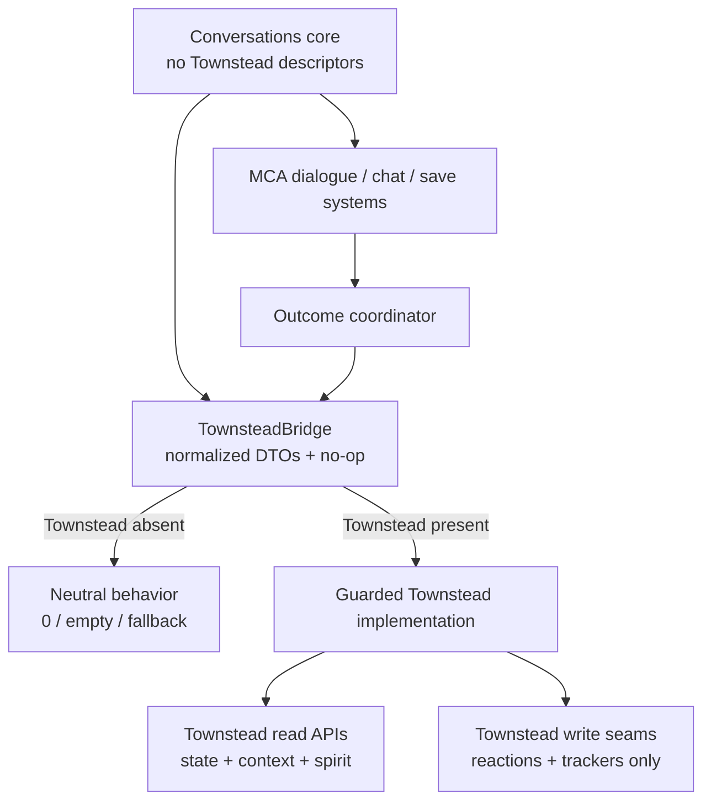

# MCA: Conversations × Townstead — Minecraft 1.20.1 Forge Compatibility Implementation Specification

**Document status:** implementation-ready engineering plan  
**Prepared:** 2026-08-25  
**Primary repository:** [otectus/MCAConversations](https://github.com/otectus/MCAConversations)  
**Integration repository:** [AetherianArtificer/Townstead](https://github.com/AetherianArtificer/Townstead)  
**Minecraft / loader:** Minecraft 1.20.1, Forge 47.x, Java 17  
**Pinned Conversations revision:** [`89edad20fa01b62a8e3e765c8bbf1a5b6df5e8a1`](https://github.com/otectus/MCAConversations/tree/89edad20fa01b62a8e3e765c8bbf1a5b6df5e8a1)  
**Pinned Townstead revision:** [`4d6206cdf8b9d0f558694d7b35b223f4f6ace61e`](https://github.com/AetherianArtificer/Townstead/tree/4d6206cdf8b9d0f558694d7b35b223f4f6ace61e)

> Scope clarification: the request called the target “MCA: Quests,” but the supplied repository is **MCA: Conversations**. This document targets the linked `MCAConversations` repository. MCA: Quests remains one of Conversations’ existing optional integrations and is covered in the compatibility matrix.

---

## 1. Executive implementation directive

Implement Townstead as a **strictly optional, first-class integration** for MCA: Conversations.

- With Townstead absent, Conversations must load, save, reload, run dialogue, run typed chat, and produce the same seeded check outcomes it produces before this update.
- With a supported Townstead build present, every relevant Townstead system must be available to Conversations: villager needs, schedules, calendar, life stage and age, roots and heritage, custom personalities, professions and learned skills, buildings and village spirit, context tags, reactions, dialogue state, and Townstead’s RPG dialogue presentation.
- Conversations must never own or directly mutate Townstead’s needs, schedules, calendar, roots, genes, profession progression, buildings, or spirit state. Townstead remains authoritative.
- Conversations remains authoritative for its disposition vector, conversation progress, per-conversation heart budgets, told-gossip memory, chat-mode session, and authored conversation outcomes.
- No Townstead class may be resolved on a Townstead-free installation.
- “Townstead present but silently degraded” is a development fallback, not an acceptable release state. Each supported Townstead/MCA variant must report all required capabilities as `FULL` in CI and in the in-game diagnostic command.

The most important architectural conclusion is that this cannot safely be delivered as one MCA-namespace-agnostic binary. Conversations directly implements MCA functional interfaces and targets MCA classes with Mixins. Townstead itself therefore publishes separate 1.20.1 modern and legacy MCA namespace artifacts. Conversations must mirror that release model.

### Required release artifacts

| Conversations artifact | MCA root compiled into bytecode | Match with Townstead artifact | Tested MCA anchor |
|---|---|---|---|
| `mcaconversations-mca-modern-<version>.jar` | `forge.net.conczin.mca` | `townstead-mca-modern-<version>.jar` | `7.7.1-alpha.1+1.20.1` or a later explicitly tested modern-root build |
| `mcaconversations-mca-legacy-<version>.jar` | `forge.net.mca` | `townstead-mca-legacy-<version>.jar` | `7.7.0-beta.2+1.20.1`, plus the currently supported 7.6 line |

The two Conversations artifacts must have:

- the same mod id, feature version, config schema, resource content, network protocol, and save schema;
- only MCA package descriptors, compile dependencies, generated metadata, and variant-specific compatibility code differing;
- a clear filename and manifest marker;
- CI proving that a world can move between the two matched stacks without Conversations save migration.

Users must install exactly one Conversations artifact and exactly one matching Townstead artifact.

---

## 2. Definition of “complete Townstead support”

The implementation is complete only when every row below is implemented and covered by automated or scripted verification.

| Townstead surface | Conversations integration requirement | Behavior without Townstead |
|---|---|---|
| Read-only villager snapshot | Expose safe dialogue conditions and template values for age, life stage, needs, schedule, profession progression, root, personality, expressed traits, and heritage | Empty snapshot; conditions score `0`; localized fallback variables |
| Needs | Gate inappropriate topics; add wellbeing/help content; prevent chat attention from pinning collapsed villagers; observe recovery after relevant gifts | Existing topic availability and attention behavior |
| Schedules | Make greetings, ambient replies, deep-topic availability, and attention behavior respect `work`, `meet`, `rest`, and `idle` | Existing greeting, responder, and attention rules |
| Calendar | Use Townstead’s calendar as the narrative date/season source in `AUTO`; add calendar/date content and variables | Serene Seasons, then current built-in fallback |
| Life stages and aging | Add age/life-stage/birthday/senior/ageless/immortal-aware lines and safe structural gates | Current MCA age-group behavior |
| Roots, lineage, ancestry, species, genes, heritage | Add opt-in narrative content and generic datapack query surfaces; preserve privacy in shipped gossip | No root/heritage branches |
| Custom personalities | Match exact namespaced Townstead personality definitions first, then fall back to their MCA base voice/profile | Current MCA canonical/legacy personality handling |
| Profession progression and skills | Expose tier, XP, and learned skills to dialogue; add mastery/learning content and transition gossip | Current profession-name content |
| Buildings | Expose the building at the villager; add location-sensitive conversation and building-change stories | Current village-name content |
| Village spirit | Expose totals, shares, classification, tier, primary and secondary spirits; add community-identity content and structural-change gossip | No spirit branch or term |
| Context tags | Reuse Townstead’s full resolved tag set once per evaluation, not an incomplete duplicate implementation | Empty tag set |
| Reaction dispatcher | Fire authored, idempotent, heart-neutral reactions for meaningful conversation outcomes | No reaction call |
| Social heart tracker | Notify Townstead of the **measured** MCA heart delta after Conversations applies affection | No notification |
| Dialogue state tracker | Mark typed-chat conversation open/close so Townstead emits dialogue context tags | No notification |
| RPG dialogue screen | Preserve Townstead’s camera, HUD, typewriter, choice panel, close lifecycle, and unknown-answer support | Current MCA GUI |
| Emotion/effect tags | Supply Conversations-owned tags only within Townstead’s typewriter path; never leak markup into chat/TTS/base MCA UI | Clean ordinary translations |
| Datapack reloads | All new query/action types register even when Townstead is absent; malformed data fails safe | Reload succeeds |
| Save removal/re-add | No Townstead object is serialized; removal and later re-add are safe | Base features continue |
| Existing optional mods | Compose correctly with MCA: Quests, MCA: Reputation, and Serene Seasons | Existing behavior |

---

## 3. Repository findings that drive the design

### 3.1 Conversations baseline

At the pinned revision:

- `mcaconversations` is version `1.2.1`, Minecraft `1.20.1`, Forge `47.4.10`, Java 17.
- It compiles against MCA `7.7.0-beta.2+1.20.1` and declares MCA `[7.6,8)`.
- It imports `forge.net.mca.*` from `McaCompat`, `ConversationsMcaRegistrar`, and all MCA-targeting Mixins.
- Its dialogue engine already has branching topics, deterministic checks, disposition vectors, progress, typed chat, sticky targets, proactive greetings, ambient responders, gifts, templates, and village gossip.
- Its optional Quests, Reputation, and Serene Seasons integrations already establish the intended “bridge + no-op fallback” direction.
- Its Mixins target concrete MCA classes, so merely moving a few API calls behind reflection would not make the jar compatible with the modern MCA root.

Important current seams:

- [`McaBridge`](https://github.com/otectus/MCAConversations/blob/89edad20fa01b62a8e3e765c8bbf1a5b6df5e8a1/src/main/java/dev/otectus/mcaconversations/compat/McaBridge.java) is the MCA classloading gate.
- [`ConversationsMcaRegistrar`](https://github.com/otectus/MCAConversations/blob/89edad20fa01b62a8e3e765c8bbf1a5b6df5e8a1/src/main/java/dev/otectus/mcaconversations/compat/mca/ConversationsMcaRegistrar.java) registers parse-safe dialogue conditions and actions into MCA’s `GiftPredicate` and `Actions` registries.
- [`Affection`](https://github.com/otectus/MCAConversations/blob/89edad20fa01b62a8e3e765c8bbf1a5b6df5e8a1/src/main/java/dev/otectus/mcaconversations/progress/Affection.java) is the guarded path to MCA hearts and already receives the measured delta from `McaCompat.rewardHearts`.
- [`CheckInputs`](https://github.com/otectus/MCAConversations/blob/89edad20fa01b62a8e3e765c8bbf1a5b6df5e8a1/src/main/java/dev/otectus/mcaconversations/check/CheckInputs.java) and [`CheckResolver`](https://github.com/otectus/MCAConversations/blob/89edad20fa01b62a8e3e765c8bbf1a5b6df5e8a1/src/main/java/dev/otectus/mcaconversations/check/CheckResolver.java) make checks deterministic and currently combine disposition, hearts, personality, Reputation, mood/state, seeded roll, and difficulty.
- [`Interiority`](https://github.com/otectus/MCAConversations/blob/89edad20fa01b62a8e3e765c8bbf1a5b6df5e8a1/src/main/java/dev/otectus/mcaconversations/interiority/Interiority.java) canonicalizes profiles by bare MCA personality path; that must change for namespaced Townstead custom personalities.
- [`GreetOnApproach`](https://github.com/otectus/MCAConversations/blob/89edad20fa01b62a8e3e765c8bbf1a5b6df5e8a1/src/main/java/dev/otectus/mcaconversations/chat/GreetOnApproach.java) and [`VillagerAttention`](https://github.com/otectus/MCAConversations/blob/89edad20fa01b62a8e3e765c8bbf1a5b6df5e8a1/src/main/java/dev/otectus/mcaconversations/chat/VillagerAttention.java) need Townstead-aware eligibility/pinning policies.
- [`GossipDetectors`](https://github.com/otectus/MCAConversations/blob/89edad20fa01b62a8e3e765c8bbf1a5b6df5e8a1/src/main/java/dev/otectus/mcaconversations/gossip/GossipDetectors.java) already performs a periodic, deduplicated nearest-village scan and must be extended rather than paralleled.

### 3.2 Townstead baseline

At the pinned revision:

- Townstead is version `0.7.7`.
- Its 1.20.1 build uses Stonecutter to produce:
  - `townstead-mca-modern`, compiled against MCA `7.7.1-alpha.1` under `forge.net.conczin.mca`;
  - `townstead-mca-legacy`, compiled against MCA `7.7.0-beta.2` under `forge.net.mca`.
- Each Townstead jar carries `Townstead-MCA-Namespace` in its manifest.
- Townstead’s mod id is `townstead`; it requires MCA and Patchouli, but must be an optional dependency of Conversations.

Townstead exposes a stable read-only facade:

- [`TownsteadAPI`](https://github.com/AetherianArtificer/Townstead/blob/4d6206cdf8b9d0f558694d7b35b223f4f6ace61e/src/main/java/com/aetherianartificer/townstead/api/TownsteadAPI.java)
- [`TownsteadVillagerSnapshot`](https://github.com/AetherianArtificer/Townstead/blob/4d6206cdf8b9d0f558694d7b35b223f4f6ace61e/src/main/java/com/aetherianartificer/townstead/api/TownsteadVillagerSnapshot.java)
- [`TownsteadNeedsSnapshot`](https://github.com/AetherianArtificer/Townstead/blob/4d6206cdf8b9d0f558694d7b35b223f4f6ace61e/src/main/java/com/aetherianartificer/townstead/api/TownsteadNeedsSnapshot.java)
- [`TownsteadScheduleSnapshot`](https://github.com/AetherianArtificer/Townstead/blob/4d6206cdf8b9d0f558694d7b35b223f4f6ace61e/src/main/java/com/aetherianartificer/townstead/api/TownsteadScheduleSnapshot.java)
- [`TownsteadCalendarSnapshot`](https://github.com/AetherianArtificer/Townstead/blob/4d6206cdf8b9d0f558694d7b35b223f4f6ace61e/src/main/java/com/aetherianartificer/townstead/api/TownsteadCalendarSnapshot.java)
- [`TownsteadBuildingSnapshot`](https://github.com/AetherianArtificer/Townstead/blob/4d6206cdf8b9d0f558694d7b35b223f4f6ace61e/src/main/java/com/aetherianartificer/townstead/api/TownsteadBuildingSnapshot.java)
- [`TownsteadRootSnapshot`](https://github.com/AetherianArtificer/Townstead/blob/4d6206cdf8b9d0f558694d7b35b223f4f6ace61e/src/main/java/com/aetherianartificer/townstead/api/TownsteadRootSnapshot.java)
- [`TownsteadGeneSnapshot`](https://github.com/AetherianArtificer/Townstead/blob/4d6206cdf8b9d0f558694d7b35b223f4f6ace61e/src/main/java/com/aetherianartificer/townstead/api/TownsteadGeneSnapshot.java)
- [`TownsteadQuery`](https://github.com/AetherianArtificer/Townstead/blob/4d6206cdf8b9d0f558694d7b35b223f4f6ace61e/src/main/java/com/aetherianartificer/townstead/api/TownsteadQuery.java)

Additional public classes needed for full integration are:

- [`ContextResolver.tagsFor`](https://github.com/AetherianArtificer/Townstead/blob/4d6206cdf8b9d0f558694d7b35b223f4f6ace61e/src/main/java/com/aetherianartificer/townstead/reaction/trigger/event/ContextResolver.java)
- [`ReactionDispatcher.fire`](https://github.com/AetherianArtificer/Townstead/blob/4d6206cdf8b9d0f558694d7b35b223f4f6ace61e/src/main/java/com/aetherianartificer/townstead/reaction/ReactionDispatcher.java)
- [`ReactionContext`](https://github.com/AetherianArtificer/Townstead/blob/4d6206cdf8b9d0f558694d7b35b223f4f6ace61e/src/main/java/com/aetherianartificer/townstead/reaction/ReactionContext.java)
- [`SocialInteractionTracker`](https://github.com/AetherianArtificer/Townstead/blob/4d6206cdf8b9d0f558694d7b35b223f4f6ace61e/src/main/java/com/aetherianartificer/townstead/reaction/trigger/event/SocialInteractionTracker.java)
- [`DialogueStateTracker`](https://github.com/AetherianArtificer/Townstead/blob/4d6206cdf8b9d0f558694d7b35b223f4f6ace61e/src/main/java/com/aetherianartificer/townstead/reaction/trigger/event/DialogueStateTracker.java)
- [`VillageSpiritAggregator`](https://github.com/AetherianArtificer/Townstead/blob/4d6206cdf8b9d0f558694d7b35b223f4f6ace61e/src/main/java/com/aetherianartificer/townstead/spirit/VillageSpiritAggregator.java)
- [`SpiritTotals`](https://github.com/AetherianArtificer/Townstead/blob/4d6206cdf8b9d0f558694d7b35b223f4f6ace61e/src/main/java/com/aetherianartificer/townstead/spirit/SpiritTotals.java)
- [`SpiritReadout`](https://github.com/AetherianArtificer/Townstead/blob/4d6206cdf8b9d0f558694d7b35b223f4f6ace61e/src/main/java/com/aetherianartificer/townstead/spirit/SpiritReadout.java)
- [`LearnedSkills`](https://github.com/AetherianArtificer/Townstead/blob/4d6206cdf8b9d0f558694d7b35b223f4f6ace61e/src/main/java/com/aetherianartificer/townstead/profession/skill/LearnedSkills.java)
- [`PersonalityResolver`](https://github.com/AetherianArtificer/Townstead/blob/4d6206cdf8b9d0f558694d7b35b223f4f6ace61e/src/main/java/com/aetherianartificer/townstead/root/personality/PersonalityResolver.java)

These non-`api` classes must be treated as a pinned `0.7.7` adapter surface, not leaked into Conversations’ public API. If Townstead later exposes equivalents through `TownsteadAPI`, switch the adapter without changing the bridge or dialogue contract.

### 3.3 UI behavior already favorable to compatibility

Townstead’s [`DialogueMenuOrganizer`](https://github.com/AetherianArtificer/Townstead/blob/4d6206cdf8b9d0f558694d7b35b223f4f6ace61e/src/main/java/com/aetherianartificer/townstead/client/gui/dialogue/DialogueMenuOrganizer.java) appends any unknown MCA main answer as a leaf using `dialogue.main.<answer>`. Conversations’ injected `conversations` main answer therefore naturally appears in Townstead’s RPG menu in `ADDITIVE` mode.

In `REPLACE` mode, Townstead’s normal `chat` leaf still submits MCA’s `chat` answer; Conversations’ existing `DialoguesMixin` can redirect that into the Conversations hub. In `HIDDEN` mode, the GUI entry remains hidden while opted-in typed chat remains available.

Do **not** replace or wrap `RpgDialogueScreen`. Compatibility should preserve Townstead’s own camera, HUD suppression, typewriter, choice panel, pagination, late content, and close state.

---

## 4. Non-negotiable invariants

1. `townstead` remains `mandatory=false` in Conversations metadata.
2. No Townstead type appears in:
   - `McaConversations`,
   - ordinary event subscribers,
   - networking payloads,
   - saved-data records,
   - config classes,
   - dialogue query records,
   - template enums,
   - check records,
   - or any package outside the guarded implementation and optional Townstead-targeting Mixins.
3. All Townstead conditions/actions are registered unconditionally with MCA so bundled dialogue JSON remains parseable without Townstead.
4. Every adapter read catches `Throwable`, reports a neutral fallback, and rate-limits repeated failures.
5. Townstead absence must contribute exactly `0` to every existing seeded check.
6. Townstead reactions must never grant or remove hearts. Every bundled compatibility reaction has `"hearts": 0`.
7. Conversations calls `SocialInteractionTracker.markHeartChange` with the measured MCA delta, never the authored or pre-budget delta.
8. No feature may scan all dimensions, all chunks, or all villagers every tick.
9. No raw Townstead emotion markup may appear in ordinary language values delivered to base MCA UI, chat mode, system chat, or TTS.
10. Removing Townstead from an existing world must not make Conversations saved data unreadable.
11. Installing the wrong modern/legacy artifact must fail early with a clear namespace diagnostic rather than an unexplained `NoClassDefFoundError` or Mixin target failure.
12. Existing Quests/Reputation/Seasons behavior remains covered by regression tests.

---

## 5. Target architecture

### 5.1 Core bridge

Add `dev.otectus.mcaconversations.compat.TownsteadBridge`. It must import only Java, Minecraft, Forge, and Conversations-owned types.

Recommended shape:

~~~java
public final class TownsteadBridge {
    private static volatile TownsteadAccess access = TownsteadAccess.NOOP;
    private static volatile Status status = Status.ABSENT;

    public interface TownsteadAccess {
        TownsteadContext snapshot(Entity villager, ServerPlayer player);
        Set<String> contextTags(Entity villager);
        AttentionPolicy attentionPolicy(Entity villager, long gameTime);
        GreetingPolicy greetingPolicy(Entity villager, ServerPlayer player);
        boolean hasSkill(Entity villager, ResourceLocation skill);
        boolean fireReaction(Entity villager, ServerPlayer player, ReactionRequest request);
        void markHeartChange(Entity villager, int measuredDelta, long gameTime);
        void dialogueOpen(Entity villager, ServerPlayer player, long gameTime);
        void dialogueClose(Entity villager, ServerPlayer player, long gameTime);
        EnumSet<Capability> capabilities();
    }

    public static void tryRegister() {
        if (!ModList.get().isLoaded("townstead")) {
            access = TownsteadAccess.NOOP;
            status = Status.ABSENT;
            return;
        }
        // Do not put the implementation class into this class's constant pool.
        Class.forName(
            "dev.otectus.mcaconversations.compat.townstead.impl.TownsteadIntegration",
            true,
            TownsteadBridge.class.getClassLoader()
        ).getMethod("install").invoke(null);
    }
}
~~~

Use a reflection string at the classloading boundary even though the implementation itself uses direct, variant-matched Townstead calls. This gives:

- direct, compiler-checked integration on supported builds;
- no per-call reflection in dialogue selection or chat scans;
- no Townstead class resolution on Townstead-free installs;
- one place to catch linkage drift and report a compatibility error.

### 5.2 Normalized Conversations-owned DTOs

Create immutable records under `compat/townstead/model`. They must contain primitives, strings, resource-id strings, Java collections, and Minecraft `Component` only where localized presentation is required.

Minimum model:

~~~text
TownsteadContext
 ├─ VillagerState
 │   ├─ NeedsState
 │   ├─ ScheduleState
 │   ├─ LifeState
 │   ├─ ProfessionState
 │   └─ PersonalityState
 ├─ CalendarState
 ├─ BuildingState
 ├─ SpiritState
 ├─ RootState
 ├─ SkillState
 └─ Set<String> contextTags
~~~

Required fields:

| Record | Fields |
|---|---|
| `NeedsState` | hunger, saturation, thirst, quenched, fatigue, collapsed, gated, semantic hunger/thirst/fatigue buckets |
| `ScheduleState` | mode, template id, custom flags, current display hour, current activity, planned activity, active template id |
| `LifeState` | root id, life-stage id, biological age days, apparent age years, immortal, ageless, senior, fertility-present flag |
| `ProfessionState` | profession id, level/tier, XP, immutable learned-skill id set |
| `PersonalityState` | exact Townstead personality id, whether custom, base MCA personality id, custom display name and description when available |
| `CalendarState` | profile id, world day, time mode, year, month, day, day-of-year, day-of-week, season, localized display date |
| `BuildingState` | present, id, village id, type, size, center and bounds |
| `SpiritState` | total, contributing buildings, per-spirit points and shares, classification, tier, primary, secondary, localized readout component |
| `RootState` | id, display name, species, effective species, ancestry, lineage, default gene ids, life-stage catalog |
| `VillagerState` | UUID, name, entity type, all records above, carried variants, expressed allele ids, immutable heritage fractions |

The default no-op model must be a real immutable `EMPTY` object, not `null`. Query code should never need to branch around a missing root object.

### 5.3 Capabilities and health

Track these separately:

~~~text
READ_VILLAGER
READ_NEEDS
READ_SCHEDULE
READ_CALENDAR
READ_BUILDING
READ_ROOT
READ_PERSONALITY
READ_SKILLS
READ_SPIRIT
READ_CONTEXT_TAGS
FIRE_REACTION
MARK_HEART_CHANGE
TRACK_DIALOGUE
RPG_DIALOGUE_UI
RPG_EMOTION_TAGS
~~~

Status values:

- `ABSENT`: Townstead not installed; expected and quiet.
- `DISABLED`: user config disabled integration.
- `FULL`: every required capability is available.
- `PARTIAL`: some capabilities linked, but at least one failed.
- `INCOMPATIBLE`: Townstead is installed but the adapter or namespace does not match.

`PARTIAL` and `INCOMPATIBLE` are useful diagnostics during development. Release tests must reject them for the supported Townstead pair.

### 5.4 Adapter implementation

`TownsteadIntegration.install()` must:

1. Read the installed Townstead version.
2. Read its `Townstead-MCA-Namespace` manifest attribute when available.
3. Compare it to this Conversations jar’s generated namespace constant.
4. Probe required methods/classes once.
5. Install a `TownsteadAccess` implementation only after the full probe succeeds.
6. Log one concise success line including Conversations variant, Townstead version, and capability set.
7. On failure, install the no-op implementation, set `INCOMPATIBLE`, and log one actionable error.

Use:

- `TownsteadAPI.entity` / `villager` for villager state;
- `TownsteadAPI.calendar` for calendar state;
- `TownsteadAPI.buildingAt` for the current building;
- `TownsteadAPI.origin` and `gene` for catalog lookup;
- `ContextResolver.tagsFor` once per cached evaluation;
- `LearnedSkills.learned` for skill ids;
- `VillageSpiritAggregator.totalsFor` and `readoutFor` for the villager’s home village;
- `PersonalityResolver.def` and `baseOf` for a custom personality;
- `ReactionDispatcher.fire` for authored reactions;
- `SocialInteractionTracker.markHeartChange` for measured heart changes;
- `DialogueStateTracker.onOpen` / `onClose` for typed chat lifecycle;
- `ReactionLockTracker.isLocked` when computing attention policy.

Do not call Townstead’s mutation APIs for needs, schedules, professions, skills, roots, genes, calendar, buildings, or village spirit.

---

## 6. Build and release modernization

This phase must land before feature integration. Attempting Townstead work while Conversations still has one hard-coded `forge.net.mca` tree will create an untestable half-port.

### 6.1 Adopt the Townstead Stonecutter pattern

Mirror Townstead’s proven layout:

~~~kotlin
plugins {
    id("dev.kikugie.stonecutter") version "0.7.11"
}

stonecutter {
    kotlinController = true
    centralScript = "build.gradle.kts"
    create(rootProject) {
        version("1.20.1-forge-modern", "1.20.1").buildscript("build.forge.gradle.kts")
        version("1.20.1-forge-legacy", "1.20.1").buildscript("build.forge.gradle.kts")
        vcsVersion = "1.20.1-forge-modern"
    }
}
~~~

Normalize the shared source to `net.conczin.mca` and `net/conczin/mca` tokens, then apply:

~~~kotlin
val legacyMcaNamespace = project.name.endsWith("-legacy")

stonecutter {
    replacements {
        if (legacyMcaNamespace) {
            string(true) { replace("net.conczin.mca", "forge.net.mca") }
            string(true) { replace("net/conczin/mca", "forge/net/mca") }
        } else {
            string(true) { replace("net.conczin.mca", "forge.net.conczin.mca") }
            string(true) { replace("net/conczin/mca", "forge/net/conczin/mca") }
        }
    }
}
~~~

Apply replacements to:

- Java imports;
- fully qualified names;
- Mixin method descriptors;
- Mixin target strings;
- comments only if doing so does not obscure source intent;
- any generated refmap validation inputs.

Use Stonecutter directives for genuine signature drift; do not create duplicate copies of whole compatibility classes.

### 6.2 Variant dependencies

| Dependency | Modern | Legacy | Scope |
|---|---|---|---|
| Forge | `1.20.1-47.4.10` or one project-wide tested pin | same | `minecraft` |
| MCA | universal jar with `forge.net.conczin.mca` | universal jar with `forge.net.mca` | implementation/compile as currently required by dev runtime |
| Townstead | `townstead-mca-modern` 0.7.7 | `townstead-mca-legacy` 0.7.7 | `compileOnly`, never bundled |
| Patchouli | not needed directly by Conversations | not needed directly | none |
| Quests/Reputation | preserve existing optional compile-only strategy | same | `compileOnly` |

Townstead is not currently consumed from a guaranteed Maven coordinate. Make the build reproducible:

1. CI checks out Townstead at the pinned compatibility SHA.
2. CI builds the appropriate 1.20.1 Townstead variant.
3. CI passes the resulting jar path to Conversations using `-PtownsteadCompatJar=<absolute path>`.
4. Local builds may use the same property, a checked adjacent repository, or a documented `libs` fallback.
5. If the Townstead adapter source set is enabled and no compile jar is found, fail with a clear message. Do not silently publish a jar with the adapter omitted.

Do not commit third-party jars.

### 6.3 Metadata

Generate per-variant metadata.

Recommended Conversations MCA ranges, subject to boundary tests:

| Variant | Recommended MCA range |
|---|---|
| modern | `[7.7.1-alpha.1,8)` |
| legacy | `[7.6,7.7.1-alpha.1)` |

Do not widen either range beyond versions actually exercised in production-style launches.

Add:

~~~toml
[[dependencies.mcaconversations]]
modId="townstead"
mandatory=false
versionRange="[0.7.7,0.8)"
ordering="AFTER"
side="BOTH"
~~~

Manifest attributes:

~~~text
MCA-Conversations-MCA-Namespace: forge.net.conczin.mca
MCA-Conversations-Townstead-API: 0.7.7
~~~

or, for legacy:

~~~text
MCA-Conversations-MCA-Namespace: forge.net.mca
MCA-Conversations-Townstead-API: 0.7.7
~~~

Keep mod id `mcaconversations` and the same feature version in both artifacts. Put the variant in the archive name, not in saved data or network versioning.

### 6.4 Early mismatch diagnostics

Add `ConversationsMixinPlugin` and reference it from `mcaconversations.mixins.json`.

The plugin must:

- verify the generated expected MCA sentinel before applying MCA Mixins;
- use string-based class probes, not static imports;
- apply Townstead-targeting client Mixins only when the Townstead target class exists;
- throw a concise, variant-specific error if the MCA root is wrong;
- never resolve a Townstead class on an absent install.

Sentinels:

~~~text
modern: forge.net.conczin.mca.entity.VillagerEntityMCA
legacy: forge.net.mca.entity.VillagerEntityMCA
~~~

CI must scan each jar’s constant pool and Mixin descriptors:

- modern jar contains no `forge/net/mca/`;
- legacy jar contains no `forge/net/conczin/mca/`;
- non-implementation core classes contain no `com/aetherianartificer/townstead/`;
- the jar does not bundle Townstead classes.

### 6.5 Production-style launch

The existing build notes that MCA’s shipped Forge Mixins do not work correctly under ordinary `runClient` remapping. Preserve unit tests, but make production-style launch tests the authority:

- build reobfuscated jars;
- launch a clean Forge 1.20.1 instance;
- install exact MCA, Conversations, Townstead, and required Townstead dependencies;
- capture server/client logs;
- run scripted dialogue and command probes;
- reject any Mixin warning for required targets.

---

## 7. Caching and performance

MCA evaluates multiple candidate results for one submitted answer. A Townstead context read can itself inspect nearby villagers, players, threats, buildings, weather, and reaction locks. Never recompute it for every result condition.

### 7.1 Evaluation cache

Add `TownsteadContextCache`:

- key: server identity, dimension, villager UUID, player UUID where relevant, and current game tick;
- value: normalized context plus context tags;
- dialogue TTL: one server tick;
- chat scan TTL: configurable 10–20 ticks;
- clear on server stop and datapack reload;
- never serialize;
- bounded by weak entity keys or explicit end-of-tick clearing.

`conversations_townstead`, `conversations_townstead_tags`, templates, check modifiers, chat eligibility, and reaction request assembly must reuse the same cached snapshot.

### 7.2 Existing scan reuse

Extend the existing Conversations gossip sweep. Do not add a second global village sweep.

- Compute Townstead resident observations only for villages already selected by `GossipDetectors.scan`.
- Compute one spirit snapshot per deduplicated `(dimension, village id)` per sweep.
- Round-robin expensive resident detail if a village is large.
- Never interpret an unloaded villager as recovered, departed, de-skilled, or changed.

### 7.3 Performance budgets

In a production-style test with 50 loaded MCA villagers and four players:

- no additional per-tick full-village scan;
- median cached Townstead condition read below 0.1 ms;
- one uncached context snapshot below 2 ms on the test host;
- gossip Townstead extension below 5 ms per scanned village;
- zero repeated stack traces during expected fallback conditions.

Record these as regression thresholds, not universal hardware promises.

---

## 8. Dialogue condition and action API

Register every type in `ConversationsMcaRegistrar` regardless of whether Townstead is installed. Parse with `SafeParse.orNull`; execution catches `Throwable`.

### 8.1 `conversations_townstead_available`

Purpose: feature/capability gate.

Accepted forms:

~~~json
"conversations_townstead_available": "read_needs"
~~~

~~~json
"conversations_townstead_available": {
  "all": ["read_needs", "read_schedule"]
}
~~~

Returns `1` only when Townstead integration is enabled, healthy, and satisfies the requested capability set. With Townstead absent, returns `0`.

### 8.2 `conversations_townstead`

Purpose: general, stable snapshot query.

~~~json
"conversations_townstead": {
  "source": "villager",
  "path": "needs.collapsed",
  "op": "eq",
  "value": true
}
~~~

Allowed sources:

- `villager`
- `player`
- `calendar`
- `building`
- `origin`
- `spirit`

Operators:

| Operator | Valid types | Semantics |
|---|---|---|
| `exists` / `missing` | any | value presence |
| `eq` / `ne` | scalar | strict normalized equality |
| `lt` / `lte` / `gt` / `gte` | number | numeric comparison |
| `contains` | string, list, map | substring, member, or key |
| `in` / `not_in` | scalar against array | exact set membership |
| `matches_id` | string/resource id | namespace-aware exact match; bare path only when explicitly allowed |

Rules:

- Comparisons are type-checked at parse time where possible.
- Numeric conversion rejects NaN and infinity.
- Do not support arbitrary regular expressions.
- Paths are validated against a documented allowlist matching the normalized DTOs.
- `carriedVariants`, `expressedAlleles`, and `heritage` are queryable for pack authors, but shipped ordinary gossip must not expose them.
- Absent Townstead, missing data, invalid path, or exception returns `0`.

### 8.3 `conversations_townstead_tags`

Purpose: reuse Townstead’s comprehensive context vocabulary.

~~~json
"conversations_townstead_tags": {
  "all": ["on_shift:work"],
  "any": ["hungry", "thirsty", "tired"],
  "none": ["raid_active", "near_mob_threat"]
}
~~~

All non-empty clauses are ANDed. Entries inside `all` are all required; at least one `any` entry is required; no `none` entry may exist.

Townstead 0.7.7 tags include:

- time, day/night, named periods, exact display hour;
- `on_shift:idle|work|meet|rest` and custom-shift state;
- nearby working/resting/meeting villagers;
- crowd and age context;
- player and MCA relationship context;
- held items and item tags;
- threats and raids;
- hunger, thirst, fatigue, unemployment, workstation, pregnancy;
- graves and dialogue state;
- weather, shelter, light, fluids, biome, temperature, dimension;
- `in_building:<type>`;
- music and nearby reactions;
- recent heart increase/decrease.

Do not reimplement a partial duplicate tag resolver inside Conversations.

### 8.4 `conversations_townstead_spirit`

Purpose: ergonomic village-spirit queries without fragile path expressions.

~~~json
"conversations_townstead_spirit": {
  "classification": ["single", "blend"],
  "min_tier": 2,
  "primary": "nautical",
  "min_share": 0.40
}
~~~

Supported fields:

- classification: `settlement`, `single`, `blend`, `mixed`;
- min/max tier;
- primary or secondary spirit;
- min/max points for a spirit;
- min/max share;
- min contributing buildings.

Townstead’s current tier thresholds are 25, 60, 140, 300, and 600 points per spirit. Do not duplicate those constants in dialogue content; ask the adapter/aggregator for the computed tier.

### 8.5 `conversations_townstead_skill`

~~~json
"conversations_townstead_skill": {
  "has": "townstead:artisan_baking"
}
~~~

Also support:

~~~json
"conversations_townstead_skill": {
  "any": ["townstead:skill_a", "townstead:skill_b"]
}
~~~

This is read-only. Conversations must not learn, forget, grant, or retrain a skill.

### 8.6 `conversations_townstead_react`

Purpose: queue a semantic reaction for the current validated submission.

~~~json
"conversations_townstead_react": {
  "reaction": "mcaconversations:conversation_warm",
  "semantic": "empathy",
  "tags": ["mcaconversations:outcome/success"],
  "once": "submission"
}
~~~

The action queues; it does not immediately fire. At the end of the validated GUI/chat submission, the outcome coordinator combines:

- reaction id;
- semantic outcome;
- topic, branch, stance, and check tier;
- measured heart-delta sign;
- GUI or chat frontend;
- cached Townstead context tags;
- player cause and villager position.

Then it calls:

~~~java
ReactionDispatcher.fire(
    level,
    livingVillager,
    reactionId,
    new ReactionContext(
        ReactionContext.TriggerSource.CONTEXT,
        player,
        villager.blockPosition(),
        tags,
        0
    )
);
~~~

Use `CONTEXT`, not `COMMAND`, so Townstead’s sleep, reaction-lock, cooldown, chance, and movement gates remain active.

### 8.7 Deterministic result/fallback authoring

Every Townstead-specialized result needs a normal result that remains valid without Townstead.

~~~json
{
  "baseChance": 0,
  "conditions": [
    {
      "chance": 100,
      "conversations_townstead_available": "read_needs"
    },
    {
      "chance": 100,
      "conversations_townstead_tags": {
        "any": ["hungry", "thirsty", "tired"]
      }
    }
  ],
  "actions": {
    "say": "conversations.wellbeing.notice_need",
    "conversations_townstead_react": {
      "reaction": "mcaconversations:conversation_acknowledge",
      "semantic": "care"
    }
  }
}
~~~

The ordinary fallback must be independently valid. Where deterministic selection matters, sink the fallback with the inverse Townstead condition rather than relying on a 100-to-1 weight.

Content lint must prove:

- every Townstead-specific branch has a reachable non-Townstead fallback;
- every referenced custom type is registered on absent installs;
- no result is Townstead-only unless the containing answer/topic is itself safely hidden.

---

## 9. Check and disposition integration

### 9.1 Add an authored Townstead context term

Do not globally alter all existing checks merely because Townstead is installed. Extend `CheckDefinition` with an optional, Conversations-owned `townstead_fit` definition:

~~~json
"conversations_check": {
  "id": "wellbeing.offer_help",
  "tier": "success",
  "axis": "warmth",
  "difficulty": 35,
  "stance": "empathy",
  "townstead_fit": {
    "good_if_any": ["hungry", "thirsty", "tired"],
    "bad_if_any": ["raid_active", "near_mob_threat"],
    "good": 4,
    "bad": -8
  }
}
~~~

Add `townsteadFit` to `CheckInputs` and the score:

~~~text
axisTerm
+ heartsTerm
+ personalityFit
+ publicStandingFit
+ townsteadFit
+ moodAdjust
+ seededRoll
~~~

Requirements:

- hard clamp to configurable `±8`;
- exactly `0` when Townstead is absent, disabled, incompatible, or the check omits `townstead_fit`;
- no change to the seed or roll;
- compute from the same cached tag snapshot used by conditions;
- expose the term in debug output;
- add `withoutTownsteadFit()` for regression tests, analogous to `withoutPublicStanding()`.

This lets state color a borderline exchange without replacing private disposition, MCA hearts, or public Reputation.

### 9.2 Structural topic gates

Use conditions, not score penalties, for hard safety:

- collapsed: hide ordinary topics; offer help, emergency context, and leave;
- sleeping: no proactive greeting or typed response;
- raid/threat/panic: suppress deep/personal starts;
- work shift: hide or defer deep topics unless the current conversation is already active or the content is urgent;
- pregnancy/life stage/age: preserve all existing romance safety gates; Townstead data may only make them stricter;
- ageless/immortal: flavor only, never a proxy for MCA adulthood.

### 9.3 Disposition ownership

Townstead state may change the immediate check fit and available wording. It must not directly rewrite:

- trust;
- respect;
- warmth;
- attraction;
- tension;
- familiarity.

Only existing `conversations_disposition_apply` actions move those axes. Townstead reactions likewise have no disposition side effects.

---

## 10. Custom personality and interiority support

Current `Personalities.normalize` strips namespaces, and `Interiority.apply` canonicalizes every profile key. That can collide two Townstead custom personalities with the same path under different namespaces.

### 10.1 New identity rule

Introduce a personality key type:

- known MCA ids and legacy aliases canonicalize to the existing bare MCA voice, such as `upbeat`;
- unknown/custom Townstead ids retain the full lowercase resource id, such as `mypack:reserved_scholar`;
- invalid ids fail to neutral;
- namespace is never discarded for a custom id.

### 10.2 Lookup order

For a Townstead-aware villager:

1. exact custom Townstead personality profile;
2. the custom definition’s MCA base profile from `PersonalityResolver.baseOf`;
3. `McaCompat.getPersonality`;
4. neutral.

This lookup applies to interiority baselines and stance bias.

Voice/localization behavior remains:

- exact Townstead custom name/description where Townstead already displays them;
- base MCA personality dialogue overlay for spoken voice;
- no fabricated dynamic language namespace for each datapack custom personality;
- a datapack may explicitly author an exact custom interiority profile under `data/<namespace>/interiority/*.json`.

Example:

~~~json
{
  "profiles": {
    "mypack:reserved_scholar": {
      "baseline": {
        "trust": -3,
        "respect": 8,
        "warmth": -4,
        "attraction": 0,
        "tension": 2,
        "familiarity": -5
      },
      "stance_bias": {
        "curiosity": 6,
        "press": -8,
        "empathy": 2
      }
    }
  }
}
~~~

Add collision, fallback, reload, and unknown-definition tests.

---

## 11. Template variables and calendar precedence

### 11.1 New template variables

Add these to `TemplateVariable` and `TemplateContextFactory`, each with a localized neutral fallback:

| Variable | Presentation |
|---|---|
| `townstead_root` | root display name |
| `townstead_species` | effective species display/path fallback |
| `townstead_ancestry` | ancestry display/path fallback |
| `townstead_lineage` | lineage display/path fallback |
| `townstead_life_stage` | current life-stage label/id fallback |
| `townstead_apparent_age` | localized age number only where explicitly authored |
| `townstead_age_description` | child/young/adult/senior/ageless narrative bucket |
| `townstead_personality` | custom display name or MCA base name |
| `townstead_profession_tier` | localized tier |
| `townstead_profession_xp` | numeric XP only where explicitly authored |
| `townstead_need_state` | highest-priority semantic need state |
| `townstead_schedule_activity` | work/meet/rest/idle |
| `townstead_schedule_template` | localized or safely humanized template id |
| `townstead_calendar_date` | localized Townstead date |
| `townstead_calendar_month` | localized month |
| `townstead_calendar_weekday` | localized weekday |
| `townstead_season` | Townstead’s season |
| `townstead_building` | localized building type |
| `townstead_spirit_readout` | Townstead’s translated readout component |
| `townstead_spirit_tier` | localized tier |
| `townstead_primary_spirit` | localized primary spirit |
| `townstead_secondary_spirit` | localized secondary spirit or neutral fallback |
| `townstead_heritage_summary` | privacy-safe dominant heritage summary, never raw fractions by default |

Rules:

- Do not expose internal numeric state in ordinary flavor lines unless the line explicitly calls for a number.
- Components stay translatable where Townstead supplies a translation key.
- Raw resource ids are humanized only as a last fallback.
- A missing value never aborts the line.

### 11.2 Calendar source

Add:

~~~text
calendarSource = AUTO | TOWNSTEAD | SERENE_SEASONS | BUILTIN
~~~

`AUTO` precedence:

1. Townstead calendar when the integration is healthy;
2. Serene Seasons when installed;
3. Conversations’ built-in season fallback.

Townstead itself may bridge a physical season system; Conversations should consume Townstead’s resolved narrative season instead of asking both systems and producing contradictory lines.

### 11.3 Holidays

Townstead’s public calendar snapshot provides date and season, not a universal holiday registry. Add a Conversations reloadable mapping:

~~~text
data/<namespace>/townstead_holidays/*.json
~~~

Key it by calendar profile plus month/day or day-of-year. When Townstead is authoritative and no mapping matches, return `none`; do not silently apply the old fixed-cycle holiday to an unrelated Townstead calendar.

Config:

~~~text
useLegacyHolidayFallbackWithTownstead = false
~~~

---

## 12. Reaction and social-state integration

### 12.1 Outcome coordinator

Dialogue actions may be iterated in content order, but compatibility must not depend on whether affection executes before reaction. Add a per-submission coordinator.

Lifecycle:

1. validated GUI click or typed-chat selection begins a submission context;
2. session/topic/check actions record semantic outcome;
3. `Affection.apply` records the measured MCA heart delta;
4. progress/disposition actions complete;
5. the outer dialogue selection scope commits once;
6. commit notifies Townstead heart tracker, then fires at most one primary reaction;
7. duplicate packets or re-evaluated candidate results cannot commit twice.

Extend `ConversationSession` with a monotonically increasing transient submission sequence and:

~~~java
boolean claimSideEffect(String namespace, String semanticKey)
~~~

Do not reuse or consume the existing validation transaction in a way that breaks duplicate-packet protection.

### 12.2 Heart tracking

In `Affection.apply`:

~~~java
int measured = McaCompat.rewardHearts(villager, player, outcome.granted());
TownsteadBridge.markHeartChange(villager, measured, now);
~~~

Call only when `measured != 0`. The bridge calls:

~~~java
SocialInteractionTracker.markHeartChange(livingVillager, measured, now);
~~~

This enables Townstead’s `heart_increased` / `heart_decreased` context tags and any compatible reactions. Never pass `outcome.authored()`, `outcome.scaled()`, or `outcome.granted()` in place of the measured value.

### 12.3 Reaction semantics

Map at least:

| Conversation semantic | Suggested reaction id |
|---|---|
| greeting / proactive greeting | `mcaconversations:conversation_greeting` |
| warm success / praise | `mcaconversations:conversation_warm` |
| humor landed | `mcaconversations:conversation_amused` |
| empathy / care | `mcaconversations:conversation_acknowledge` |
| practical help accepted | `mcaconversations:conversation_grateful` |
| deep disclosure / secret | `mcaconversations:conversation_disclosure` |
| boundary stated | `mcaconversations:conversation_boundary` |
| partial / awkward | `mcaconversations:conversation_awkward` |
| rebuff | `mcaconversations:conversation_rebuff` |
| insult / tension increase | `mcaconversations:conversation_hurt` |
| apology / repair | `mcaconversations:conversation_repair` |
| farewell | `mcaconversations:conversation_farewell` |
| quest/reputation/community news | `mcaconversations:conversation_news` |

Add tags:

~~~text
mcaconversations:topic/<topic>
mcaconversations:stance/<stance>
mcaconversations:outcome/crit|success|partial|rebuff
mcaconversations:frontend/gui|chat
mcaconversations:heart/increased|decreased|unchanged
mcaconversations:semantic/<semantic>
~~~

Sanitize authored ids before turning them into tags.

### 12.4 Compatibility reaction data

Ship reaction definitions under:

~~~text
data/mcaconversations/townstead/reactions/*.json
~~~

Example:

~~~json
{
  "schema": "townstead:reaction/v2",
  "display_name": "Conversation Warmth",
  "tags": ["social", "conversation", "positive"],
  "cooldown": "2s",
  "chance": "100%",
  "lock": "1s",
  "mirror_radius": 0,
  "mirror_chance": 0,
  "hearts": 0,
  "triggers": [],
  "choices": [
    {
      "animation": {
        "type": "emotecraft",
        "id": "happy",
        "allow_movement": true
      },
      "weight": 1,
      "personality_weights": {
        "friendly": 1.4,
        "upbeat": 1.3,
        "introverted": 0.7,
        "default": 1.0
      }
    }
  ]
}
~~~

Validate every referenced Townstead emote/backend in a live client. Missing animation support must fail to “no reaction,” not block dialogue or side effects.

Every compatibility reaction must be linted for:

- `hearts == 0`;
- no Pheno action that mutates hearts, needs, skills, profession, roots, calendar, or disposition;
- bounded cooldown and lock;
- no unbounded mirroring;
- at least one valid binding after reload.

### 12.5 Typed-chat dialogue tracking

Townstead’s RPG screen already sends open/close state. For Conversations chat mode:

- on acquiring a sticky partner or beginning a chat-driven topic, call `DialogueStateTracker.onOpen`;
- on farewell, mute, target switch, timeout, logout, death, or disabled chat mode, call `onClose`;
- make repeated open/close idempotent;
- do not send a new client packet; the bridge calls the server tracker directly;
- ensure target switching closes the old villager before opening the new one.

This makes Townstead’s `in_dialogue_with_player` and `dialogue_just_ended` tags true for both frontends.

---

## 13. Chat mode, greetings, ambient responders, and attention

### 13.1 Attention policy

Replace the current binary “pin or skip” decision with:

~~~text
NONE      — do not face or stop navigation
LOOK_ONLY — set look target but do not erase walk target or stop navigation
FULL      — current behavior
~~~

Policy order:

1. removed/dead/sleeping, hurt, panic, threat, collapse, Townstead reaction lock → `NONE`;
2. active Townstead work shift → `LOOK_ONLY`;
3. meet/rest/idle and otherwise safe → `FULL`;
4. Townstead absent → existing behavior (`FULL` after current safety gates).

Do not let `VillagerAttention` fight Townstead’s animation lock or work AI.

### 13.2 Proactive greetings

Add:

~~~text
SUPPRESS — sleeping, collapsed, emergency need, threat/raid, another player’s dialogue
BRIEF    — work shift; greeting may play without stopping movement
NORMAL   — meet/rest/idle and safe
~~~

Keep the current deterministic per-villager/player/day roll and daily memory. Townstead policy decides eligibility after the roll inputs are assembled but before memory is spent. A suppressed greeting must not consume the day’s greeting memory.

### 13.3 Addressed chat

When a player explicitly addresses a working or tired villager:

- allow a short deferral line rather than silently ignoring the player;
- offer “Can we talk later?” or practical-help topics;
- do not open deep/personal topic trees while collapsed or in immediate danger;
- maintain the same MCA constraint validation path as GUI;
- reuse the same Townstead snapshot, variables, checks, and reactions as GUI.

### 13.4 Ambient responders

Before `AmbientSelection.select`:

- remove sleeping, collapsed, panicking, threat-locked, and reaction-locked villagers;
- down-weight work-shift villagers;
- cap working responders to one;
- keep deterministic score/distance ordering and UUID-derived stagger;
- do not create an extra context scan per candidate/result.

### 13.5 Typed intents

Add deterministic intent/synonym coverage for:

- hungry, food, meal, thirsty, drink, tired, rest, exhausted;
- shift, schedule, work, off work, meeting;
- job, profession, skill, learned, master;
- age, birthday, life stage, senior, ageless;
- root, species, ancestry, lineage, heritage;
- building, home, tavern, workplace, village;
- spirit, community, identity;
- calendar, date, month, weekday, season.

All typed intents must bind to the same MCA dialogue question/answer graph used by GUI; do not create a separate response engine.

---

## 14. Gift integration

The existing `BreedableRelationshipMixin` records gifts at `acceptGift` head, after MCA has accepted the gift. Preserve that hook and add a Townstead-aware observation layer.

### 14.1 Ownership

- Conversations records gratitude memory and `last_gift_item`.
- MCA owns acceptance and heart behavior.
- Townstead owns whether food/drink affects hunger/thirst and how much.
- Conversations never directly fills Townstead hunger/thirst or reduces fatigue.

### 14.2 Before/after observation

For an accepted gift:

1. capture the cached needs snapshot;
2. schedule a server-thread observation one tick later;
3. re-read needs;
4. only claim a need benefit if Townstead’s authoritative value actually improved;
5. set a short Conversations memory such as `gift.relieved_hunger`, `gift.relieved_thirst`, or `gift_helped_recovery`;
6. allow gratitude lines and a heart-neutral reaction to consult that memory.

Do not promise that an item helped before the state confirms it. Do not add duplicate hearts for a need-aware gift.

Tests must cover:

- ordinary non-food gift;
- food that Townstead consumes;
- drink with and without a thirst integration active;
- gift accepted but need unchanged;
- Townstead absent;
- duplicate hook/packet;
- villager unloads before the deferred observation.

---

## 15. Gossip and world-event integration

### 15.1 Extend, do not replace, existing gossip

Keep death event handling and relationship/residency diffing. Add a versioned `TownsteadObservation` section to `GossipSavedData`.

Per loaded resident, persist only primitives:

- need-crisis state bucket;
- collapsed flag;
- profession id, tier, and immutable learned-skill id set;
- life-stage id and last observed Townstead date/birthday marker;
- root id only if needed for transition detection;
- observation time.

Per village:

- stable building fingerprint or id/type map;
- `SpiritReadout` primitive fields;
- spirit point/tier fingerprint;
- observation time.

Never serialize Townstead record classes.

### 15.2 Event types

Add:

| Event | Trigger | Notes |
|---|---|---|
| `NEED_CRISIS` | enters a severe combined hunger/thirst/fatigue state | hysteresis + cooldown; not one event per tick |
| `COLLAPSE` | false → true | loaded villager only |
| `RECOVERY` | crisis/collapse → stable | only after prior observed crisis |
| `PROFESSION_TIER_UP` | tier increases | include profession id and new tier |
| `SKILL_LEARNED` | learned-skill set gains an id | one event per newly learned skill, bounded per scan |
| `LIFE_STAGE_CHANGED` | life-stage id changes | no false birth event |
| `BIRTHDAY` | Townstead date crosses villager birthday | once per Townstead year |
| `BUILDING_REGISTERED` | new complete building fingerprint | first village observation seeds without events |
| `BUILDING_REMOVED` | previously known building disappears | require confirmation across two scans |
| `SPIRIT_IDENTITY_CHANGED` | `SpiritReadout.isStructuralChange` | classification, tier, primary, or secondary changes |

Avoid routine `SHIFT_CHANGED` gossip: normal daily shift transitions are not news. A custom schedule may be mentioned in direct dialogue, but only an explicit long-term role/schedule assignment change should become gossip.

Do not ship gossip about:

- fertility;
- carried recessive variants;
- exact genes;
- heritage percentages;
- private custom personality details;
- hunger/thirst numeric values.

### 15.3 Save schema

If `GossipEvent` needs richer details, add an immutable `Map<String, String> attributes`:

- old saves load with `Map.of()`;
- only validated ids and bounded strings are saved;
- format version increments;
- unknown future event types are skipped safely or retained as `UNKNOWN`, not fatal;
- Townstead removal leaves historical prose-capable events readable.

### 15.4 First observation and unloaded residents

- First observation seeds state and emits nothing.
- A missing loaded snapshot is “unknown,” not a transition.
- Use MCA’s full residency set to distinguish unloaded residents from departure, as the current code already does.
- Building removal requires two consecutive observations to avoid reload/reconciliation transients.
- Need recovery requires a prior observed need crisis.

---

## 16. Conversation content program

Townstead support must not be only an API with no player-facing content.

### 16.1 New natural-language category

When Townstead is healthy, add a Conversations hub category labeled naturally, such as **Life here**, rather than exposing an implementation label.

Minimum subtopics:

| Topic | Example prompts | Primary Townstead data |
|---|---|---|
| Wellbeing | “You look tired.” “Have you eaten?” “Can I help?” | needs, collapse, context tags |
| Daily rhythm | “How is your shift?” “When are you free?” | schedule, current/planned activity |
| Work and mastery | “How did you learn that?” “How is the job going?” | profession id, tier, XP, skills |
| Age and life | birthday, current stage, becoming senior, ageless life | calendar, life stage, ages, flags |
| Roots and heritage | respectful questions about origin/lineage | root, species, ancestry, lineage; privacy-safe |
| Home and place | current building, favorite village place | building type, village |
| Community identity | “What kind of place is this becoming?” | spirit readout, primary/secondary, tier |
| Calendar and season | date, month, weekday, seasonal plans | Townstead calendar |

### 16.2 Existing-topic enhancement

Add Townstead-aware variants to existing content, not only the new category:

- `work`: shift, profession tier, current building, learned skill;
- `day/checkin`: hunger/thirst/fatigue and meeting/rest schedule;
- `weather/season`: Townstead calendar source;
- `life/dreams/hopes`: life stage, root, ageless/senior context;
- `news/gossip`: buildings, profession progression, spirit transitions;
- `greet/farewell`: brief work greeting, tired farewell, Townstead reactions;
- `gratitude/gifts`: confirmed need relief;
- `us/secret/fears`: custom interiority and state-sensitive check fit.

### 16.3 Content volume and fallback

For each new topic:

- opener;
- at least three player stances;
- crit/success/partial/rebuff variants where a check is used;
- leave/back path;
- repeat/cooldown handling;
- GUI and typed-chat binding;
- normal fallback when a specific Townstead field is missing;
- no heart changes outside `conversations_affection_apply`;
- no Townstead reaction hearts.

### 16.4 Localization

Maintain zero missing-key parity for every locale Conversations currently claims, including `en_us` and `pt_br`, across:

- base `mca_dialogue`;
- all supported MCA personality overlay namespaces;
- legacy personality aliases;
- Conversations’ own UI/config/diagnostic keys;
- Townstead-emotion sidecar resources.

Do not create a full duplicate line in all personality overlays unless it is genuinely personality-specific. Use base fallback deliberately and lint it.

---

## 17. Townstead RPG dialogue UI and emotion effects

### 17.1 Entry behavior matrix

| `hubEntryMode` | Townstead RPG UI expectation |
|---|---|
| `ADDITIVE` | Townstead appends unknown `conversations` main answer as a leaf; selecting it opens the Conversations category |
| `REPLACE` | Townstead’s `chat` leaf is redirected by Conversations into its hub; separate `conversations` leaf stays hidden |
| `HIDDEN` | No Conversations GUI entry; typed chat remains available if enabled |

Automate or script all three.

### 17.2 UI constraints

Do not:

- replace `RpgDialogueScreen`;
- open a second screen on top of it;
- bypass normal MCA dialogue packets;
- send duplicate villager lines;
- mutate Townstead’s camera/HUD state;
- consume clicks meant for pagination or close;
- assume every answer fits without scrolling.

Test:

- Townstead top-level and Conversations category/back navigation;
- question/answer updates;
- `silent` prompts and late content;
- long typewriter pagination;
- close via farewell, Escape, distance, villager unload/death;
- camera and HUD restoration;
- screen re-open;
- 10+ available answers;
- GUI/chat frontend switching.

### 17.3 Emotion-tag sidecar

Townstead’s `EmotionTagOverrides` scans a hard-coded set of MCA language namespaces and does not include `mcaconversations` or all of Conversations’ overlay namespaces. Do not put raw tags in ordinary lang values.

Add client-only:

~~~text
assets/mcaconversations/townstead_emotions/<locale>.json
~~~

The file maps translation keys to tagged text.

Add a guarded `@Pseudo` Mixin targeting:

~~~text
com.aetherianartificer.townstead.client.gui.dialogue.EmotionTagOverrides
~~~

Inject at return of:

- `getTaggedText(String)`;
- `applyTagsToResolvedText(String)`.

Behavior:

1. Preserve any non-null Townstead result.
2. Otherwise consult Conversations’ locale-aware sidecar.
3. Key lookup is exact.
4. Resolved-plain-text fallback is used only when the stripped text maps to exactly one tagged line; collisions return `null`.
5. Townstead’s `TypewriterText` receives tags and strips them for visible text.
6. Outside this path, ordinary Conversations text stays clean.
7. The Mixin plugin skips the target entirely when Townstead is absent.
8. Resource/language reload rebuilds the index.

If Townstead changes these methods, the client capability becomes `PARTIAL` and a release test fails; gameplay must still continue with the normal Townstead typewriter and clean text.

---

## 18. Interaction with other optional integrations

| Installed mods | Required rule |
|---|---|
| Townstead only | Full Townstead context/content/reactions/UI; no Quests/Reputation/Serene assumptions |
| Townstead + Quests | Quest dialogue remains task-authoritative; Townstead may animate offer/turn-in/news, with `hearts: 0` |
| Townstead + Reputation | Reputation is public standing; Townstead spirit is community identity; keep separate query/check terms |
| Townstead + Serene Seasons | Townstead calendar is narrative authority in `AUTO`; do not add both seasons as two score terms |
| Townstead + Quests + Reputation | One validated submission, one disposition/progress sequence, one primary reaction, no duplicated gossip |
| All optional integrations absent | Bit-for-bit seeded checks and normal Conversations content behavior remain unchanged |

Never:

- convert spirit tier directly into Reputation;
- convert Reputation directly into Townstead spirit;
- complete a quest because a Townstead skill exists unless a quest explicitly authored that condition;
- award hearts from both Conversations and a Townstead reaction;
- emit the same world fact as both native and external gossip without deduplication.

---

## 19. Configuration

Add a `compat.townstead` section:

~~~text
enabled = true
contentEnabled = true
contextConditionsEnabled = true
contextCheckFitEnabled = true
reactionsEnabled = true
emotionEffectsEnabled = true
scheduleRespectEnabled = true
typedChatDialogueTrackingEnabled = true
giftNeedObservationEnabled = true
gossipEnabled = true
customPersonalityProfilesEnabled = true
calendarSource = AUTO
useLegacyHolidayFallbackWithTownstead = false
maxCheckFit = 8
chatContextCacheTicks = 20
needCrisisCooldownDays = 2
buildingRemovalConfirmScans = 2
debug = false
~~~

Config-off semantics:

- core Conversations still works;
- Townstead dialogue conditions score `0`;
- variables use fallbacks;
- no reaction/tracker calls for disabled subfeatures;
- saved Townstead observation data may remain dormant and reload safely;
- changing config requires no world migration.

---

## 20. Diagnostics

Extend `/conversations`:

~~~text
/conversations compat townstead status
/conversations compat townstead probe
/conversations compat townstead snapshot
/conversations compat townstead explain <question> <answer>
/conversations compat namespace
~~~

Permissions:

- `status`: player-safe summary;
- all detailed snapshot/probe/explain commands: permission level 2;
- gene, fertility, carried-variant, and heritage fraction details: admin-only and omitted from ordinary `status`.

`status` reports:

- absent/disabled/full/partial/incompatible;
- Conversations artifact namespace;
- Townstead version and manifest namespace;
- required and missing capabilities;
- calendar source;
- config toggles;
- current cache hit/miss counters;
- last adapter failure summary without full repeated stack trace.

`snapshot` targets the nearest MCA villager and reports normalized data. `explain` shows:

- selected context tags;
- matching Townstead conditions;
- each check term, including `townsteadFit`;
- selected fallback/result;
- queued reaction and why it fired or was gated.

---

## 21. Save, network, and removal safety

### 21.1 Saved data

Permitted Townstead-derived persisted values:

- strings/resource ids;
- booleans;
- bounded integers/floats;
- immutable primitive maps/sets;
- observation timestamps;
- historical gossip event attributes.

Forbidden:

- Townstead record objects;
- MCA/Townstead entity references;
- Townstead registry objects;
- Java-serialized objects;
- class names as save discriminators.

All new save sections require:

- format version;
- missing-section default;
- unknown-id tolerance;
- bounded collection sizes;
- migration tests from current `1.2.1` saves;
- removal/re-add tests.

### 21.2 Network

No Townstead type enters a Conversations packet. Prefer no new packets:

- Townstead owns RPG screen state packets;
- the server owns dialogue conditions and templates;
- the emotion sidecar is client-local;
- chat dialogue tracking calls Townstead server state directly.

If a packet is later necessary, encode only Conversations-owned primitive DTOs and bump the channel version compatibly in both artifacts.

### 21.3 Active sessions during removal/reload

If Townstead disappears between launches:

- a saved world loads;
- Townstead-gated answers disappear;
- current transient session is naturally lost on restart;
- historical gossip renders using saved strings/components or generic fallback;
- custom personality profile falls back to MCA base/neutral;
- no dangling Townstead registry lookup occurs.

On datapack reload during an active session:

- clear Townstead evaluation caches;
- keep session ids but revalidate the next submitted answer against the newly offered set;
- drop missing reaction ids without failing the conversation.

---

## 22. File-by-file implementation map

### 22.1 Build and metadata

Modify or replace:

~~~text
settings.gradle
build.gradle
gradle.properties
src/main/resources/META-INF/mods.toml
src/main/resources/mcaconversations.mixins.json
~~~

Add:

~~~text
settings.gradle.kts
build.gradle.kts
build.forge.gradle.kts
stonecutter.gradle.kts
src/main/java/dev/otectus/mcaconversations/mixin/ConversationsMixinPlugin.java
~~~

Keep only one active Gradle script family after migration; do not leave two divergent builds.

### 22.2 Core compatibility

Add:

~~~text
compat/TownsteadBridge.java
compat/townstead/model/TownsteadContext.java
compat/townstead/model/NeedsState.java
compat/townstead/model/ScheduleState.java
compat/townstead/model/LifeState.java
compat/townstead/model/ProfessionState.java
compat/townstead/model/PersonalityState.java
compat/townstead/model/CalendarState.java
compat/townstead/model/BuildingState.java
compat/townstead/model/SpiritState.java
compat/townstead/model/RootState.java
compat/townstead/model/ReactionRequest.java
compat/townstead/TownsteadContextCache.java
compat/townstead/TownsteadConditionQuery.java
compat/townstead/TownsteadConditionQueryParser.java
compat/townstead/impl/TownsteadIntegration.java
compat/townstead/impl/TownsteadAccessImpl.java
compat/townstead/impl/TownsteadNamespaceProbe.java
~~~

Modify:

~~~text
McaConversations.java
compat/mca/ConversationsMcaRegistrar.java
~~~

### 22.3 Checks, personality, templates

Modify:

~~~text
check/CheckDefinition.java
check/CheckInputs.java
check/CheckContextFactory.java
check/CheckResolver.java
interiority/Interiority.java
personality/Personalities.java
template/TemplateVariable.java
template/TemplateContextFactory.java
season/SeasonContext.java
~~~

Add:

~~~text
check/TownsteadFitDefinition.java
check/TownsteadFitResolver.java
personality/PersonalityKey.java
season/CalendarSource.java
season/TownsteadHolidayLoader.java
~~~

### 22.4 Outcome, chat, gifts, gossip

Modify:

~~~text
conversation/ConversationSession.java
progress/Affection.java
chat/ChatModeDispatcher.java
chat/GreetOnApproach.java
chat/VillagerAttention.java
chat/AmbientSelection.java
gift/GiftTracker.java
gossip/GossipEvent.java
gossip/GossipEventType.java
gossip/GossipSavedData.java
gossip/GossipDetectors.java
command/ConversationsCommand.java
~~~

Add:

~~~text
conversation/ConversationOutcomeCoordinator.java
chat/TownsteadChatPolicy.java
gift/TownsteadGiftObservation.java
gossip/TownsteadObservation.java
gossip/TownsteadGossipDiff.java
~~~

### 22.5 Client integration

Add:

~~~text
client/townstead/ConversationsEmotionTags.java
client/townstead/ConversationsEmotionReloadListener.java
mixin/client/townstead/TownsteadEmotionTagOverridesMixin.java
assets/mcaconversations/townstead_emotions/en_us.json
assets/mcaconversations/townstead_emotions/pt_br.json
~~~

The Townstead-targeting Mixin must be optional in practice even if listed in the common Mixin config: the plugin decides whether to apply it before the target resolves.

### 22.6 Data/content

Add or extend:

~~~text
data/mcaconversations/dialogues/conversations.cat.townstead.json
data/mcaconversations/dialogues/conversations.topic.wellbeing*.json
data/mcaconversations/dialogues/conversations.topic.schedule*.json
data/mcaconversations/dialogues/conversations.topic.mastery*.json
data/mcaconversations/dialogues/conversations.topic.roots*.json
data/mcaconversations/dialogues/conversations.topic.life_stage*.json
data/mcaconversations/dialogues/conversations.topic.calendar*.json
data/mcaconversations/dialogues/conversations.topic.place*.json
data/mcaconversations/dialogues/conversations.topic.spirit*.json
data/mcaconversations/townstead/reactions/*.json
data/mcaconversations/townstead_holidays/*.json
data/mcaconversations/interiority/*.json
assets/mca_dialogue/lang/*.json
assets/mca_dialogue_*/lang/*.json
~~~

Confirm the exact reload directory name for holiday files in the implementation and keep documentation/tests consistent with it.

---

## 23. Phased implementation plan

### Phase 0 — Freeze evidence and fixtures

- Record both pinned SHAs and artifact hashes.
- Archive current `1.2.1` unit-test results and a small save fixture.
- Capture production-style logs for:
  - current Conversations + legacy MCA without Townstead;
  - current Conversations + matching legacy Townstead, documenting current successes/failures.
- Add a compatibility evidence note to the repository.

Exit gate: reproducible baseline and save fixture.

### Phase 1 — Dual MCA namespace build

- Migrate to Stonecutter.
- Normalize MCA imports/descriptors.
- Produce modern and legacy artifacts.
- Add manifest markers and early namespace probe.
- Run all existing unit tests for both variants.
- Launch both variants without Townstead.

Exit gate: both artifacts reproduce current Conversations behavior and have clean constant-pool scans.

### Phase 2 — Optional bridge and read-only state

- Add bridge, no-op, capability state, adapter, normalized DTOs, and cache.
- Integrate `TownsteadAPI`, context tags, skills, personality base, building, and spirit reads.
- Add diagnostics.
- Add absent/present classloading tests.

Exit gate: `status` reports `FULL` for both matched Townstead variants and `ABSENT` cleanly without Townstead.

### Phase 3 — Datapack conditions, templates, checks, calendar

- Register all new condition/action parsers unconditionally.
- Add generic/specialized queries.
- Add Townstead template variables and calendar precedence.
- Add authored `townstead_fit`.
- Fix namespaced interiority.
- Extend content lint.

Exit gate: reload succeeds with/without Townstead; absent seeded checks remain unchanged.

### Phase 4 — Outcome/reaction and lifecycle integration

- Add submission outcome coordinator.
- Mark measured heart changes.
- Fire heart-neutral reactions.
- Track typed-chat dialogue open/close.
- Add reaction data and idempotency tests.

Exit gate: one submission produces at most one heart application and one primary Townstead reaction; duplicate packets produce neither twice.

### Phase 5 — Chat policy, gifts, and RPG client compatibility

- Add Townstead attention/greeting/ambient policies.
- Add gift before/after observation.
- Add emotion sidecar and guarded client Mixin.
- Exercise all `hubEntryMode` values in Townstead RPG screen.

Exit gate: no AI pinning conflicts, no raw tags outside Townstead UI, and clean dedicated-server launch.

### Phase 6 — Content and gossip

- Ship all minimum topics and existing-topic variants.
- Add typed intents.
- Add Townstead gossip observations/events and migrations.
- Complete `en_us` / `pt_br` and overlay parity.

Exit gate: content coverage table is complete and lint passes.

### Phase 7 — Matrix, performance, docs, release

- Run the full matrix in section 24.
- Measure cache/scan budgets.
- Test old save, Townstead removal, re-add, and cross-variant save move.
- Update README, CONFIG, DATAPACK, changelog, troubleshooting, and release asset descriptions.
- Publish both artifacts together.

Exit gate: all release acceptance criteria in section 25 are checked.

---

## 24. Verification matrix

### 24.1 Build/runtime matrix

| MCA root | Conversations | Townstead | Client | Dedicated server | Required |
|---|---|---|---|---|---|
| legacy | legacy | absent | yes | yes | pass |
| legacy | legacy | legacy | yes | yes | pass |
| modern | modern | absent | yes | yes | pass |
| modern | modern | modern | yes | yes | pass |
| legacy | modern | any | startup | startup | clear expected failure |
| modern | legacy | any | startup | startup | clear expected failure |
| matched | both Conversations jars installed | any | startup | startup | duplicate-mod/variant guidance |

Add Quests, Reputation, and Serene Seasons pairwise, then one all-integrations job on each MCA root.

### 24.2 Automated unit/component tests

Build:

- Stonecutter replacement correctness;
- archive names and manifests;
- dependency metadata optionality;
- constant-pool namespace tripwire;
- no Townstead class bundled.

Bridge:

- no-op defaults;
- absent classpath does not resolve Townstead;
- capability probe;
- failure rate-limiting;
- modern/legacy manifest match.

Queries/templates:

- every allowed path/operator/type;
- invalid path/value;
- missing snapshot;
- exact namespaced ids;
- fallback component;
- calendar precedence;
- holiday mapping reload.

Checks/personality:

- Townstead term clamp;
- term exactly zero absent;
- seed unchanged;
- context can move only a borderline tier;
- custom personality exact profile;
- base fallback;
- namespace collision;
- profile reload.

Outcome/reactions:

- measured heart delta sent;
- authored/granted/measured difference;
- reaction hearts are zero;
- once per submission;
- duplicate packet;
- candidate re-evaluation;
- Townstead cooldown/lock rejection leaves conversation intact;
- frontend tags.

Chat:

- greeting suppression does not consume memory;
- work greeting is brief;
- attention `NONE`, `LOOK_ONLY`, `FULL`;
- reaction lock wins;
- collapsed villager not pinned;
- ambient filtering remains deterministic;
- open/close state on every exit path.

Gifts:

- all cases listed in section 14.

Gossip:

- initial seed emits nothing;
- hysteresis/cooldown;
- no unloaded false transition;
- skill/tier/life-stage diff;
- building removal confirmation;
- structural spirit change only;
- old-save migration;
- Townstead removal.

Content/client:

- graph reachability;
- Townstead fallback for every gated result;
- GUI/chat binding parity;
- locale and overlay parity;
- emotion key lookup and collision;
- no raw tag in ordinary language;
- Townstead Mixin skipped absent.

### 24.3 Manual scripted scenarios

1. Open Townstead RPG UI and traverse Conversations in `ADDITIVE`.
2. Repeat in `REPLACE`.
3. Confirm `HIDDEN` removes GUI entry but typed chat works.
4. Speak to a work-shift villager; observe look-only behavior.
5. Speak to a collapsed villager; only safety/help/leave content appears.
6. Offer a need-relevant accepted gift; observe only confirmed recovery language.
7. Complete a positive and negative check; verify one heart mutation, tracker tag, and reaction each.
8. Use a Townstead custom personality; verify custom name, exact interiority, and base voice.
9. Discuss current building and spirit; change buildings until spirit readout changes; verify one gossip event.
10. Advance Townstead calendar through birthday/life-stage boundary.
11. Reload datapacks/language resources during and after a conversation.
12. Remove Townstead, load the same save, converse, save, reinstall, and converse again.
13. Move a save from legacy matched stack to modern matched stack after updating MCA/Townstead/Conversations together.

---

## 25. Release acceptance criteria

Do not release until all are true.

### Optionality

- [ ] Conversations client and dedicated server launch with no Townstead jar.
- [ ] No Townstead class is resolved, logged as missing, or present in a core constant pool.
- [ ] Bundled dialogue reloads without Townstead.
- [ ] Existing save loads without Townstead.
- [ ] Townstead metadata is `mandatory=false`.

### Complete present-state support

- [ ] Modern matched stack reports `FULL`.
- [ ] Legacy matched stack reports `FULL`.
- [ ] Every coverage row in section 2 has a passing test or scripted proof.
- [ ] All Townstead content works in GUI and typed chat.
- [ ] All three `hubEntryMode` settings behave as specified.
- [ ] Custom personality exact/base fallback is correct.
- [ ] Context, calendar, skills, buildings, and spirit are queryable.
- [ ] Need/schedule state affects availability and attention without mutating Townstead.
- [ ] Reactions respect locks/cooldowns and have no hearts.
- [ ] Measured heart changes reach Townstead’s tracker.

### Correctness and safety

- [ ] Existing seeded check fixtures are unchanged without Townstead.
- [ ] No duplicate heart, disposition, progress, reaction, or gossip effect.
- [ ] No private genetic/fertility details appear in shipped ordinary gossip.
- [ ] No Townstead objects are serialized or networked.
- [ ] Removal/re-add and old-save migration pass.
- [ ] Dedicated server loads no client class.
- [ ] Required Mixins apply with zero target/refmap errors.

### Quality

- [ ] All unit/component tests pass for both variants.
- [ ] Production-style client and server matrix passes.
- [ ] Content graph and locale lint pass.
- [ ] Performance budgets are recorded and met on the reference fixture.
- [ ] README/CONFIG/DATAPACK/changelog describe artifact matching and optional behavior.
- [ ] Release page places the modern/legacy pairing table above download links.

---

## 26. Risk register

| Risk | Impact | Mitigation |
|---|---|---|
| Wrong MCA namespace artifact | startup failure before gameplay | two clear archive names, generated metadata, sentinel probe, manifest diagnostics, matrix tests |
| Townstead internal API drift | partial integration | isolate in one pinned adapter, capability probe, version range `<0.8`, no internal types in core |
| Mixin loads Townstead target while absent | client/server crash | Mixin plugin string probe, `@Pseudo`, absent launch test |
| Context resolver called per result | lag | one-tick evaluation cache and scan reuse |
| Townstead state changes seeded outcomes everywhere | surprising behavior | authored `townstead_fit`; default zero |
| Double hearts | progression inflation | Conversations owns hearts; reaction JSON lint requires zero; measured tracker notification only |
| Chat attention fights schedules/reactions | villager AI freeze | `NONE`/`LOOK_ONLY`/`FULL` policy and reaction-lock precedence |
| Emotion markup leaks to chat/TTS | broken text | sidecar + Townstead-only return injections |
| Custom personality namespace collision | wrong voice/profile | preserve full custom resource id; base fallback separately |
| Gossip floods on install | noisy saves/dialogue | first-observation seed, hysteresis, cooldown, bounded scan |
| Unloaded resident appears recovered/changed | false event | unknown-state semantics; no diff without current loaded observation |
| Townstead removal corrupts save | world loss | primitive-only versioned observations and removal test |
| Townstead UI changes private methods | lost effects or UI crash | avoid screen replacement; optional narrow Mixin; capability test; clean fallback |
| Optional-mod interaction duplicates story | repeated gossip/rewards | normalized event identity and one submission outcome coordinator |

---

## 27. Coding-agent execution rules

1. Start from the pinned revisions or re-audit all referenced seams if either repository has moved.
2. Land build duality before Townstead feature code.
3. Keep commits/PRs phase-sized; do not mix hundreds of content edits into the build migration.
4. Preserve every existing safety invariant: parse containment, constraint validation, romance gate, idempotency, heart budgets, and deterministic seed.
5. Write tests with each new parser/DTO/policy before bulk-authored dialogue.
6. Never “fix” optionality by bundling Townstead.
7. Never make Townstead a hard Gradle runtime dependency of the distributed jar.
8. Never use reflection in a hot result-evaluation loop.
9. Never copy Townstead’s state into a second authoritative store.
10. When a supported present-state capability cannot be made `FULL`, stop release work and either:
    - adapt to the pinned API;
    - add a narrowly scoped optional Mixin;
    - or propose a small upstream Townstead API seam.
11. If an upstream seam is needed, keep a safe adapter for current `0.7.7` until a new tested Townstead release exists.
12. Update this document’s evidence SHA and compatibility table when moving the baseline.

---

## 28. Source evidence index

### Conversations

- [Build configuration](https://github.com/otectus/MCAConversations/blob/89edad20fa01b62a8e3e765c8bbf1a5b6df5e8a1/build.gradle)
- [Version/dependency pins](https://github.com/otectus/MCAConversations/blob/89edad20fa01b62a8e3e765c8bbf1a5b6df5e8a1/gradle.properties)
- [Mod metadata](https://github.com/otectus/MCAConversations/blob/89edad20fa01b62a8e3e765c8bbf1a5b6df5e8a1/src/main/resources/META-INF/mods.toml)
- [Mixin configuration](https://github.com/otectus/MCAConversations/blob/89edad20fa01b62a8e3e765c8bbf1a5b6df5e8a1/src/main/resources/mcaconversations.mixins.json)
- [MCA compatibility facade](https://github.com/otectus/MCAConversations/blob/89edad20fa01b62a8e3e765c8bbf1a5b6df5e8a1/src/main/java/dev/otectus/mcaconversations/compat/McaCompat.java)
- [Dialogue registrar](https://github.com/otectus/MCAConversations/blob/89edad20fa01b62a8e3e765c8bbf1a5b6df5e8a1/src/main/java/dev/otectus/mcaconversations/compat/mca/ConversationsMcaRegistrar.java)
- [Affection application](https://github.com/otectus/MCAConversations/blob/89edad20fa01b62a8e3e765c8bbf1a5b6df5e8a1/src/main/java/dev/otectus/mcaconversations/progress/Affection.java)
- [Check context](https://github.com/otectus/MCAConversations/blob/89edad20fa01b62a8e3e765c8bbf1a5b6df5e8a1/src/main/java/dev/otectus/mcaconversations/check/CheckContextFactory.java)
- [Template variables](https://github.com/otectus/MCAConversations/blob/89edad20fa01b62a8e3e765c8bbf1a5b6df5e8a1/src/main/java/dev/otectus/mcaconversations/template/TemplateVariable.java)
- [Interiority registry](https://github.com/otectus/MCAConversations/blob/89edad20fa01b62a8e3e765c8bbf1a5b6df5e8a1/src/main/java/dev/otectus/mcaconversations/interiority/Interiority.java)
- [Gift hook](https://github.com/otectus/MCAConversations/blob/89edad20fa01b62a8e3e765c8bbf1a5b6df5e8a1/src/main/java/dev/otectus/mcaconversations/mixin/BreedableRelationshipMixin.java)
- [Gossip detector](https://github.com/otectus/MCAConversations/blob/89edad20fa01b62a8e3e765c8bbf1a5b6df5e8a1/src/main/java/dev/otectus/mcaconversations/gossip/GossipDetectors.java)
- [Proactive greeting](https://github.com/otectus/MCAConversations/blob/89edad20fa01b62a8e3e765c8bbf1a5b6df5e8a1/src/main/java/dev/otectus/mcaconversations/chat/GreetOnApproach.java)
- [Villager attention](https://github.com/otectus/MCAConversations/blob/89edad20fa01b62a8e3e765c8bbf1a5b6df5e8a1/src/main/java/dev/otectus/mcaconversations/chat/VillagerAttention.java)
- [Datapack authoring documentation](https://github.com/otectus/MCAConversations/blob/89edad20fa01b62a8e3e765c8bbf1a5b6df5e8a1/DATAPACK.md)

### Townstead

- [Stonecutter versions](https://github.com/AetherianArtificer/Townstead/blob/4d6206cdf8b9d0f558694d7b35b223f4f6ace61e/settings.gradle.kts)
- [Forge modern/legacy build](https://github.com/AetherianArtificer/Townstead/blob/4d6206cdf8b9d0f558694d7b35b223f4f6ace61e/build.forge.gradle.kts)
- [Townstead mod metadata](https://github.com/AetherianArtificer/Townstead/blob/4d6206cdf8b9d0f558694d7b35b223f4f6ace61e/src/main/resources/META-INF/mods.toml)
- [Read-only API](https://github.com/AetherianArtificer/Townstead/blob/4d6206cdf8b9d0f558694d7b35b223f4f6ace61e/src/main/java/com/aetherianartificer/townstead/api/TownsteadAPI.java)
- [Context tags](https://github.com/AetherianArtificer/Townstead/blob/4d6206cdf8b9d0f558694d7b35b223f4f6ace61e/src/main/java/com/aetherianartificer/townstead/reaction/trigger/event/ContextResolver.java)
- [Reaction dispatcher](https://github.com/AetherianArtificer/Townstead/blob/4d6206cdf8b9d0f558694d7b35b223f4f6ace61e/src/main/java/com/aetherianartificer/townstead/reaction/ReactionDispatcher.java)
- [Reaction schema/parser](https://github.com/AetherianArtificer/Townstead/blob/4d6206cdf8b9d0f558694d7b35b223f4f6ace61e/src/main/java/com/aetherianartificer/townstead/reaction/Reaction.java)
- [Social interaction tracker](https://github.com/AetherianArtificer/Townstead/blob/4d6206cdf8b9d0f558694d7b35b223f4f6ace61e/src/main/java/com/aetherianartificer/townstead/reaction/trigger/event/SocialInteractionTracker.java)
- [Dialogue state tracker](https://github.com/AetherianArtificer/Townstead/blob/4d6206cdf8b9d0f558694d7b35b223f4f6ace61e/src/main/java/com/aetherianartificer/townstead/reaction/trigger/event/DialogueStateTracker.java)
- [Village spirit aggregation](https://github.com/AetherianArtificer/Townstead/blob/4d6206cdf8b9d0f558694d7b35b223f4f6ace61e/src/main/java/com/aetherianartificer/townstead/spirit/VillageSpiritAggregator.java)
- [Learned skills](https://github.com/AetherianArtificer/Townstead/blob/4d6206cdf8b9d0f558694d7b35b223f4f6ace61e/src/main/java/com/aetherianartificer/townstead/profession/skill/LearnedSkills.java)
- [Custom personality resolver](https://github.com/AetherianArtificer/Townstead/blob/4d6206cdf8b9d0f558694d7b35b223f4f6ace61e/src/main/java/com/aetherianartificer/townstead/root/personality/PersonalityResolver.java)
- [RPG dialogue menu organizer](https://github.com/AetherianArtificer/Townstead/blob/4d6206cdf8b9d0f558694d7b35b223f4f6ace61e/src/main/java/com/aetherianartificer/townstead/client/gui/dialogue/DialogueMenuOrganizer.java)
- [Emotion override loader](https://github.com/AetherianArtificer/Townstead/blob/4d6206cdf8b9d0f558694d7b35b223f4f6ace61e/src/main/java/com/aetherianartificer/townstead/client/gui/dialogue/EmotionTagOverrides.java)
- [Typewriter display resolution](https://github.com/AetherianArtificer/Townstead/blob/4d6206cdf8b9d0f558694d7b35b223f4f6ace61e/src/main/java/com/aetherianartificer/townstead/client/gui/dialogue/TypewriterText.java)

---

## 29. Final implementation outcome

When this plan is complete:

- a player without Townstead receives the existing MCA: Conversations experience with no new dependency, no linkage warning, and unchanged seeded outcomes;
- a player with either supported Townstead 1.20.1 variant installs the clearly matched Conversations variant and receives one coherent system:
  - villagers speak about the life Townstead actually gives them;
  - dialogue availability and checks respect their current state without replacing relationship mechanics;
  - typed chat and the Townstead RPG screen drive the same conversation graph;
  - reactions and heart context remain synchronized without double rewards;
  - professions, skills, roots, aging, calendar, buildings, and spirit become narratively visible;
  - world changes become bounded, privacy-conscious village stories;
  - all state remains owned by the mod that created it;
  - Townstead can later be removed without damaging Conversations data.

That is the release standard for “Townstead remains optional, but when present receives complete integration and support.”
