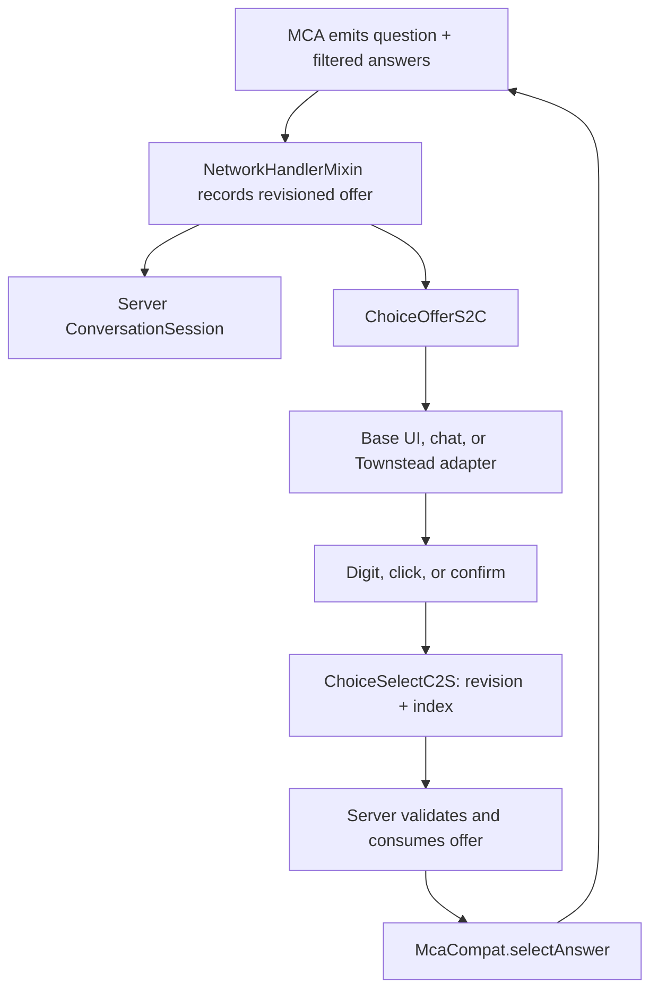

# MCA: Conversations — Numbered Responses and UI/UX Modernization

## Implementation specification for Minecraft 1.20.1 Forge

**Repository:** [otectus/MCAConversations](https://github.com/otectus/MCAConversations)  
**Repository baseline reviewed:** [`16b5ab95ed3c1dae3d8023a53e1b518a367de089`](https://github.com/otectus/MCAConversations/commit/16b5ab95ed3c1dae3d8023a53e1b518a367de089) on `main`  
**Review date:** 2026-08-26  
**Primary target:** Minecraft `1.20.1`, Forge `47.4.10`, Java `17`  
**MCA compatibility baseline:** MCA Reborn `7.6.20`, `7.7.0-beta.2`, and the renamed `7.7.1-alpha.2` package root already covered by the repository's probe fleet  
**Current project version at review:** `1.3.0-alpha.1`

---

## 1. Purpose

Implement a coherent numbered-response system across MCA: Conversations' supported conversation frontends, with the following core behavior:

1. When the player is shown two or more responses, display them as a vertical numbered list.
2. Allow the player to activate a visible response with its corresponding number key.
3. Preserve mouse selection, keyboard navigation, chat-mode free text, and all existing dialogue consequences.
4. Make the dialogue interface easier to scan, navigate, localize, and use at different GUI scales.
5. Keep the server authoritative. A number key must identify an answer the server actually offered; it must never become a new way to submit arbitrary question or answer IDs.
6. Preserve MCA: Conversations' existing cross-version architecture: no compile-time linkage to MCA classes, soft-failing dual-root Mixins, and graceful behavior when optional UI integrations are absent.

This is a UI and input update, not a conversation-content rewrite. It must not change answer order, constraints, result weighting, heart effects, disposition effects, memories, quests, gossip, or branching outcomes.

---

## 2. Executive summary

The repository already contains part of the requested feature, but not the complete UX:

- `QuickReplies` already renders chat-mode choices with numeric labels and accepts a **typed** bare number.
- The current chat list is a single horizontal line separated by spaces, not a readable vertical menu.
- `QuickReplies.MAX_OPTIONS` is `5`, while bundled menus currently contain as many as **eight** answers. Therefore some valid answers can be offered by the server but omitted from the numbered chat line and made impossible to choose by number.
- MCA's ordinary `InteractScreen` renders answers as centered, unnumbered text rows. Its current upstream implementation uses fixed ten-pixel row spacing, does not wrap long answers, does not paginate them, and handles only Escape in `keyPressed`.
- MCA: Conversations already records the exact constraint-filtered answer list from MCA's outgoing dialogue packet in the shared `ConversationSession`. That is the correct authority for numbering and hotkey selection.
- The existing custom network channel currently carries only `TypingStatusC2S`, so direct hotkey selection requires a small protocol extension.
- Townstead's optional RPG screen already provides wrapping, scrolling, hover selection, arrow-key navigation, Enter selection, submenus, and typewriter pagination. It should be extended narrowly with numeric labels and digit activation, not replaced.

The recommended design is therefore:

1. Promote the current question and ordered answers into an immutable, revisioned **choice offer**.
2. Sync that offer to the speaking player's client whenever MCA emits an `InteractionDialogueResponse`.
3. Render the same offer through frontend-specific adapters:
   - a redesigned choice card in MCA's base `InteractScreen`;
   - a vertical quick-reply block in typed chat;
   - number badges and digit handling inside Townstead's existing `ChoicePanel` when Townstead is present.
4. Send only `(offerRevision, absoluteChoiceIndex, optionalVillagerUuid)` back to the server.
5. Re-resolve the answer from server-owned state, validate context and constraints, consume the offer atomically, and then call the existing `McaCompat.selectAnswer` path exactly once.

---

## 3. Repository-grounded findings

### 3.1 Relevant current implementation

| Area | Current behavior | Consequence for this update |
|---|---|---|
| [`QuickReplies.java`](https://github.com/otectus/MCAConversations/blob/16b5ab95ed3c1dae3d8023a53e1b518a367de089/src/main/java/dev/otectus/mcaconversations/chat/QuickReplies.java) | Builds `[1] Answer  [2] Answer` on one component line; parses typed values such as `2`, `(2)`, or `#2`; caps display and parsing at five | Reuse its strict parser semantics, but remove the five-answer truncation and render a vertical block |
| [`ChatModeDispatcher.java`](https://github.com/otectus/MCAConversations/blob/16b5ab95ed3c1dae3d8023a53e1b518a367de089/src/main/java/dev/otectus/mcaconversations/chat/ChatModeDispatcher.java) | Checks a live offered list before free-text intent matching and drives the same answer path as the GUI | Preserve this ordering; numeric selection remains an exact answer selection, not an NLU intent |
| [`ChatDelivery.java`](https://github.com/otectus/MCAConversations/blob/16b5ab95ed3c1dae3d8023a53e1b518a367de089/src/main/java/dev/otectus/mcaconversations/chat/ChatDelivery.java) | Appends one options component under the speaking player's villager line and hides it from bystanders | Keep choices private to the addressed player; replace the single options line with a proper options block |
| [`NetworkHandlerMixin.java`](https://github.com/otectus/MCAConversations/blob/16b5ab95ed3c1dae3d8023a53e1b518a367de089/src/main/java/dev/otectus/mcaconversations/mixin/NetworkHandlerMixin.java) | Observes MCA's outgoing `InteractionDialogueResponse`, records its question and already-filtered answer list for both GUI and chat, and swallows it only in chat redirect scope | Extend this exact interception point to create and sync a revisioned offer |
| [`ConversationSession.java`](https://github.com/otectus/MCAConversations/blob/16b5ab95ed3c1dae3d8023a53e1b518a367de089/src/main/java/dev/otectus/mcaconversations/conversation/ConversationSession.java) | Stores `currentQuestion` and an immutable copy of `currentAnswers`; already shared by GUI and chat | Add offer revision, frontend, consumed state, and atomic lookup/consume operations here rather than creating a second state store |
| [`InteractionDialogueMessageMixin.java`](https://github.com/otectus/MCAConversations/blob/16b5ab95ed3c1dae3d8023a53e1b518a367de089/src/main/java/dev/otectus/mcaconversations/mixin/InteractionDialogueMessageMixin.java) | Guards the mod's own GUI questions against fabricated or duplicate submissions | Reuse its security principles; the new numeric packet can be stricter because it is fully controlled by this mod |
| [`ConversationsNetwork.java`](https://github.com/otectus/MCAConversations/blob/16b5ab95ed3c1dae3d8023a53e1b518a367de089/src/main/java/dev/otectus/mcaconversations/network/ConversationsNetwork.java) | Protocol `1`; message discriminator `0` is `TypingStatusC2S` | Bump the protocol and register offer, clear, and choice-selection messages without renumbering the existing message |
| [`mcaconversations.mixins.json`](https://github.com/otectus/MCAConversations/blob/16b5ab95ed3c1dae3d8023a53e1b518a367de089/src/main/resources/mcaconversations.mixins.json) | Two client Mixins; all MCA targets are dual-root, `@Pseudo`, and soft-fail | Add the new base-screen Mixin to the `client` section and extend the existing target probes |

### 3.2 The five-option cap is already incorrect for bundled content

The cap is not merely theoretical. The current data contains menus larger than five:

| Question | Authored answers before constraint filtering |
|---|---:|
| [`conversations`](https://github.com/otectus/MCAConversations/blob/16b5ab95ed3c1dae3d8023a53e1b518a367de089/src/main/resources/data/mcaconversations/dialogues/conversations.json) | 8 |
| `conversations.cat.personal` | 8 |
| `conversations.cat.village` | 6 |
| `conversations.us` | 5 |
| `conversations.cat.chitchat` | 5 |

An adult can legitimately see more than five entries in these menus. The coding agent must not retain `MAX_OPTIONS = 5`, truncate silently, or number only a prefix of an offer.

### 3.3 MCA's base interaction screen needs structural cleanup

At MCA Reborn's reviewed `1.20.1` baseline, [`InteractScreen`](https://github.com/Luke100000/minecraft-comes-alive/blob/4d824551b30654e5792e19e84f3933e3e3d90ea2/common/src/main/java/net/mca/client/gui/InteractScreen.java):

- draws every answer as centered text;
- increments the answer Y coordinate by a fixed `10` pixels;
- gives each answer a fixed hover strip rather than a height derived from wrapped text;
- provides no answer wrapping or paging;
- sends a choice only from a left mouse click;
- handles Escape but no response hotkeys in `keyPressed`;
- changes the player's selected hotbar slot from `mouseScrolled`, including while a dialogue is visible;
- leaves a comment acknowledging dialogue double-click behavior.

The add-on should not replace the entire MCA screen. The villager information, icon strip, gift mode, close lifecycle, and button layouts are MCA's responsibility. Replace or wrap only the dialogue-choice portion.

### 3.4 Existing architectural invariants are load-bearing

The current branch deliberately supports MCA's package migration from `forge.net.mca.*` to `forge.net.conczin.mca.*`. The implementation must preserve all of the following:

- no MCA class descriptor in compiled MCA: Conversations classes;
- string-targeted `@Pseudo` Mixins for both known Forge package roots;
- `remap = false` for MCA-owned methods;
- `require = 0` plus build-time probes that prevent silent drift;
- dedicated-server isolation from client classes;
- no hard dependency on Townstead;
- identical dialogue engine calls and consequences regardless of frontend.

Do not solve the UI task by adding MCA as an `implementation` dependency or importing `InteractScreen`, `VillagerLike`, `InteractionDialogueMessage`, `Question`, or any other MCA class.

---

## 4. Required user experience

### 4.1 Base MCA interaction screen

When a dialogue question has at least two valid answers, render a vertically stacked choice card. Each row must contain:

| Element | Required behavior |
|---|---|
| Number | Show `1.` through `9.` for the choices on the current page |
| Answer | Use the exact `dialogue.<question>.<answer>` component the ordinary MCA UI would use |
| Row | Left-align text, wrap long translations, and size the hitbox to the wrapped content |
| Hover | Highlight the entire row and move keyboard focus to it |
| Focus | Show a visible border/indicator in addition to a color change |
| Selection | Mouse click, number key, Numpad number, Enter, or Space must activate the same answer once |
| Hint | Show a restrained footer such as `1–8 Select  •  ↑/↓ Move  •  Enter Confirm  •  Esc Close` |
| Overflow | Page at nine choices; show `Page 1/2` and support wheel, Page Up/Page Down, or small page controls |

Example content hierarchy:

| Number | Response |
|---:|---|
| 1. | How has your day been? |
| 2. | Tell me about your work. |
| 3. | What is happening around the village? |
| 4. | I wanted to ask something personal. |

The question belongs in a distinct header region above the answers. It may remain centered if that suits the current style, but answers should be left-aligned because left alignment is much easier to scan when lines wrap.

### 4.2 One-choice and zero-choice states

- **Zero choices:** do not render an empty panel. Preserve the existing terminal-line or close behavior.
- **One choice:** render a single primary row without implying a meaningful decision. Enter, Space, or mouse may activate it. A numeric `1.` is optional; the default recommendation is to label it as `Continue` only if the authored translation is not already meaningful. Never replace the actual translated answer text.
- **Two or more choices:** numbering and numeric shortcuts are mandatory.

### 4.3 Input behavior

| Input | Choice-screen behavior |
|---|---|
| Top-row `1`–`9` | Select the corresponding entry on the current page |
| Numpad `1`–`9` | Same as the corresponding top-row digit |
| Up / Down | Move focus by one entry and keep it visible |
| Home / End | Move to the first / last entry on the current page |
| Enter / Space | Activate the focused entry |
| Mouse move | Move focus to the hovered row |
| Left click | Activate the hovered row |
| Wheel / Page Up / Page Down | Change page or scroll the choice region; never change the hotbar while choices own focus |
| Escape | Preserve the screen's existing close/back behavior |

Do not intercept number keys globally merely because an offer exists. In ordinary gameplay those keys select hotbar slots. Numeric capture is safe when a dialogue screen owns keyboard focus. Chat-mode behavior requires a separate policy described in section 10.

### 4.4 Selection feedback and locking

After any selection:

1. Mark the row as selected immediately.
2. Disable further answer input for that offer.
3. Optionally show a subtle pressed state or `Selecting…` indicator while awaiting the next server response.
4. Unlock only when a newer offer revision arrives, the server clears the offer, or the screen is reopened.

This closes MCA's existing double-click gap and prevents held number keys from submitting repeated packets.

### 4.5 Answer order is immutable

Numbers must reflect the ordered, constraint-filtered answer list emitted by MCA. Never:

- alphabetize answers;
- sort by translated text;
- move positive choices above negative choices;
- group choices by guessed sentiment;
- insert an unnumbered answer between numbered rows;
- renumber after hover;
- derive a separate client-side constraint list.

Styling a recognized `back`, `decline`, or `farewell` answer as secondary is acceptable, but it must retain its original absolute position and corresponding server index.

---

## 5. Recommended architecture



The server-owned offer is the single source of truth. Client UI models are projections of that offer, not authorities.

### 5.1 Server offer model

Extend the shared session with an immutable snapshot similar to:

```java
public record ChoiceOffer(
        long revision,
        UUID villagerId,
        String questionId,
        List<String> answerIds,
        ConversationSession.Frontend frontend,
        long createdGameTime,
        boolean consumed
) {}
```

The exact representation may remain as fields on `ConversationSession`, but expose snapshot-style accessors. Required semantics:

- `revision` increases monotonically for every newly recorded offer, even if the same question and same answers recur;
- `answerIds` is an immutable ordered copy;
- `consumed` becomes true atomically before dialogue execution;
- changing villager, ending a topic, timing out, logging out, or closing the relevant interaction clears the offer;
- a stale revision can never select a newer instance of the same question.

For a chat redirect, the villager UUID is available from `ChatModeSession.Scope`. For the ordinary GUI, the outgoing MCA response packet does not carry a villager UUID. The client numeric-selection packet may therefore include the villager UUID captured from the active screen, but the server must treat it only as a candidate and independently validate it.

### 5.2 Client offer model

Create a client-only store such as `ClientChoiceState` containing:

```java
public record ClientChoiceOffer(
        long revision,
        String questionId,
        List<String> answerIds,
        Frontend frontend,
        long receivedClientTick
) {}
```

Also track:

- currently focused absolute index;
- current page;
- locked/selected index;
- screen identity or villager UUID when applicable;
- an expiry fallback;
- the highest revision observed.

Ignore out-of-order offer or clear packets whose revision is lower than the current revision. Clear state on disconnect, world change, death screen, and explicit screen close.

### 5.3 Why a custom selection packet is preferred

A direct selection packet is safer and more maintainable than synthetically invoking `mouseClicked` or reflectively constructing MCA's private packet:

- it carries no client-supplied answer ID;
- it can be replay-protected with the offer revision;
- it uses the exact server-owned list already captured from MCA;
- it can share validation between base UI, chat UI, and Townstead;
- it avoids a new static MCA link;
- it eliminates keyboard-specific divergence from mouse behavior;
- it provides a natural place to fix duplicate submission.

The packet handler still ends at `McaCompat.selectAnswer`, so result selection and all consequences remain MCA-native.

---

## 6. Network protocol changes

### 6.1 Messages

Keep discriminator `0` assigned to the existing typing message and add:

| ID | Direction | Message | Payload |
|---:|---|---|---|
| 0 | C2S | `TypingStatusC2S` | Existing boolean |
| 1 | S2C | `ChoiceOfferS2C` | Revision, frontend, question ID, ordered answer IDs, optional expiry hint |
| 2 | S2C | `ChoiceClearS2C` | Revision and optional translatable reason enum |
| 3 | C2S | `ChoiceSelectC2S` | Revision, zero-based absolute index, optional villager UUID |

Bump `ConversationsNetwork.PROTOCOL` from `"1"` to `"2"`. Both sides already require the mod through MCA's client/server topology, so strict equality remains appropriate. Note the protocol bump in the changelog because old clients will not connect to new servers.

### 6.2 Codec limits

Defend the codec even though MCA already transmitted the original answer list:

- question ID: maximum 256 UTF-8 characters;
- each answer ID: maximum 256 UTF-8 characters;
- synchronized choices: maximum 64;
- absolute index: VarInt, rejected if negative or outside the stored list;
- no translated answer strings in packets;
- no arbitrary components from the client;
- no client-supplied question or answer IDs in `ChoiceSelectC2S`.

If a datapack produces more than the synchronization limit, do **not** truncate and show misleading numbers. Disable numeric synchronization for that offer, leave MCA's original mouse UI operational, and log one rate-limited warning naming the question and count.

### 6.3 Handler threading

All C2S handling must use `NetworkEvent.Context.enqueueWork`. Entity lookup, session mutation, constraint checks, and `selectAnswer` belong on the server thread. Set the packet handled flag regardless of acceptance.

### 6.4 Invalid-packet policy

Invalid or stale selections should be ignored and optionally logged at debug level. Do not kick a player for a race caused by screen close, latency, or an offer changing between key press and arrival. Rate-limit warnings for structurally impossible values.

---

## 7. Server-side selection pipeline

Create one service, for example `ChoiceSelectionService`, so packet handlers and any future `/conversations choose` fallback do not duplicate validation.

### 7.1 Validation order

For `ChoiceSelectC2S`, perform these checks in order:

1. Sender exists, is connected, alive, and not a spectator.
2. MCA bridge is available.
3. A non-consumed current offer exists for the sender.
4. Packet revision exactly equals the current offer revision.
5. Index is inside the server-owned ordered answer list.
6. Offer has not exceeded `conversationSessionTimeoutTicks`.
7. Resolve the intended villager:
   - **GUI:** require a packet villager UUID, resolve it in the sender's current level, require an MCA villager, require reasonable interaction distance, and require MCA's interacting-player state to name this player.
   - **CHAT:** ignore or cross-check the packet UUID; use the server's sticky/scope villager ID, require the same active partner, and require the configured addressed radius.
8. Require the session villager, if already known, to equal the resolved villager; set it only when this is the first valid GUI offer association.
9. Re-run `McaCompat.checkConstraints(villager, player, questionId, answerId)` even though the answer came from a filtered list. This protects against state changes between offer and selection.
10. Atomically consume the exact `(revision, index)` offer.
11. Mark the session frontend appropriately and call `McaCompat.selectAnswer` once.
12. Send `ChoiceClearS2C` for the consumed revision. A new outgoing MCA response will immediately supersede it with a higher revision if the branch continues.

### 7.2 Do not trust duplicated client context

The client may display `questionId` and translated labels, but selection should contain only revision and index. The server derives:

```java
String question = offer.questionId();
String answer = offer.answerIds().get(index);
```

This is the central security property of the feature.

### 7.3 Consume before execution

Mark the offer consumed before invoking the dialogue engine. If an action throws, log it, clear the client offer, and leave durable idempotency guards intact. Do not restore the offer automatically: restoring can turn a held digit or duplicated packet into a second side effect after a partial failure.

### 7.4 Reconcile ordinary mouse packets

The base MCA mouse path still sends MCA's `InteractionDialogueMessage`. Keep `InteractionDialogueMessageMixin`, but strengthen it for MCA: Conversations-owned questions:

- require the answer to match the current offer;
- claim the current offer revision/answer before MCA receives it;
- reject a second click on the same revision;
- preserve fail-open behavior for native MCA questions unless this update explicitly opts into guarding them.

The custom numeric packet can safely support every question displayed by the adapted screen because it performs its own strict validation. Do not broaden the existing native-packet Mixin casually across all MCA and third-party questions; that would change upstream semantics outside this add-on's ownership.

---

## 8. Base MCA screen adapter

### 8.1 Mixin target

Add a client-only, `@Pseudo` Mixin targeting both known production roots:

```text
forge.net.mca.client.gui.InteractScreen
forge.net.conczin.mca.client.gui.InteractScreen
```

Use `remap = false` for MCA-owned methods and `require = 0`, then add explicit target/signature probes so a future MCA reshaping cannot silently ship without numeric UI.

Do not import the target class. Shadow only vanilla/JDK-typed fields or use `@Coerce Object` for MCA-typed constructor parameters. The currently useful vanilla fields are conceptually:

- `List<String> dialogAnswers`;
- `String dialogAnswerHover`;
- `List<FormattedCharSequence> dialogQuestionText`;
- `String dialogQuestionId`.

Capture the active villager UUID at screen construction with a client-only bridge that accepts `Object`, first using `instanceof Entity`, then a probed `asEntity()` handle as fallback. Keep this bridge out of dedicated-server class loading.

### 8.2 Rendering integration

Do not overwrite the whole screen. Wrap only the call that draws the legacy text popup, or suppress only its dialogue subsection while leaving villager name, profession, mood, personality, traits, hearts, parents, genes, and analysis rendering untouched.

Preferred implementation:

1. Intercept the one `render` call into MCA's private text-popup method.
2. Invoke the original method with dialogue fields temporarily hidden inside `try/finally`, so all non-dialogue text remains.
3. Restore the fields.
4. Invoke `DialogueChoiceRenderer` with the original question lines, answer IDs, mouse position, and screen dimensions.

If a safe private-method invocation cannot be established for all probed versions, a fully opaque tail-rendered dialogue card covering the exact legacy dialogue rectangle is an acceptable fallback. Do not leave old and new answer text simultaneously visible.

### 8.3 Keep layout code pure

Create a pure `DialogueChoiceLayout` that receives dimensions and pre-wrapped row heights and returns rectangles. Avoid embedding layout arithmetic in the Mixin.

Recommended geometry in Minecraft GUI-scaled pixels:

| Property | Recommendation |
|---|---|
| Outer margin | 16 px, never less than 8 on very small screens |
| Panel width | `clamp(screenWidth - 32, 220, 380)` |
| Panel height | Content height capped to `screenHeight - 32` |
| Inner padding | 8 px |
| Number column | 18–24 px, enough for `9.` and focus indicator |
| Row padding | 4 px vertical, 6 px horizontal |
| Row gap | 2 px |
| Minimum row height | 18 px |
| Question/answer gap | 8 px with a one-pixel divider |
| Footer gap | 6 px |

These are starting values; verify visually at GUI scales 1–4 and at the minimum supported window size.

### 8.4 Wrapping and caching

Resolve answer components client-side:

```java
Component.translatable("dialogue." + questionId + "." + answerId)
```

Do not flatten them to strings. Split with the current `Font` against the available answer text width. Cache the resulting lines and rectangles by:

- offer revision;
- current language/resource reload generation;
- screen width and height;
- GUI scale;
- current page.

Rendering should be allocation-light. Do not rebuild translated components and call `font.split` for every answer on every frame.

### 8.5 Paging

Use nine choices per page. On page `p`, digit `d` maps to:

```text
absoluteIndex = p * 9 + (d - 1)
```

Only display number labels `1.` through the number of entries on that page. Show a clear `Page x/y` footer when more than one page exists. A page change must:

- update focus to the first available entry or preserve the same absolute choice if still visible;
- recompute hover rectangles;
- never submit an answer;
- never alter server order;
- never carry a selected/locked row from another revision.

### 8.6 Input integration

Inject at the head of `keyPressed` only while a choice panel is active. Handle recognized keys and set the return value to `true`; otherwise allow MCA's original method to run.

For number keys:

1. Translate GLFW top-row and keypad codes into a page-local number.
2. Reject modifiers other than Num Lock semantics; do not treat Ctrl+1 or Alt+1 as a dialogue choice.
3. Resolve the absolute index.
4. If valid and unlocked, send `ChoiceSelectC2S` and lock the offer.
5. Play the ordinary UI click sound at a restrained volume.

Inject into `mouseScrolled` before MCA changes `player.getInventory().selectedSlot`. If choices are active and overflow, consume the event for paging/scrolling. If choices fit, allow unrelated scrolling only if it cannot change the hotbar while the interaction screen owns focus; the preferred behavior is to consume it.

### 8.7 Focus and mouse parity

Maintain one `focusedIndex`. Hover sets focus; keyboard movement sets focus; moving the mouse later may change it. The rendered highlight, narrated row, Enter target, and click target must all refer to that same value.

Do not use `dialogAnswerHover` as the entire new UI model. Keep it synchronized only where necessary for compatibility with MCA's ordinary mouse behavior.

---

## 9. UI cleanup beyond numbering

Implement the following in priority order.

### 9.1 Required cleanup

- **Vertical hierarchy:** question, divider, response list, then controls footer.
- **Left-aligned responses:** improves scanning and makes wrapped lines coherent.
- **Responsive width:** replace MCA's fixed 160/170-pixel assumptions for this panel.
- **Wrapped text:** no clipping, overlap, or hitbox mismatch in long translations.
- **Full-row hitboxes:** clicking padding beside text should select that row.
- **Visible focus:** use a border, arrow, or filled strip in addition to color.
- **Submission lock:** eliminate double-click and held-key duplicates.
- **Page/scroll indicator:** make overflow discoverable.
- **No hotbar mutation:** wheel input inside the dialogue UI belongs to the dialogue UI.
- **Stable question transition:** keep the prior card visible in a locked state until the next offer/line arrives, avoiding a distracting blank flash.

### 9.2 Recommended polish

- Show the villager's name as a concise panel title if it can be obtained without duplicating MCA's existing name label.
- Style `back`, `decline`, `farewell`, and similar answers as secondary through color/border only; never reorder them.
- Move heart-change feedback into a small personal status chip near the card rather than appending it to the spoken sentence on GUI surfaces. Retain the current configurable chat suffix in chat mode.
- Use a short 3–5 tick fade/slide only when motion is enabled; never delay input until animation completes.
- Preserve focused answer by answer ID across a screen resize when the offer revision is unchanged.
- Show an unobtrusive error/expired message if the server rejects a choice because the offer changed, then clear the stale client state.

### 9.3 Avoided scope

Do not add portraits, relationship dashboards, quest journals, radial menus, cinematic camera changes, or a wholesale MCA screen replacement in this update. Those features enlarge compatibility risk and are not required to make response selection clean.

---

## 10. Typed-chat frontend

### 10.1 Preserve what already works

Keep all current chat behavior:

- free-text matching remains primary;
- a bare typed number still selects a live offered answer;
- phrases containing numbers, such as `give me 2 minutes`, remain ordinary speech;
- choices are shown only to the addressed player, never bystanders;
- the same constraint checks and `selectAnswer` call are used;
- no player chat message is canceled or mutated by default.

### 10.2 Replace `optionsLine` with a vertical block

Refactor `QuickReplies.optionsLine` into a name such as `optionsBlock` and render:

```text
1. First translated response
2. Second translated response
3. Third translated response
```

Requirements:

- one response per line;
- actual offered order;
- no five-answer cap;
- show every synchronized answer for current bundled menus;
- number prefix visually distinct but readable;
- translated answer component retained intact;
- optional hover text such as `Select response 2`;
- optional `SUGGEST_COMMAND` click behavior that prepares the numeric response without silently sending it.

Use `SUGGEST_COMMAND`, not `RUN_COMMAND`, unless a dedicated `/conversations choose` command is implemented with the same revisioned validation. A chat click must not bypass the offer guard.

### 10.3 Numeric keys in chat mode

Do **not** steal digits from normal in-world hotbar control. Recommended default:

1. A pending chat offer displays the numbered list and a short `Press T, then 1–9` hint.
2. When `ChatScreen` is open, a Forge screen-key event or narrow vanilla `ChatScreen` Mixin may intercept an unmodified digit only if:
   - a live chat offer exists;
   - the chat input is empty or whitespace-only;
   - no suggestion list is active;
   - no Ctrl, Alt, or Shift modifier is held;
   - the digit maps to a visible answer.
3. Send `ChoiceSelectC2S` directly and close the chat screen, without broadcasting the digit as player chat.
4. If the input contains any text, the digit behaves normally and is inserted into the message.
5. Sending a bare number through ordinary chat remains a fallback for clients with the shortcut disabled.

This provides genuine one-key selection once the player opens chat while preserving the hotbar and ordinary numeric typing.

An optional dedicated `Quick Reply Focus` key could allow in-world digits to be captured temporarily, but it should not be default and is not required for this update.

### 10.4 More than nine chat answers

Current bundled menus top out at eight authored answers, so direct digits cover them. For third-party datapacks with ten or more:

- render global numbers for all choices within the synchronization limit;
- allow strict typed multi-digit values such as `10`;
- keep direct one-key selection limited to `1`–`9`;
- state this in the hint when needed;
- do not truncate the visible list silently.

Update `QuickReplies.parse` so its valid upper bound is the actual offered count, subject only to a defensible hard safety ceiling. Retain its punctuation and whole-message strictness.

---

## 11. Townstead RPG dialogue compatibility

### 11.1 Preserve ownership

When Townstead's RPG dialogue UI is active, do not replace `RpgDialogueScreen`, open a second screen, bypass MCA packets, or disturb Townstead's camera/HUD lifecycle.

At the pinned compatibility baseline, Townstead's [`ChoicePanel`](https://github.com/AetherianArtificer/Townstead/blob/4d6206cdf8b9d0f558694d7b35b223f4f6ace61e/src/main/java/com/aetherianartificer/townstead/client/gui/dialogue/ChoicePanel.java) already provides:

- wrapped entries;
- scroll bounds and indicators;
- hover and selected indices;
- arrow-key navigation;
- Enter selection;
- top-level hub entries, submenus, and Back;
- preservation of raw MCA answer IDs;
- support for unknown/modded MCA answers.

The add-on should decorate that model, not duplicate it.

### 11.2 Number visible Townstead entries

Number the entries the player can currently select, including hub and Back entries. Do not number only `rawAnswers`, because a visible hub entry may represent several raw answers and does not itself send an MCA answer.

Digit selection must:

1. map to the visible entry on the current nine-entry page;
2. update Townstead's existing selected index;
3. invoke its existing choice-selection routine;
4. let that routine decide whether the entry is an MCA answer, submenu, or Back action;
5. preserve Townstead's own packet send and screen transition behavior.

### 11.3 Optional Mixins must be guarded

Use Townstead-targeted client Mixins only when the target classes exist. Extend the existing Mixin plugin/probe approach rather than making Townstead a hard dependency.

Likely narrow targets are:

- `ChoicePanel.render` for number badges and adjusted text inset;
- `RpgDialogueScreen.keyPressed` for digit mapping;
- a small mixed-in bridge method on `ChoicePanel` to select an absolute visible index and call its existing visibility logic;
- an invoker for `RpgDialogueScreen.handleChoiceSelection` if no public selection hook exists.

If Townstead changes these private members, fail back to its fully functional mouse/arrow/Enter UI. Never fail game startup.

### 11.4 Townstead test cases

- top-level MCA menu with unknown `conversations` leaf;
- `ADDITIVE`, `REPLACE`, and `HIDDEN` hub entry modes;
- Townstead hub entry selected by number;
- submenu answer selected by number;
- Back selected by number;
- ten or more visible entries with paging/scrolling;
- number press while typewriter text is still revealing does not select a hidden choice;
- Page Up/Page Down debug/effect behavior is not consumed incorrectly;
- Escape, distance close, villager death/unload, and HUD restoration remain intact;
- chat/Townstead frontend switching cannot reuse a stale offer revision.

---

## 12. Localization and accessibility

### 12.1 Translation keys

Add base translations in `assets/mcaconversations/lang/en_us.json` and maintain parity in every locale the project promises as complete, currently including `pt_br`.

Suggested keys:

```json
{
  "gui.mcaconversations.responses.title": "Choose a response",
  "gui.mcaconversations.responses.hint": "%1$s Select  •  ↑/↓ Move  •  Enter Confirm",
  "gui.mcaconversations.responses.page": "Page %1$s/%2$s",
  "gui.mcaconversations.responses.selecting": "Selecting…",
  "gui.mcaconversations.responses.expired": "That response is no longer available.",
  "gui.mcaconversations.responses.narration": "Response %1$s of %2$s: %3$s",
  "chat.mcaconversations.responses.hint": "Press T, then a response number.",
  "chat.mcaconversations.responses.hover": "Select response %1$s"
}
```

The exact English wording may be refined, but do not concatenate translated fragments when a full translatable component can express the sentence.

### 12.2 Narration

If Minecraft narration is active:

- announce a new question once per offer revision;
- announce the focused row as `Response 2 of 5: <translated answer>`;
- announce page changes;
- announce selection lock or expiry once;
- never narrate the entire list every render frame.

### 12.3 Visual accessibility

- Do not communicate focus by color alone.
- Keep normal text near full white; use muted gray only for hints and secondary metadata.
- Ensure the selected row has a border, arrow, or filled background visible under common resource packs.
- Avoid transparency so low that world detail makes text unreadable.
- Reuse Minecraft's current GUI scale; do not force a separate scale.
- Verify Unicode arrows and symbols have a fallback; use localized words if a glyph is unavailable.
- Ensure numeric labels remain left-to-right and visually distinct in right-to-left locale packs.

---

## 13. Configuration

The clean default should require no configuration. Add only controls with real user value to the currently empty client display spec:

| Option | Default | Meaning |
|---|---:|---|
| `numberedResponses` | `true` | Render number labels on supported dialogue surfaces |
| `numericResponseShortcuts` | `true` | Enable digits while a dialogue screen owns focus |
| `chatNumericShortcuts` | `true` | Let an empty open chat screen select a pending chat response by digit |
| `showResponseControlHints` | `true` | Show the compact input footer/hint |

Do not expose pixel padding, colors, row height, maximum width, animation ticks, or page size as configuration in the first release. Excessive display settings make the UX harder to support and test. Use resource-packable textures/colors later if demand exists.

If `numberedResponses=false`, numeric shortcuts should also be disabled to avoid invisible mappings. Mouse, arrows, Enter, and typed free text must continue to work.

---

## 14. Proposed file-level change map

Names are recommendations; adapt them to repository conventions while preserving the responsibilities.

| File | Change |
|---|---|
| `conversation/ConversationSession.java` | Add offer revision, frontend, villager association, consumed state, snapshot access, and atomic consume |
| `conversation/ConversationSessions.java` | Make `recordOffer` return a snapshot/revision; add clear/consume helpers and test seams |
| `mixin/NetworkHandlerMixin.java` | Record frontend-aware offer, attach chat villager context, and send `ChoiceOfferS2C`/clear state |
| `network/ConversationsNetwork.java` | Protocol `2`; register three new messages after existing ID `0` |
| `network/ChoiceOfferS2C.java` | Decode bounded offer data and update client state on client thread |
| `network/ChoiceClearS2C.java` | Clear only the matching or older client revision |
| `network/ChoiceSelectC2S.java` | Enqueue server validation using revision and index |
| `conversation/ChoiceSelectionService.java` | Central server-authoritative resolve, validate, consume, and drive pipeline |
| `client/dialogue/ClientChoiceState.java` | Client offer, focus, page, lock, expiry, and lifecycle |
| `client/dialogue/DialogueChoiceLayout.java` | Pure responsive rectangles and page/index mapping |
| `client/dialogue/DialogueChoiceRenderer.java` | Cached translated/wrapped components and visual states |
| `client/dialogue/DialogueChoiceInput.java` | GLFW digit/keypad mapping and shared navigation helpers |
| `mixin/client/InteractScreenChoiceMixin.java` | Base MCA render, key, mouse, scroll, screen lifecycle, and villager capture |
| `client/ChatChoiceInput.java` | Empty-ChatScreen numeric selection without global hotbar interception |
| `chat/QuickReplies.java` | Vertical list, actual offer bound, multi-digit typed fallback, click/hover metadata |
| `chat/ChatDelivery.java` | Append an options block and clear/sync at the correct lifecycle points |
| `McaConversationsConfig.java` | Populate the client display section with the four user-facing switches |
| `mcaconversations.mixins.json` | Register base-screen adapter; add optional Townstead adapters through the plugin |
| `assets/mcaconversations/lang/en_us.json` | UI, hint, error, and narration keys |
| `assets/mcaconversations/lang/pt_br.json` | Complete parity for the new keys |
| existing probes/tests | Cover dual MCA roots, optional Townstead targets, no static MCA links, and dedicated-server client isolation |

Optional Townstead adapter files:

```text
mixin/client/townstead/TownsteadChoicePanelMixin.java
mixin/client/townstead/TownsteadRpgDialogueScreenMixin.java
client/townstead/NumberedChoicePanelBridge.java
```

---

## 15. Testing strategy

### 15.1 Pure unit tests

Add focused tests that do not need a running Minecraft client:

| Test | Required cases |
|---|---|
| `QuickRepliesTest` | 1–9; `10`; punctuation wrappers; zero/out-of-range; embedded-number sentences rejected; actual count above five; vertical component ordering |
| `DialogueChoiceLayoutTest` | small and large screens; wrapped rows; page counts; first/last index; exact nine and ten; no overlapping rectangles |
| `DialogueChoiceInputTest` | top-row digits; keypad digits; modifiers; arrows; Enter/Space; invalid key |
| `ClientChoiceStateTest` | newer revision replaces old; stale offer ignored; stale clear ignored; lock; page reset; disconnect clear; expiry |
| `ChoiceOfferCodecTest` | round trip; bounds; malformed counts; long IDs rejected without allocation abuse |
| `ChoiceSelectionServiceTest` | correct index; stale revision; consumed offer; wrong villager; wrong frontend; distance; changed constraints; duplicate packet; engine failure |
| `ConversationSessionTest` | monotonically increasing revision; immutable answers; atomic consume; same question reopened with new revision; target switch clear |

### 15.2 Content and locale tests

Extend existing lints to assert:

- every new `en_us` UI key exists in `pt_br` if that locale remains advertised as complete;
- no answer order is altered by the numbered presentation layer;
- bundled questions with more than five answers remain fully representable;
- all translated labels used by the renderer are components, not flattened strings;
- no raw numeric prefix is added to authored language values.

### 15.3 Binding and Mixin probes

Update the existing MCA probe fleet for:

- both `InteractScreen` package roots;
- field and method descriptors used by the client Mixin;
- constructor villager capture;
- render/key/mouse/scroll injection points;
- no MCA class constants in compiled output;
- no client class reference reachable from dedicated-server initialization.

For Townstead, probe the exact supported jar when provided. A missing optional jar must not fail ordinary tests.

### 15.4 Production-style manual matrix

The repository notes that ordinary `runClient` is not authoritative for MCA's shipped Forge Mixins. Use production-style instances for final validation.

Test at least:

| Axis | Values |
|---|---|
| MCA | `7.6.20`, `7.7.0-beta.2`, `7.7.1-alpha.2` or the supported release replacing it |
| Townstead | absent, present at supported version |
| Environment | integrated client, dedicated server with two clients |
| GUI scale | 1, 2, 3, 4 / Auto |
| Resolution | minimum supported window, 1080p, ultrawide |
| Locale | `en_us`, `pt_br`, one locale with longer strings |
| Input | mouse, top-row digits, keypad, arrows + Enter, Space, wheel, Page Up/Down |
| Chat policy | public replies on/off, local chat off/default, empty/non-empty ChatScreen |
| Latency | normal and simulated high latency/double press |

### 15.5 Required manual scenarios

1. Open the eight-entry Conversations hub and select entries `1`, `5`, and `8` by key.
2. Open `conversations.cat.personal` and verify all eight answers appear.
3. Use a test datapack with ten, eighteen, and sixty-five answers.
4. Verify nine-entry page mapping and page two mapping.
5. Verify the sixty-five-answer offer disables numeric sync without truncating MCA's fallback UI.
6. Hover one row, move with arrows, and confirm visual/narration focus agrees.
7. Hold a digit key; exactly one selection reaches the engine.
8. Double-click; exactly one selection reaches the engine for guarded Conversations questions.
9. Change a constraint after the offer but before selection; server rejects safely.
10. Close the screen, then send a delayed selection; server ignores it.
11. Switch villagers before a delayed packet arrives; the old offer cannot drive the new villager.
12. Type `give me 2 minutes` in chat; it is not treated as choice two.
13. With empty ChatScreen and a live offer, press `2`; it selects without broadcasting `2`.
14. With non-empty ChatScreen, press `2`; it inserts the digit normally.
15. With no screen open, press `2`; the hotbar changes normally.
16. Scroll while the base dialogue list is open; choices navigate and the hotbar does not change.
17. Select a Townstead hub, submenu, leaf, and Back by number.
18. Disable all new client options; legacy mouse/chat behavior remains functional.
19. Run with MCA absent in the unit-test classpath; all pure tests still pass.
20. Start a dedicated server and confirm no client GUI classloading error.

---

## 16. Performance requirements

This feature should be effectively free outside an active offer.

- No world scan per render frame.
- No translation resolution or text wrapping per frame.
- No packet polling.
- No new persistent saved data.
- No answer list copy on every tick.
- No reflection in the render loop; resolve and cache client handles once.
- Recompute layout only on offer, page, language/resource reload, GUI scale, or window-size change.
- Clear client references on world disconnect so screens and components cannot leak.
- Keep all server offer state per player and bounded by existing session cleanup.

---

## 17. Failure and compatibility policy

| Failure | Required degradation |
|---|---|
| Base MCA screen injection no longer matches | Log a clear compatibility warning once; leave MCA's original mouse UI intact |
| Client offer sync missing | Do not show numeric hint or accept numeric packet; original GUI/chat remains |
| Numeric selection rejected as stale | Clear stale UI and show a subtle translated expiry message |
| Constraint changes after display | Reject; do not run another answer automatically |
| Townstead target changes | Townstead keeps its existing wrapping, scrolling, mouse, arrows, and Enter behavior without numbers |
| More than packet safety limit answers | Disable numeric synchronization for that offer; never truncate or misnumber |
| MCA bridge unavailable | No selection attempt; preserve current fail-safe behavior |
| Client config disabled | Ordinary MCA/Townstead mouse path and chat free text continue |
| Server/client protocol mismatch | Normal Forge channel rejection with a changelog note explaining required matching version |

Do not silently present numbers if selection cannot work. A visible number is a promise that the mapped response is valid and selectable.

---

## 18. Implementation phases

### Phase 0 — Baseline and probes

1. Check out the reviewed `main` baseline or intentionally re-audit any newer head.
2. Run the existing unit suite and build.
3. Capture current production-style screenshots/video of:
   - base MCA question with 2, 5, and 8 answers;
   - chat-mode quick replies;
   - Townstead choice panel if installed.
4. Extend Mixin target probes before implementing client hooks.

**Exit criterion:** the agent can name the exact fields/methods used in all supported MCA jars, and the pre-change build is green.

### Phase 1 — Revisioned server offer and protocol

1. Extend `ConversationSession` and `ConversationSessions`.
2. Add bounded packet codecs and bump protocol.
3. Sync offers from `NetworkHandlerMixin`.
4. Implement `ChoiceSelectionService` and strict C2S validation.
5. Add state/codec/service tests.

**Exit criterion:** a test client can select an index through the new packet, stale and duplicate packets are rejected, and no UI changes are required yet.

### Phase 2 — Base MCA numbered choice card

1. Add pure layout/input/client-state classes.
2. Add the dual-root base-screen Mixin.
3. Implement responsive wrapping, pages, hover/focus, digits, keypad, arrows, Enter/Space, mouse, and scroll ownership.
4. Add lock/pressed/expired feedback.
5. Test every supported MCA root.

**Exit criterion:** all base-screen choices are readable and every displayed digit maps to the exact server answer once.

### Phase 3 — Chat quick-reply cleanup

1. Remove the five-answer cap.
2. Render a vertical block.
3. Expand strict typed parsing to the actual offer count.
4. Add empty-ChatScreen digit selection.
5. Preserve free text, signed-chat policy, and bystander privacy.

**Exit criterion:** eight-answer bundled menus are complete in chat and numeric input cannot steal normal hotbar or non-empty chat typing.

### Phase 4 — Townstead adapter

1. Verify the supported Townstead target against the actual jar.
2. Add guarded number badges and digit-to-visible-entry selection.
3. Delegate hubs, submenus, Back, scrolling, typewriter, camera, and HUD to Townstead.
4. Run the full Townstead UI matrix.

**Exit criterion:** Townstead gains the shortcut without losing any native RPG-screen behavior, and Townstead absence remains a no-op.

### Phase 5 — Accessibility, release hardening, and documentation

1. Add narration and locale parity.
2. Run production-style client/server matrices.
3. Update `README.md`, `CONFIG.md`, and `CHANGELOG.md`.
4. Document the protocol bump and key behavior.
5. Verify clean install, upgrade, downgrade warning, and config migration.

---

## 19. Acceptance criteria

The update is complete only when all of the following are true:

- [ ] Every multiple-choice response in the base MCA screen is visibly numbered.
- [ ] Responses are vertical, left-aligned, wrapped, and have content-sized hitboxes.
- [ ] Top-row and Numpad digits select the matching visible response.
- [ ] Arrow keys plus Enter/Space and mouse selection remain equivalent.
- [ ] More than nine options are navigable without truncation or ambiguous numbering.
- [ ] The bundled six- and eight-answer menus are complete.
- [ ] `QuickReplies.MAX_OPTIONS = 5` no longer hides valid choices.
- [ ] A number identifies only an answer in the server's current filtered offer.
- [ ] Stale, fabricated, out-of-range, changed-constraint, and duplicate selections do nothing.
- [ ] A held digit or double click cannot apply consequences twice.
- [ ] The selected answer still reaches MCA's normal `selectAnswer` implementation exactly once.
- [ ] Hearts, disposition, progress, memories, quests, gossip, checks, and result weighting are unchanged.
- [ ] Normal gameplay digits still select hotbar slots when no choice screen owns focus.
- [ ] A non-empty chat input receives number characters normally.
- [ ] Scrolling a dialogue list does not change the hotbar.
- [ ] No MCA class becomes a compile-time dependency.
- [ ] Both known MCA Forge package roots pass probes.
- [ ] A dedicated server loads no client UI class.
- [ ] Townstead remains optional and its screen is decorated rather than replaced.
- [ ] Disabling the new client options preserves legacy input paths.
- [ ] New English and Portuguese-Brazilian keys pass locale parity tests.
- [ ] Unit tests, static-link tests, Mixin probes, `build`, and production smoke tests pass.

---

## 20. Coding-agent execution rules

The implementing agent should follow these rules throughout the work:

1. Re-read the current repository head before editing. If it is newer than the reviewed commit, reconcile this document with actual code rather than forcing obsolete line assumptions.
2. Preserve unrelated user changes in a dirty worktree.
3. Add tests with each state/network/layout layer instead of postponing validation until the screen renders.
4. Keep answer IDs and translated components separate; server state uses IDs, client display uses components.
5. Never accept a client-supplied question or answer ID as authority.
6. Never truncate an offer while still claiming that displayed numbers cover it.
7. Never import MCA or Townstead classes into common compiled code.
8. Prefer existing `McaBinding`, `McaHandles`, probe, and optional-Mixin patterns over introducing a second compatibility system.
9. Do not replace MCA's whole interaction screen or Townstead's RPG screen.
10. Do not alter dialogue JSON merely to make the UI fit.
11. Do not reorder answers for aesthetics.
12. Do not globally intercept gameplay number keys.
13. Keep the normal mouse path operational as a fallback.
14. Treat production-style launches as authoritative for MCA Mixin compatibility.
15. Stop and investigate any failure in static-link, mixin-target, pseudo-shadow, locale-parity, graph-lint, or dedicated-server tests; do not suppress those guards.

---

## 21. Suggested release documentation

### User-facing summary

> Multiple-choice conversations are now displayed as a clean numbered list. Press the matching number, use the mouse, or move with the arrow keys and press Enter. Long responses wrap properly, larger menus can be paged, and chat-mode replies are listed one per line without hiding later choices.

### Compatibility note

> This update changes MCA: Conversations' network protocol. Multiplayer clients and servers must use the same mod version. MCA Reborn's original mouse controls remain available if an optional numbered-UI hook cannot load.

### Config note

Document the four client display switches, emphasizing that numeric shortcuts are active only while an appropriate UI owns focus and do not replace normal hotbar controls during gameplay.

---

## 22. Reviewed sources

### MCA: Conversations

- [Repository at reviewed commit](https://github.com/otectus/MCAConversations/tree/16b5ab95ed3c1dae3d8023a53e1b518a367de089)
- [Build properties and supported MCA probe versions](https://github.com/otectus/MCAConversations/blob/16b5ab95ed3c1dae3d8023a53e1b518a367de089/gradle.properties)
- [Current numbered chat replies](https://github.com/otectus/MCAConversations/blob/16b5ab95ed3c1dae3d8023a53e1b518a367de089/src/main/java/dev/otectus/mcaconversations/chat/QuickReplies.java)
- [Chat dispatcher numeric selection](https://github.com/otectus/MCAConversations/blob/16b5ab95ed3c1dae3d8023a53e1b518a367de089/src/main/java/dev/otectus/mcaconversations/chat/ChatModeDispatcher.java)
- [Chat delivery and private option display](https://github.com/otectus/MCAConversations/blob/16b5ab95ed3c1dae3d8023a53e1b518a367de089/src/main/java/dev/otectus/mcaconversations/chat/ChatDelivery.java)
- [Shared conversation session](https://github.com/otectus/MCAConversations/blob/16b5ab95ed3c1dae3d8023a53e1b518a367de089/src/main/java/dev/otectus/mcaconversations/conversation/ConversationSession.java)
- [Outgoing dialogue interception](https://github.com/otectus/MCAConversations/blob/16b5ab95ed3c1dae3d8023a53e1b518a367de089/src/main/java/dev/otectus/mcaconversations/mixin/NetworkHandlerMixin.java)
- [Current custom network channel](https://github.com/otectus/MCAConversations/blob/16b5ab95ed3c1dae3d8023a53e1b518a367de089/src/main/java/dev/otectus/mcaconversations/network/ConversationsNetwork.java)
- [Eight-answer Conversations hub](https://github.com/otectus/MCAConversations/blob/16b5ab95ed3c1dae3d8023a53e1b518a367de089/src/main/resources/data/mcaconversations/dialogues/conversations.json)
- [Existing Townstead compatibility constraints](https://github.com/otectus/MCAConversations/blob/16b5ab95ed3c1dae3d8023a53e1b518a367de089/MCAConversations-Townstead-1.20.1-Compatibility-Implementation-Spec.md)

### MCA Reborn and Townstead

- [MCA Reborn 1.20.1 `InteractScreen`](https://github.com/Luke100000/minecraft-comes-alive/blob/4d824551b30654e5792e19e84f3933e3e3d90ea2/common/src/main/java/net/mca/client/gui/InteractScreen.java)
- [MCA outgoing dialogue response](https://github.com/Luke100000/minecraft-comes-alive/blob/4d824551b30654e5792e19e84f3933e3e3d90ea2/common/src/main/java/net/mca/network/s2c/InteractionDialogueResponse.java)
- [MCA incoming answer packet](https://github.com/Luke100000/minecraft-comes-alive/blob/4d824551b30654e5792e19e84f3933e3e3d90ea2/common/src/main/java/net/mca/network/c2s/InteractionDialogueMessage.java)
- [Townstead RPG dialogue screen](https://github.com/AetherianArtificer/Townstead/blob/4d6206cdf8b9d0f558694d7b35b223f4f6ace61e/src/main/java/com/aetherianartificer/townstead/client/gui/dialogue/RpgDialogueScreen.java)
- [Townstead choice panel](https://github.com/AetherianArtificer/Townstead/blob/4d6206cdf8b9d0f558694d7b35b223f4f6ace61e/src/main/java/com/aetherianartificer/townstead/client/gui/dialogue/ChoicePanel.java)
- [Townstead menu organizer](https://github.com/AetherianArtificer/Townstead/blob/4d6206cdf8b9d0f558694d7b35b223f4f6ace61e/src/main/java/com/aetherianartificer/townstead/client/gui/dialogue/DialogueMenuOrganizer.java)

---

## Final implementation principle

**The number is presentation; the server-owned offer is authority.**

If every frontend renders the same ordered offer and every input resolves back through a revisioned server index, the update can make conversations dramatically cleaner without changing what any response means or allowing the client to invent one.
