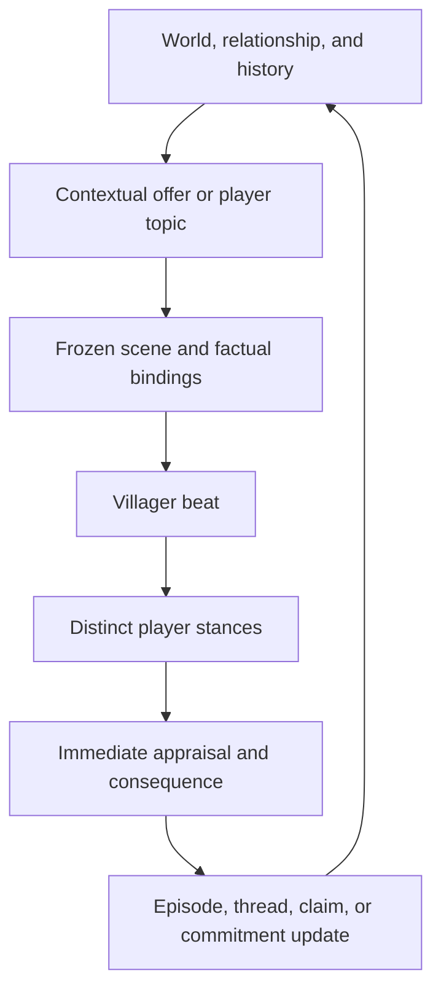

# MCA: Conversations — conversation-flow audit and expansion plan

**Audit date:** 2026-08-28  
**Repository:** [otectus/MCAConversations](https://github.com/otectus/MCAConversations)  
**Reviewed branch and revision:** `main` at [`c982a3aa39c24ca1f0508f0df7781994d364e918`](https://github.com/otectus/MCAConversations/tree/c982a3aa39c24ca1f0508f0df7781994d364e918)  
**Review focus:** unfinished work, runtime consistency, conversation flow, diversity, continuity, immersion, and release readiness.

## Executive verdict

The project has an unusually strong foundation: a contracted dialogue graph, explicit stances and discourse frames, English/Portuguese parity, persistent relationship and history records, deterministic selection, optional-mod isolation, and a large lint/test corpus. The latest living-histories work also has the right design instincts—grounded facts, continuity before novelty, bounded memory, privacy provenance, and no LLM-generated prose.

The current head should not yet be treated as a finished living-histories release. Four defects undermine the headline experience:

1. **Half of all generated work scenes are silently excluded from the live index.** The `topic/work` bucket contains 256 scenes and `SceneCatalog` keeps only the first 128 alphabetically. Eighteen professions lose every dynamic work scene, one loses half, and the advertised librarian damaged-volume arc is unreachable through the director.
2. **The anti-reroll guarantee is not true across reopening or reconnecting.** Every topic submission clears and rebuilds the plan; playing the opener changes recency, making another scene likely on reopen. Logout deletes the session completely.
3. **Villager initiative is largely scaffold, not a live system.** All 316 scene definitions are player-initiated `topic:*` scenes; no production caller uses `InitiativeGate.Weight.FULL`; the eight non-greeting initiative purposes and the initiative context request have no end-to-end path.
4. **Many “dynamic” non-work scenes assert unrecorded history.** All 60 non-work dynamic scenes are context-gated vignettes with no episode and no bound slot. Several variants claim a six-year absence, a repaired roof, a newcomer arriving in spring, weeks of village gossip, or a specific shared incident without any corresponding saved fact. Because MCA chooses `/1`, `/2`, `/3` variants client-side, even the invented backstory is not stable.

The immediate strategy should be **correctness, truth, and continuity first; content volume second**. More scenes under the present `topic/work` index would make more authored content unreachable. More factual-sounding variants under the present truth model would create more contradictory biographies.

## Scope and validation

This was a source-level review of the current GitHub head, its history, authored and generated data, configuration, tests, release notes, and runtime wiring. The repository is substantial:

| Surface | Current size |
|---|---:|
| Tracked files | 1,601 |
| Main Java sources | 279 |
| Test/tooling Java sources | 108 |
| Runtime data files | 1,069 |
| Dialogue question JSON files | 917 |
| Conversation beat files | 110 |
| Chat-intent files | 26 |
| Locale files | 46 (23 namespaces × 2 locales) |
| Generated scenes | 316 |
| Generated episode templates | 111 |
| Generated thread templates | 111 |
| Generated commitments | 35 |

Static validation performed during this audit:

- all 1,183 JSON files under `src/main/resources` and `src/content` parsed successfully;
- English and Brazilian Portuguese have identical key sets in all 23 paired namespaces;
- the three explicit debt ledgers are logically empty;
- no literal `TODO`, `FIXME`, `HACK`, `XXX`, `TBD`, or `WIP` marker exists in project code or content;
- GitHub showed no open issue or pull-request backlog at the time of review.

The full Gradle suite could not be rerun in this environment because the Gradle 8.8 distribution was not cached and outbound access to `services.gradle.org` was blocked. The repository states that the latest layer took the suite from 640 to 682 passing tests; that is a repository claim, not an independently reproduced result here. The findings below are based on direct control-flow and data inspection and include tests that would reproduce them.

## The target conversation loop

The strongest version of this system is not “pick a topic, receive varied prose.” It is a loop in which a real state produces a relevant exchange, the player takes a legible stance, and the result becomes future state.

The repository already implements pieces of every box. The unfinished work is mostly in the joins: selecting all authored content, binding claims to records, preserving the offer, exposing continuity in both frontends, and letting stored outcomes cause future conversations.

## Prioritized findings

| ID | Priority | Finding | Player-visible effect | Recommended disposition |
|---|---|---|---|---|
| F-01 | P0 | `topic/work` silently truncates 256 scenes to 128 | Half the generated work corpus never participates in selection | Re-index by profession/archetype; fail shipped content on truncation |
| F-02 | P0 | Non-work dynamic scenes assert facts with no record or slot | Villagers acquire changing, fabricated histories | Add claim provenance and persistent factual bindings; rewrite unsupported lines |
| F-03 | P0 | Topic submission clears the frozen plan | Reopening can shop for a different scene | Persist/reuse an offer keyed by player, villager, topic, and validity window |
| F-04 | P0 | Reconnect reuse is documented but sessions are deleted on logout | A documented continuity guarantee cannot hold | Persist the minimal offer identity or remove the promise |
| F-05 | P1 | Initiative purposes have no authored/runtime path | Villagers rarely drive meaningful exchanges; the daily cap is effectively unused | Build one initiative planner and author a small vertical slice |
| F-06 | P1 | Weekly mention counts are represented as only 0 or 1 | Caps of 2 or 3 never become exhausted | Store a bounded seven-day count/ring |
| F-07 | P1 | 219 authored `fallback` relationships are parsed but never followed | Pack authors and reports imply resilience that runtime does not provide | Implement bounded fallback traversal or remove the field |
| F-08 | P1 | Dynamic hub is chat-only and routes only by broad topic | GUI misses the best continuity affordance; “continue” may not continue the named record | Add GUI parity and bind a thread/episode/scene hint to each slot |
| F-09 | P1 | Group pilot uses an unrelated live episode and recreates its session every turn | A bystander can use the wrong footing; the advertised three-speaker cap is not enforced across an exchange | Bind to the active plan and persist a group session |
| F-10 | P1 | Generated content has no golden verification and the repository has no CI workflow | `src/content` and committed runtime resources can drift silently | Add a non-mutating compiler verification task and CI |
| F-11 | P2 | Persistent narrative state is 100% work-focused; 97% of commitments are fetch promises | Breadth looks large, but repeated play feels like work problems and item delivery | Add fewer, deeper non-work episode families and varied resolvers |
| F-12 | P2 | Scene shapes are heavily concentrated | Different nouns produce the same rhetorical exchange | Add shape-distribution review and underused shapes |
| F-13 | P2 | Substantive personality overlay coverage is 0.9% | Important middle beats collapse back to one narrator | Expand six voice-family sources by salience, then emit all 21 overlays |
| F-14 | P2 | Documentation and version metadata contradict current behavior | Users and pack authors cannot tell what 1.4.0 contains or what defaults apply | Treat head as 1.5.0 work, reconcile README/config/changelog |
| F-15 | P3 | Duplicate/stale planning documents and dead API seams remain | The source of truth is harder to identify and future work can follow stale rules | Archive or remove duplicates; add a living roadmap and issue links |

## Detailed findings and fixes

### F-01 — half of the work scenes are unreachable

[`SceneCatalog`](https://github.com/otectus/MCAConversations/blob/c982a3aa39c24ca1f0508f0df7781994d364e918/src/main/java/dev/otectus/mcaconversations/scene/SceneCatalog.java#L21-L51) groups scenes by `purpose/topic`, sorts by scene ID, and retains only the first `MAX_INDEXED = 128`. The generated catalog contains 256 `topic:work` scenes. The result is deterministic but incorrect: exactly 128 work scenes are dropped before profession eligibility is evaluated.

The truncation boundary falls inside leatherworker:

- kept through `work.leatherworker.stubborn_hide.blocked`;
- dropped from `work.leatherworker.stubborn_hide.succeeded` onward.

Eighteen professions lose every dynamic work scene: shady wizard, scribe, mercenary, outlaw, librarian, mason, nitwit, unemployed/none, shepherd, toolsmith, weaponsmith, miner, netherian, oceanographer, woodworker, priest, vampire expert, and werewolf expert. Leatherworker retains three and loses three. This includes the librarian arc used as the headline example in the README.

[`SceneCatalogLintTest`](https://github.com/otectus/MCAConversations/blob/c982a3aa39c24ca1f0508f0df7781994d364e918/src/test/java/dev/otectus/mcaconversations/content/SceneCatalogLintTest.java#L303-L316) checks `bucketSizes()` after truncation, so the test can never observe an oversized bucket. The report likewise presents truncation as an accepted performance behavior rather than a loss of shipped content.

**Fix design**

- Index work scenes by at least `(purpose, topic, profession)` and optionally archetype. Let a lookup merge a narrow profession leaf with genuinely generic leaves.
- Make an overflow on bundled content a reload/build error, not silent data loss. Third-party overflow may be rejected with a precise diagnostic while the previous valid catalog remains active.
- Do not let `MAX_SCORED = 32` select “the first 32 eligible alphabetically.” Hard-filter the bounded leaf and either score all of it or preselect by a meaningful stable rank such as priority plus a seeded tie-break.
- Add `BundledSceneReachabilityTest`: for every declared profession and every state of each episode family, assert that its intended scene appears in the candidate set.
- Add a raw pre-index bucket report, alongside the live index report, so truncation cannot hide itself.

**Acceptance test:** 256/256 work scenes are retrievable before contextual filtering; every one of the 37 profession packs has at least one reachable evergreen scene and all of its authored episode states can reach a matching scene.

### F-02 — dynamic prose is not consistently grounded

The generated catalog has 60 non-work dynamic scenes—two for each of 30 topics. None requires an episode and none binds a slot. Selection can therefore establish only broad context such as “it is raining,” “the village population is at least ten,” or “we have known each other for 40 days.” A spot audit found concrete claims that those gates cannot support:

| Scene | Actual gate | Example of the unsupported fact family |
|---|---|---|
| `memories.the_one_who_is_not_here` | close relationship and 21 days known | an absent person and a chair unused for six years |
| `neighbour.the_unthanked_kindness` | village population ≥ 4 | firewood deliveries, a mile-long rain walk, or four people repairing a roof |
| `people.the_newcomer` | village population ≥ 10 | a household arrived in spring and has been excluded for four months |
| `player.what_i_say_about_you` | 20 days known and population ≥ 4 | villagers asked about the player last week and the speaker has corrected a reputation for months |
| `shared_history.the_thing_we_avoid` | confidant/partner/family band | a specific unspoken incident and an unrepaired apology |
| `weather.working_in_the_wet` | raining or storming now | it is the third or fourth consecutive day of rain |
| `firstmet.long_enough_to_be_a_story` | 60 days since first-met marker | details about rain and what the player carried at the first meeting |

This conflicts with the release note’s statement that an old pair without an event record does not invent a first meeting. It also weakens the project’s otherwise excellent distinction between authored prose and verified facts.

The risk is amplified by the rendering model. [`BeatContract`](https://github.com/otectus/MCAConversations/blob/c982a3aa39c24ca1f0508f0df7781994d364e918/src/main/java/dev/otectus/mcaconversations/conversation/BeatContract.java#L20-L27) correctly notes that MCA chooses a `/1`, `/2`, or `/3` variant on the client and the server never learns which one was read. Those variants currently often describe different incidents, not merely different wording. A villager can therefore tell mutually incompatible biographies while the server believes the same semantic beat played.

**Fix design**

- Add declared claim provenance to authored beats/scenes. Every concrete claim should name one of: `context`, `episode`, `thread`, `player_claim`, `village_event`, `identity_motif`, or `nonfactual_flavor`.
- Require past observed events, named people, quantities, and durations to come from a bound record/slot. A relationship band is not evidence that a particular shared event occurred.
- If ambient backstory is desired, create a persistent `identity_motif` or lightweight `life_event` once per villager. Bind every future mention to its stable ID and payload.
- Restrict random variants of factual beats to paraphrases of the same facts. If variants contain different events, make them distinct persistent scenes or pin a variant ID as part of the plan.
- Add an editorial `ClaimGroundingLint` that rejects a beat marked `observed/past` when it declares no supporting record or typed context. The prose still needs human review, but the data contract can make unsupported factual writing visible.
- Rewrite the 60 non-work dynamic scene openers before expanding them. Vague, subjective statements can remain context-only; concrete anecdotes should become records.

**Acceptance test:** repeated rendering, language changes, GUI/chat switching, and reopening may change phrasing only; names, dates, events, participants, quantities, and outcomes remain identical and trace to saved or captured state.

### F-03 and F-04 — frozen-plan guarantees do not survive their documented boundaries

[`ConversationPlanner.onAnswerSubmitted`](https://github.com/otectus/MCAConversations/blob/c982a3aa39c24ca1f0508f0df7781994d364e918/src/main/java/dev/otectus/mcaconversations/scene/ConversationPlanner.java#L53-L96) does this for every topic starter:

1. captures a new snapshot;
2. calls `session.setPlan(null)`;
3. runs the director again.

When the previous opening beat played, `onScenePlayed` wrote its recency. Reopening the topic now makes that scene ineligible during its cooldown or lowers its score, so another scene can be selected. This is exactly the topic-shopping behavior that the README, director documentation, plan documentation, and design spec say cannot happen.

Reconnect reuse is impossible under the current storage model. [`ConversationSessions`](https://github.com/otectus/MCAConversations/blob/c982a3aa39c24ca1f0508f0df7781994d364e918/src/main/java/dev/otectus/mcaconversations/conversation/ConversationSessions.java#L13-L20) explicitly says sessions are transient, and [`ConversationsEvents.onPlayerLoggedOut`](https://github.com/otectus/MCAConversations/blob/c982a3aa39c24ca1f0508f0df7781994d364e918/src/main/java/dev/otectus/mcaconversations/event/ConversationsEvents.java#L82-L90) clears them.

**Fix design**

Introduce a small `ConversationOfferRecord`, separate from the live UI session:

- key: player UUID + villager UUID + topic/purpose;
- value: scene ID, exact thread/episode target, pinned slots or their stable record IDs, context fingerprint, offer day, and state (`offered`, `opened`, `completed`, `expired`);
- lifetime: through GUI close, frontend switch, and logout; expire on a declared day/window or a material context invalidation;
- behavior: selecting the same topic reuses a valid offer. It does not call the director again;
- recency: track `offered`, `opened`, and `completed` separately. A viewed opener should not be treated as a successfully completed conversation, and an unviewed offer should not disappear from novelty accounting.

If persistent reconnect reuse is not worth the save/schema cost, remove the reconnect promise everywhere and define the precise boundary honestly. Reopen and GUI/chat parity should still be guaranteed in the live session.

**Acceptance tests:** close/reopen before the opener, close/reopen after the opener, switch GUI→chat, switch chat→GUI, change locale, disconnect/reconnect, and repeat on the same game day. Each path resolves to the same semantic scene and factual bindings until an explicit expiry or invalidation reason is logged.

### F-05 — initiative is an unwired architecture

`ScenePurpose` defines greeting, state change, due commitment, acute, shared event, opinion request, repair, low stakes, and resume. The director contains scoring rules for several of them. `ContextRequest.PURPOSE_INITIATIVE` exists. `InitiativeGate` implements mute, busy-state, cooldown, and daily-budget policy.

But the shipped catalog contains **316 topic scenes and zero initiative scenes**. The director is called in production only with `ScenePurpose.TOPIC`. The only production gate caller is [`GreetOnApproach`](https://github.com/otectus/MCAConversations/blob/c982a3aa39c24ca1f0508f0df7781994d364e918/src/main/java/dev/otectus/mcaconversations/chat/GreetOnApproach.java#L96-L105), using `Weight.BARK`. There is no `Weight.FULL` call in production, so the daily full-initiative counter cannot be consumed.

This makes the feature claim “one unprompted conversation per villager per day” misleading: there are greeting barks, but no end-to-end unsolicited decision-page conversations for promises, repairs, state changes, or resumable threads.

**Fix design**

- Add one `InitiativePlanner` entry point on a bounded, low-frequency event such as player approach, direct attention, or conversation hub opening. Do not globally scan all villagers.
- Gather real candidates in this order: acute → episode state change → due commitment → repair → ready resume → shared event → opinion request → low stakes.
- Capture `PURPOSE_INITIATIVE`, ask `InitiativeGate`, run the director, then present a short opt-in bark. Open a decision page only if the player responds; do not seize the UI.
- Author a deliberately small vertical slice first: one due promise, one repair, one state change, one resume, and one low-stakes observation. Prove policy and persistence before multiplying content.
- Expose the refusal reason in `/conversations explain` so “quiet” is debuggable.

**Acceptance test:** a due promise can be raised without the player choosing its topic, mute always wins, busy state suppresses the right purposes, no more than one full initiative spends the daily budget, and the same pending initiative cannot reroll.

### F-06 — weekly caps above one are not enforced

[`ConversationDirector.mentionsThisWeek`](https://github.com/otectus/MCAConversations/blob/c982a3aa39c24ca1f0508f0df7781994d364e918/src/main/java/dev/otectus/mcaconversations/scene/ConversationDirector.java#L307-L318) derives a “count” from only the last-seen day. It can return 0 or 1. The comment says this is enough for caps of 1 or 2, but a cap of 2 is reached only when the count is at least 2—an impossible value here.

The corpus contains 127 scenes with a cap of 2 and seven with a cap of 3. Their weekly cap never fires; only their separate cooldown can suppress them.

**Fix design**

- Store a bounded seven-day ring or seven daily bins per scene, pruning old scene IDs under the existing history caps.
- Define the window exactly—normally days `today-6` through `today`, not “≤ 7 days ago,” which spans eight day labels.
- Migrate old saves by treating the existing last-seen entry as one mention.
- Test first, second, third, and fourth mentions, boundary rollover, clock rollback, and save/load.

### F-07 — `fallback` is dead schema

There are 219 `fallback` declarations in the 316 generated scenes. [`SceneCatalog`](https://github.com/otectus/MCAConversations/blob/c982a3aa39c24ca1f0508f0df7781994d364e918/src/main/java/dev/otectus/mcaconversations/scene/SceneCatalog.java#L128-L145) validates that a reference exists and is not self-referential, but runtime selection never follows it. A selected scene that cannot bind or becomes stale simply drops to the old static route.

Choose one contract:

- **Implement it:** when a preferred scene fails late binding or becomes invalid before playback, traverse a same-purpose fallback chain with cycle/depth guards, re-checking eligibility and logging the path; or
- **Remove it:** delete the field from schema, generator, reports, and documentation so pack authors do not depend on behavior that does not exist.

If implemented, require fallbacks to match purpose/topic and compatible profession/age scope. A generic evergreen work scene is a sensible final leaf; an unrelated topic is not.

### F-08 — the contextual hub is not yet a shared frontend or an exact continuation

The changelog accurately states that contextual hub entries ship only in chat and the GUI keeps its fixed six categories. Code search confirms [`DynamicHub`](https://github.com/otectus/MCAConversations/blob/c982a3aa39c24ca1f0508f0df7781994d364e918/src/main/java/dev/otectus/mcaconversations/hub/DynamicHub.java) is consumed by [`ChatModeDispatcher`](https://github.com/otectus/MCAConversations/blob/c982a3aa39c24ca1f0508f0df7781994d364e918/src/main/java/dev/otectus/mcaconversations/chat/ChatModeDispatcher.java#L275-L287), not the GUI.

A `HubSlot` stores only kind, broad domain, and topic. “Where were we?” may be derived from a particular ready thread, but selecting it invokes the ordinary topic starter. The director is free to choose another scene in that topic. The same loss occurs for “what’s on your mind?” when several episodes share a topic. The chat dispatcher also recomputes the hub before resolving a typed label instead of first resolving against the exact plan previously shown.

**Fix design**

- Extend `HubSlot` with a stable target: thread template ID, episode UUID, or locked scene/offer ID.
- Pass that target as a selection constraint or direct frozen offer; do not reduce it back to a topic.
- Resolve a response against the exact shown `HubPlan` plus villager ID and nonce. Recompute only when opening a new hub.
- Add the same contextual entries above the six GUI categories, with the same privacy labels, visibility, numeric shortcuts, and disabled/fallback behavior.
- Prioritize due/ruptured threads over mere recency. `PairHistory.resumable` currently sorts only by most recently mentioned even though the hub calls the first entry “highest priority.”

### F-09 — group conversation does not preserve its own subject or session

The group pilot is correctly off by default, but two runtime details must be fixed before enabling it:

1. [`GroupDirector.offersFor`](https://github.com/otectus/MCAConversations/blob/c982a3aa39c24ca1f0508f0df7781994d364e918/src/main/java/dev/otectus/mcaconversations/chat/group/GroupDirector.java#L128-L161) uses the first live episode on the lead villager, not the episode bound to the active plan/beat. A weather line can therefore be judged as public or private using an unrelated work episode.
2. `maybeInterject` creates a new `GroupConversationSession` on every call, adds one best interjection, speaks it, and discards the session. The configured three-speaker cap cannot accumulate across the exchange; two bystanders cannot join one turn, while an arbitrary number of different bystanders can join on successive turns.

Bind group footing to the active `ConversationPlan.episodeId`, current beat contract, and pinned subject. Store the group session on the shared conversation session, and define whether the cap applies to a beat or the whole exchange. Add an explicit response beat if the lead can answer the interjection; otherwise this remains a bark, not a group conversation.

### F-10 — generated source and CI are not protected

[`build.gradle`](https://github.com/otectus/MCAConversations/blob/c982a3aa39c24ca1f0508f0df7781994d364e918/build.gradle#L233-L249) says `ContentCompilerTest` regenerates and re-asserts committed generated files on every test run. No such test exists, and no test invokes `ContentCompiler`. The generator task writes directly into `src/main/resources`, but `check` has no non-mutating drift verification. There is also no `.github/workflows` directory.

**Fix design**

- Add `verifyGeneratedConversationContent`: compile `src/content` into a temporary directory, byte-compare every expected generated output, and fail on changed, missing, or extra files.
- Wire it into `check`; keep the existing mutating generation task as an explicit author command.
- Add Java 17 CI running at least `./gradlew check` and the reobfuscated build, then upload the jar and `build/libs/reports` artifacts.
- Add a small production smoke matrix for supported MCA versions and optional integrations where distributable test jars are available.
- Turn every silent bundled-content truncation into a test failure.

## Diversity and immersion assessment

### Systemic depth is concentrated in work

The latest layer is broad by topic name but narrow by persistent state:

- 111/111 episode templates are `work.*`;
- 111/111 thread templates are `work.*`;
- 35/35 commitment templates are `work.*`;
- 34/35 commitments use `gift_tag_received`; one uses `visit_after_day`;
- the resolver vocabulary also supports quest state, conversation choice, observed events, and neutral/manual follow-through, but shipped content does not use them;
- each of 30 non-work dynamic topics has exactly two scenes, and none binds an episode or slot.

That distribution will feel like “every profession has a current problem” rather than “every villager has a life.” The next content pass should not add another thin layer to every topic. It should build a few deep, persistent non-work verticals:

| Domain | Grounded trigger/state | Useful player stances | Future payoff |
|---|---|---|---|
| Village change | actual birth, death, arrival, departure, building, need shift, or festival | ask, help, disagree, keep confidence, investigate | corrected rumor, village opinion, task/quest lead, later status |
| Relationship repair | stored rupture or disputed claim | own impact, clarify, apologize, hold boundary, postpone | repaired/strained thread, changed openness, callback |
| Family life | MCA family event or household state | listen, practical support, restraint, humor | family-specific resume, role/opinion change |
| Personal project | persistent interest/value motif plus progress state | encourage, challenge, teach-back, offer resource | project advances/fails, new knowledge or craft line |
| Shared player history | actual gift, quest, rescue, choice, visit, or public claim | remember differently, explain intent, accept correction | stable shared memory and relationship-specific line |
| Village disagreement | culture proposition plus two real villager opinions | take a side, mediate, ask evidence, decline | opinions update; a later group scene has real footing |
| Seasonal routine | calendar plus actual profession/schedule/environment state | ask, join, help, tease | a recurring ritual with variation and anniversary callback |

Start with two or three episode families in four domains, not dozens of generic anecdotes. A small record that changes and returns is more immersive than ten unrelated “deep” lines.

### Rhetorical shapes are concentrated too

The 316 scenes use nine declared shapes, but distribution is uneven:

- work: 188/256 scenes (73.4%) are `reminisce` or `problem_solve`;
- non-work: 46/60 scenes (76.7%) are `observe` or `confide`;
- there is no `repair` scene at all;
- there is one `teach_back` scene and five `debate` scenes.

The enum documentation correctly warns that different nouns can still produce the same conversation. Make shape distribution part of editorial review, not a hard quota that forces unnatural writing:

- every profession pack should normally contain at least three genuinely different shapes;
- every deep domain should have at least one scene that is not report→empathy/help;
- use `teach_back` for craft, history, and local custom;
- use `debate` for values and village decisions where both positions remain respectable;
- use `repair` only when a stored rupture exists;
- use `plan` for shared next steps that the game can observe;
- let some `observe` scenes end without a relationship payout. Texture is valuable without farming hearts.

Add a generated “shape concentration” report and warn when one shape exceeds a chosen editorial threshold within a profession/domain. The threshold should prompt review, not mechanically reject an otherwise coherent small pack.

### Personality reaches signatures but not the conversational middle

The changelog measures 12.8% raw personality-overlay coverage and 24.9% salience-weighted coverage. Signature coverage is 100%, but substantive pools are only 0.9%. That means opening voice is distinctive and the important middle often returns to base narration.

Use the existing six `VoiceFamily` sources as the authoring unit:

1. rank uncovered pools by `VoiceWeight`, traffic, and emotional salience;
2. write family variants for appraisals, disagreements, boundaries, decisions, and callbacks first;
3. expand those six sources into all 21 namespaces;
4. preserve facts and consequences exactly—voice changes phrasing, not history, competence, or values;
5. add small personality-specific signatures only where a family-level line would erase an important distinction.

The living-histories spec says the raw target is 30% and weighted target is 90%; the changelog incorrectly describes the raw target as 25%. Reconcile the target before using it as a release gate.

### Make conversations worthwhile without turning them into reward vending

“Worthwhile” should mean the exchange changes understanding or future possibility, not that every answer pays hearts. Every substantive scene should do at least one of these, visibly or later:

- reveal reliable knowledge the player can use;
- update a thread, episode, opinion, claim, boundary, or commitment;
- unlock a more specific future question;
- create a quest/task lead through an installed integration;
- change how this villager introduces, resumes, or refuses a subject;
- allow the player to correct a rumor or their own recorded claim;
- close a loop the player remembers opening.

Use a consequence budget:

- **texture:** no durable mechanical change;
- **recognition:** records that this pair discussed or learned something;
- **relationship:** changes trust/respect/warmth/tension within anti-farming limits;
- **world-facing:** creates a trackable promise, event, quest, role, or opinion update.

Most conversations should land in recognition; fewer should change the relationship; rare ones should create world-facing obligations. That makes consequential scenes feel consequential.

## Recommended conversation flow

### 1. Offer a reason to talk

The hub should show up to three contextual offers in both GUI and chat:

- **Continue** an exact ready thread;
- **On your mind** for an exact salient but undisclosed episode, with a privacy-safe label;
- **Ask about** an exact known episode/domain.

The fixed six categories remain below them as reliable navigation. A contextual offer is a frozen object, not a fresh topic query.

### 2. Orient the player with one grounded beat

The opener should establish one stable subject and only facts the scene can prove. Bind names, objects, dates, states, and referents once. Do not spend three sentences on preamble; the player should know why this conversation matters before choosing.

### 3. Offer distinct intent, not synonymous tone buttons

Most decision pages need two to four meaningful choices plus an exit, selected from the existing stance vocabulary. Good combinations include:

- curiosity vs restraint;
- empathy vs practical help;
- respectful disagreement vs affirmation;
- self-disclosure vs keeping focus on the villager;
- humor vs seriousness when the beat permits either;
- accept, decline, or renegotiate a trackable commitment.

Do not offer “That sounds hard,” “I’m sorry,” and “That must be difficult” as three choices. The lints validate semantic compatibility; an editorial similarity check should also flag near-synonymous options on the same page.

### 4. Let the villager appraise the stance

Personality, values, relationship band, current affect, and the specific history should influence how the response lands, but hard facts and boundaries remain gates. A high score must never talk a villager out of an authored “no.” Disagreement should sometimes increase respect even when it reduces warmth.

### 5. Record the result at the right level

Separate:

- line offered;
- opener seen;
- decision completed;
- thread advanced;
- promise made/resolved;
- factual claim learned/corrected;
- relationship effect paid.

This separation fixes rerolling, prevents farming, and lets a later line say “we started this” without claiming “we settled this.”

### 6. Return naturally

A return should be caused by one of four things:

- the player selects the exact continuation;
- the player’s observed action resolves a commitment;
- the episode changes state;
- a bounded initiative offers a callback.

The return line should acknowledge the last stance or outcome, not merely reopen the topic. A postponed conversation should remember it was postponed; a respected boundary should not reopen as intimacy the next morning.

## Authoring rules for consistency

1. **One fact, one owner.** MCA owns family and entity facts; Townstead owns its schedule/culture facts; Conversations owns its episode/thread/claim records. Mirror IDs, not competing truth.
2. **No concrete past tense without provenance.** “I prefer rain” may come from identity; “it rained for four days” needs weather history; “four people repaired a roof” needs an event.
3. **Random variants are paraphrases.** They may alter rhythm and attitude, never participants, event type, chronology, quantity, or outcome.
4. **A button describes an observable promise or no promise.** Prefer “I’ll come back tomorrow” only when `visit_after_day` is attached. Otherwise use non-judged willingness.
5. **A callback names the actual previous decision.** Store stance/outcome IDs and use them in eligibility or slots.
6. **High-stakes disclosure requires a real subject and consent.** A generic closeness band alone does not create grief, trauma, conflict, or a secret.
7. **Children and teens get different concerns, not shortened adult prose.** Age should alter subject eligibility, agency, vocabulary, and who can be named safely.
8. **Voice never rewrites facts.** Personality overlays change delivery; identity values influence choice/weight; neither invents life history.
9. **Every surface is one semantic transaction.** GUI, chat, numbered replies, TTS, and bystanders consume the same frozen plan and bindings.
10. **Every persistent state has a visible payoff.** If a record can never affect selection, a callback, a label, or a consequence, remove it or wire it.

## Test and observability plan

The current tests are extensive but are strongest on static graph correctness. There is no direct `ConversationDirector` test, despite the spec naming determinism, eligibility, priority, and repetition tests. Add these as end-to-end state-machine tests rather than only more lints:

| Test | What it must prove |
|---|---|
| `BundledSceneReachabilityTest` | every shipped scene survives its intended index leaf and all 37 professions can select their scenes |
| `ConversationOfferPersistenceTest` | reopen, frontend switch, locale switch, and reconnect preserve scene and factual bindings |
| `ConversationDirectorPriorityTest` | due, rupture, resume, salience, identity, recency, and interruption weights order candidates as documented |
| `MentionWindowTest` | 1/2/3 weekly caps work across day boundaries and save/load |
| `FallbackTraversalTest` | fallback chains resolve, cycles/depth are rejected, and traces explain the path |
| `InitiativeEndToEndTest` | a real due/state-change/repair/resume offer passes through context, gate, director, budget, and response |
| `HubTargetingTest` | the exact thread/episode that produced a label is the one opened on GUI and chat |
| `GroupSessionLifecycleTest` | active subject supplies footing and the speaker cap persists across the defined exchange |
| `ClaimGroundingLint` | past observed claims declare a source and factual variants share bindings |
| `GeneratedContentGoldenTest` | compiling author sources produces byte-identical committed outputs with no extra/missing files |
| `ProductionSmokeTest` | a dedicated Forge server loads, reloads data, opens GUI/chat conversations, saves, and reloads history |

For playtesting, add local/operator-only counters to the existing explain/report surface—no external telemetry is required:

- scene offered/opened/completed/fallback counts;
- rejection reasons and empty-selection rate by topic/profession;
- distinct scenes and shapes encountered per villager over 7/30 days;
- contextual hub offer → selection rate;
- commitments made, kept, broken, and abandoned by resolver type;
- initiative offered, accepted, muted, busy-suppressed, and budget-suppressed;
- group interjection shape and refusal reason;
- static fallback frequency, which should expose unreachable dynamic content immediately.

## Release roadmap

### 1.4.1 — correctness hotfix

- repair scene indexing and add reachability coverage;
- fix weekly mention counting;
- either implement fallback traversal or remove dead fallback schema;
- add generated-content verification and CI;
- correct README defaults/counts/integration list and clean changelog version headings.

**Exit gate:** no bundled scene is silently dropped; generated content cannot drift; static validation and the full Gradle suite pass in CI.

### 1.5.0 — finish the living-histories vertical

- persistent frozen offers and honest reopen/reconnect behavior;
- exact contextual hub targeting in GUI and chat;
- grounded-claim schema and rewrite of unsupported non-work vignettes;
- first real initiative slice for due commitment, state change, repair/resume, and low stakes;
- substantive voice-family overlay expansion driven by salience.

**Exit gate:** the advertised librarian arc is reachable; the same offer and facts survive every frontend boundary; an actual stored event can cause an opt-in callback; no dynamic factual opener lacks provenance.

### 1.6.0 — broaden lives beyond work

- persistent episode families for village, relationship/repair, personal projects, family, and shared history;
- commitment resolver diversity beyond item delivery;
- group conversation rebuilt on the active subject, then enabled only after live playtest;
- event-driven Townstead, MCA: Quests, and MCA: Reputation callbacks where those mods are present;
- shape and repetition tuning from play sessions rather than line-count targets.

**Exit gate:** at least four non-work domains have true episode→choice→state→callback loops; no resolver or scene shape dominates because of generator convenience; GUI/chat behavior remains semantically identical.

## GitHub-ready issue backlog

1. **`[P0][Director] Stop topic/work index truncating 128 shipped scenes`**  
   Add profession-aware leaves, pre-truncation diagnostics, and 37-profession reachability tests.
2. **`[P0][Continuity] Persist and reuse frozen conversation offers`**  
   Cover reopen, GUI/chat switch, locale switch, and reconnect; separate offered/opened/completed recency.
3. **`[P0][Content] Bind dynamic factual claims to saved records`**  
   Add provenance/claim contracts and rewrite the 60 non-work dynamic openers.
4. **`[P1][Initiative] Wire a real full-initiative vertical slice`**  
   Connect stored due/state/repair/resume candidates through context, gate, director, and opt-in UI.
5. **`[P1][History] Implement real seven-day mention counters`**  
   Cover the 134 scenes authored with caps above one.
6. **`[P1][Scenes] Define and implement fallback semantics`**  
   Resolve or remove all 219 fallback references.
7. **`[P1][Hub] Open the exact offered thread/episode in GUI and chat`**  
   Add target IDs/nonces and contextual GUI entries.
8. **`[P1][Group] Persist group sessions and bind interjections to the active subject`**  
   Make the three-speaker claim and privacy footing true before enabling the pilot.
9. **`[P1][Build] Verify generated conversation content and add CI`**  
   Temporary-output golden comparison, Java 17 checks, build artifacts and reports.
10. **`[P2][Content] Add non-work living-history episode packs`**  
    Start with village change, relationship repair, personal project, and grounded shared history.
11. **`[P2][Content] Diversify shapes and commitment resolvers`**  
    Reduce problem-solve/reminisce and item-delivery concentration with editorial metrics.
12. **`[P2][Voice] Raise substantive voice-family overlay coverage`**  
    Work by salience and traffic; keep factual bindings invariant.
13. **`[P2][Release] Reconcile 1.4.0 metadata and documentation`**  
    Current head adds 214,984 lines after the commit explicitly released as 1.4.0; mark it as 1.5.0 development or create a coherent new release.

## Documentation and release inconsistencies

- `gradle.properties` still declares `mod_version=1.4.0`, but commit `023e00c` explicitly calls itself the released 1.4.0 baseline and current head adds the entire living-histories layer afterward (618 files changed, 214,984 insertions). Backward-compatible features should move head to 1.5.0 development.
- The changelog’s 1.4.0 section combines the earlier coherence release and the later living-histories work while also saying disabling the latter reproduces “1.4.0 exactly.” Those cannot all identify the same release.
- Changelog headings for 1.2.0, 1.2.1, and 1.1.0 still say `unreleased` below released 1.3.0 and 1.4.0 headings.
- README says experimental local chat is on by default; code and `CONFIG.md` say it has been off by default since 0.8.1.
- README lists only MCA: Quests and Serene Seasons as optional integrations; metadata/config also support MCA: Reputation and Townstead.
- README says there are 5,524 translated strings per locale across 23 namespaces. Current assets contain 36,255 key/value entries per locale across those namespaces, of which 12,961 are in the base `mca_dialogue` namespace. Define and report one consistent metric.
- The living-histories spec sets raw overlay coverage at 30%; the changelog says the spec asks for 25%.
- `docs/BRANCHING-CONVERSATIONS-IMPLEMENTATION-PLAN.md` is duplicated byte-for-byte under `gradle/`; `gradle/PHASE-0-EVIDENCE.md` is a stale version of the document under `docs/`. Keep one canonical copy and archive historical snapshots clearly.
- User-facing copy says the contextual hub “now” surfaces entries before later admitting it is chat-only, and says villagers obey one daily unprompted-conversation cap although no full initiative exists. Lead with actual shipped scope.

## Definition of done for “dynamic, meaningful, engaging, worthwhile”

A release should meet all of these, not merely a line-count target:

- every shipped scene is reachable in at least one valid context;
- every concrete factual claim traces to current context or persisted state;
- the same offered conversation preserves its scene, referents, and facts across reopen, frontend, locale, and the documented reconnect boundary;
- GUI and chat expose the same contextual opportunities and choices;
- every non-exit reply answers the line immediately before it and represents a distinct player intent;
- at least one immediate or future state observes every substantive completed scene;
- callbacks are caused by the player’s real previous stance, a real episode transition, or an observable promise—not by generic elapsed time alone;
- villagers can initiate a bounded, opt-in continuation for due, changed, or ruptured state, while mute and busy-state rules always win;
- no private or unknown fact reaches a hub label or bystander without proven footing;
- scene-shape, resolver, profession, age, relationship, and voice-family reports reveal concentration before release;
- English and Portuguese preserve keys, placeholders, factual bindings, tone intent, and choice consequences—not only file parity;
- CI regenerates/verifies content, runs tests, builds the production jar, and publishes the conversation reports;
- a live dedicated-server playtest covers new acquaintance, confidant, spouse/family, two villagers of the same profession, 1/3/7-day revisits, GUI↔chat, relog, crowded group chat, and each supported integration combination.

## Bottom line

MCA: Conversations does not primarily need more raw dialogue. It needs the latest architecture to keep the promises its prose already makes: every authored scene selectable, every fact owned by real state, every offer stable, every callback caused, and every frontend consuming the same plan. Once those joins are solid, the most valuable expansion is clear—move persistent episodes, varied commitments, repairs, opinions, and callbacks out of the work topic and into village, family, relationship, personal-project, and genuinely shared-history domains.
