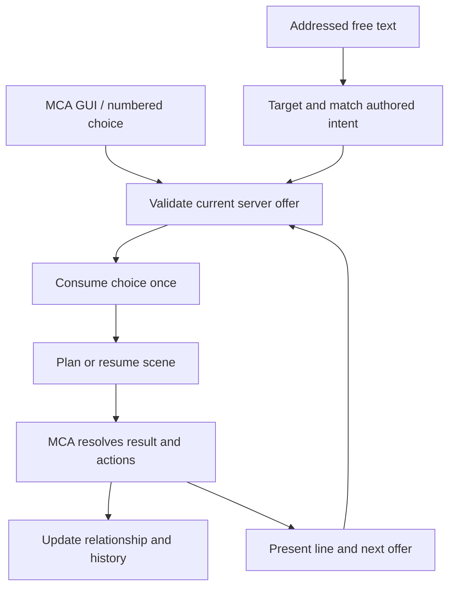
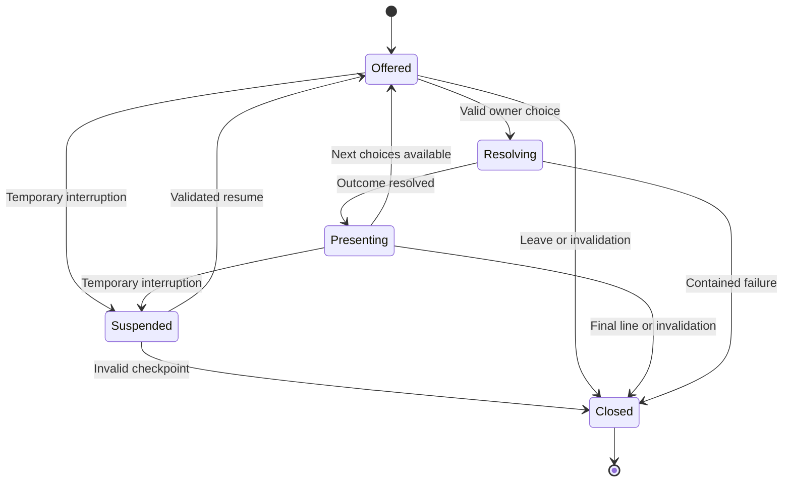

# MCA: Conversations — Conversation Systems Research and Implementation Plan

**Prepared:** September 8, 2026  
**Audience:** Coding agents, maintainers, dialogue writers, and datapack authors  
**Primary baseline:** MCA: Conversations 1.6.1, Forge 1.20.1, commit [`df0b5c82d8e0758068ca22b58d759c881c150db3`](https://github.com/otectus/MCAConversations/commit/df0b5c82d8e0758068ca22b58d759c881c150db3)  
**Related branch:** NeoForge 1.21.1, commit [`e9d097367ec1722b05aa3201c6427c62135fd125`](https://github.com/otectus/MCAConversations/tree/e9d097367ec1722b05aa3201c6427c62135fd125)  
**Purpose:** A research-backed, executable improvement specification. This document does not implement changes or certify a release.

**Navigation:** [Research and comparisons](#3-the-complete-npc-conversation-design-space) · [Current architecture](#6-current-mca-conversations-architecture) · [Audit findings](#7-correctness-findings-and-required-repairs) · [Target design](#8-target-architecture-and-non-negotiable-invariants) · [Writing and content](#12-dialogue-writing-and-content-overhaul) · [Integrations](#16-integration-architecture-and-content) · [Execution packages](#20-work-packages-for-a-coding-agent) · [Verification gates](#21-verification-matrix-and-release-gates)

## 1. Recommended direction

MCA: Conversations should evolve into a more dependable, expressive simulation of an ongoing relationship with a particular villager. The best next step is to consolidate the substantial framework already present, repair its remaining correctness and authoring gaps, and then expand the situations that framework can express.

**Preserve the existing MCA dialogue engine, shared server session, deterministic chat matcher, typed context, scene director, conversation contracts, and separate memory stores.** A replacement dialogue engine or mandatory generative-AI service would introduce substantial migration and consistency costs without addressing the most immediate problems.

The current project already contains branching replies, disposition axes, checked stances, stable identities, episodic histories, promises, gossip provenance, contextual scenes, several presentation styles, and extensive structural tests. Recommending these as entirely new features would misread the repository. The important questions are whether each mechanism is actually used, whether its runtime guarantees hold, whether authored text respects those guarantees, and whether ordinary play exposes enough meaningful variety.

Implement in this order:

1. **Restore a reproducible, passing build and close correctness defects.** Fix the missing optional API build inputs, invalid age gates, chat range mismatch, cache lifetime, and persistence policies. Strengthen validation at the actual runtime boundaries.
2. **Make conversations easier to follow and more resilient.** Add safe interruption recovery, a private transcript, explicit unavailable-choice feedback, consistent delivery semantics, and reliable reload behavior.
3. **Improve the writing and selection of existing content.** Preserve facts across variants, distinguish knowledge from hearsay, reduce interchangeable reflective speeches, and prevent high-value callbacks from being crowded out.
4. **Expand daily life, relationship development, and integrated conversations.** Add original, compact scenes with consequences and later recognition. Broaden ordinary topics before multiplying an already large profession corpus.
5. **Introduce optional shared conversations, richer ambient exchanges, and presentation cues only after the foundations pass production tests.**

These recommendations are the report’s synthesis. Comparative sources support the mechanisms; proposed defaults, work packages, schemas, and content targets below are design decisions for this project.

## 2. Scope, baseline, and evidence limits

### 2.1 Verified repository baseline

The main branch declares Minecraft **1.20.1**, Forge **47.4.10**, Java **17**, and mod version **1.6.1**. Its development MCA dependency is `7.7.0-beta.2+1.20.1`; its configured reflection probes include MCA `7.6.20`, `7.7.0-beta.2`, and `7.7.1-alpha.2`. These are repository pins, not a recommendation to upgrade dependencies blindly. See the pinned [Gradle properties](https://github.com/otectus/MCAConversations/blob/df0b5c82d8e0758068ca22b58d759c881c150db3/gradle.properties).

The separate NeoForge branch also declares version 1.6.1, with Minecraft **1.21.1**, NeoForge **21.1.234**, Java **21**, and MCA `7.7.36-beta.3+1.21.1`. Its metadata was inspected; this report’s detailed code audit centers on Forge main. Shared designs should be implemented on both maintained branches, but branch-specific defects must be confirmed before being marked fixed there. See [NeoForge properties](https://github.com/otectus/MCAConversations/blob/e9d097367ec1722b05aa3201c6427c62135fd125/gradle.properties).

Direct counts from the checked-out Forge commit:

| Inventory | Count | Interpretation |
| --- | ---: | --- |
| Production Java files | 341 | Includes runtime, compatibility, presentation, and support code |
| Files ending in `Test.java` | 148 | Test classes/files, not executed test cases |
| Shipped dialogue JSON files | 1,000 | Question definitions under `data/mcaconversations/dialogues` |
| Answers in those files | 3,327 | Player answer entries |
| Result entries | 4,562 | Conditional/weighted outcomes |
| Generated scene definitions | 373 | Contextual scene records |
| Work-topic scenes | 256 | About 69% of the scene catalog |
| Other topic scenes | 117 | Includes Capitals scenes |
| Authoring topic files | 34 | `src/content/topics` |
| Authoring profession files | 37 | `src/content/professions` |
| Language files | 46 | Both locales across the shipped namespaces |

The checked-in stabilization report describes **55 Capitals-gated scenes** and reports historical validation totals. Many ordinary topics have only two generated contextual scenes, whereas work has 256. This is a useful editorial allocation signal, not proof that the other topics have only two possible lines: legacy routes, reactions, and voice variants add further content. Sources: [generated scene catalog](https://github.com/otectus/MCAConversations/blob/df0b5c82d8e0758068ca22b58d759c881c150db3/src/main/resources/data/mcaconversations/conversation_scenes/generated.json), [stabilization report](https://github.com/otectus/MCAConversations/blob/df0b5c82d8e0758068ca22b58d759c881c150db3/docs/STABILIZATION-2026-09.md).

### 2.2 What was and was not verified

Research combined primary developer talks, official documentation, mod source, a matching local repository snapshot, authored and generated content inspection, and the current GitHub Actions job logs. High-impact findings were checked against their current code paths rather than copied from old specifications.

**No Gradle build, production Minecraft client, dedicated server, or complete human review of every possible dialogue trace was run for this report.** Static findings describe what the inspected code does; integration risks identify concrete paths requiring reproduction. Test files and historical claims are evidence of intended coverage, not proof of passing tests on this commit.

The main commit message says no build/test/in-game run was performed for that commit. The checked-in stabilization document reports successful earlier local validation. The exact-head GitHub run fails at `compileJava` because Quests and Reputation API classes are missing. These statements can coexist; the actionable current result is a failed clean CI build, not a verified release. See [Forge run 34085815628](https://github.com/otectus/MCAConversations/actions/runs/34085815628).

“Industry-leading” and “top mods” are treated as representative, influential examples with relevant mechanisms, not a download-ranking study. Proprietary games are not presented as fully reverse-engineered. Versioned server-plugin examples are architectural references, not Forge dependencies.

## 3. The complete NPC conversation design space

Conversation consists of more than a dialogue tree. The following map defines the functional areas the implementation and content audit must cover.

| Area | Questions the system must answer | Required behavior in MCA: Conversations |
| --- | --- | --- |
| Entry and discovery | Who is available? What can be discussed? Who initiates? | Validated GUI/chat entry, contextual topics, restrained initiative, understandable quiet states |
| Participants | Who speaks, listens, owns a choice, or may leave? | Stable UUIDs, owner authority, explicit observer admission, independent player relationships |
| Attention and embodiment | Is the villager asleep, working, fleeing, trading, or engaged elsewhere? | AI cooperation, bounded attention, immediate release for danger, no forced cinematic lock |
| Context | What is true now, and which provider knows it? | Typed facts, capability status, authoritative ownership, bounded refresh |
| Knowledge and belief | Did this NPC witness, hear, infer, or merely imagine it? | Provenance, uncertainty, privacy, correction, no omniscience |
| Selection | Which eligible scene matters most? | Hard gates first; continuity, urgency, novelty, identity, and recency considered separately |
| Discourse | What did the last line ask, imply, refuse, or promise? | Replies answer the actual preceding speech act and preserve its referents |
| Player expression | Can the player ask, joke, disagree, empathize, decline, or leave? | Clearly worded intentions with meaningful differences, without requiring a check for every reply |
| Outcomes | What changes because of this choice? | Bounded affection, disposition, memory, commitments, and typed integration actions |
| Relationship development | How do familiarity and previous behavior alter future speech? | Persistent shared history without turning every exchange into a reward exercise |
| Pacing | When should dialogue continue, pause, end, or resume? | Short ordinary exchanges, optional depth, safe interruption and later recall |
| Variation | How do recurring lines stay fresh and truthful? | Semantic-equivalent variants, bounded repetition tracking, diverse conversational shapes |
| Presentation | Can the player identify the speaker and read/respond comfortably? | Three maintained styles, stable focus, scalable text, narration, transcript, optional motion/audio |
| Multiplayer | What changes when several players interact simultaneously? | One authoritative action path; no cross-player knowledge or reward leakage |
| World integration | Can the NPC react to quests, crimes, standing, court changes, or village needs? | Verified capabilities, event identity, clear ownership, truthful fallback |
| Authoring | Can writers safely add and revise content? | Schemas, reusable patterns, deterministic generation, source maps, previews, useful diagnostics |
| Persistence | What survives restarts, upgrades, missing packs, and restored saves? | Versioned data, bounded decoding, protected commitments, explicit unknown-schema policy |
| Operations | Can a maintainer explain failures and measure cost? | Reproducible CI, production probes, redacted traces, coverage and performance reports |

This is the checklist for completeness. Features can remain intentionally modest, but no area should be left with undefined behavior.

## 4. Lessons from established games and dialogue tools

### 4.1 Valve / Left 4 Dead: context matching needs a writer-readable vocabulary

Elan Ruskin’s Valve talk describes matching world facts against large collections of possible dialogue through a uniform response system. It supports the central idea of authored responses selected from context rather than sprawling special-case branches. The accessible synopsis does not establish every detail of Valve’s scoring algorithm. [Valve / GDC, 2012: dynamic dialogue](https://www.gdcvault.com/play/1015528/AI-driven-Dynamic-Dialog-through).

**Application:** Retain `ContextKeys`, `SceneEligibility`, and `SelectionExplanation`. Improve discoverability of the fact vocabulary and expose decisive rejection reasons. Authors should not need to add redundant conditions merely to make a line win. Urgency and specificity need separate, explicit meanings.

### 4.2 Firewatch: interrupted speech can corrupt narrative understanding

The Firewatch developers describe object, player, day, and global fact scopes; most-specific matching; and bugs where interruption left character knowledge ahead of what the player had heard. They also describe line IDs and localization tooling. Their later proposal for a structured conversation container is a retrospective improvement, not a feature this report assumes shipped. [Ewing and Armstrong / GDC, 2017, especially slides 9–14, 37–43, 50–57, 64–74](https://media.gdcvault.com/gdc2017/Presentations/Armstrong_Do_you_copy.pdf).

**Application:** Give queued speech, delivered speech, player-selected actions, and completed exchanges distinct meanings. Preserve a safe conversation checkpoint after interruption. A line that was scheduled but never presented must not become a future “as I told you” assertion. Keep stable IDs independent of English prose.

### 4.3 Hades: a large script still needs priority and sequencing maintenance

Supergiant’s official patches adjust dialogue-event requirements and priorities to unblock character subplots and repair inappropriate acknowledgments and event order. This demonstrates that authored conditions alone do not ensure content is encountered correctly. It does not disclose Hades’ exact runtime algorithm. [Supergiant Games, Hades update notes, 2020–2021](https://www.supergiantgames.com/blog/hades-updates/).

**Application:** Add tests for simultaneously eligible callbacks, first-meeting ordering, changed circumstances, and eligible content that repeatedly loses selection. Measure the useful variety a player encounters, not only the number of strings in the jar.

### 4.4 Baldur’s Gate 3: participants need explicit authority

Larian documents an in-conversation history, an initiating character who generally owns the conversation, and witnesses who may vote while the host retains the choice. Private conversations are also described. Earlier design material emphasizes identity, prior actions, and companions’ distinct opinions. [Larian, July 31, 2023](https://baldursgate3.game/news/community-update-22-wield-the-power-of-a-mind-flayer_75); [Larian, September 23, 2020](https://baldursgate3.game/news/community-update-7-romance-companionship_6).

**Application:** Add a private transcript first. Treat multiplayer spectators as a separate optional feature with an owner, audience permissions, and no power to select or skip another player’s lines. Keep villager opinion, relationship warmth, public reputation, and court affiliation distinct.

### 4.5 Yarn Spinner: preview must not consume content

Yarn’s saliency API separates a read-only query for the best content from notification that content was selected. A queried result may never execute. Its documentation also describes using eligibility to decide whether a character has something available to discuss. The strategy named “Least Recently Viewed” is documented using selection counts; this report does not reinterpret it as a timestamp algorithm. [Yarn Spinner, Saliency, undated documentation accessed September 8, 2026](https://docs.yarnspinner.dev/write-yarn-scripts/advanced-scripting/saliency).

**Application:** Topic previews, novelty indicators, debug inspection, and candidate reports must not alter memory, seed state, rewards, episode lifecycle, or cooldowns. If lazily creating a persistent villager profile is necessary, move that into a separate initialization boundary and document it.

### 4.6 ink: branches can reconverge without erasing meaning

inkle’s language supports branching and gathering, state-dependent choices, selective state tracking, and controlled variation. Its structure helps writers produce expressive branches without making every short response a permanently separate plot. [inkle, Writing with ink, undated documentation accessed September 8, 2026](https://github.com/inkle/ink/blob/master/Documentation/WritingWithInk.md).

**Application:** Preserve consequential choices, then allow small branches to reconverge on an appropriate next beat. A disagreement can leave a remembered stance while the characters still return to the same practical task. Borrow these authoring principles; embedding ink is not required.

### 4.7 Accessibility: readability is part of the conversation system

Microsoft’s guidance supports scalable text without lost content, predictable navigation and focus, clear speaker identification beyond color, independently configurable captions, and settings previews. These are design references rather than a certification claim for this mod. [XAG 101: text](https://learn.microsoft.com/en-us/xbox/accessibility/xbox-accessibility-guidelines/101), [XAG 104: subtitles](https://learn.microsoft.com/en-us/xbox/accessibility/xbox-accessibility-guidelines/104), [XAG 112: navigation](https://learn.microsoft.com/en-us/xbox/accessibility/xbox-accessibility-guidelines/112), updated March 4, 2026.

**Application:** Maintain instant text and reduced/off motion, preserve meaningful focus across layout changes, and let players inspect long dialogue without time pressure. Test the actual Minecraft font, GUI scale, resource pack, narrator, and input behavior together.

## 5. Lessons from Minecraft mods and server plugins

| Reference | Verified contribution | Adaptation for this project | Compatibility boundary |
| --- | --- | --- | --- |
| MCA Reborn | Questions → answers → weighted results → actions; answer constraints and result conditions differ; repeated question basenames merge | Preserve native hearts and interaction ownership; validate emitted content against the actual MCA registries | Upstream 1.20.1 source is evidence, but resolved production jars remain the runtime contract |
| Easy NPC | Dialog and button conditions, priority, manual-only entries, lock/hide modes, server revalidation, author previews | Explain unavailable choices; distinguish opening a route from opening it only when eligible; shorten writer feedback loops | Current wiki spans versions; verify features before claiming them for a particular 1.20.1 build |
| CustomNPCs | Reusable categorized dialogues and handoffs to roles; specific modern Forge port exists | Explicit trade/quest/native-menu handoffs; route consistency across entry points | Historical Noppes docs and Goodbird’s 2026 port must not be treated as one unchanged API |
| BetonQuest 2.2 | Named conditions/events/pointers, cross-conversation links, multiple presentation adapters, documented ending policies | Reusable subgraphs, explicit stop reasons, reliable exits, presentation/runtime separation | Server-plugin architecture reference; no Forge dependency implied |
| Denizen | NPC assignments, step/trigger scripts, object-scoped persistent flags versus temporary definitions | Reusable conversation assignments, deliberate triggers, player-specific state, documented expiry semantics | Spigot/Citizens ecosystem; not a direct MCA API |
| Taterzens 1.8.3 docs | In-game speech editing, editable lists, rich text, paced proximity messages | Immediate previews and compact ambient authoring | No claim that its documented feature set is available on Forge 1.20.1 |

Sources and useful cautions:

- **MCA:** [pinned dialogue loader](https://github.com/Luke100000/minecraft-comes-alive/blob/4d824551b30654e5792e19e84f3933e3e3d90ea2/common/src/main/java/net/mca/resources/Dialogues.java), [actions](https://github.com/Luke100000/minecraft-comes-alive/blob/4d824551b30654e5792e19e84f3933e3e3d90ea2/common/src/main/java/net/mca/resources/data/dialogue/Actions.java), and [constraints](https://github.com/Luke100000/minecraft-comes-alive/blob/4d824551b30654e5792e19e84f3933e3e3d90ea2/common/src/main/java/net/mca/entity/interaction/Constraint.java). The older [2022 dialogue wiki](https://github.com/Luke100000/minecraft-comes-alive/wiki/Dialogues) is useful background; source wins when merge behavior differs.
- **Easy NPC:** Markus Bordihn’s [Dialogs documentation](https://github.com/MarkusBordihn/BOs-Easy-NPC/wiki/Dialogs), edited July 25, 2026; relevant content was also verified from its [raw wiki source](https://raw.githubusercontent.com/wiki/MarkusBordihn/BOs-Easy-NPC/Dialogs.md). Client-readable locks are useful feedback, while server checks remain authoritative.
- **CustomNPCs:** Noppes’ [Dialog Setup](https://www.kodevelopment.nl/minecraft/customnpcs/dialog), May 2, 2013, is historical. Goodbird’s [Forge 1.20.1.20260711 release](https://www.curseforge.com/minecraft/mc-mods/customnpcs-unofficial/files/8414335), July 11, 2026, documents modern dialogue UI fixes. Do not copy old API signatures into a new integration without checking that exact artifact.
- **BetonQuest:** [Conversations, version 2.2](https://betonquest.org/2.2/Documentation/Features/Conversations/), undated. Its optional forced-stop/resume policy is informative, but ordinary MCA social dialogue should always permit leaving.
- **Denizen:** [Interact script containers](https://meta.denizenscript.com/Docs/Languages/interact%20script%20containers) and [Flag system](https://meta.denizenscript.com/Docs/Languages/flag%20system), undated. A flag becoming expired is not itself a fired event; promise deadlines need an explicit observation policy.
- **Taterzens:** [Messages, version 1.8.3](https://samolego.github.io/Taterzens/1.8.3/getting_started/messages/), undated. This supports a lightweight authoring comparison, not a claim of sophisticated branching or relationship simulation.

The common lesson is separation of responsibilities: the graph describes the exchange, context determines eligibility, the server owns effects, persistent state belongs to the correct entity or pair, and presentation adapters expose the same result.

## 6. Current MCA: Conversations architecture

All Java paths in this section are relative to `src/main/java/dev/otectus/mcaconversations/`. Names identify existing components unless explicitly marked proposed.

### 6.1 Runtime flow



The diagram summarizes the ordinary choice path. Topic entry, MCA automatic nodes, initiative barks, and native menu handoffs have additional paths and must be included in testing.

| Layer | Existing components | Current role and preservation requirement |
| --- | --- | --- |
| Bootstrap/config | `McaConversations`, `McaConversationsConfig`, `HubEntryMode` | Register the addon and common/server/client configuration; retain existing keys and entry preferences |
| MCA binding | `compat/mca/McaBinding`, `McaHandles`, `ConversationsMcaRegistrar`, `LivingHistoriesRegistrar` | Reflective MCA compatibility and registration of addon conditions/actions; preserve package-rename support |
| Input seams | `mixin/InteractionDialogueMessageMixin`, `NetworkHandlerMixin`, `QuestionMixin`, `DialoguesMixin` | Intercept submission, offers, and dialogue processing without replacing MCA wholesale |
| Offers | `conversation/ConversationSession`, `ConversationSessions`, `ConversationGuard`, `ChoiceSelectionService` | Server-owned ordered offers, revisions, one-shot selection, semantic state, budget, and target |
| Networking | `ChoiceOfferS2C`, `ChoiceSelectC2S`, `ChoiceClearS2C`, `ConversationsNetwork` | Protocol 2 choice projection and typing status; client does not determine outcomes |
| Chat | `Addressing`, `VillagerFinder`, `Normalizer`, `IntentIndex`, `IntentMatcher`, `ChatModeDispatcher` | Deterministic text-to-authored-intent resolution, scoped by speaker and current decision |
| Chat pacing | `ChatModeSession`, `ChatModeScheduler`, `ChatDelivery`, `QuickReplies` | Sticky target, mute/cooldown state, ordered delayed speech, private choices |
| Attention/group | `VillagerAttention`, `AttentionLedger`, `GreetOnApproach`, `chat/group/*` | Bounded attention and optional multi-villager interjections |
| Topic discovery | `ConversationCatalog`, `DynamicHub`, `HubPlan`, `HubSlot` | Catalogued starters and contextual hub entries |
| Context | `context/*` | Typed snapshots, known/unknown/unavailable values, ownership, volatile fields, fingerprints |
| Scene planning | `ConversationPlanner`, `ConversationDirector`, `SceneCatalog`, `SceneEligibility`, `SlotBinder`, `FallbackChain` | Indexed, gated, scored selection and pinned referents; validated fallback traversal |
| Discourse contracts | `BeatContract`, `ReplyContract`, `DiscourseFrame`, `SemanticFact`, speech-act and stance enums | Define what was said and which kinds of reply are coherent |
| Identity/voice | `identity/*`, `personality/*`, `interiority/*`, `locale/LineVoice`, `VariantPools` | Stable identity, personality baselines, voice overlays, bounded anti-repeat selection |
| Social outcomes | `check/*`, `disposition/*`, `progress/*` | Seeded checks, disposition vector, affection policy, cooldowns, milestones, replay limits |
| Persistent narrative | `history/*` | Episodes, threads, promises, player claims, opinions, social roles, provenance and recency |
| World observations | `gift/*`, `gossip/*`, `court/*`, `state/*`, `village/*`, `season/*` | Gifts, relationship/court news, culture, seasonal and conversational state |
| Text rendering | `template/*` | Typed slot conversion, translation components, context-aware speech |
| UI | `client/dialogue/*`, `mixin/client/*`, `client/townstead/*` | Responsive/minimal/original styles, portrait, paging, keyboard, narrator, reveal, native screen cooperation |
| Authoring/diagnostics | `src/content/*`, authoring compilers in `src/test/java`, `debug/*`, `command/*` | Deterministic content generation, traces, graph export, profile/context inspection |

Sources: [main source tree](https://github.com/otectus/MCAConversations/tree/df0b5c82d8e0758068ca22b58d759c881c150db3/src/main/java/dev/otectus/mcaconversations), [project conventions](https://github.com/otectus/MCAConversations/blob/df0b5c82d8e0758068ca22b58d759c881c150db3/CLAUDE.md), [datapack reference](https://github.com/otectus/MCAConversations/blob/df0b5c82d8e0758068ca22b58d759c881c150db3/DATAPACK.md).

### 6.2 Content production and extension points

`src/content/topics`, `src/content/professions`, and `src/content/voices` are the maintained authoring sources. Compilers produce committed dialogue, scene, beat, intent, and locale resources. Generation is not automatically performed by `processResources`; drift verification is a separate responsibility. The repository also includes ten worked datapack examples.

The runtime data vocabulary spans dialogue questions, conversation catalogs, beat contracts, scenes, episode templates, thread templates, commitment templates, identity tokens, profession profiles, village culture, interiority, and chat intents. A new feature should extend the appropriate existing format and compiler instead of adding another independent routing file with overlapping meaning. [Build tasks](https://github.com/otectus/MCAConversations/blob/df0b5c82d8e0758068ca22b58d759c881c150db3/build.gradle); [sample packs](https://github.com/otectus/MCAConversations/tree/df0b5c82d8e0758068ca22b58d759c881c150db3/datapack_samples).

### 6.3 Existing strengths that must remain intact

- GUI, numbered chat, and contextual free-text choices converge on server-owned dialogue behavior.
- Current offers are revisioned, consumed once, and checked against the actual target and constraints.
- A valid unanswered GUI page can remain available while the player reads.
- Scene plans pin identity and referents; recency is recorded when the opening beat actually plays rather than merely when a candidate is considered.
- Hard scene gates and score contributions are separate, and selection can explain itself.
- Histories distinguish player claims, witnessed events, rumors, and privacy levels.
- Promise resolvers require observable evidence; unsupported observers should not invent fulfillment or failure.
- Affection and disposition budgets already address farming; ordinary questions are not intended to pay hearts simply for being opened.
- Personality aliases, English/Portuguese content, narrator support, three menu styles, and motion preferences already exist.
- Optional integrations degrade by capability, with MCA remaining mandatory and authoritative.

Source anchors: [choice selection](https://github.com/otectus/MCAConversations/blob/df0b5c82d8e0758068ca22b58d759c881c150db3/src/main/java/dev/otectus/mcaconversations/conversation/ChoiceSelectionService.java), [planner](https://github.com/otectus/MCAConversations/blob/df0b5c82d8e0758068ca22b58d759c881c150db3/src/main/java/dev/otectus/mcaconversations/scene/ConversationPlanner.java), [history package](https://github.com/otectus/MCAConversations/tree/df0b5c82d8e0758068ca22b58d759c881c150db3/src/main/java/dev/otectus/mcaconversations/history), [UI package](https://github.com/otectus/MCAConversations/tree/df0b5c82d8e0758068ca22b58d759c881c150db3/src/main/java/dev/otectus/mcaconversations/client/dialogue).

## 7. Correctness findings and required repairs

**Evidence labels:** “Confirmed” means the relevant behavior is directly visible in code, data, or CI logs. It does not mean an in-game reproduction was performed. “Risk” means the mechanism is visible but the adverse gameplay combination still needs reproduction. Priorities: **P0** blocks reliable development/release; **P1** correctness/data preservation; **P2** resilience/quality; **P3** later expansion.

### F01 — P0: clean CI cannot compile optional integrations

**Confirmed.** The exact-head Forge run fails at `compileJava`, with missing `dev.otectus.mcaquests.*` and `dev.otectus.mcareputation.*` packages. `build.gradle` defaults to sibling class-output directories, but the workflow checks out only this repository. Supplying optional runtime mods is different from supplying compile-time API dependencies. [Failing run](https://github.com/otectus/MCAConversations/actions/runs/34085815628); [dependency setup](https://github.com/otectus/MCAConversations/blob/df0b5c82d8e0758068ca22b58d759c881c150db3/build.gradle); [workflow](https://github.com/otectus/MCAConversations/blob/df0b5c82d8e0758068ca22b58d759c881c150db3/.github/workflows/build.yml).

**Implementation:** Prefer separately published, versioned compile-only API artifacts. Until available, create a checked-in dependency manifest with matching-loader source commits or artifact hashes and a deterministic CI bootstrap. Pass `mcaQuestsApiPath` and `mcaReputationApiPath` explicitly. Never silently omit the integration package to obtain a green build. Never compile against whatever happens to exist in a developer’s sibling directory for a release.

**Acceptance:** An empty workspace can bootstrap and build both declared branch targets with recorded inputs. The jar contains no shaded MCA/Quests/Reputation classes. CI artifacts identify the exact dependency versions and hashes. The same process works with the optional mods absent at runtime.

### F02 — P1: nine answer gates use an unrecognized `!child` constraint

**Confirmed.** Affected answers are `routine`, `interests`, `player`, `origin`, `place`, `crown`, `court`, `house`, and `realm` in the three category files. The latest commit explicitly acknowledges this. Upstream MCA’s inspected constraint registry has no `child` token and drops unknown tokens. Its `AgeState` still contains CHILD. `kids` refers to parenthood and is not a replacement. [Affected category data](https://github.com/otectus/MCAConversations/tree/df0b5c82d8e0758068ca22b58d759c881c150db3/src/main/resources/data/mcaconversations/dialogues); [MCA Constraint](https://github.com/Luke100000/minecraft-comes-alive/blob/4d824551b30654e5792e19e84f3933e3e3d90ea2/common/src/main/java/net/mca/entity/interaction/Constraint.java); [MCA AgeState](https://github.com/Luke100000/minecraft-comes-alive/blob/4d824551b30654e5792e19e84f3933e3e3d90ea2/common/src/main/java/net/mca/entity/ai/relationship/AgeState.java).

**Implementation:** Define the intended allowed ages for each answer. Use positive `adult` only where adult-only behavior is intended. For teen-or-adult or other combinations, introduce a validated addon answer-eligibility predicate/projection with an explicit allowed-age set. Apply it to GUI visibility, direct submission, chat matching, and follow-up routing. Do not assume a result-level `age_group` condition also hides the starter. Unknown age should take a neutral age-safe route.

Add a registry probe/lint for every native constraint token and a separate validator for addon age values. Fix maintained sources as applicable, regenerate, and verify all nine outputs. Do not perform a blind text replacement.

**Acceptance:** Test BABY, TODDLER, CHILD, TEEN, ADULT, and unknown/unassigned states across all nine answers and both locales. No invalid native token is emitted. Unauthorized direct packets cannot bypass the allowed-age set. Appropriate teen routes remain available.

### F03 — P1: an unknown feature ID is treated as enabled

**Confirmed behavior; authoring defect exposure.** `McaConversationsConfig.isFeatureEnabled` ends in `default -> true`. A misspelled feature therefore remains enabled and its `conversations_disabled` fallback never matches. [Configuration resolver](https://github.com/otectus/MCAConversations/blob/df0b5c82d8e0758068ca22b58d759c881c150db3/src/main/java/dev/otectus/mcaconversations/McaConversationsConfig.java).

**Implementation:** Introduce one registry of recognized feature IDs used by config, parsers, samples, and reports. Parse to a valid feature reference or an explicit invalid result. Unknown feature references must invalidate the affected authored rule with an actionable diagnostic. Do not merely return false from the old method: otherwise an unknown `disabled` reference can accidentally become true. Both enabled/disabled checks need an invalid-reference policy.

**Acceptance:** Misspell every shipped feature in fixtures; no typo activates content or a misleading fallback. Known disabled features take their intended generic routes. Old valid identifiers and config keys remain supported through aliases where necessary.

### F04 — P1: named chat can execute outside its configured radius

**Confirmed static path.** `VillagerFinder.candidates` queries an inflated bounding box without filtering to a sphere. Named/sticky targets bypass the subsequent ambient-radius check. `ChatDelivery` later enforces the addressed spherical radius, so effects can execute while the response is dropped. [Finder](https://github.com/otectus/MCAConversations/blob/df0b5c82d8e0758068ca22b58d759c881c150db3/src/main/java/dev/otectus/mcaconversations/chat/VillagerFinder.java); [dispatcher](https://github.com/otectus/MCAConversations/blob/df0b5c82d8e0758068ca22b58d759c881c150db3/src/main/java/dev/otectus/mcaconversations/chat/ChatModeDispatcher.java); [delivery](https://github.com/otectus/MCAConversations/blob/df0b5c82d8e0758068ca22b58d759c881c150db3/src/main/java/dev/otectus/mcaconversations/chat/ChatDelivery.java).

**Implementation:** Add `distanceToSqr <= radius * radius` before sorting/limiting candidates and repeat the authoritative gate immediately before effects. Share distance/dimension/liveness policy across text and numbered choices. Preserve the tighter ambient radius and delivery-time recheck.

**Acceptance:** For radius R, a named target at `(0.75R, 0, 0.75R)` gets no conversation effects. Targets just inside/outside the sphere behave consistently. Test vertical separation and movement between selection and delivery.

### F05 — P1: chat work is queued before downstream cancellation is known

**Confirmed ordering risk.** The HIGH-priority chat handler copies raw text and schedules processing. A later cancellation or rewrite by another mod cannot change that copy. Experimental local chat cancels and schedules its own rebroadcast at the same early boundary. [Event handler](https://github.com/otectus/MCAConversations/blob/df0b5c82d8e0758068ca22b58d759c881c150db3/src/main/java/dev/otectus/mcaconversations/event/ConversationsEvents.java); [chat entry methods](https://github.com/otectus/MCAConversations/blob/df0b5c82d8e0758068ca22b58d759c881c150db3/src/main/java/dev/otectus/mcaconversations/chat/ChatModeDispatcher.java).

**Implementation:** Separate accepted-chat observation from local-chat ownership. Establish a loader-correct post-routing/cancellation contract and process only accepted content under that contract. If using a late event priority, document its limits and coordinate with channel/moderation adapters; changing one annotation is not a universal guarantee. Avoid retaining a mutable event across threads. Transfer an immutable accepted-message snapshot after the required decision boundary.

Keep local chat experimental and off by default. Preserve signed-chat behavior in the ordinary mode; any explicit local rebroadcast must be documented as its own presentation path and cooperate with other chat owners.

**Acceptance:** Synthetic later handlers cancel, rewrite, and route messages. Canceled messages cause neither NPC consequences nor rebroadcast; accepted messages produce exactly one attempt; rewrites follow the documented matching policy. Verify both local-chat settings.

### F06 — P1: Capitals caches can outlive the world that populated them

**Confirmed lifecycle defect; visible symptom needs production reproduction.** A process-static bridge owns residency and opaque upstream-record caches. Residency validity checks only `expiryTick > now`; server-stop cleanup does not clear the bridge. Record lookup trusts cached objects with matching UUIDs without proving they remain in the current registry. [Reflective bridge](https://github.com/otectus/MCAConversations/blob/df0b5c82d8e0758068ca22b58d759c881c150db3/src/main/java/dev/otectus/mcaconversations/compat/capitals/ReflectiveCapitalsBridge.java); [bridge holder](https://github.com/otectus/MCAConversations/blob/df0b5c82d8e0758068ca22b58d759c881c150db3/src/main/java/dev/otectus/mcaconversations/compat/CapitalsBridge.java); [stop cleanup](https://github.com/otectus/MCAConversations/blob/df0b5c82d8e0758068ca22b58d759c881c150db3/src/main/java/dev/otectus/mcaconversations/event/ConversationsEvents.java).

**Implementation:** Separate immutable reflection handles from server-owned data caches. Scope caches to the active server/world, clear them on lifecycle transitions, reject backward-clock freshness, and reconcile deleted/replaced records. Bound both caches. Prefer cached IDs and refreshed immutable views where practical. Do not reset one-time registration flags unless reinitialization is correctly arranged.

**Acceptance:** Within one JVM, open world A, visit a capital, stop, then open an earlier copy with the same resident UUID and different court state. The first conversation must use the new world. Also test capital deletion/recreation and bounded memory after many changes.

### F07 — P1: newer-schema preservation is not implemented losslessly

**Confirmed contract defect.** History loading projects recognized fields into the current model. Saving reconstructs those fields and writes `CURRENT_VERSION`; unknown nested fields and record variants are not retained. The migration code’s forward-tolerance wording therefore overstates preservation. This is a future-schema fixture case, not a claim that users currently have a published schema 2. [History store](https://github.com/otectus/MCAConversations/blob/df0b5c82d8e0758068ca22b58d759c881c150db3/src/main/java/dev/otectus/mcaconversations/history/ConversationHistoryStore.java); [migration](https://github.com/otectus/MCAConversations/blob/df0b5c82d8e0758068ca22b58d759c881c150db3/src/main/java/dev/otectus/mcaconversations/history/HistoryMigration.java).

**Implementation:** Adopt an explicit unsupported-future-schema policy. Recommended first implementation: preserve the original store untouched and place that subsystem in a diagnosed read-only/degraded mode; do not overwrite it through ordinary dirty saves. Continue safe generic conversations without claiming missing history never existed. Lossless opaque-field preservation is an alternative only if incompatible nested semantics are also handled. Back up before supported migrations.

**Acceptance:** Load a higher-version fixture with unknown top-level fields, nested fields, and variants. Attempt a normal mutation. Either all unknown data and originating schema survive exactly under a supported preservation design, or the original file remains untouched with a clear status. No silent downgrade.

### F08 — P1: history decoding bypasses declared collection limits

**Confirmed.** Load methods insert villagers, pairs, episodes, roles, opinions, threads, commitments, and claims directly into maps. Mutation-time limits do not establish load-time bounds. `recordCount` also omits several collections and cannot prove a total storage limit. [HistoryCaps](https://github.com/otectus/MCAConversations/blob/df0b5c82d8e0758068ca22b58d759c881c150db3/src/main/java/dev/otectus/mcaconversations/history/HistoryCaps.java); [VillagerHistory](https://github.com/otectus/MCAConversations/blob/df0b5c82d8e0758068ca22b58d759c881c150db3/src/main/java/dev/otectus/mcaconversations/history/VillagerHistory.java); [PairHistory](https://github.com/otectus/MCAConversations/blob/df0b5c82d8e0758068ca22b58d759c881c150db3/src/main/java/dev/otectus/mcaconversations/history/PairHistory.java).

**Implementation:** Bound decoding, migration, and post-load normalization using deterministic retention rules. Enforce string/payload lengths and all nested cardinalities, not merely world-level count. Handle unsupported future schemas under F07 before applying destructive normalization. Report bounded diagnostics and preserve an original backup when same-schema repair discards excess data.

**Acceptance:** Oversized same-schema fixtures for every collection load within declared bounds and retain the intended important records deterministically. Measure complete record counts and serialized bytes. Repeated save/reload must not grow the store or change retained records arbitrarily.

### F09 — P2: world history eviction is insertion-order, not activity-order

**Confirmed.** The history store documents least-recently-active eviction but falls back to the first map key. Existing access does not update order, while serialization sorts UUIDs. Consequently, the eviction victim can change after a restart and need not be inactive. [Store eviction and serialization](https://github.com/otectus/MCAConversations/blob/df0b5c82d8e0758068ca22b58d759c881c150db3/src/main/java/dev/otectus/mcaconversations/history/ConversationHistoryStore.java).

**Implementation:** Add or derive persisted activity and retention priority. Protect current participants and unresolved commitments; prune settled stale data before discarding a villager. UUID is only a final tie-breaker. If every record is protected, refuse creation of new low-value history with a diagnostic rather than evicting an obligation or allowing unbounded growth. Keep consequence/reward ledgers distinct from disposable prose recency.

**Acceptance:** Fill the store, refresh an old villager, add another record, and verify an eligible inactive record is evicted. Save/reload and repeat with the same activity state; the victim must remain the same.

### F10 — P2: some source prose violates its own identity and grammar assumptions

**Confirmed example, not a corpus-wide verdict.** The outlaw source’s `work.the_name` reaction includes a female self-description while the profession pack is not gender-gated. The same scene substitutes singular and plural watcher phrases into fixed agreement. This can produce identity mismatch or ungrammatical lines, especially across English and Portuguese. [Outlaw authoring source](https://github.com/otectus/MCAConversations/blob/df0b5c82d8e0758068ca22b58d759c881c150db3/src/content/professions/mca_outlaw.json).

**Implementation:** Rewrite unbound self-gender statements neutrally or add a correctly sourced linguistic form. Do not infer gender from names or skins. Expand all authored slot alternatives in both languages and review agreement. Preserve MCA identity without forcing gender-specific prose where it is unnecessary. Audit similarly specific family, employment, past-event, and physical-world assertions.

**Acceptance:** Every variant of the affected scene works for all supported speaker identities and all watcher slots. A prose change must preserve the scene’s facts and player-choice meaning. Native-language editorial review remains necessary after structural tests pass.

### F11 — P2: selection caps can suppress continuity before it is scored

**Confirmed algorithmic edge; not established as a current shipped-corpus failure.** The director sorts indexed candidates by base priority and admits at most 32 eligible candidates before applying continuity and other score terms. A relevant callback below that cutoff cannot win regardless of its later continuity score. Leaf indexing also truncates at 128 with diagnostics. [Director](https://github.com/otectus/MCAConversations/blob/df0b5c82d8e0758068ca22b58d759c881c150db3/src/main/java/dev/otectus/mcaconversations/scene/ConversationDirector.java); [SceneCatalog](https://github.com/otectus/MCAConversations/blob/df0b5c82d8e0758068ca22b58d759c881c150db3/src/main/java/dev/otectus/mcaconversations/scene/SceneCatalog.java).

**Implementation:** Reserve admission for due obligations, active-thread callbacks, and recent state changes before filling the general bucket. Alternatively, evaluate a cheap relevance bound for all already-bounded indexed candidates and retain a bounded best set. Preserve hard eligibility and work limits. Diagnose index/scoring exclusions separately from genuine ineligibility. Do not resolve the issue by removing limits.

**Acceptance:** A fixture with 33 eligible candidates and a critical callback beyond the base-priority cutoff still admits that callback. A 129-entry pack yields a clear capacity diagnostic and deterministic behavior. Verify fairness without forcing every authored scene to play.

### F12 — P2: reload and override semantics need one coherent generation

**Confirmed architecture; mixed-generation failure is a targeted risk.** Catalogs publish independently. A failed beat reload can retain its previous catalog while another catalog publishes new routes. Some loaders sort resource IDs, while the conversation catalog iterates the incoming map and silently overwrites repeated topic IDs. Deterministic ordering alone is not the same as resource-pack priority. [Beat reload test](https://github.com/otectus/MCAConversations/blob/df0b5c82d8e0758068ca22b58d759c881c150db3/src/test/java/dev/otectus/mcaconversations/content/ReloadResilienceTest.java); [conversation loader](https://github.com/otectus/MCAConversations/blob/df0b5c82d8e0758068ca22b58d759c881c150db3/src/main/java/dev/otectus/mcaconversations/conversation/ConversationCatalogLoader.java); [scene loader](https://github.com/otectus/MCAConversations/blob/df0b5c82d8e0758068ca22b58d759c881c150db3/src/main/java/dev/otectus/mcaconversations/scene/SceneCatalogLoader.java).

**Implementation:** Stage related addon catalogs, validate cross-references, then publish one immutable generation. Reconcile this with MCA’s separately owned question graph at a verified reload completion boundary. If whole-graph rollback is unavailable, invalidate affected offers and quarantine inconsistent owned routes until all references resolve. Preserve intentional empty packs. Define add/replace/remove operations and source precedence explicitly; report collisions instead of depending on arbitrary file iteration.

**Acceptance:** An active exchange survives a compatible reload or closes with a clear safe reason. Renamed/deleted routes cannot execute via old offers. A malformed replacement never pairs new dialogue with old incompatible contracts. Identical resource stacks give identical results; intentional removals remain removed.

### F13 — P2: fingerprints and runtime slot rendering have extension edge cases

**Confirmed mechanisms; impact depends on supplied data.** `ContextFingerprint` sorts field names, but `ContextValue.token()` uses `String.valueOf` for values including sets. Equal sets with different iteration order can produce different fingerprints. `SlotBinder` also converts a runtime village name into a token, while `SlotRenderer` treats tokens as translation keys; an arbitrary village name is not necessarily an authored translation token. [Fingerprint](https://github.com/otectus/MCAConversations/blob/df0b5c82d8e0758068ca22b58d759c881c150db3/src/main/java/dev/otectus/mcaconversations/context/ContextFingerprint.java), [context value](https://github.com/otectus/MCAConversations/blob/df0b5c82d8e0758068ca22b58d759c881c150db3/src/main/java/dev/otectus/mcaconversations/context/ContextValue.java), [slot binding](https://github.com/otectus/MCAConversations/blob/df0b5c82d8e0758068ca22b58d759c881c150db3/src/main/java/dev/otectus/mcaconversations/scene/SlotBinder.java), [slot rendering](https://github.com/otectus/MCAConversations/blob/df0b5c82d8e0758068ca22b58d759c881c150db3/src/main/java/dev/otectus/mcaconversations/template/SlotRenderer.java).

**Implementation:** Use canonical, type-aware encodings: status/type tags, sorted sets, ordered lists, explicit lengths, stable numeric formats. Distinguish authored translation tokens from registry references, entity/village display names, and item tags. Resolve proper names through authoritative IDs into literal display components; do not sanitize them into guessed localization keys. Preserve bounded, non-executable text rendering.

**Acceptance:** Equal contexts constructed in different insertion orders hash identically. Distinct statuses cannot alias a known literal value. Unicode/punctuation in village names survives display. Missing registry/tag names use a meaningful localized fallback rather than a raw key.

### F14 — P2: CI and public documentation overstate or omit current behavior

**Confirmed.** CI invokes `check` and `build` but not the separate generated-content and voice drift gates. The README still contains descriptions such as three small mixins and only a typing ping as client code, inconsistent with the current source inventory. It also describes initiative more narrowly than the existing `InitiativePlanner`, which now handles several recorded reasons for speaking. [Workflow](https://github.com/otectus/MCAConversations/blob/df0b5c82d8e0758068ca22b58d759c881c150db3/.github/workflows/build.yml); [README](https://github.com/otectus/MCAConversations/blob/df0b5c82d8e0758068ca22b58d759c881c150db3/README.md); [InitiativePlanner](https://github.com/otectus/MCAConversations/blob/df0b5c82d8e0758068ca22b58d759c881c150db3/src/main/java/dev/otectus/mcaconversations/scene/InitiativePlanner.java).

**Implementation:** Make release CI explicitly run both drift gates. Replace the historical feature chronology in the README with a current capability summary and clear links to changelogs. Separate implemented behavior, tested behavior, and future plans. Update `MODMAP.md` to describe the actual authored/generated pipeline. Preserve useful old specifications as historical references with status labels.

**Acceptance:** Changing a source without regenerating or altering generated output independently fails CI. Current docs accurately describe styles, networking, initiative, integrations, and production-test requirements.

## 8. Target architecture and non-negotiable invariants

### 8.1 Extend existing components

Keep the current package structure recognizable. New classes proposed below are responsibilities, not a requirement to create one class per noun. Reuse equivalent components when the coding agent confirms they already exist.

| Responsibility | Existing home | Proposed extension |
| --- | --- | --- |
| Accepted input | `ChoiceSelectionService`, `ConversationGuard`, chat dispatcher | One execution eligibility policy; accepted-chat adapter; uniform rejection reasons |
| Session state | `ConversationSession`, `ConversationSessions` | Explicit terminal reasons, content generation, utterance IDs, safe checkpoints |
| Content publication | Catalog loaders and MCA reload seam | `ConversationContentGeneration` staging/validation coordinator |
| Context and grounding | `ContextSources`, `ContextKeys`, `SlotBinder` | Canonical serialization, typed display references, explicit temporal validity |
| Scene admission | `SceneCatalog`, `ConversationDirector` | Continuity-reserved admission and bounded starvation diagnostics |
| Consequence handling | Existing action registrars and progress/history stores | Validated effect intent, idempotency keys where supported, separate disclosure bookkeeping |
| Presentation history | Client choice/message controllers | `ConversationTranscript` with recipient-scoped entries and no executable actions |
| Pack diagnostics | Existing compiler, graph, and command reports | Unified source locations, structured errors, simulator scenarios and coverage matrix |
| Integration lifecycle | Existing bridge facades | Server-scoped caches, provider health and explicit reset hooks |

### 8.2 Invariants

1. **Only the server authorizes an effect.** Displayed labels, local language, hover state, and client narration cannot grant a reward or choose an outcome.
2. **A choice belongs to one offer.** Bind owner UUID, speaker UUID, session identity, revision, generation, and actual answer ID/order.
3. **The same input intention has the same semantics across frontends.** Text and GUI may differ in convenience, never in permissions or rewards.
4. **Preview is read-only.** Opening a topic list, hovering a badge, inspecting candidates, or simulating a scene does not advance actual history.
5. **A hard gate cannot be overcome by weight.** Age, privacy, missing provider, incompatible referent, and unavailable resolver are eligibility decisions.
6. **Specific statements have a source.** World facts, authored narrative facts, personal claims, beliefs, and hypothetical discussion remain distinguishable.
7. **Selection and presentation preserve referents.** The “book,” “neighbor,” or “promise” discussed in turn two is the one selected in turn one.
8. **Unloaded is not dead; unavailable is not false.** Neither may become an accusation, a vacancy, a completed promise, or proof that an event did not occur.
9. **Leaving remains possible.** Ordinary social dialogue does not trap players or stop villagers from responding to danger.
10. **A repeated packet or replayed line cannot repeat its consequence.** Preserve existing one-shot consumption and reward-ledger protections.
11. **Every retained collection and queue is bounded.** Bounds apply during load, migration, reload, ordinary play, and diagnostics.
12. **An unsupported future save is preserved.** A downgrade must not silently reinterpret or erase newer data.
13. **Provider ownership is respected.** Conversations observes quests, crime, reputation, politics, and AI through verified boundaries rather than duplicating their authoritative state.
14. **A successful structural test is not a claim of natural dialogue or production compatibility.** Those require distinct evidence.

## 9. Conversation lifecycle, interruption, and delivery

### 9.1 Explicit lifecycle

Use an explicit state model inside the existing session. Names below are proposed:



Terminal reasons should include completed, player-left, danger, speaker-dead, speaker-unavailable, out-of-range, dimension-changed, disconnected, content-reloaded, feature-disabled, invalid-offer, and contained-error. These reasons are operational facts. Only explicitly authored gameplay choices should create blame or social consequences.

**Do not equate closing a GUI with rejecting a promise.** An explicit “I won’t help” choice can be meaningful; a crash, escape key, or connection loss is not the same statement.

### 9.2 What a safe checkpoint contains

Retain a bounded checkpoint with stable IDs: topic, scene, beat/page, bound entity/event/episode IDs, selected player stance, current content generation, original check seed scope, and the last safely delivered utterance. Keep live world objects and translated prose out of durable narrative state.

On resume:

1. Resolve the same speaker and player.
2. Recheck liveness, world/dimension, distance, privacy, relationship eligibility, and provider capabilities.
3. Resolve the same scene/reference IDs under a compatible generation.
4. Continue from a safe boundary without rerunning previously committed actions.
5. If circumstances changed, use a short authored bridge or close safely. Do not substitute another person or silently reroll the original question.

Default scope should be transient continuation within a live session or a short, bounded recent-exchange window. Durable across-restart resume is a later addition unless an existing thread record already represents the continuation. Persistent promises and relationship history must survive independently of presentation resume.

### 9.3 Distinguish effects from disclosures

The current chat path executes effects and then schedules presentation. Retain timely server-authoritative actions, but make their semantics precise:

| Event | May happen when | Must not imply |
| --- | --- | --- |
| Player chose a stance | Valid choice accepted | The NPC reply was seen |
| Gameplay effect committed | Valid action executed under its owner | The player heard a particular explanation |
| NPC utterance prepared | Content selected and rendered | The disclosure reached anyone |
| NPC utterance delivered | Validated server delivery to a permitted recipient | The human read or understood it |
| Exchange completed | Authored completion boundary reached | Every possible branch was explored |
| Content previewed | Pure query/simulator operation | Any real story progression |

Use a stable `utteranceId` for duplicate suppression and transcript insertion. Mark “already told this player” only at the chosen delivery boundary, per recipient. Never claim to know that a human read the text. A client acknowledgment, if added for presentation reliability, is untrusted and must not grant hearts, items, quest progress, or evidence of gameplay actions.

When a delayed reply is dropped, keep any legitimate accepted player choice and effect, but do not record the dropped NPC disclosure as heard. On the next valid interaction, an authored recap can explain the state without paying the effect again.

### 9.4 Effects and failure handling

Prevalidate owned actions before executing them: target, required provider, cost, observable resolver, effect ID, and replay policy. Consume the current offer before invoking the authoritative action path, preserving existing duplicate-packet protection.

Do not promise universal atomic transactions across other mods. For multi-step effects, use the owning API’s transaction/idempotency support where available. Otherwise define order, failure behavior, compensation if safe, and a diagnostic. Avoid blindly retrying a partially executed command list. In particular, narration replay must never replay a gift, reputation incident, or quest completion.

Add a bounded transition budget for automatic owned dialogue nodes and detect cycles, missing targets, empty outcomes, and all-ineligible results. Upstream MCA behavior must be verified against the supported jar. Do not globally alter unrelated MCA or third-party dialogue semantics to repair one owned route.

**Completion criteria:** Interrupt at every state boundary; each case leaves no stuck input lock, attention lease, queued disclosure, stale offer, or duplicated consequence.

## 10. Context, knowledge, identity, and narrative truth

### 10.1 Five distinct kinds of information

Use the existing typed context and provenance model to enforce these distinctions throughout content:

| Kind | Example | Authority and persistence |
| --- | --- | --- |
| Observable world fact | This villager currently holds a court office | Current provider snapshot; refresh under explicit validity rules |
| Authored narrative fact | This librarian’s remembered volume suffered damp damage | Stable episode selected from an authored template; not automatically a physical item in the world |
| Player claim | The player says they once lived near the sea | Attributed claim, scoped to audience and permission |
| NPC belief/hearsay | A neighbor reports that the old argument was settled | Source chain, confidence, event identity, correction rules |
| Hypothetical/opinion | The villager thinks a ruler should hear petitions | No implied decree, tax, construction, or gameplay action |

This allows fictional richness without fabricating game mechanics. An authored damaged book can be a real narrative episode while not claiming that a specific inventory stack exists. If the player can repair or deliver something, that affordance needs an actual supported observer and target.

### 10.2 Grounded referents

Extend slot types with clear categories: authored noun phrase, item, item tag, profession, entity reference, village reference, location reference, quantity, time/day, and closed enum. A registry ID alone does not specify whether it identifies an item, block, tag, or profession.

For people, declare the required validity explicitly. A current meeting may require a living person; a memory of a deceased relative must be allowed to name that person under a historical-reference policy. The current living-person check should not be relaxed globally just to permit memorial scenes.

A place described as visitable needs a verified coordinate/dimension or an owned location identifier. Otherwise phrase it as recollection or lore, and do not create a destination marker. MCA: Quests should own quest markers and navigation handoffs.

### 10.3 Stable identity without rigid stereotypes

Preserve stable identity anchors across saves and players. Let those anchors influence selection and wording without making every reply predictable. A quiet villager can make a sharp joke; a confident villager can admit uncertainty; a profession does not determine moral alignment.

Add a small number of meaningful, persistent developments rather than continuously rerolling traits. Examples: becoming more comfortable discussing one topic, changing an opinion after a specific event, adopting a shared phrase, or retiring a long-running worry. Each change needs a cause, timestamp/event identity, and a readable later callback.

Player-created identity and presentation should be respected. Use neutral language when an identity attribute is unavailable. The authored system must not infer personal identity from a name, skin texture, profession, or relationship role.

### 10.4 Time semantics

Document two clocks:

- **Server game ticks** for short-lived sessions, input cooldowns, leases, scheduling, and cache lifetime.
- **Narrative/calendar day** for season-aware dialogue, authored multi-day threads, and promise deadlines under the selected policy.

Handle day changes caused by sleeping or commands explicitly. Time moving backward must not create indefinitely fresh caches or repeatedly payable daily rewards. Store a monotonic observation epoch for anti-replay logic where calendar rollback would otherwise reopen a budget. Restoring an older whole-world backup is outside a simple in-memory anti-replay guarantee and must not be described as preventable without external state.

### 10.5 Privacy and social knowledge

Keep ordinary public facts, private disclosures, and player claims distinct. A rumor must not become more certain because it circulates. Repeated retellings should retain original event identity, and a correction must target that event rather than adding another unrelated story.

Extend diagnostics to explain why a speaker knows a fact and why a recipient is permitted to hear it. Default logs should use IDs and reason codes rather than raw private text. Player-facing conversations can express uncertainty naturally without exposing confidence percentages or provenance internals.

## 11. Selection, repetition, and pacing

### 11.1 A bounded selection pipeline

Retain the current staged director, with these refinements:

1. Gather indexed candidates for topic, profession, and applicable special-purpose buckets.
2. Enforce hard gates, including age, privacy, capabilities, valid context, and required referents.
3. Reserve bounded admission for real continuity: due commitments, ready threads, correction/repair, and changed episodes relevant to this player.
4. Fill remaining admission slots using cheap relevance and authored priority.
5. Bind expensive slots only for candidates that can still matter, where possible.
6. Score the bounded set using documented contributions.
7. Choose deterministically within the permitted tie band.
8. Record consumption only when the corresponding content reaches its defined played/delivered boundary.

The exact weights are tuning parameters, not universal truths. Avoid adding several correlated “importance” bonuses that effectively count the same circumstance multiple times. Diagnostics must show hard rejection, admission exclusion, score, selection, and delivery as separate stages.

### 11.2 Useful anti-repetition

Existing `LineVoice` already uses bounded per-pair exhaustion tracking for small variant pools. Preserve it. The next improvements should address semantic repetition: two different sentences that make the same point, repeated rhetorical shapes, and several topics that all lead to the same reflective speech.

Track recent topic, scene, subject, shape, and meaningful variant family at their appropriate scopes. Do not persist every sentence indefinitely. Keep low-value wording recency disposable while protecting commitments and consequential memory.

A resource pack that replaces or extends variants must have defined behavior. The current classpath-based English pool index is not a complete description of every client resource pack. Introduce generated semantic variant metadata and an explicit fallback policy; do not let an untrusted client choose different gameplay semantics by advertising a larger pool. Translation and personality variants of the same utterance must remain equivalent in facts and choice meaning.

### 11.3 Quiet is a valid result

When there is nothing suitable, a short neutral answer, a graceful return to the hub, or silence for unsolicited speech is better than a false event or another forced monologue. Returning players should get a concise acknowledgment before optional depth, not a mandatory recap of every outstanding story.

Suggested editorial pacing targets, to tune in play:

| Exchange type | Target structure | Player control |
| --- | --- | --- |
| Passing bark | One short thought | No modal UI or required reply |
| Casual conversation | Opening, one meaningful reply, optional continuation | Easy exit at each offered turn |
| Practical issue | Concrete situation, clarification/choice, reaction, later follow-up | Refusal and uncertainty remain valid |
| Personal conversation | Invitation, boundary check, optional disclosure, response, closure | No forced intimacy or automatic confession |
| Major shared-history callback | Brief recognition, relevant choice, bounded consequence | Recap available, repetition controlled |

Do not require every topic to have two decisions merely to satisfy a depth metric. One excellent exchange is preferable to filler. Coverage should distinguish intentional short scenes from unfinished branches.

### 11.4 Eligibility and encounter coverage

Add simulator metrics for eligible-but-never-selected scenes, repeated generic fallbacks, callback latency measured in eligible opportunities, and the concentration of output by topic/shape. A rare scene may remain rare deliberately; it must have at least one reproducible scenario in which it can play.

Do not require every eligible scene to play eventually in an unbounded world with competing events. Define fairness only for stable bounded fixtures and for reserved continuity classes with explicit limits.

## 12. Dialogue writing and content overhaul

### 12.1 Editorial objective

Make villagers sound like people dealing with a particular day, task, preference, or relationship. More content should mean more experiences and responses, not merely more synonyms for generic warmth or introspection.

The existing content deserves preservation and selective revision. Empty legacy/depth/overlay debt files are not proof of complete literary quality, but they also should not be described as unresolved debt. The inspected versions contain no active entries. Use actual traces and source review to create a new issue queue.

### 12.2 Required scene contract

For every new or substantially revised scene, the author must be able to answer:

1. What prompted this conversation now?
2. What does this particular villager know, want, fear, or find amusing?
3. What concrete subject or referent stays consistent through the exchange?
4. What did the player’s available reply actually mean?
5. How does the next line acknowledge that reply?
6. What changes, if anything, and who owns that change?
7. What may be remembered later?
8. How can the player decline, leave, or encounter a changed circumstance?
9. Which age, relationship, locale, voice, and integration variants are valid?
10. What happens after the scene is exhausted?

Reject a scene that cannot answer these questions coherently, regardless of how polished an isolated line sounds.

### 12.3 Voice rules

- Use concrete observations and ordinary speech. Vary sentence length, directness, humor, and willingness to elaborate.
- Avoid making every profession speak like the same reflective narrator. Practical competence, impatience, delight, uncertainty, and small absurdities should coexist.
- Let villagers disagree for understandable reasons. A disagreement is not automatically an insult; an apology does not automatically erase its history.
- Avoid repeating the player’s name in every line. Names are useful for greetings, emphasis, and recognition.
- Do not make every empathetic answer a therapeutic speech or every blunt answer cruel.
- Keep player labels honest. A mild-looking choice must not secretly become a threat, oath, flirtation, or costly promise.
- Distinguish playful teasing from humiliation and curiosity from pressure. These distinctions belong in authored reactions and contracts.
- Avoid unsupported absolutes such as everyone knowing an event, an entire village agreeing, or a named relative existing.
- Write child and teen dialogue as distinct perspectives, not merely shorter adult paragraphs. Unknown age uses safe neutral speech.
- Keep relationship boundaries coherent. Family affection, friendship, court respect, and romantic intimacy must not share interchangeable lines.

### 12.4 Variant equivalence and branching

A pool may vary wording while preserving the same facts, referents, stance, and temporal frame. If one variant says a letter arrived and another says it never came, these are separate state-gated beats, not stylistic variants.

When a line introduces a new fact, record it explicitly or keep it confined to a stable authored episode. If a reply depends on that fact, it must be available only after the relevant beat. Reactions should acknowledge the chosen stance before moving to another subject.

Branches may reconverge after recording a meaningful difference. For example, agreeing to a cautious repair and advocating an ambitious repair can reach the same workshop follow-up while retaining the villager’s opinion of the advice. Do not multiply entire trees for differences that only require one remembered stance and a later acknowledgment.

### 12.5 Balanced expansion target

After corrective work, author **48 new ordinary-life scenes across 16 topic families**, approximately three per family. This is a proposed planning target, not a claim that 48 is an industry standard. Count a scene only when it has its gates, replies, reactions, fallback/exit, locale parity, and validation fixture. Substitute a well-justified revision for a new scene where it produces more value.

| Family | Three useful scene directions | Grounding and consequence |
| --- | --- | --- |
| Day | A small success; an interrupted routine; a day that stayed uneventful | Current time/task where available; neutral authored fallback |
| Food | A preferred preparation; sharing an unusual ingredient; changing one’s mind about a dish | Respect dietary traits; no imaginary inventory transfer |
| Weather | A practical inconvenience; enjoying the weather; choosing to postpone a task | Weather relevance and location; avoid discussing rain indoors as direct exposure |
| Interests | Teaching a detail; comparing tastes; returning to an old hobby | Stable interests; player preference becomes an attributed claim |
| Routine | A favored quiet moment; an annoying interruption; making room for someone | Schedule capability when available; otherwise personal habit |
| Place | A useful meeting spot; a remembered view; disagreeing about the village’s nicest corner | Distinguish located place from narrative recollection |
| People | Appreciating a neighbor; correcting a misunderstanding; asking about a relationship | Real bound person when named; privacy-aware knowledge |
| Village | A shared tradition; a minor disagreement; noticing something improved | Existing culture record or verified world event |
| Hopes | A modest plan; an abandoned idea; finding a smaller first step | Personal narrative state, no unimplemented quest promise |
| Dreams | A strange dream; a recurring image; laughing at an implausible ambition | Clearly framed as dream/imagination |
| Worries | A practical concern; a concern easing; choosing not to discuss it today | Bound episode and respectful exit |
| Values | Fairness in a small choice; duty versus rest; changing one’s judgment | Personality/identity fit without a single optimal answer |
| Memories | Shared first meeting; remembering an ordinary kindness; uncertainty about details | Recorded shared event or explicitly personal recollection |
| Player | Asking about a preference; noticing a known action; revisiting an earlier claim | Do not infer offscreen player biography |
| Family | A household routine; asking for space; appreciating reliable help | Real relationship role, age-safe and non-romantic |
| Shared history | Recognizing a kept promise; repairing tension; a private shared joke | Existing pair records; reward replay limits |

Use a varied distribution of scene shapes: observation, humor, practical problem, disagreement, question from the NPC, small celebration, correction, boundary-setting, and reflective disclosure. Avoid a rigid numerical quota per shape; use the coverage report to detect imbalance.

### 12.6 Four original pilot exchanges

These examples are original proposed content, not quotes from games and not ready-to-load JSON. They illustrate behavior the compiler and runtime must support. Final production versions need both locales and appropriate voice variants.

**Pilot A — The damp ledger: practical continuity**

Prerequisites: adult librarian; stable damaged-volume episode; its volume and damage already bound. A material promise appears only when the gift-tag observer is available.

- Villager: “The pages are dry now. The writing is the problem. Press them flat and I may lose the last of it.”
- Player: “Could you copy the readable parts first?”
- Villager: “Yes. It would take longer, but I would still have something if the pressing went badly.”
- Player options: “Then take the time.” / “Is there something I can bring?” / “You know the book better than I do.”
- The help route names the supported material and deadline before creating a commitment. The other routes record advice or trust without inventing a delivery.
- Later callback: if the actual promise was fulfilled, acknowledge the material; otherwise discuss the book’s current episode state without thanking the player for nonexistent help.

**Pilot B — A boundary respected: meaningful refusal**

Prerequisites: a personal topic is available, but the villager’s current openness is low.

- Villager: “I thought I wanted to talk about it. I don’t, just now.”
- Player options: “All right. We can talk about something else.” / “Would you rather I stayed a minute?” / “You brought it up.”
- Respecting the boundary closes or changes topic without forcing disclosure. Staying is offered as company, not a guaranteed relationship reward. Pressing can create tension if the authored context supports it.
- Later callback: “You didn’t make me explain. I appreciated that.” This requires the recorded choice and does not imply the private story was ever told.

**Pilot C — A harmless disagreement: personality without punishment**

Prerequisites: food topic; appropriate dietary gates; a stable preference.

- Villager: “Soup is better the next day. I will defend that opinion against anyone with a spoon.”
- Player options: “Only if there’s bread.” / “Fresh is better.” / “That sounds like an excuse not to cook tonight.”
- Reactions differ in warmth, humor, or directness. Ordinary disagreement does not cost hearts. Teasing is accepted or gently rebuffed according to the relationship, without becoming a hidden insult.
- A later shared joke can recall the spoon argument, but only after the exchange was delivered.

**Pilot D — Court change: grounded politics**

Prerequisites: Capitals present; current office change recorded for this speaker; no unsupported policy claims.

- Villager: “I have a new title. So far, the old work has not become any shorter.”
- Player options: “What changes for you?” / “Do you want the responsibility?” / “Congratulations.”
- The first answer describes the verified office at an appropriate level. The second expresses personal opinion. The third is acknowledged without inventing a coronation, salary, or new decree.
- If the office changed again before resuming, use a bridge: “That appointment has already changed. Let me start with where things stand now.” No stale title or repeated appointment reward.

### 12.7 Editorial acceptance

For each pilot, review complete traces across: stranger/familiar/close relationships; low/high tension; at least three contrasting voice families; relevant ages; both locales; and relevant provider absent/disabled/available states. Include a repeat visit, an interruption, and a changed-world case.

Score traces for factual consistency, response relevance, distinct voice, honest choices, natural wording, pacing, and graceful closure. Automated semantic metadata is useful but cannot certify these qualities. Maintain a small review queue with concrete line/scene IDs and reasons; do not hide failures behind a large aggregate coverage percentage.

## 13. Player choices, dialogue checks, and relationships

### 13.1 Choices should express intentions

Support a common repertoire through existing stance contracts: acknowledge, clarify, empathize, disagree, joke, offer practical help, share a relevant experience, decline, set a boundary, apologize, and leave. A scene should expose only the intentions that make sense in its context.

Use two to four substantive choices for most ordinary turns, plus an exit when needed. Larger hubs may page. Do not add filler choices to meet a count. Two differently worded buttons that execute the same emotional response are not necessarily meaningful variety; label them as stylistic alternatives only when that is intentional.

### 13.2 Checks should be scarce and legible

Preserve the existing seeded critical/success/partial/rebuff model for situations where uncertainty improves play. Most friendly conversation should resolve from authored meaning and context without a roll.

For a checked choice, communicate the intention and plausible risk. An optional descriptive hint such as “A difficult reassurance” can help; exact percentages should be an optional presentation mode rather than mandatory social bookkeeping. Never reveal hidden private facts through a check tooltip.

Preserve the seed across reopening, frontend switches, and repeated packets within the same attempt. Define when a new attempt is legitimate: changed evidence, an authored cooldown, a different episode state, or another explicit condition. A language change is never a reroll.

Use partial success to continue the story: the villager accepts help but remains doubtful, appreciates honesty without changing their mind, or offers a smaller disclosure. A rebuff should have a relevant response and exit, not a dead end or nonsensical punishment.

### 13.3 Consequences without farming

Keep MCA hearts as the visible relationship authority and the disposition vector as its distinct contextual model. Do not add another visible affinity bar unless a separate product decision justifies it.

Reward meaningful participation and verified commitments, not repeated opening, transcript replay, or browsing. Respect existing per-pair/day/exchange limits and lifetime replay policies. A cap should suppress extra reward while still allowing a natural conversation, where possible.

Separate mechanical consequences from literary recognition. A villager can remember kindness without paying hearts on every callback. Repairing tension can make future conversation easier without refunding every previous loss.

## 14. GUI, chat, accessibility, and presentation

### 14.1 Preserve all three styles

Maintain `RESPONSIVE`, `MINIMAL`, and `MCA_ORIGINAL`. They should consume the same server offer and expose the same valid choices. Preserve resource-pack compatibility, the native MCA identity display, Townstead screen ownership, keyboard navigation, page mapping, and existing motion settings.

Do not force a new art style or a cinematic camera to deliver these improvements. Minecraft’s active font and UI conventions should remain the baseline.

### 14.2 Add a private conversation transcript

Add a small client-side transcript panel reachable by keyboard and a visible control. Proposed default: retain the most recent **100 delivered entries per server connection**, bounded further by total text/component size. This is a tuning default. Persistent transcript storage should be opt-in and separately bounded.

Each entry contains speaker display identity, delivered text/component, utterance ID, and optional scene/turn metadata for diagnostics. It contains no executable click action that repeats a consequence. A transcript entry is not a new source of quest knowledge or an API that reveals unseen branches.

Show only content legitimately delivered to that player. Do not download an NPC’s complete private history. On server changes, reset the transient transcript and session identity. Let the player clear their local transcript.

Preserve the displayed historical name/text for readability; use stable IDs internally. A later rename should not corrupt old lines or retarget a follow-up.

### 14.3 Unavailable choices

Introduce an authored presentation policy: hide, show locked with a generic reason, or show a contextual refusal. Default sensitive or spoiler-bearing conditions to hide. Public prerequisites such as needing an item may use a locked choice with a concise explanation.

The server must validate the actual action regardless of presentation. Do not expose exact hidden trust, private incidents, secret relationships, or a not-yet-known quest merely because a tooltip can explain the condition. Disabled rows remain narratable and cannot be activated through keyboard shortcuts.

### 14.4 Reading and input behavior

- Keep instant text available and preserve reduced/off motion.
- The first input that finishes a text reveal must not also select an answer unless an explicit, well-tested setting requests that behavior.
- Let the player reread the full question and oversized answers with keyboard-accessible scrolling or an inspect view.
- Preserve focus on the same logical answer after resize, language change, or resource reload when it still exists; otherwise move predictably and announce the change.
- A valid open GUI should not expire merely because reading takes a long time. Liveness, owner, generation, and world validity still apply.
- Narrate speaker, question, focused choice, disabled reason, page change, selection lock, and closure without repeated interruption. Confirm what MCA already narrates to avoid speaking the prompt twice.
- Test large GUI scales, narrow windows, long names, long Portuguese choices, non-Latin fonts, right-to-left text where supported, and custom resource packs.
- Text reveal should not split a visible grapheme in future multilingual expansion; the current code-point approach needs dedicated combining-mark and joined-character fixtures before claiming broad support.

### 14.5 Deterministic free-text improvements

Keep text matching deterministic and optional. Improve it with context-scoped paraphrases and better ambiguity handling:

1. Exact current offered sentence or explicit number resolves to that offer.
2. High-confidence contextual paraphrase resolves only among current valid choices.
3. Ambiguous text asks for a short clarification or redisplays relevant options without side effects.
4. A topic shift is allowed only at an authored boundary or after an explicit interruption action.
5. Unrelated player chat stays unrelated player chat.

Add adversarial examples for negation, quoted speech, double negatives, near-identical villager names, Portuguese `no` versus `não`, diacritics, typos, numerals embedded in ordinary sentences, and a player addressing another player. Do not normalize away distinctions that reverse a choice’s meaning.

Provide an optional per-player addressed-only mode to reduce accidental NPC responses in busy multiplayer chat. Preserve existing “stop talking” and mute behavior across relevant entry paths.

### 14.6 Optional audio and gestures

Treat audio and animation as additive presentation. Begin with restrained head/gaze changes, brief acknowledgment gestures, and optional UI sounds, only where compatible hooks exist. Do not make gestures imply a world action that did not occur.

If voice support is expanded, use stable line IDs, authored audio metadata, text fallback, separate speech/ambient volume controls, cancellation, and no overlapping voices from the same speaker. Preserve MCA’s voice/TTS restrictions. No network voice service or runtime LLM is required by this plan.

Combat, panic, sleeping, trading, restraints, and external AI control take precedence over social attention. Release attention leases on every close path. Avoid continuously restarting navigation merely to keep a villager facing the player.

## 15. Ambient and shared conversations

### 15.1 Improve existing initiative before adding more

`InitiativePlanner` already reacts to recorded due commitments, unresolved tension, resumable threads, changed episodes, standing remarks, and court remarks. Most authored scenes are player-selected `topic:*` scenes, so initiative uses dedicated bark pools rather than the same scene catalog. This is an intentional distinction to preserve or deliberately evolve, not evidence that initiative is absent. [Existing planner](https://github.com/otectus/MCAConversations/blob/df0b5c82d8e0758068ca22b58d759c881c150db3/src/main/java/dev/otectus/mcaconversations/scene/InitiativePlanner.java).

Improve the connection between a bark and its follow-up. A villager who mentions a specific outstanding issue should expose the matching current hub entry when approached. Do not open a modal screen automatically or consume the issue merely by calling for attention.

Use per-player and per-villager budgets together with a nearby aggregate budget. A crowded village should not multiply greetings or reminders by its population. Respect mute, sleeping, danger, other-player interaction, and privacy before scheduling.

### 15.2 Optional NPC-to-NPC exchanges

Expand existing group functionality only through a bounded director. Start with two-speaker exchanges; add a third only for a clear authored purpose. Each line must respond to the preceding line and be licensed by the second speaker’s knowledge or personal preference.

Useful patterns include a practical disagreement, a shared joke, correcting a public rumor, comparing work methods, or deciding who can answer the player’s question. Profession or kinship alone must not prove that a speaker knows a private episode.

Select participants from loaded nearby entities without loading chunks or scanning every villager pair. Apply cooldowns to the exchange and its subject. If a speaker leaves, dies, becomes busy, or loses eligibility, end cleanly instead of substituting a stranger mid-sentence.

### 15.3 Optional player spectators

Treat this as a later, independent feature from NPC group interjections. Define an owner, admitted observers, visibility scope, and disconnect/leave policy. Observers cannot choose, skip, advance, or claim rewards. Advisory votes are optional and have no authority.

Newly arriving observers receive only the permitted current context, not the owner’s past private conversation. Shared public consequences still belong to the correct owner/API; relationship consequences remain scoped to the actor who made the choice.

Default spectator participation to opt-in. A simple reliable one-player exchange is a prerequisite for this expansion.

## 16. Integration architecture and content

### 16.1 Ownership contract

The inspected repository already has Quests, Reputation, Capitals, Townstead, and Seasons compatibility packages. New Crime or Runic Skills adapters below are proposals, not claims of existing support. Verify the matching-loader API/artifact before implementing any new adapter or naming its methods.

| System | Authority it retains | Conversations may own | Required fallback |
| --- | --- | --- | --- |
| MCA Reborn | Villager identity, family relationships, native hearts, interaction engine | Additional authored conversation state and presentation | Addon disables safely if required binding is unusable |
| MCA: Quests | Quest definitions, objective progress, rewards, navigation | Topic discovery, dialogue hooks, attributed conversation events, quest-aware wording | Generic work/help discussion without fabricated quest acceptance |
| MCA: Reputation | Public standing, incident identity/visibility, reputation changes | Speaking about legitimately known standing/incidents | No standing assertion when provider data is unavailable |
| MCA: Capitals | Court membership, offices, dynasties, diplomacy and chronicle state exposed by its API | Opinions, reactions, conversation memory and permitted retellings | General political discussion or topic hidden; unknown is not vacancy/peace |
| Townstead | Its schedules, needs, buildings, culture, life-stage and profession data | Contextual interpretation and dialogue choices | MCA/vanilla or authored narrative fallback |
| Serene Seasons | Actual season when supported | Seasonal wording and configured calendar fallback | Explicit fallback season policy, not a claim the mod is installed |
| MCA: Crime, proposed | Restraints, crimes, bounty/legal state, enforcement | Witness-sensitive dialogue, social reaction, menu handoff | No claim of guilt or legal consequence without a verified event |
| Runic Skills, proposed | Skill levels, perks, powers and their own checks | Optional dialogue prerequisites or contextual choices | Base conversation remains available; no inferred perk ownership |
| Behavior/AI addons | Movement, combat, schedules, interaction priorities | Short-lived conversation attention requests | Yield to busy/danger states and preserve native control |

Existing sources: [compatibility tree](https://github.com/otectus/MCAConversations/tree/df0b5c82d8e0758068ca22b58d759c881c150db3/src/main/java/dev/otectus/mcaconversations/compat), [Capitals support evidence](https://github.com/otectus/MCAConversations/blob/df0b5c82d8e0758068ca22b58d759c881c150db3/docs/MCA_CAPITALS_SUPPORT.md), [configuration reference](https://github.com/otectus/MCAConversations/blob/df0b5c82d8e0758068ca22b58d759c881c150db3/CONFIG.md).

### 16.2 Common provider contract

Every optional adapter needs:

- A capability report separating absent, disabled, unsupported, partially available, failed, and available states.
- Immutable typed views with stable IDs and observation timestamps; no raw provider object crossing the public facade.
- Read-only queries that cannot accidentally mutate the provider while building a menu.
- Explicit server lifecycle cleanup and bounded caches.
- Safe partial registration: failed hooks do not publish a facade that claims successful operation.
- Version/artifact evidence for each consumed signature, including loader and Minecraft version.
- Missing-provider tests at class-loading time as well as ordinary null-result tests.
- Event deduplication and origin markers where two addons could reflect the same event back to one another.

A soft-failing mixin or successful reflection probe proves load resilience or signature matching. It does not prove the production hook ran. Expose operability diagnostics and include a real interaction probe for critical hooks.

### 16.3 MCA: Quests

Refine the existing conversation/quest boundary around exact quest instance, definition, objective, player, and speaker identity. A discussion objective should complete on the intended accepted dialogue event, not merely on opening a category. A promise about a quest should observe that specific quest’s authoritative completion or failure.

Useful additions:

1. **Ask for clarification:** restate the current objective using Quests’ own authoritative description.
2. **Explain inability:** let the player decline an offer without a fake failure or unwanted acceptance.
3. **Debrief:** after verified completion, discuss how it went without paying the quest again.
4. **Changed objective:** handle a target becoming unavailable with the quest system’s actual status.
5. **Social reward:** permit a quest reward to unlock a conversation topic through a stable existing reward/hook contract.

Any map marker, destination, reward, deadline, or objective status remains owned by Quests. Conversation-only promises should stay modest and observable rather than becoming a second quest engine.

### 16.4 MCA: Reputation and MCA: Crime

Use Reputation for public standing and recorded incidents. Use a future Crime adapter only for capabilities the real Crime API exposes. Do not infer a specific crime from low reputation, a weapon, a profession name, or an NPC’s dislike.

Proposed scene families include a resident acknowledging a publicly known helpful deed, a witness asking for an explanation, a friend distinguishing rumor from what they saw, a guard postponing ordinary chat during an active enforcement task, and a fence handing control to its native trade UI. Each needs exact visibility, knowledge, and role gates.

Restraint or weapon-point conditions should affect attention and scene suitability, not silently grant the conversation system control of combat or custody. A player leaving a conversation must not become a new offense unless the authoritative Crime system explicitly defines and reports it.

Prevent feedback loops: an incident can generate one conversation observation, and that observation must not recursively create the same incident or gossip forever. Carry provider event IDs and origin tags through the existing provenance system.

### 16.5 MCA: Capitals

The existing 55 contextual scenes are a substantial foundation. First fix cache lifetime and verify current person/office/capability binding; then improve follow-through and perspective rather than simply adding more crown exposition.

Proposed expansion target: **12 additional scenes**, arranged as six paired initial/follow-up situations. These are independent of the 48 ordinary-life scenes.

| Situation | Initial conversation | Later recognition | Required evidence |
| --- | --- | --- | --- |
| Appointment | What the responsibility means to this speaker | How their view changed after time in office | Exact speaker office and change record |
| Public succession | Different residents interpret a verified change | Revisit the opinion after a later verified event | Chronicle/court identity; no invented birth or coronation |
| Court mourning | Respectful acknowledgment with room for silence | Remembering an appropriate public detail | Verified death/mourning state and permitted knowledge |
| Diplomacy | Resident discusses known tension or alliance | React to a verified change rather than repeating old state | Diplomacy capability available; exact relation |
| House identity | What a known house symbol or words mean to the speaker | A personal interpretation revisited | Known house metadata; no fabricated membership |
| Ordinary resident and court | Practical opinion about being heard | Refer back to the player’s stance | Clearly opinion/hypothetical unless a real petition system exists |

Give sovereigns, courtiers, guards, tradespeople, family members, newcomers, and uninvolved residents different scopes of knowledge. Shared political facts can be public; private motives and family matters are not automatically public.

Do not claim a tax rate, law, building project, petition outcome, public vote, or financial burden exists merely because a capital exists. Discussion may be hypothetical. If a future provider supports a real petition/decree action, add an explicit capability and authoritative action handoff before changing the wording into a promise.

### 16.6 Townstead and profession mods

Use available schedules and needs to decide whether a conversation is timely and what practical subject fits. A villager heading to sleep may offer a short answer and a later continuation. A need level is not proof of a specific cause; avoid claiming a food shortage unless the provider exposes that fact.

Respect Townstead’s screen and behavior ownership. New presentation features must either integrate through a verified seam or gracefully remain unavailable in that screen. Do not render two competing menus or replace its camera/typewriter behavior accidentally.

For new profession packs, require registry IDs and capability guards. Separate each optional mod’s content. A missing profession falls back to a safe generic work discussion, not another mod’s occupation. Profession changes should suspend incompatible work episodes without erasing unrelated shared history.

### 16.7 Runic Skills and other optional RPG checks

If a verified Runic Skills API is available, use it for optional knowledgeable approaches: discussing craftsmanship, offering an informed repair idea, or noticing a technical detail. Base choices must remain viable. A skill-gated choice should reveal relevant expertise, not function as a universal social-win button.

Do not duplicate skill XP, perk ownership, or power effects in Conversations. Avoid automatic XP for repeatedly asking questions. Resolve the exact API, supported artifacts, and event ownership before adding any concrete method calls or config keys.

## 17. Authoring schema, tools, and validation

### 17.1 One vocabulary and one source of truth

Create machine-readable schemas for the actual maintained authoring formats and runtime pack formats. Generate documentation/enumerations from registries where possible. Validate all shipped data and all ten sample packs against the same vocabulary the runtime accepts.

Validation should distinguish:

- Unknown field or identifier.
- Invalid enum/token for the running MCA/provider version.
- Missing route, beat, translation, or required slot.
- Duplicate stable ID or ambiguous override.
- An impossible condition intersection.
- A route with no valid exit or an automatic cycle.
- A semantic mismatch between a beat and its reply.
- A potentially unsupported factual assertion requiring editorial review.

Do not turn every warning into a fatal world-load error. Bundled content should fail CI. Third-party invalid entries should be quarantined with source-specific diagnostics while valid independent content and safe fallbacks continue. Cross-catalog inconsistencies need the generation policy in F12.

### 17.2 Proposed metadata extension

The following is an **illustrative proposed metadata block**, not a currently accepted schema or a complete scene file. Implement and document it before including it in a playable pack. Preserve existing version-1 data through an explicit adapter.

```json
{
  "authoring_contract_version": 2,
  "scene_id": "mcaconversations:daily_life/borrowed_tool",
  "allowed_ages": ["teen", "adult"],
  "availability": {
    "presentation": "hide",
    "unknown_policy": "unavailable"
  },
  "facts": [
    {
      "id": "borrowed_tool_episode",
      "source": "authored_episode",
      "scope": "villager",
      "physical_item_claim": false
    }
  ],
  "continuity": {
    "resume_policy": "safe_checkpoint",
    "remember_on": "server_delivery",
    "callback_fact": "borrowed_tool_discussed"
  },
  "editorial": {
    "shape": "practical_disagreement",
    "sensitive_disclosure": false,
    "required_locales": ["en_us", "pt_br"]
  }
}
```

Design requirements behind this example:

1. Human-readable stable IDs map to existing runtime scene/beat/topic identifiers through explicit aliases; migration must not regenerate IDs from prose.
2. `allowed_ages` compiles to both answer eligibility and scene/beat validation, preventing the F02 mismatch.
3. Fact source and physical-world claims are authoring metadata used by lints and content review. They do not magically create world objects.
4. `remember_on` describes disclosure bookkeeping only. Gameplay consequences still use server-authoritative accepted actions.
5. New enums must be validated; unknown values cannot silently inherit a permissive default.
6. Metadata must remain small. Avoid a verbose annotation framework that costs more to maintain than the dialogue it protects.

### 17.3 Source maps and diagnostics

Every generated runtime ID should map back to its source file, scene, reply, and locale entry. Compiler errors should identify that source location, not only a generated question thousands of lines long.

Extend the existing reports with:

| Report | Required contents |
| --- | --- |
| Content inventory | Topics/scenes/beats/replies/locales and maintained-source ownership |
| Reachability | Reachable, intentionally gated, missing entry, impossible gate, exhausted, capacity-excluded |
| Semantic adjacency | NPC line → player choice → NPC reaction, with bound facts and variants |
| Selection coverage | Candidate count, decisive rejection, admitted score, chosen scene, repeated fallback |
| Integration capabilities | Exact artifact evidence, available fields/hooks, missing or failed bindings |
| Persistence | All collection counts, serialized bytes, retention events, schema mode |
| Localization | Missing keys, placeholder/form mismatch, pool equivalence, source revision needing translation review |

Use machine-readable JSON for CI and concise Markdown/TSV views for review. Do not commit enormous generated trace dumps by default; publish them as CI artifacts or generate targeted cases locally.

### 17.4 Simulator and command additions

Extend existing `/conversations` diagnostics rather than creating a competing command family. Proposed subcommands or equivalent tooling:

- `validate`: validate loaded owned content and report quarantined entries.
- `explain`: show why the current scene/choice is available or unavailable, subject to operator permissions.
- `simulate <fixture>`: run against isolated snapshots without mutating real worlds.
- `trace <session>`: emit a bounded redacted trace with target, generation, gates, effect IDs, and terminal reason.
- `capabilities`: summarize provider and hook health, including runtime-operability evidence where available.

Existing profile/history/context/scene inspection commands should gain source pointers and generation IDs where useful. Destructive history commands must remain clearly separate from read-only inspection. Do not let a preview command initialize real episodes or settle real promises.

### 17.5 Localization workflow

Maintain English and Brazilian Portuguese together. Use stable localization keys and track source revisions so a changed meaning invalidates translation review without unnecessarily renaming the key.

Validate placeholder identity, order, count, grammatical role, and slot alternatives. Matching `%2$s` counts alone does not prove agreement or natural wording. Avoid concatenating translated fragments into a sentence when grammar depends on gender, number, tense, or case.

Add pseudolocalization for expansion, diacritics, and long strings. Add a small fixture set for additional scripts even if those locales are not shipped, to catch renderer assumptions. Document fallback behavior when an optional resource pack is incomplete. Never let language change alter a choice’s effect.

## 18. Persistence, migration, and compatibility strategy

### 18.1 Upgrade procedure

1. Record the loaded schema and preserve a backup before a supported migration.
2. Decode within bounded same-schema limits, collecting source-specific repair diagnostics.
3. Migrate only known older versions through explicit steps.
4. Preserve legacy topic/scene/beat IDs through aliases or tombstones where references can remain in saves.
5. Publish the migrated store only after validation; a failed migration retains the original data and reports degraded operation.
6. Write only when real state changes, retaining the existing dirty-on-mutation intent.

Do not change the save schema merely to rename an internal Java class. Do change it when field meaning, identity scope, or retention semantics change. Each such change needs a fixture from the previous version.

### 18.2 Removed content and providers

When a datapack disappears, retain stable history references as dormant data within bounded retention. Do not convert them to failures or pay rewards again if the pack returns. Missing future content is distinct from an intentionally resolved episode.

When a provider is disabled or removed, mark its dependent obligations unavailable/suspended under a defined policy. Do not accuse the player of failing an unobservable promise. Preserve completed outcomes already recorded. When the provider returns, validate exact IDs and current state before resuming.

### 18.3 Retention hierarchy

Recommended order when reducing storage:

1. Drop expired transient delivery/preview state.
2. Remove disposable wording recency and old diagnostic samples.
3. Prune stale, settled, low-salience narrative details.
4. Compact resolved history into small meaningful summaries where the schema supports it.
5. Preserve outstanding commitments, active threads, current participants, and anti-replay records.
6. If important protected state cannot fit, refuse new low-priority state with a clear diagnostic rather than silently erasing protected history.

A bounded store cannot promise infinite perfect memory. Document what is retained and what may be forgotten. Do not let forgetting a literary detail reopen a one-time reward.

### 18.4 Network compatibility

Protocol 2 is the current baseline. New fields or message types that change interpretation require explicit negotiation or a protocol bump. Server-authoritative identifiers and bounded payload sizes remain mandatory.

If transcript or richer availability presentation can be implemented entirely from existing delivered components, avoid a protocol change. If new disclosure IDs, generation IDs, or observer membership are synchronized, document mixed-version behavior and require matching versions where necessary. Never silently reinterpret old packet fields.

### 18.5 Cross-loader parity

Maintain shared content and pure-logic behavior between Forge 1.20.1 and NeoForge 1.21.1. Loader-specific event, networking, persistence, and mixin seams need separate tests. Compare generated content hashes when the authored sources are intended to be identical; do not force byte equality for genuinely version-specific resource formats.

Do not port fixes by copying imports alone. Verify the target branch’s current API and production mapping behavior. This report does not certify the NeoForge branch based on Forge inspection.

## 19. Performance and observability

### 19.1 Preserve bounded work

Use loaded-entity spatial queries, indexed scene buckets, per-event context snapshots, batched provider polling, and bounded queues. Do not scan all villagers, every stored memory, or every scene on each tick or rendered frame. Never load chunks merely to find someone to talk about.

Cache immutable provider views where appropriate, scoped by server and revision with explicit invalidation. Do not hold arbitrary upstream records forever. Keep renderer layout caches keyed by the inputs that actually affect geometry and invalidate them on font/resource/language/style changes.

### 19.2 Measure before setting a release budget

Establish a repeatable baseline on documented hardware and pack configuration. Record median/p95/p99 timing, allocations, queued messages, serialized bytes, and candidate counts. Suggested scenarios:

- One player, a small village, repeated ordinary conversations.
- Multiple players speaking to different villagers and the same villager.
- A dense loaded village with ambient speech enabled.
- All supported optional integrations present.
- A stress datapack approaching scene/choice/history bounds.
- A long-lived save near configured history capacity.

Provisional engineering targets may include keeping ordinary selection/context capture comfortably below a few milliseconds on the documented test machine and spreading ambient/polling work across ticks. These are targets to validate, not measured results or universal guarantees. If costs are higher, profile the cause and revise the budget explicitly rather than hiding it behind averages.

### 19.3 Useful diagnostics

Record counters for invalid/stale choices, dropped deliveries, unavailable capabilities, rejected content, history-cap events, cache resets, and selection admission exclusions. Keep debug traces bounded and off by default. Sampling should capture enough context to reproduce a problem without logging all player chat.

A trace should answer: which speaker/player/session/generation; which intent; which offer; which gates; which scene and source; which effect IDs; whether speech was delivered; and why the exchange ended. It should not expose private narrative content to ordinary players.

## 20. Work packages for a coding agent

Implement in small reviewable changes. The table establishes dependency order; findings and feature sections provide the detailed behavior and acceptance criteria.

| Package | Scope and principal files | Depends on | Done when |
| --- | --- | --- | --- |
| WP00 — Baseline | Pin branches, dependency/artifact manifest, build bootstrap, CI logs | None | Exact commits and reproducible failing/passing baseline recorded |
| WP01 — Build gates | `build.gradle`, workflow, compile-only inputs, drift tasks | WP00 | Clean build succeeds; generated drift fails CI; no bundled optional APIs |
| WP02 — Vocabulary and age | Config resolver, MCA registrar/binding probes, catalog/compiler, nine category answers | WP01 | F02/F03 fixed across all entry paths and samples |
| WP03 — Input boundaries | Finder, dispatcher, selection service, chat event adapter | WP01 | Sphere, cancellation, ownership and frontend parity fixtures pass |
| WP04 — Lifecycle caches | Capitals facade/cache, stop/start hooks, provider diagnostics | WP01 | World-switch/deletion tests pass; caches bounded |
| WP05 — Persistence | History store/loaders/migration/caps and related ledgers | WP01 | F07–F09 fixtures pass; no silent future-schema overwrite |
| WP06 — Reload generation | Catalog loaders, MCA reload seam, sessions/network | WP02, WP05 | Cross-reference validation and stale-offer behavior pass |
| WP07 — Grounding | Context fingerprints, slot types/rendering, source metadata | WP02, WP05 | F13 and typed referent fixtures pass |
| WP08 — Lifecycle and disclosure | Session, scheduler, delivery, history, automatic-node guard | WP03, WP06, WP07 | Every interruption boundary is safe; effects/disclosures separated |
| WP09 — Selection | Scene index/director/trace, recency and admission policy | WP07, WP08 | Critical callback admission and bounded selection tests pass |
| WP10 — Player experience | Transcript, availability reasons, narrator/input/layout | WP06, WP08 | Three-style frontend parity and accessibility matrix pass |
| WP11 — Authoring tools | Compilers, schemas, source maps, simulator, reports, samples | WP02, WP06, WP07 | Writers can reproduce and diagnose a complete pilot exchange |
| WP12 — Editorial repair | Existing topic/profession/voice sources and locales | WP11 | F10 repaired; high-frequency trace review completed with issues tracked |
| WP13 — Everyday expansion | 48 proposed scenes and pilot micro-arcs | WP09–WP12 | Complete scene contracts, locale parity, traces, and gameplay review |
| WP14 — Integrations | Existing Quests/Reputation/Capitals/Townstead/Seasons adapters | WP04, WP08, WP11 | Capability matrix and exact-artifact production scenarios pass |
| WP15 — Optional expansions | NPC groups, spectators, gestures/audio, new Crime/Skills adapters | WP10, WP13, WP14 | Feature-specific opt-in behavior and multiplayer tests pass |
| WP16 — Release closure | Docs, migration notes, branch parity, reports and production checks | Relevant prior packages | Acceptance ledger contains evidence, unresolved limits, and release decision |

### 20.1 Suggested release slices

**Slice A: stabilization.** WP00–WP07 plus critical portions of WP08, documentation correction, and production regression checks. Deliver the confirmed fixes without making players wait for a large writing expansion.

**Slice B: conversation quality.** Complete WP08–WP12, then deliver the four pilot exchanges and a small representative portion of the everyday expansion. Validate actual encounter quality before scaling.

**Slice C: broader content and integrations.** Complete the ordinary-life target and Capitals follow-ups, then selectively add optional features. A new version number is intentionally not prescribed; use the project’s release policy and compatibility requirements.

### 20.2 Parallel development boundaries

After the baseline is stable, independent branches can handle persistence, input/lifecycle, authoring tools, and editorial work. Agree on schema/ID contracts before parallel source edits. Run generators sequentially in an isolated checkout; do not run generation and drift verification concurrently in the same working tree.

Do not let separate agents independently rename scene IDs, invent overlapping registries, or modify generated resources without coordinating the maintained source. Merge schema changes before authoring content that depends on them.

## 21. Verification matrix and release gates

### 21.1 Meaningful automated checks

Reuse and extend existing tests. Prefer tests that expose a real failure boundary over assertions that merely mirror implementation text.

| Test family | Required scenarios | Observable pass condition |
| --- | --- | --- |
| Build/dependency | Clean workspace; exact API pins; optional runtime absence | Reproducible jar, valid contents, passing checks |
| Age vocabulary | All age states; nine affected answers; direct packet/text/GUI | Correct eligibility and no unknown emitted tokens |
| Feature vocabulary | Every known feature on/off; typo; missing provider | Invalid reference diagnosed; no accidental activation |
| Choice authority | Duplicate, stale, reordered, wrong-target, wrong-owner, forged index | No unauthorized or duplicate effect |
| Range/targeting | Sphere boundary, cube corner, vertical gap, same-name NPCs | Consistent target and no out-of-range effect |
| Chat compatibility | Later cancellation/rewrite/channel route; normal/local modes | Only accepted messages cause documented behavior |
| Interruption | Leave, danger, death, unload, disconnect, dimension change, server stop | Clean terminal state and safe resume/closure |
| Delivery | Delayed line canceled, reordered events, recipient leaves | No unseen-disclosure memory or stale choices |
| Reload | Valid replacement, invalid cross-reference, intentional empty pack, removed scene | One coherent generation or explicit quarantine |
| Persistence | Old/current/future schema, oversized nested collections, malformed records | Preservation policy, bounded state, deterministic repair |
| Eviction | Capacity with active family/commitments; restart before eviction | Stable documented victim or refused low-priority insertion |
| Capitals lifecycle | Same JVM world switch, earlier save, deleted/replaced court | Current-world data and bounded caches |
| Grounding | Renamed/dead/unloaded person, Unicode village, missing item/tag | Correct temporal/reference policy and readable text |
| Selection | 33 eligible scenes, due callback, 129-entry index, repeated opportunities | Bounded work and no unintended callback exclusion |
| Rewards/checks | Reopen, switch language/frontend, retry packet, transcript replay | Stable attempt and no extra reward |
| Promises | Exact target fulfilled/failed; resolver absent; provider removed | Truthful status with no invented completion or blame |
| Locale | Every supported locale/voice/slot variant; pseudolocalization | Same semantics, valid placeholders, readable layout |
| UI/input | Three styles, Townstead, large scale, keyboard, narrator, reveal | All valid choices accessible with stable focus |
| Groups/spectators | Owner leaves, observer tries selecting, privacy change, speaker interruption | Authority and audience boundaries preserved |
| Performance | Dense village, many players, large packs, long-lived save | Recorded costs within agreed budgets, no unbounded queues |

### 21.2 Content trace scenarios

Create a compact fixture set that deliberately crosses meaningful dimensions rather than trying to enumerate every permutation:

1. New stranger meeting an adult villager with no optional mods.
2. A child and a teen encountering the same broad topic through their separate routes.
3. Two villagers with the same profession but different stable identities.
4. Two players with different histories speaking to the same villager.
5. A close relationship with high recent tension.
6. A kept promise, an overdue observable promise, and an unavailable resolver.
7. A public rumor, private confidence, correction, and false player claim.
8. A world fact changing mid-exchange without changing the bound identity.
9. A villager changing profession or village.
10. A capital resident with partial capability availability.
11. A long absence followed by a concise relevant callback.
12. Every optional integration absent, disabled, available, and failing in turn.

Each fixture should have expected eligibility, permitted facts, allowed outcomes, and a readable transcript. Assertions should check these properties rather than freezing all prose forever.

### 21.3 Production validation

The repository warns that MCA’s production mappings/mixins make a ForgeGradle dev run insufficient evidence for real integration. Use production-style clients and dedicated servers with the supported artifacts. Preserve exact mod versions, config, datapacks, save fixture, and logs for each result. [Repository runtime notes](https://github.com/otectus/MCAConversations/blob/df0b5c82d8e0758068ca22b58d759c881c150db3/README.md); [production checklist](https://github.com/otectus/MCAConversations/blob/df0b5c82d8e0758068ca22b58d759c881c150db3/docs/STABILIZATION-2026-09.md).

At minimum, test supported MCA package roots on Forge, the maintained NeoForge branch separately, two simultaneous clients, all three menu styles, GUI/chat transitions, save/reload, resource reload, and each optional integration individually. Then test the intended combined pack. Pairwise automated coverage reduces cost, but does not replace a real combined-stack smoke test.

### 21.4 Build commands and evidence handling

After WP01 establishes deterministic API inputs, the intended release verification is:

```bash
./gradlew build verifyGeneratedConversationContent verifyVoiceOverlays \
  -PmcaQuestsApiPath=/absolute/path/to/matching-quests-api \
  -PmcaReputationApiPath=/absolute/path/to/matching-reputation-api
```

The paths are placeholders to replace with verified matching-loader inputs. They are not artifacts supplied by this report. Run the existing Capitals/Townstead probe tasks with the appropriate real jar properties as documented in the repository. A skipped optional-artifact test is recorded as skipped, not passed.

When authoring sources change, run the appropriate generators first, then verification in sequence. Keep generated files and maintained sources in the same change. Do not manufacture successful test counts or mark runtime checks complete from source inspection.

### 21.5 Definition of done

A release is ready only when:

- Every included work package has code/content changes and evidence for its acceptance criteria.
- All P0/P1 findings in the release scope are fixed; any unresolved P0/P1 remains a release blocker.
- Generated content and voice overlays are reproducible and drift-free.
- Save upgrades, unsupported-future-schema handling, and rollback documentation are truthful.
- Supported client/server combinations have actual production evidence.
- Optional provider absence and failure do not break ordinary conversations.
- New dialogue has complete routes, truthful facts, both locales, and reviewed representative traces.
- Performance and storage remain bounded under the agreed stress fixtures.
- Documentation identifies implemented, verified, experimental, and deferred behavior accurately.

## 22. Ideas to defer or reject for this update

| Idea | Decision and rationale |
| --- | --- |
| Mandatory runtime LLM conversations | Defer. The immediate needs are deterministic correctness, authored continuity, localization, and testable effects. A future optional experiment must be isolated from gameplay authority and clearly label generated claims. |
| Replacing MCA’s dialogue engine | Reject for this plan. Extend its validated seams and the existing addon framework; preserve IDs, mods, and saves. |
| Making every conversation a skill check | Reject. It reduces ordinary social expression to optimization and increases retries/edge cases. |
| A large cinematic camera or animation overhaul | Defer. Add small compatible cues only after the UI and lifecycle are reliable. |
| A second quest/reputation/crime system | Reject. Use the owning addons and verified handoffs. |
| Unlimited conversation history | Reject. Protect meaningful state and use explicit bounded retention. |
| Hundreds of new profession scenes immediately | Defer. Work already dominates the scene catalog; improve ordinary-life variety and existing semantic quality first. |
| Global forced listening or unsolicited modal dialogue | Reject as a default. Use respectful barks, optional follow-through, and player-controlled depth. |
| Claiming all text is human-reviewed because lints pass | Reject. Structural and literary evidence are different. |

## 23. Execution brief

Start from the pinned code, recheck the branch head before implementation, and create an acceptance ledger keyed to F01–F14 and WP00–WP16. Treat this document’s feature proposals as extensions to existing systems. Reproduce each confirmed static finding with a focused test before fixing it; reproduce each labeled risk before reporting it as an observed gameplay bug.

Repair the build and correctness boundaries first. Preserve server authority, stable identity, shared frontend semantics, save compatibility, and optional-mod isolation. Then implement the lifecycle/transcript/authoring improvements and use the four pilot exchanges to validate the design in production. Expand only after those pilots demonstrate coherent, readable, enjoyable conversation across real world changes.

The desired result is a villager who remembers what matters, answers what the player actually said, knows when a claim is uncertain, reacts to the world they inhabit, and can end a conversation naturally. The existing project has much of the machinery required; this plan concentrates the next development effort on making that machinery dependable and its content more varied and convincing.
