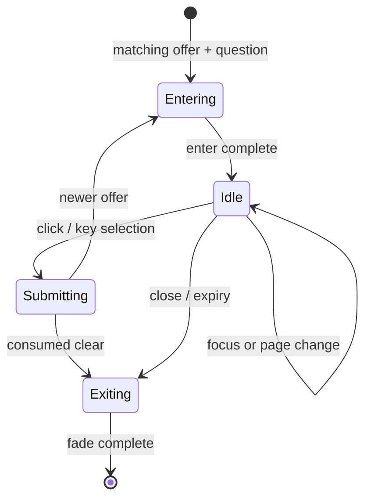
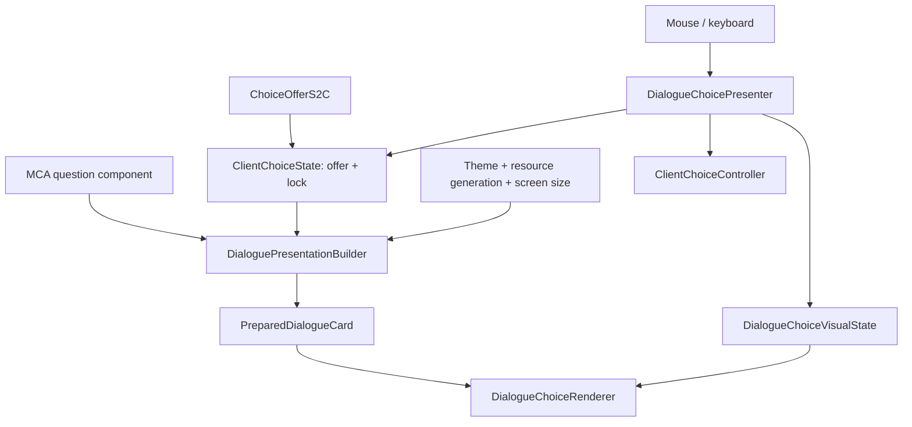

# MCA: Conversations — Visual Polish, Motion, and Interaction Feedback

## Implementation specification for Minecraft 1.20.1 Forge

**Repository:** [otectus/MCAConversations](https://github.com/otectus/MCAConversations)  
**Reviewed baseline:** [`da7a30b6d64625a2372bfe049d25acec5ff15501`](https://github.com/otectus/MCAConversations/commit/da7a30b6d64625a2372bfe049d25acec5ff15501) (`1.4.3`, `main`)  
**Review date:** 2026-08-30  
**Primary target:** Minecraft `1.20.1`, Forge `47.4.10`, Java `17`  
**MCA compatibility:** MCA Reborn `7.6.20`, `7.7.0-beta.2`, and the renamed `7.7.1-alpha.2` package root already represented by the repository's probe fleet  
**Optional UI compatibility:** Townstead `[0.7.5,0.8)` plus forward verification against the reviewed `0.8-alpha` choice surface  
**Recommended release:** `1.5.0` because this introduces a reusable visual-presentation subsystem, new client settings, new assets, and substantially different interaction feedback  
**Reference image:** the supplied 1919×1199 screenshot showing Stephan's eight-entry conversation menu

---

## 1. Purpose

MCA: Conversations `1.4.3` solved the structural problems of MCA's original response popup. It now has a responsive panel, wrapped answers, numbered input, focus, paging, selection locking, chat parity, and a narrow Townstead adapter. The next update should make that interface feel deliberately crafted rather than merely functional.

The desired experience is tactile, readable, and recognizably Minecraft-native:

- the speaking villager's name is an unmistakable visual anchor;
- the focused response feels raised from the list instead of only recolored;
- opening a menu, moving focus, selecting an answer, and changing pages each receive concise visual feedback;
- text, borders, badges, shadows, and motion use one coherent gold-and-charcoal design language;
- animation communicates state without delaying input or making the screen restless;
- the interface remains crisp at every GUI scale and remains fully usable with motion disabled;
- all current server authority, answer order, compatibility, and failure-safe behavior remains intact.

This specification is intentionally grounded in the current implementation. It is not a generic GUI redesign and does not recommend replacing MCA's entire interaction screen.

---

## 2. Executive recommendation

Implement the update around five coordinated changes.

1. **Give the dialogue card a real visual hierarchy.** Use a deeper, more opaque charcoal panel, a restrained gold edge, a small pixel bevel, a local drop shadow, clearer header spacing, and consistent color tokens rather than unrelated hard-coded ARGB values.
2. **Style the speaker rather than the whole sentence.** Render `Stephan` in the same gold used for the active border and number badges, with bold enabled; keep the colon and body text separate and readable. Silent/player-authored prompts must not be mislabeled as villager speech.
3. **Make focus feel physical.** The selected or hovered row should expand horizontally by approximately four GUI pixels, lift by one pixel, receive a short shadow, brighten its number badge, and render above its neighbors. The underlying layout and hitbox must remain fixed so the animation cannot cause hover oscillation.
4. **Add restrained state-driven motion.** The card should rise/fade in, rows should enter with a very short stagger, focus should ease rather than snap, selection should press and lock, and page changes should move by only a few pixels. There should be no perpetual pulsing, bouncing, shaking, or shimmer.
5. **Fix the layout and focus weaknesses that animation would expose.** Replace hard-coded 9-pixel font metrics, constrain the card to screen height, make pagination height-aware, stop a stationary mouse from stealing keyboard focus, invalidate prepared text on resource reload, and implement the narration keys that already ship but are not consumed.

The core visual update should remain a **client-only presentation change on network protocol `2`**. It should reuse the current revisioned offer and `ChoiceSelectC2S` path. Do not add a packet merely to animate UI state the client already knows.

---

## 3. Review scope and repository findings

### 3.1 Reviewed surfaces

The review covered the following current systems, not only the screenshot:

| Surface | Current implementation reviewed | Relevance |
|---|---|---|
| Base MCA dialogue card | [`DialogueChoiceRenderer`](https://github.com/otectus/MCAConversations/blob/da7a30b6d64625a2372bfe049d25acec5ff15501/src/main/java/dev/otectus/mcaconversations/client/dialogue/DialogueChoiceRenderer.java) | Colors, rows, text, footer, caching, hit testing |
| Responsive geometry | [`DialogueChoiceLayout`](https://github.com/otectus/MCAConversations/blob/da7a30b6d64625a2372bfe049d25acec5ff15501/src/main/java/dev/otectus/mcaconversations/client/dialogue/DialogueChoiceLayout.java) | Width, vertical placement, row sizes, overflow |
| Client offer/focus state | [`ClientChoiceState`](https://github.com/otectus/MCAConversations/blob/da7a30b6d64625a2372bfe049d25acec5ff15501/src/main/java/dev/otectus/mcaconversations/client/dialogue/ClientChoiceState.java) | Focus, fixed nine-entry pages, one-shot lock |
| Selection feedback | [`ClientChoiceController`](https://github.com/otectus/MCAConversations/blob/da7a30b6d64625a2372bfe049d25acec5ff15501/src/main/java/dev/otectus/mcaconversations/client/dialogue/ClientChoiceController.java) | Packet submission and the only current UI sound |
| MCA screen integration | [`InteractScreenChoiceMixin`](https://github.com/otectus/MCAConversations/blob/da7a30b6d64625a2372bfe049d25acec5ff15501/src/main/java/dev/otectus/mcaconversations/mixin/client/InteractScreenChoiceMixin.java) | Legacy suppression, render timing, mouse/key/wheel lifecycle |
| Chat choices | [`QuickReplies`](https://github.com/otectus/MCAConversations/blob/da7a30b6d64625a2372bfe049d25acec5ff15501/src/main/java/dev/otectus/mcaconversations/chat/QuickReplies.java) and [`ChatDelivery`](https://github.com/otectus/MCAConversations/blob/da7a30b6d64625a2372bfe049d25acec5ff15501/src/main/java/dev/otectus/mcaconversations/chat/ChatDelivery.java) | Cross-frontend visual vocabulary and clickable components |
| Townstead choices | [`TownsteadChoicePanelMixin`](https://github.com/otectus/MCAConversations/blob/da7a30b6d64625a2372bfe049d25acec5ff15501/src/main/java/dev/otectus/mcaconversations/mixin/client/TownsteadChoicePanelMixin.java) and [`TownsteadRpgDialogueScreenMixin`](https://github.com/otectus/MCAConversations/blob/da7a30b6d64625a2372bfe049d25acec5ff15501/src/main/java/dev/otectus/mcaconversations/mixin/client/TownsteadRpgDialogueScreenMixin.java) | Optional number badges and native selection delegation |
| Client configuration | [`McaConversationsConfig.Client`](https://github.com/otectus/MCAConversations/blob/da7a30b6d64625a2372bfe049d25acec5ff15501/src/main/java/dev/otectus/mcaconversations/McaConversationsConfig.java#L674) and [`CONFIG.md`](https://github.com/otectus/MCAConversations/blob/da7a30b6d64625a2372bfe049d25acec5ff15501/CONFIG.md) | Visual preferences and migration |
| Localization | [`assets/mcaconversations/lang/en_us.json`](https://github.com/otectus/MCAConversations/blob/da7a30b6d64625a2372bfe049d25acec5ff15501/src/main/resources/assets/mcaconversations/lang/en_us.json) and `pt_br.json` | Existing title, hint, page, selecting, expiry, and unused narration keys |
| Compatibility probes | `MixinTargetProbeTest`, `TownsteadUiMixinProbeTest`, `NoMcaStaticLinkTest`, and `DedicatedServerSafetyTest` | Required guardrails for new hooks |
| Upstream MCA screen | MCA `1.20.1` commit [`4d82455`](https://github.com/Luke100000/minecraft-comes-alive/blob/4d824551b30654e5792e19e84f3933e3e3d90ea2/common/src/main/java/net/mca/client/gui/InteractScreen.java) and renamed-package backport commit [`a2a11b`](https://github.com/Luke100000/minecraft-comes-alive/blob/a2a11b2599d0e6af12f0f1380e026441391a5280/common/src/main/java/net/conczin/mca/client/gui/InteractScreen.java) | Exact source of the prefixed question component and field/method shape |
| Upstream Townstead screen | Townstead main commit [`4d6206c`](https://github.com/AetherianArtificer/Townstead/blob/4d6206cdf8b9d0f558694d7b35b223f4f6ace61e/src/main/java/com/aetherianartificer/townstead/client/gui/dialogue/ChoicePanel.java) and `0.8-alpha` commit [`a410d2d`](https://github.com/AetherianArtificer/Townstead/blob/a410d2d29808482e7be13f8916bad5b91454d642/src/main/java/com/aetherianartificer/townstead/client/gui/dialogue/ChoicePanel.java) | Existing typewriter/fade ownership and dynamic hub entries |

### 3.2 What already works well

The existing UI should be refined, not discarded.

- The panel is meaningfully more readable than MCA's 170-pixel popup.
- Questions and answers are separated by a divider.
- Answers are left-aligned and wrap to content-sized rows.
- Gold number labels already establish a useful accent color.
- The active row has a full border and left rail, so focus is not represented by text color alone.
- The panel is dark enough to remain readable over most world scenes.
- Input is broad and server-authoritative: mouse, digits, keypad, arrows, Enter, Space, wheel, Page Up, and Page Down all resolve through the same one-shot offer.
- The renderer caches wrapping and layout instead of rebuilding them every frame.
- Townstead retains control of its own RPG screen.

These are the foundation of the visual pass.

### 3.3 Screenshot-specific diagnosis

The supplied screenshot makes the remaining weaknesses especially clear.

| Element | Current appearance | Recommended change |
|---|---|---|
| Speaker line | `Stephan:` and the utterance are the same white weight | Gold, bold speaker name; normal off-white body; colon visually subordinate |
| Selected row | Darker fill, gold outline, two-pixel left rail | Four-pixel horizontal pop-out, one-pixel lift, local shadow, filled number badge, brighter inner edge |
| Panel | One flat charcoal rectangle with a gray outline | Pixel bevel, muted gold top/left accent, darker lower edge, local shadow, slightly stronger header surface |
| Choice list | Every row has nearly the same visual weight | Resting rows recede; focused row is layered above them; locked row has a distinct pressed/confirmed state |
| Motion | Entirely static except the world behind it | Short enter, focus, selection, and page transitions; no ambient looping animation |
| Footer | Useful but faint and visually detached | Structured control strip, clearer contrast, page buttons when relevant, compact-mode fallback |
| Background competition | World geometry and the large entity nameplate compete with the card | Stronger local panel shadow/scrim; do not add a heavy full-screen blur |

### 3.4 Current code gaps that should be corrected in the same update

These are not cosmetic preferences; each one will make animation or accessibility unreliable if left in place.

| Priority | Finding | Current cause | Required correction |
|---|---|---|---|
| P0 | A stationary pointer can repeatedly restore hover focus after the player presses an arrow key | `DialogueChoiceRenderer.render` calls `state.focus(...)` every frame for any row containing the unchanged mouse coordinates | Add input modality and only adopt hover focus after actual pointer movement or a click |
| P0 | The panel can extend below the screen | `DialogueChoiceLayout.create` computes total height but only clamps `y`; it never caps height or repacks rows | Introduce height-aware pages and safe vertical bounds |
| P0 | Font/resource packs can break vertical geometry | Question and answer line steps are hard-coded to `9` | Use `font.lineHeight` and calculated line spacing everywhere |
| P1 | Speaker styling has no reliable source component | The renderer receives already wrapped `FormattedCharSequence` lines and reconstructs them character by character | Capture the exact component passed to `Font.split` when possible; keep a style-run fallback |
| P1 | Prepared text can remain stale after a resource reload | Cache key contains offer/screen/list identity, not a resource-generation token | Add a client reload generation and include it in preparation keys |
| P1 | Focus methods report success even when nothing changed | `focus`, `moveFocus`, and `focusBoundary` generally return `true` at the same index | Return whether the index actually changed; use that for sound and narration |
| P1 | Existing narration localization is unused | `gui.mcaconversations.responses.narration` ships but no narrator path consumes it | Add offer/focus/page/lock narration with deduplication |
| P1 | Existing title localization is unused | `gui.mcaconversations.responses.title` ships but the renderer never draws it | Either use it only where it improves hierarchy or explicitly remove it; do not leave dead UI copy |
| P2 | Reflow reconstruction creates one component sibling per code point and unconditionally inserts spaces between legacy lines | `reflowQuestion` rebuilds through `Character.toString(codePoint)` | Prefer captured raw component; fallback should coalesce contiguous style runs and preserve boundaries conservatively |
| P2 | Paging has no clickable affordance | Only wheel and keyboard paging exist; footer is text only | Add small previous/next hit targets while retaining all existing controls |
| P2 | Townstead badges appear independently of Townstead's own five-tick fade | Badge mixin draws at `render` tail with full alpha | Give badge decoration its own matched fade without shadowing Townstead's private fade field |

---

## 4. Design principles

### 4.1 Minecraft-native, not web-like

The interface should feel at home beside Minecraft's pixel font and MCA's icons.

- Use integer-aligned rectangles, one- and two-pixel borders, short shadows, stepped alpha, and resource-packable pixel textures.
- Avoid rounded cards, Gaussian blur, glassmorphism, elastic overshoot, smooth vector icons, and large floating gradients.
- Do not scale glyphs fractionally during animation. Animate surrounding geometry and integer text offsets so the font stays crisp.

### 4.2 Motion must explain state

Every animation must answer one of four questions:

- Did a new offer arrive?
- Which response is focused?
- Was a response accepted locally and locked?
- Did the visible page change?

If an animation does not communicate one of these, omit it.

### 4.3 Input must never wait for animation

The visual layer may be entering, leaving, or transitioning, but valid input remains governed by the current offer.

- Rows become clickable as soon as a complete matching offer and screen model exist.
- A focus animation follows state; it never becomes the source of state.
- Selection locks immediately before its pressed animation begins.
- Page hitboxes switch to the new page at the same moment the page state changes, not after the slide completes.

### 4.4 Presentation must not imply consequences

Do not color answers green/red, attach heart icons, or guess which response is kind, hostile, romantic, criminal, or successful from its ID or translated wording. The current ordered list is an authored set of stances, not a morality menu.

### 4.5 Compatibility remains a first-class feature

- No MCA type may appear in a public or compiled descriptor outside the existing isolated compatibility mechanism.
- Both known MCA package roots remain string-targeted `@Pseudo` Mixins.
- Townstead remains optional and owns its screen.
- A failed visual hook must return to the current 1.4.3 or native UI, not fail startup.
- No visual code loads on a dedicated server.

---

## 5. Target visual system

### 5.1 Layer hierarchy

Render the base MCA choice card in this order:

1. local card shadow;
2. panel background and bevel;
3. question/header surface;
4. speaker/body text;
5. divider and answer-region label if used;
6. resting answer rows;
7. focused or locked row, rendered last so its pop-out overlaps cleanly;
8. number badges and answer text;
9. footer, page indicator, and page buttons;
10. one-shot selection confirmation pixels or status indicator.

Do not rely on a large Z translation when simple draw order is sufficient. If `PoseStack.translate` is used, keep the Z delta small and contained by `pushPose`/`popPose` so MCA tooltips are not accidentally buried.

### 5.2 Default palette

All colors must come from one immutable `ConversationVisualTheme`, never from scattered renderer constants.

| Token | RGB | Suggested ARGB | Use |
|---|---:|---:|---|
| `panelBackground` | `#151515` | `0xED151515` | Main card, approximately 93% opacity |
| `headerBackground` | `#211D16` | `0xF0211D16` | Slightly warm question region |
| `panelShadow` | `#000000` | `0x78000000` | Two- to three-pixel local shadow |
| `borderDark` | `#3A3226` | `0xFF3A3226` | Bottom/right bevel |
| `borderMid` | `#8C6A2B` | `0xFF8C6A2B` | Resting gold-brown edge |
| `accent` | `#FFC34D` | `0xFFFFC34D` | Speaker name, active border, active number badge |
| `accentSoft` | `#C99438` | `0xFFC99438` | Divider, resting number, non-focused ornament |
| `rowRest` | `#252525` | `0xC9252525` | Resting response surface |
| `rowHover` | `#39352E` | `0xED39352E` | Hover/focus surface |
| `rowLocked` | `#493820` | `0xF2493820` | Submitted/awaiting state |
| `textPrimary` | `#F2EEE8` | `0xFFF2EEE8` | Question and answer body |
| `textSecondary` | `#B7B1A6` | `0xFFB7B1A6` | Footer and page information |
| `textDisabled` | `#857C6F` | `0xFF857C6F` | Inactive control hints |

The accent token is the exact shared source for the speaker name and the active row border. This directly implements the supplied request and prevents visually similar but mismatched golds.

### 5.3 Panel shape and depth

The panel should retain a rectangular Minecraft silhouette.

- Draw a shadow at `x + 2`, `y + 3`, with one softer one-pixel extension if performance remains negligible.
- Give the top and left edge a muted gold-brown highlight.
- Give the bottom and right edge a dark bevel.
- Add an eight-pixel accent segment or square corner notch at the top-left rather than outlining the entire panel in bright gold.
- Keep the interior opaque enough that stone, foliage, nametags, and minimaps do not compete with text.
- Use a slightly warmer header background to separate the villager's words from player choices without adding another large box.

Avoid a full-screen shader or framebuffer blur. It is disproportionately expensive, commonly conflicts with Oculus/Embeddium-style stacks, and is unnecessary once the card has a proper local shadow and opacity.

### 5.4 Speaker typography

For a normal villager utterance such as the reference screenshot:

- `Stephan` uses `accent` and `Style.withBold(true)`;
- the colon remains `accentSoft` or `textSecondary`;
- the utterance uses `textPrimary`, normal weight;
- existing component styling inside the utterance is preserved unless it would make the text unreadable;
- wrapping is applied after styling so the font measures the bold name correctly.

The preferred inline result is:

> **Stephan**: I'm getting really tired. I suppose it's been a long day…

Do not color the entire question gold. The goal is a speaker anchor, not a gold paragraph.

### 5.5 Choice-row anatomy

Each row has four conceptual regions:

| Region | Resting state | Focused state | Locked state |
|---|---|---|---|
| Shadow | None | Two pixels down/right | One pixel down/right, darker |
| Surface | `rowRest` | `rowHover` | `rowLocked` |
| Number badge | Gold text on transparent/dark cell | Gold fill with near-black numeral | Gold-brown fill with check/number |
| Answer | `textPrimary` | `textPrimary`, shifted right 1–2 pixels | `textPrimary`, no pulsing |
| Edge | Subtle dark outline | Bright gold one-pixel outline plus two-pixel left rail | Stable gold edge and pressed top bevel |

The numeral remains local to the visible page (`1`–`9`) while the selection packet continues to use the absolute answer index.

### 5.6 The pop-out effect

The focused row should appear to leave the stack without making neighboring rows move.

- Base layout rect: unchanged and used for hit testing.
- Visual rect at full focus: `x - 4`, `y - 1`, `width + 8`, `height + 2`.
- Text offset at full focus: `+2` pixels on X, `0` on Y.
- Shadow: one dark rect at `visualX + 2`, `visualY + 2` before the row surface.
- Draw order: all resting rows first, focused/locked row last.
- Do not scale the text or mutate the page's row heights.
- Round every animated outset and text offset to an integer before drawing.

This creates the requested expansion while avoiding two common defects:

1. moving the hitbox with the animation can make the cursor leave/re-enter the row every frame;
2. relaying out neighboring rows produces a distracting accordion effect.

### 5.7 Footer and page controls

The footer should be a deliberate control strip rather than loose text.

- Separate it with a subtle top line.
- Left-align the current input hint.
- Right-align `Page X/Y` when multiple pages exist.
- Add small previous/next arrow hit targets beside the page label. Each target should be at least `18×18` GUI pixels even if the glyph is smaller.
- In compact mode, shorten the hint before reducing answer text area.
- When locked, replace navigation copy with the localized `Selecting…` state and preserve page text only if it remains useful.

Do not animate the ellipsis continuously. A small one-shot three-step dot sequence may play during the first six ticks of lock, then settle.

---

## 6. Motion specification

### 6.1 Motion profiles

Expose three motion modes.

| Mode | Behavior |
|---|---|
| `FULL` | Short fades, four-pixel entry movement, row stagger, pop-out interpolation, page slide, pressed feedback |
| `REDUCED` | Alpha transitions only; no row translation, no stagger, no geometric expansion; static focus outline remains |
| `OFF` | Immediate state changes; all non-motion focus/lock cues remain |

The default is `FULL`. The user must not lose functional feedback when choosing `REDUCED` or `OFF`.

### 6.2 Timing and easing

Durations are expressed in client ticks and interpolated with render partial ticks.

| Event | Full-motion duration | Easing | Distance/alpha |
|---|---:|---|---|
| Card enter | `4` ticks / ~200 ms | cubic ease-out | `y + 4 → y`, alpha `0 → 1` |
| Question crossfade | `3` ticks | quadratic ease-out | alpha `0 → 1`, no text scale |
| Row cascade | `3` ticks each | cubic ease-out | `x - 3 → x`; start offset `0.35` tick per row |
| Focus enter | `2.5` ticks | cubic ease-out | outset `0 → 4`, lift `0 → 1` |
| Focus exit | `2` ticks | quadratic ease-in-out | reverse focus geometry |
| Selection press | `1.5` ticks | quadratic ease-out | briefly reduce outset from `4 → 1` |
| Selection settle | `2` ticks | cubic ease-out | return to locked outset `3` and locked color |
| Page change | `3` ticks | cubic ease-out | old page `0 → -4`, new page `+4 → 0`, crossfade |
| Consumed clear | `2` ticks | quadratic ease-in | alpha `1 → 0`; no input during cleared state |

Do not use spring/elastic easing. Pixel UI should feel decisive.

Suggested pure easing functions:

```java
static float easeOutCubic(float t) {
    float u = 1.0F - clamp01(t);
    return 1.0F - u * u * u;
}

static float smoothStep(float t) {
    t = clamp01(t);
    return t * t * (3.0F - 2.0F * t);
}
```

### 6.3 Motion state machine



The state machine is visual only. `ClientChoiceState.lock(...)` remains the authoritative local submission lock.

### 6.4 Clock and interpolation

Use a client-owned clock with a test seam.

- Increment whole time from the screen's client `tick` hook.
- Pass `partialTick` from MCA's render call into the renderer.
- Calculate `visualTime = tickCount + partialTick`.
- Never base animation on server game time; a lagging server must not make local focus feel laggy.
- If an injected tick hook is unavailable on one MCA build, fall back to a monotonic `Util.getMillis()` clock behind the same interface and clamp a single-frame delta to prevent resume jumps.
- Unit tests use a fake clock.

### 6.5 Offer entry and replacement

A new network offer is not sufficient by itself to start the visible enter animation. The adapter must first have all of the following:

- a current `ClientChoiceOffer`;
- matching `dialogQuestionId`;
- matching ordered `dialogAnswers`;
- non-null question content or legacy question lines;
- a prepared, on-screen layout.

Start the animation when that complete presentation model exists. This prevents a blank panel from fading in while MCA's companion question packet is still arriving.

When revision `N+1` replaces revision `N`:

- stop accepting input for `N` immediately because the state already changed;
- retain a non-interactive prepared snapshot of `N` for at most three ticks if a crossfade is enabled;
- prepare `N+1` once and animate it in;
- never keep entity, screen, or world references in the snapshot.

### 6.6 Selection feedback

Selection feedback must begin inside `ClientChoiceController.select` only after `state.lock(...)` succeeds.

1. Lock the absolute index.
2. Notify the visual state of `SUBMITTING`.
3. Play the configured confirm sound.
4. Send `ChoiceSelectC2S` exactly as in 1.4.3.

The selected row presses inward briefly, returns to a slightly raised locked pose, and uses `rowLocked`. The footer changes to `Selecting…`. No other row accepts focus.

If the server returns a new offer immediately, the new offer transition supersedes the remainder of the pressed animation. Visual completion must never delay the next question.

---

## 7. Recommended client architecture

### 7.1 Separate synchronized state from presentation state

Do not put animation floats, theme values, cached text, or mouse coordinates into the synchronized offer record.



### 7.2 Proposed classes

Names may be adapted to project conventions, but preserve these boundaries.

| Class | Responsibility |
|---|---|
| `ConversationVisualTheme` | Immutable palette, dimensions, and state colors; provides classic/high-contrast variants |
| `ConversationMotionSpec` | Durations, distances, and behavior derived from `MotionMode` |
| `DialogueChoiceVisualState` | Phase, animation timestamps, per-row focus progress, page transition, input modality |
| `DialogueChoicePresenter` | Maps digits, focus, page controls, hover movement, and hit targets onto absolute indices |
| `DialoguePresentationBuilder` | Translates/wraps question and answers, styles speaker, computes pages and layout, builds immutable render data |
| `PreparedDialogueCard` | Cached question lines, prepared row lines, stable hit rects, visual base rects, footer and page controls |
| `SpeakerTextStyler` | Splits or range-styles the speaker label without flattening the utterance |
| `ClientUiResourceGeneration` | Increments on client resource reload so prepared text and assets invalidate |
| `DialogueChoiceNarrator` | Deduplicated offer/focus/page/lock/expiry narration |
| `DialogueUiSounds` | Optional, throttled focus/page/confirm sounds |

`DialogueChoiceRenderer` becomes an orchestrator over these pieces rather than accumulating more state and layout branches in one class.

### 7.3 Suggested immutable records

```java
public record ChoicePage(int firstInclusive, int lastExclusive) {
    public int size() { return lastExclusive - firstInclusive; }
}

public record PreparedChoiceRow(
        int absoluteIndex,
        int visibleNumber,
        DialogueChoiceLayout.Rect hitRect,
        DialogueChoiceLayout.Rect baseVisualRect,
        List<FormattedCharSequence> lines
) {}

public record PreparedDialogueCard(
        long offerRevision,
        long questionRevision,
        int resourceGeneration,
        DialogueChoiceLayout.Rect panel,
        List<FormattedCharSequence> questionLines,
        List<ChoicePage> pages,
        List<PreparedChoiceRow> visibleRows,
        List<HitTarget> controls
) {}

public enum InputModality { POINTER, KEYBOARD }
```

Prepared records must contain no `Entity`, `Level`, `Screen`, or MCA object reference.

---

## 8. Capturing and styling the exact speaker line

### 8.1 Why the current input is insufficient

MCA builds the displayed line inside `InteractScreen.setLastPhrase`:

1. the raw dialogue component is transformed for speech state;
2. the villager chat prefix and display name are prepended;
3. a colon and space are appended;
4. the resulting component is split to 160 pixels and stored as `dialogQuestionText`.

The current Conversations renderer sees only that already split list. It then joins the legacy lines with inserted spaces and rebuilds a component one code point at a time. That loses the clean semantic boundary between speaker and utterance and makes precise name styling unnecessarily fragile.

### 8.2 Preferred capture route

Add a narrowly probed capture inside `InteractScreenChoiceMixin` at the argument passed to vanilla `Font.split` in `setLastPhrase`.

- Use standard Mixin `@ModifyArg` or an equivalent injection supported by the existing dependency set.
- Capture the vanilla `FormattedText`/`Component` argument.
- Return the exact original argument unchanged.
- Do not redirect the MCA call or invoke it reflectively.
- Keep the handler signature entirely vanilla-typed.
- Increment a local `questionRevision` whenever a new captured component is observed.
- Record whether the `setLastPhrase` call was silent.

Illustrative shape, with the exact descriptor verified against all probed jars before use:

```java
@ModifyArg(
    method = "setLastPhrase",
    at = @At(
        value = "INVOKE",
        target = "Lnet/minecraft/client/gui/Font;split(Lnet/minecraft/network/chat/FormattedText;I)Ljava/util/List;",
        remap = true
    ),
    index = 0,
    require = 0,
    remap = false
)
private FormattedText mcaconversations$captureDisplayedQuestion(FormattedText text) {
    mcaconversations$questionRevision++;
    mcaconversations$questionComponent = copySafely(text);
    return text;
}
```

The descriptor above is the expected official-mapping shape for Minecraft 1.20.1. The coding agent must still confirm it against the generated mappings and every production jar in the probe fleet before relying on the hook.

### 8.3 Speaker range detection

The Mixin constructor already captures the villager UUID when its argument is also a vanilla `Entity`. Extend that capture to keep an immutable copy of `entity.getDisplayName()`.

Given the captured complete component and display name:

1. find the display-name component structurally if it remains a sibling in the captured tree;
2. otherwise find the exact display-name code-point sequence only within the leading label before the first `": "` separator;
3. preserve any custom MCA chat prefix before the name;
4. apply the theme's `accent` and bold only to the name range;
5. style the separator separately;
6. preserve all body styles, siblings, arguments, hover data, and bidirectional ordering;
7. split the styled component to the final responsive width.

Never run a global string replacement. A villager named `Rose` may say the word “rose” in the body; only the leading label is a valid match.

### 8.4 Silent prompts

MCA silent questions often represent the player's own thought or a menu prompt.

- Do not prepend or gold-style the villager's name when `silent == true`.
- Preserve existing italics or authored styles.
- Optionally use a slightly warmer header surface, but do not label the line “Stephan” merely because Stephan is the interaction target.
- If exact component capture fails, render the legacy lines unchanged rather than guessing a speaker.

### 8.5 Fallback route

If the exact component hook no longer matches:

- keep using `dialogQuestionText` so the interface remains functional;
- coalesce adjacent code points with identical `Style` into runs instead of making one component sibling per character;
- treat legacy line joins conservatively;
- style the speaker only if an exact leading-label match is unambiguous;
- log one compatibility warning in debug output, not once per frame.

---

## 9. Responsive layout redesign

### 9.1 Use font metrics

Replace every hard-coded vertical `9` with values based on the active `Font`.

```text
lineStep        = font.lineHeight + 1
rowPaddingY     = 5 (normal) or 3 (compact)
rowHeight       = max(lineStep + 2 * rowPaddingY, lines * lineStep + 2 * rowPaddingY)
questionHeight  = max(lineStep, questionLines * lineStep)
footerHeight    = footerVisible ? lineStep + 10 : 0
```

This is required for custom font/resource packs and for bold speaker measurement.

### 9.2 Width calculation

Use GUI pixels, not framebuffer pixels.

```text
wide outer margin      = 16
narrow outer margin    = 8
minimum panel width    = 220
preferred panel width  = round(guiWidth * 0.60)
maximum panel width    = 420
actual panel width     = clamp(preferred, min, max), then cap to guiWidth - 2 * margin
```

On very narrow screens, the screen-width cap wins even if it falls below the normal minimum.

Keep the number/badge column fixed enough that digits do not move between rows. The answer text width is the inner width minus badge width, badge gap, and row padding.

### 9.3 Safe vertical area

Define a safe region before packing rows.

```text
safeTop    = 8
safeBottom = guiHeight >= 220 ? 36 : 8
maxPanelHeight = guiHeight - safeTop - safeBottom
```

The bottom reservation avoids fighting the hotbar and dense modded HUDs while retaining nearly the full screen on small windows.

### 9.4 Height-aware pagination

`PAGE_SIZE = 9` currently means “always place up to nine rows,” regardless of row height. Replace this with “at most nine numeric shortcuts per page, and only as many rows as fit.”

Algorithm:

1. Wrap the question and every answer once.
2. Compute the fixed chrome height: panel padding, header, divider, footer, and gaps.
3. Compute `availableRowsHeight = maxPanelHeight - fixedChromeHeight`.
4. Walk answers in original absolute order.
5. Add a row to the current page if both conditions hold:
   - page contains fewer than nine rows;
   - row plus preceding gap fits the available height.
6. If the next row does not fit and the page is non-empty, close the page and start another.
7. Never reorder or drop an answer.
8. Keep the page containing the focused absolute index active after a resize or resource reload.

Rename the constant to `MAX_VISIBLE_SHORTCUTS = 9`; it is an input bound, not a layout promise.

### 9.5 Extreme single-row overflow

A third-party datapack can provide an answer longer than an entire small screen.

The fallback order is:

1. enter compact spacing;
2. use the maximum allowed panel width;
3. place the oversized row alone on a page;
4. clip its text inside a scrollable row-text viewport with visible up/down indicators;
5. narrate the full answer and expose the full component in a tooltip while focused.

Do not silently ellipsize a selectable answer without another way to read it.

### 9.6 Stable hit geometry

Maintain two rects per row:

- `hitRect`: static, derived from layout, used for hover/click;
- `baseVisualRect`: normally identical, used as the origin for animated outsets.

The animated pop-out rect is never used to decide whether the pointer is inside the row.

### 9.7 Page controls as hit targets

Replace `hitIndex(...)` with a typed hit-test result.

```java
sealed interface HitTarget {
    record Choice(int absoluteIndex) implements HitTarget {}
    record PreviousPage() implements HitTarget {}
    record NextPage() implements HitTarget {}
    record None() implements HitTarget {}
}
```

This prevents page buttons from being smuggled into fake answer indices.

---

## 10. Focus, hover, and input modality

### 10.1 Fix stationary-pointer focus theft

The renderer must not mutate focus merely because the current pointer coordinates still overlap a row.

Track:

- last observed mouse X/Y;
- current `InputModality`;
- last focus-change cause.

Rules:

- On actual pointer movement of at least one GUI pixel, set modality to `POINTER` and focus the hovered row.
- On left click, set modality to `POINTER` and focus/select the clicked row even if the pointer did not previously move.
- On arrow, Home, End, Page Up, Page Down, digit, Enter, or Space, set modality to `KEYBOARD`.
- While modality is `KEYBOARD`, unchanged mouse coordinates do not change focus.
- Moving the mouse again immediately restores pointer behavior.

This also makes focus sounds and narration deduplicatable.

### 10.2 Focus mutation semantics

Change focus methods to return `true` only when focus actually changed.

```java
public boolean focus(int absoluteIndex) {
    if (!isVisibleAndUnlocked(absoluteIndex) || focusedIndex == absoluteIndex) return false;
    focusedIndex = absoluteIndex;
    return true;
}
```

Apply equivalent behavior to boundary and movement methods.

### 10.3 Cross-page keyboard movement

Recommended behavior:

- Down from the final row of a non-final page opens the next page and focuses its first row.
- Up from the first row of a non-first page opens the previous page and focuses its last row.
- Home/End stay within the current page.
- Page Up/Page Down change page and focus its first row.
- Digits always map to the labels currently visible.

This makes a multi-page menu behave as one continuous ordered list without changing its numbering model.

### 10.4 Mouse wheel ownership

Retain 1.4.3's rule that an active choice card consumes the wheel so MCA cannot change the player's hotbar slot behind the screen.

- If multiple pages exist, the wheel changes page.
- If an oversized single row has an internal text scroll, wheel over that row scrolls its text first.
- If neither action can move, consume the wheel without changing game state.

---

## 11. Renderer implementation details

### 11.1 Prepare once, animate cheaply

Preparation may perform:

- component styling;
- translation resolution;
- wrapping;
- line/row measurement;
- height-aware page packing;
- control hitbox calculation;
- texture/resource lookup.

Per-frame rendering may perform only:

- float progress calculations;
- integer interpolation/rounding;
- fills/blits;
- draws of already prepared sequences;
- bounded hit tests over the current page.

Do not call `font.split`, `Component.getString`, reflection, registry lookup, or file/resource parsing every frame.

### 11.2 Cache key

The prepared-card key should include:

```text
offer revision
question revision
visible page index or page-map revision
GUI width and height
active Font identity/line height
client resource generation
locale id
visual style/theme id
footer visibility
compact mode
```

Do not use `System.identityHashCode(questionLines)` as the primary content revision.

### 11.3 Rendering the focused row last

Suggested flow:

```java
PreparedChoiceRow elevated = null;
for (PreparedChoiceRow row : card.visibleRows()) {
    if (row.absoluteIndex() == state.focusedIndex()
            || row.absoluteIndex() == state.lockedIndex()) {
        elevated = row;
    } else {
        drawRow(row, visualState.progress(row.absoluteIndex()), false);
    }
}
if (elevated != null) {
    drawRow(elevated, visualState.progress(elevated.absoluteIndex()), true);
}
```

If focus and lock somehow differ, lock wins and is the elevated row.

### 11.4 Pixel alignment

- Interpolate in floats.
- Round rectangle coordinates, border positions, and text offsets before drawing.
- Never apply a fractional scale to the matrix containing text.
- If a texture is used, sample at native integer boundaries and disable accidental filtering.
- Test at GUI scales 1–4 and Auto.

### 11.5 Scissor discipline

Use scissoring for the answer viewport and extreme overflow only.

- Compute scissor bounds from final integer GUI rects.
- Keep the focused pop-out inside a slightly expanded clip so its four-pixel outset is not cut off.
- Always restore scissor state, including failure paths.
- Do not leave a scissor active for MCA's tooltips or other HUD elements.

---

## 12. Texture and resource-pack strategy

### 12.1 Phase-one primitive fallback

The full design must remain possible with `GuiGraphics.fill` and one-pixel outlines. This is the guaranteed fallback when custom visual resources fail to load.

### 12.2 Recommended pixel assets

Add tintable, resource-packable assets under:

```text
assets/mcaconversations/textures/gui/dialogue/panel.png
assets/mcaconversations/textures/gui/dialogue/row.png
assets/mcaconversations/textures/gui/dialogue/number_badge.png
assets/mcaconversations/textures/gui/dialogue/page_controls.png
```

Recommended constraints:

- 16×16 or 32×32 sources;
- one-pixel hard edges;
- no antialiased border pixels;
- white/gray tintable interiors where practical;
- four-pixel nine-slice corners for the panel and row;
- no large embedded text or symbols;
- no animation metadata for continuous looping.

Use `GuiGraphics.blitNineSliced` only after confirming its exact 1.20.1 mapped signature. A small local nine-slice helper is acceptable if that method differs across the development and production mappings.

### 12.3 Theme fallback

If any texture is absent or malformed:

- log once at debug level;
- use primitive fills and borders;
- keep identical hitboxes and layout;
- do not disable the whole numbered-response system.

---

## 13. Narration and accessibility

### 13.1 Implement the narration contract already documented by the mod

Narration should occur on transitions, never on render frames.

| Event | Narration |
|---|---|
| New offer | Speaker/question once, then “N responses” if useful |
| Keyboard focus change | `Response %1$s of %2$s: %3$s` immediately |
| Pointer focus change | Narrate only after a short dwell, not while sweeping across rows |
| Page change | `Page %1$s of %2$s` followed by the newly focused response |
| Lock | `Selected: <response>` or localized selecting state once |
| Expiry | Existing translated expiry message once |

The current `gui.mcaconversations.responses.narration` key can be reused. Add complete keys for offer count, selected response, and page narration in every advertised locale.

### 13.2 Do not duplicate MCA/Townstead speech

- Do not narrate the villager's sentence if MCA's TTS or Townstead's narrator already owns that surface.
- The base card may announce focus responses without replaying the spoken villager line on every focus change.
- Townstead retains its own typewriter narration policy; the number-badge adapter should announce only a digit mapping if Townstead does not already announce the selected entry.

### 13.3 Color and shape

- Gold is not the only focus cue: use border, left rail, badge fill, and pop-out geometry.
- With motion off, preserve a two-pixel rail or arrow.
- Normal text remains near-white.
- Footer gray must still pass practical contrast against the final panel opacity.
- High-contrast mode uses a two-pixel light border and disables subtle bevel dependence.
- Never flash the entire panel or alternate high-contrast colors rapidly.

### 13.4 Reduced motion

Reduced motion is a first-class supported configuration, not a debug flag.

- Remove translation, pop-out, stagger, and page slide.
- Retain a short alpha transition if selected.
- Keep focus outline, badge fill, pressed color, and selection lock.
- Ensure tests exercise all three motion modes.

### 13.5 Localization

- Keep question and answer text as components until final layout.
- Never inject numbers into authored language values.
- Use translatable full sentences for hints and narration rather than concatenating fragments.
- Preserve bidirectional visual order through `FormattedCharSequence`.
- Test `en_us`, `pt_br`, a long-word language, and a right-to-left resource pack.
- ASCII `1`–`9` labels are acceptable because they advertise physical key mappings, but they must remain visually isolated from bidirectional answer text.

---

## 14. Sound feedback

Sound is secondary to the visual work but materially improves perceived responsiveness.

### 14.1 Recommended cues

| Action | Sound | Suggested volume/pitch |
|---|---|---|
| Keyboard focus moved | Existing UI click, high and soft | volume `0.18`, pitch `1.35` |
| Page changed | Existing page-turn or softer UI click | volume `0.25`, pitch `1.0` |
| Selection accepted locally | Current `UI_BUTTON_CLICK` | volume `0.65`, pitch `1.0` |
| Invalid/stale digit | No sound by default | Avoid punishing or noisy feedback |

### 14.2 Sound rules

- Play focus sound only when the index changed.
- Do not play a sound every render frame under a stationary pointer.
- Pointer hover sound should be off by default or rate-limited to actual row transitions.
- Do not play a second selection sound if Townstead's native path already does so.
- A single `uiSoundVolume` client setting may scale all cues; `0` disables them.

---

## 15. Chat-mode visual parity

Vanilla chat components cannot use the card's live animation, but they should share its hierarchy.

### 15.1 Speaker name

`ChatDelivery` currently uses `ChatFormatting.YELLOW`. Change the default speaker component to the same gold family and bold weight used by the card, while preserving `chatModeMessageFormat` substitution and all configured literal text.

Do not flatten the line or name into `String.format`.

### 15.2 Choice block

Refine `QuickReplies.optionsBlock` as follows:

- gold/bold number label;
- off-white or light-gray response body rather than a very dim gray;
- dark-gray italic instruction line;
- consistent one-choice suppression;
- click/hover styling applied to the whole response line, not only the numeric prefix;
- retain `SUGGEST_COMMAND`, not `RUN_COMMAND`, unless a separately secured direct-selection component is designed;
- retain strict typed multi-digit selection and the 64-answer protocol ceiling;
- never animate or repeatedly resend the block.

### 15.3 No duplicate overlay

Do not introduce a second animated choice card over the world while the chat frontend is active. The chat block and empty-ChatScreen digit shortcut are already the correct interaction model for that mode.

---

## 16. Townstead compatibility and parity

### 16.1 Preserve ownership

Townstead already supplies:

- camera motion;
- a bottom dialogue box;
- typewriter text and page handling;
- emotion effects and optional particles;
- a five-tick choice-panel fade;
- wrapped/scrollable choices;
- native hover, keyboard, submenu, Back, and dynamic hub behavior.

MCA: Conversations must not draw its base card over that screen or duplicate Townstead's motion language.

### 16.2 Improve number badges only

The adapter may refine its own decoration:

- use the shared gold palette;
- fade badges in over five ticks to match Townstead's panel;
- use a filled badge for the selected entry and a muted number for resting entries;
- clip badge drawing to the panel;
- keep the current visible-entry mapping, including hub entries, Back, careers, orders, and future client-only Townstead rows;
- recalculate safely if Townstead inserts a dynamic row while the panel is open.

Do not shadow Townstead's private `fadeAlpha` merely to copy it. Maintain an independent `@Unique` badge fade reset by soft-failing injections into `setVisible` and `tick`, and extend the Townstead probe accordingly.

### 16.3 Pop-out behavior in Townstead

Do not force the base UI's four-pixel row expansion through the optional Mixin. Townstead owns its geometry and already uses a triangle/highlight selection model.

If Townstead later exposes a stable styling or animation API, use it. Until then, badge fill and accent parity are enough.

### 16.4 Dynamic-entry testing

The reviewed `0.8-alpha` can insert career and order entries into the top-level hub. Test that:

- numbers update immediately after insertion;
- a selected absolute display index does not point at a different action after insertion;
- digit selection invokes Townstead's current `handleChoiceSelection` path;
- badge animation state does not retain the old row identity;
- Townstead absence remains a complete no-op.

---

## 17. Configuration

### 17.1 Recommended client options

Keep the current four display options and add only high-value visual controls.

| Option | Type | Default | Meaning |
|---|---|---:|---|
| `numberedResponses` | boolean | `true` | Existing numbered card behavior |
| `numericResponseShortcuts` | boolean | `true` | Existing dialogue-screen digit behavior |
| `chatNumericShortcuts` | boolean | `true` | Existing empty-chat digit behavior |
| `showResponseControlHints` | boolean | `true` | Existing footer behavior |
| `enhancedConversationVisuals` | boolean | `true` | New panel skin, speaker styling, badges, shadows, and refined states |
| `motionMode` | enum | `FULL` | `FULL`, `REDUCED`, or `OFF` |
| `visualStyle` | enum | `GOLD` | `GOLD`, `HIGH_CONTRAST`, or `CLASSIC_1_4` |
| `panelOpacity` | double | `0.93` | Range `0.65–1.0`; affects main surfaces, not text |
| `uiSoundVolume` | double | `0.65` | Range `0–1`; `0` disables new UI cues |
| `speakerNameAccent` | boolean | `true` | Allows users/resource packs to keep the original speaker style |

`CLASSIC_1_4` should preserve the current 1.4.3 colors and static geometry as closely as practical while retaining P0 correctness fixes such as height-aware layout and input modality.

### 17.2 Avoid configuration soup

Do not expose individual pixel paddings, easing exponents, row outsets, stagger intervals, badge widths, or every ARGB token. Those belong to tested theme presets and resource packs.

### 17.3 Live changes

If Forge reloads the client config while a screen is open:

- increment a visual-config generation;
- rebuild the prepared card once;
- preserve offer revision, absolute focus, lock, and page containing focus;
- switch motion mode without replaying the entire enter animation.

---

## 18. Localization additions

Add and maintain parity for at least:

```json
{
  "gui.mcaconversations.responses.count": "%1$s responses",
  "gui.mcaconversations.responses.selected": "Selected: %1$s",
  "gui.mcaconversations.responses.page_narration": "Page %1$s of %2$s",
  "gui.mcaconversations.responses.previous_page": "Previous page",
  "gui.mcaconversations.responses.next_page": "Next page",
  "gui.mcaconversations.responses.scroll_for_more": "Scroll to read the full response",
  "gui.mcaconversations.responses.visual_style.gold": "Gold",
  "gui.mcaconversations.responses.visual_style.high_contrast": "High contrast",
  "gui.mcaconversations.responses.visual_style.classic": "Classic 1.4",
  "gui.mcaconversations.responses.motion.full": "Full",
  "gui.mcaconversations.responses.motion.reduced": "Reduced",
  "gui.mcaconversations.responses.motion.off": "Off"
}
```

Retain existing keys for hint, expiry, page, selecting, narration, and chat hover. If `responses.title` remains unused after the redesign, remove it from all locales and tests rather than carrying dead copy indefinitely.

---

## 19. File-level change map

| File | Required change |
|---|---|
| `client/dialogue/DialogueChoiceRenderer.java` | Split preparation from drawing; layered panel; focused-row-last draw; motion interpolation; typed hit targets; no per-frame focus mutation |
| `client/dialogue/DialogueChoiceLayout.java` | Font-aware metrics, safe vertical area, height-aware page packing, stable hit/base rects, compact mode, page-control rects |
| `client/dialogue/ClientChoiceState.java` | Keep synchronized offer/lock; rename nine-entry bound; return accurate focus-change results; decouple page calculation from fixed arithmetic |
| `client/dialogue/ClientChoiceController.java` | Notify visual state after a successful lock; route sounds/narration; add visual config accessors without changing packet semantics |
| `client/dialogue/DialogueChoicePresenter.java` | **New.** Input modality, visible-number mapping, continuous keyboard movement, page and hit-target dispatch |
| `client/dialogue/DialogueChoiceVisualState.java` | **New.** Enter/idle/submitting/exiting phases and per-row progress |
| `client/dialogue/DialoguePresentationBuilder.java` | **New.** Component styling, wrapping, measurement, page packing, immutable render plan |
| `client/dialogue/ConversationVisualTheme.java` | **New.** Palette, dimensions, high-contrast/classic presets |
| `client/dialogue/ConversationMotionSpec.java` | **New.** Motion profile and easing values |
| `client/dialogue/SpeakerTextStyler.java` | **New.** Safe speaker/body styling and legacy fallback |
| `client/dialogue/DialogueChoiceNarrator.java` | **New.** Deduplicated transition narration |
| `client/dialogue/DialogueUiSounds.java` | **New.** Throttled focus/page/confirm cues |
| `client/ClientUiResourceGeneration.java` | **New.** Client reload counter; no server linkage |
| `mixin/client/InteractScreenChoiceMixin.java` | Capture exact question component/silent state; pass partial tick; delegate input; reset on close; preserve dual-root and native fallback |
| `mixin/client/TownsteadChoicePanelMixin.java` | Shared palette, independent badge fade, clipping, dynamic-entry reset |
| `chat/QuickReplies.java` | Gold/bold numbers, clearer body text, whole-line hover/click metadata |
| `chat/ChatDelivery.java` | Shared gold/bold speaker component while preserving configured format |
| `McaConversationsConfig.java` | Add validated enum/double client settings under `[display]` or a nested `[display.visuals]` group |
| `CONFIG.md` | Explain styles, motion profiles, opacity, sounds, and classic fallback |
| `README.md` | Add concise visual-update description and control summary |
| `CHANGELOG.md` | Document visual behavior, accessibility, compatibility, and no protocol bump |
| `assets/mcaconversations/lang/*.json` | New narration/control/config labels with locale parity |
| `assets/mcaconversations/textures/gui/dialogue/*` | Optional nine-slice/pixel assets with primitive fallback |
| `mcaconversations.mixins.json` | No new target required if current Mixin is extended; keep client isolation |
| existing probe and safety tests | Add every new MCA/Townstead injection point and preserve no-static-link guarantees |

Do not add a second screen class that replaces MCA wholesale.

---

## 20. Compatibility and failure policy

| Failure | Required degradation |
|---|---|
| Exact question-component capture misses | Use legacy question lines; speaker remains unaccented if ambiguous; choices remain fully functional |
| Texture/theme resource missing | Use primitive theme renderer |
| Resource reload occurs mid-offer | Rebuild once and preserve absolute focus/lock |
| Animation code throws | Disable enhanced motion for that screen instance and render static enhanced/classic state |
| Base MCA render hook misses | Leave MCA's native interface intact; log a compatibility warning once |
| One MCA package root is absent | Expected; matching root applies through current `@Pseudo` design |
| Townstead member changes | Townstead retains native UI without Conversations badges/digits that depend on the missing member |
| Offer sync missing/stale | Do not show an interactive enhanced card; preserve native fallback |
| More than 64 answers | Keep current protocol safety fallback; never display a misleading partial numbered list |
| Motion disabled | Static hierarchy and focus cues remain complete |
| Custom font changes line height | Recompute with `font.lineHeight`; never use vanilla constants |
| Dedicated server loads mod | No client visual class is resolved from common initialization |

### 20.1 Mixin rules

Any added hook in `InteractScreenChoiceMixin` must retain:

- both `forge.net.mca.*` and `forge.net.conczin.mca.*` targets;
- `@Pseudo`;
- `remap = false` for MCA-owned members;
- `require = 0` at runtime;
- exact build-time probe coverage so soft failure cannot go unnoticed before release;
- vanilla-only parameters or `@Coerce Object` where an MCA descriptor would otherwise leak.

### 20.2 No protocol bump for the core update

The client already knows:

- offer revision;
- ordered answer IDs;
- focused/locked index;
- clear reason;
- arrival time.

That is sufficient for all required visual transitions. Keep `ConversationsNetwork.PROTOCOL = "2"` unless a separately scoped feature sends new server truth.

---

## 21. Optional future feedback: actual relationship deltas

A small `+2 ♥` rise-and-fade near the selected row could be satisfying, but it is deliberately **not part of the core acceptance criteria**.

It is safe only if:

- the server sends the actual measured delta after all scaling, caps, repeat policy, and MCA effects;
- the client never predicts from answer text, IDs, or authored intent;
- the feedback is private to the selecting player;
- zero delta produces no misleading animation;
- the packet is revision-bound;
- protocol is deliberately bumped and documented.

Do not infer relationship outcome from the row color. Implement this as a later protocol feature if desired.

---

## 22. Performance requirements

### 22.1 Frame budget

Target on an active eight-choice card:

- typical renderer CPU time below `0.10 ms` per frame on ordinary desktop hardware;
- 99th percentile below `0.25 ms` outside resource reload/resize;
- zero allocations attributable to wrapping/layout in steady-state render;
- no world scan, reflection, registry query, JSON parsing, or file access per frame.

### 22.2 Memory bounds

- At most one active prepared card plus one short-lived outgoing snapshot.
- Per-row animation arrays bounded by `ChoiceOfferS2C.MAX_CHOICES` (`64`).
- Outgoing snapshot lifetime at most three ticks.
- Clear all screen-local presentation state on close, disconnect, and world switch.
- Do not retain `Entity` or `Level` references in global singletons.

### 22.3 Reload behavior

Client resource reload may do expensive preparation once. It must not:

- resolve translations on a background thread through unsafe client state;
- mutate the synchronized offer;
- replay selection sounds;
- replay the complete enter animation unless the offer itself is new.

---

## 23. Testing strategy

### 23.1 Pure unit tests

| Test class | Required cases |
|---|---|
| `DialogueChoiceLayoutTest` | Font line heights 9/12/16; screen-height cap; compact mode; long question; 1–9 rows; height-driven split before nine; oversized single row; no overlap; all rects in safe bounds |
| `ChoicePageMapTest` | Stable absolute order; resize repack; focused index remains visible; exact digit-to-absolute mapping; 9/10/18/64 answers |
| `DialogueChoiceVisualStateTest` | Enter progress; row stagger; focus enter/exit; lock press/settle; page transition; newer offer reset; reduced/off modes; clamped progress |
| `DialogueChoicePresenterTest` | Stationary mouse does not steal keyboard focus; real movement does; click forces pointer modality; cross-page arrows; typed hit targets |
| `SpeakerTextStylerTest` | Plain name; styled name; custom prefix; Unicode/surrogate pairs; repeated name in body; colon in body; silent prompt; no match fallback; style preservation |
| `ConversationVisualThemeTest` | Valid presets; opacity clamping; high-contrast structural cues; classic fallback |
| `DialogueChoiceNarratorTest` | Once per offer/focus/page/lock; pointer dwell; no per-frame repeats; no duplicate Townstead speech |
| `DialogueUiSoundsTest` | Sound only on actual change; volume zero; no stationary-hover spam; no duplicate lock sound |

### 23.2 Existing tests to extend

- `ClientChoiceStateTest`: focus methods return false when unchanged; lock remains one-shot; resizing page map cannot unlock.
- `DialogueChoiceInputTest`: no regression in top-row/keypad/modifier mapping.
- `MixinTargetProbeTest`: `setLastPhrase`, any tick capture, and exact vanilla split invocation assumptions.
- `TownsteadUiMixinProbeTest`: added `setVisible`/`tick` hooks if badge fade uses them; dynamic hub members where supported.
- `NoMcaStaticLinkTest`: every new client class remains free of MCA descriptors.
- `NoTownsteadStaticLinkTest`: visual theme/presenter contains no Townstead descriptor.
- `DedicatedServerSafetyTest`: no new client event subscriber or config accessor loads on server.
- locale parity tests: every new UI key exists in `en_us` and `pt_br`.

### 23.3 Render-plan assertions

Do not attempt brittle full OpenGL screenshots in ordinary unit tests. Make the presentation builder emit a pure render plan and assert:

- exact panel/row/control rects;
- draw-order classification;
- focused row marked elevated;
- static hit rect differs from expanded visual rect only in drawing;
- safe-area compliance;
- no prepared page exceeds nine visible shortcuts;
- speaker style spans only the correct code-point range.

### 23.4 Production-style manual matrix

The repository correctly notes that development runtime behavior is not sufficient for MCA's shipped Forge Mixins. Validate in production-style instances.

| Axis | Values |
|---|---|
| MCA | `7.6.20`, `7.7.0-beta.2`, `7.7.1-alpha.2`, and any explicitly supported successor using the renamed root |
| Townstead | absent, supported `0.7.x`, reviewed `0.8-alpha`/successor |
| Environment | integrated client, dedicated server with two clients |
| GUI scale | 1, 2, 3, 4, Auto |
| Resolution | smallest practical window, 1280×720, 1920×1200, 2560×1440, ultrawide |
| Locale/font | `en_us`, `pt_br`, long-string locale, Unicode name, custom font pack |
| Visual style | Gold, high contrast, classic |
| Motion | Full, reduced, off |
| Input | pointer, top digits, keypad, arrows, Home/End, Enter, Space, wheel, clickable page arrows |
| Rendering stack | vanilla Forge, Embeddium-style renderer, Oculus/shader stack where supported |
| Latency | local, simulated delay, immediate next offer, expired offer |

### 23.5 Required manual scenarios

1. Reproduce the supplied eight-entry Stephan menu. Confirm `Stephan` is gold and bold while the sentence remains off-white.
2. Hover each row slowly. Each expands without shifting neighbors or losing hover.
3. Leave the pointer over row 1, press Down twice, and confirm focus stays on row 3 until the pointer actually moves.
4. Select by click, top-row digit, keypad digit, and Enter. Each shows the same pressed/locked state and applies the answer once.
5. Hold a digit and double-click a row. Exactly one selection reaches the server.
6. Open the menu with motion Full, Reduced, and Off; every mode remains obvious and usable.
7. Resize the window while a row is focused. The same absolute answer remains focused and visible.
8. Reload a language/resource pack while the menu is open. Text, metrics, textures, and speaker styling rebuild once.
9. Test a custom font with a line height greater than nine. No text overlaps.
10. Test a long translated question and nine multi-line responses on a short screen. No panel edge leaves the safe region.
11. Test an intentionally enormous single answer. It remains fully readable through the overflow fallback.
12. Use Page Up/Down, wheel, cross-page arrows, and clickable page controls. Visible numbers always select what they label.
13. Switch to another villager while an old offer clears. No outgoing animation remains interactive.
14. Let an offer expire. It fades/clears once and announces the existing translated expiry state.
15. Disable enhanced visuals. The classic card remains functional and receives P0 layout/focus fixes.
16. Enter chat mode. The villager name and quick replies share the gold hierarchy without opening a second overlay.
17. Open Townstead. Its native camera, typewriter, fade, particles, hearts, submenus, Back action, and HUD restoration remain unchanged.
18. Let Townstead insert a career/order entry while visible. Badges renumber safely and the chosen digit invokes the visible action.
19. Start a dedicated server and inspect classloading/logs for client-only leakage.
20. Run with a missing visual texture. Primitive fallback renders the complete interface.

---

## 24. Implementation phases

### Phase 0 — Baseline capture and probes

1. Check out or intentionally re-audit commit `da7a30b` or the newer target head.
2. Record the exact current screenshots/video at GUI scales 1–4.
3. Extend probes for the intended `setLastPhrase` component capture before relying on it.
4. Add pure font-height and short-screen failures that demonstrate the current layout defects.
5. Add an input-modality test reproducing stationary-pointer focus theft.

**Exit criterion:** the coding agent can prove every new hook against all supported MCA jars and has failing tests for the P0 defects.

### Phase 1 — Presentation model and correctness foundation

1. Split synchronized offer state from presentation/animation state.
2. Introduce font-aware metrics and height-aware pages.
3. Add stable hit rects and typed page-control targets.
4. Add resource/config generation invalidation.
5. Fix focus mutation semantics and input modality.
6. Keep the renderer visually close to 1.4.3 until tests are green.

**Exit criterion:** static UI is correct at all target sizes/fonts; no clipping, focus theft, or stale cache.

### Phase 2 — Theme and speaker hierarchy

1. Introduce `ConversationVisualTheme` and replace hard-coded colors.
2. Capture the exact displayed question component.
3. Implement safe gold/bold speaker styling and silent-prompt behavior.
4. Add panel shadow, bevel, header surface, number badges, and structured footer.
5. Add primitive fallback and optional pixel assets.

**Exit criterion:** a static screenshot already looks cohesive and the Stephan example matches the required hierarchy.

### Phase 3 — Motion and tactile selection

1. Add the visual state machine and fake-clock tests.
2. Add card enter, question fade, row stagger, focus pop-out, selection press/lock, page transition, and clear fade.
3. Render elevated row last with fixed hit geometry.
4. Add motion profiles and hot config switching.
5. Add restrained sounds with accurate change detection.

**Exit criterion:** every motion communicates state, input remains immediate, and Reduced/Off are complete.

### Phase 4 — Accessibility and cross-frontend parity

1. Implement offer/focus/page/lock narration.
2. Add high-contrast theme.
3. Refine chat speaker/choice styling.
4. Fade and recolor Townstead badges without taking ownership of its layout.
5. Complete locale parity and configuration documentation.

**Exit criterion:** keyboard-only, narration, reduced-motion, chat, and Townstead paths are production-ready.

### Phase 5 — Release hardening

1. Run the full production matrix.
2. Profile steady-state allocations and render time.
3. Verify texture/resource-pack fallback.
4. Update README, CONFIG, changelog, screenshots, and CurseForge copy.
5. Confirm protocol remains `2` and client/server `1.5.0` compatibility policy is accurately documented.

**Exit criterion:** all automated checks pass, every supported MCA root applies the intended hooks, and the release artifact has no dedicated-server client leakage.

---

## 25. Acceptance criteria

The update is complete only when all of the following are true.

### Visual hierarchy

- [ ] The villager name in a non-silent base-MCA question uses the exact active accent color and bold weight.
- [ ] The colon and utterance body remain separately styled and readable.
- [ ] Silent prompts never receive the villager's name treatment.
- [ ] Panel, header, rows, badges, footer, and page controls use one centralized theme.
- [ ] The card has local depth without a full-screen blur or non-Minecraft rounded styling.

### Pop-out and motion

- [ ] Focused rows expand approximately four GUI pixels horizontally and one vertically without moving layout or hitboxes.
- [ ] The elevated row renders above neighbors and has a local shadow.
- [ ] Card entry, row entry, focus, selection, page, and clear transitions follow bounded state changes.
- [ ] No perpetual pulse, shake, shimmer, or bounce remains after the state settles.
- [ ] Selection locks before animation and can never submit twice.
- [ ] Full, Reduced, and Off motion modes are all complete.

### Layout and input

- [ ] All vertical metrics use the active font rather than a hard-coded 9-pixel assumption.
- [ ] The panel never leaves its safe vertical area under the tested window/font matrix.
- [ ] Pages contain at most nine shortcuts and as many rows as actually fit.
- [ ] Answer order and absolute indices never change.
- [ ] A stationary mouse does not steal focus from keyboard navigation.
- [ ] Pointer movement restores pointer focus immediately.
- [ ] Page buttons, wheel, keyboard paging, and visible digits agree.
- [ ] Animated geometry is never used as the hitbox.

### Accessibility

- [ ] Focus is distinguishable without color or motion.
- [ ] New offer/focus/page/lock/expiry narration fires once per transition, not per frame.
- [ ] High-contrast and reduced-motion modes remain usable at all target GUI scales.
- [ ] Long and Unicode names do not corrupt speaker styling.
- [ ] Oversized response text is never silently lost.

### Performance and compatibility

- [ ] No translation, wrapping, reflection, registry access, or resource parsing occurs in steady-state render.
- [ ] Cache invalidates on offer, question, page map, window/font, locale/resource, theme, and relevant config changes.
- [ ] Both MCA package roots pass the extended probe.
- [ ] Townstead remains optional and retains native UI ownership.
- [ ] Dedicated-server safety and no-static-link tests pass.
- [ ] Missing assets or component capture degrade to a fully functional static/primitive UI.
- [ ] The core update retains network protocol `2`.

---

## 26. Coding-agent execution rules

1. **Re-audit a newer head.** If implementation begins after the reviewed commit, diff every current client UI class and update paths/probes before editing.
2. **Do not rewrite the dialogue engine.** The server offer, validation, constraints, answer order, heart effects, memory, scene, gossip, and quest behavior are outside this visual pass.
3. **Keep input authoritative.** Animation reads focus and lock state; animation never decides which answer exists or may be selected.
4. **Write the failing correctness tests first.** Short-screen overflow and stationary-pointer focus theft should be reproducible before refactoring.
5. **Preserve static fallback at every phase.** Never make animation assets a prerequisite for readable choices.
6. **Probe every new Mixin assumption.** `require = 0` is a runtime safety net, not permission to let release builds silently lose features.
7. **Keep client types isolated.** New reload listeners, renderer classes, sound classes, and narrator classes must not be touched by common/server initialization.
8. **Use components, not flattened strings.** The only string inspection allowed for speaker fallback is bounded leading-label matching; retain the original styled component as authority.
9. **Measure with custom fonts.** Do not declare layout complete after testing only vanilla `font.lineHeight == 9`.
10. **Do not over-animate.** If motion is noticeable after the user stops interacting, it is probably too much.
11. **Do not infer sentiment.** A visual response row is neutral until the server applies an outcome.
12. **Keep Townstead narrow.** Decorate visible entries and delegate; do not duplicate its camera, typewriter, submenu, or packet logic.
13. **Preserve a clean worktree.** Generated visual assets must be deterministic and committed; tests must not rewrite sources.
14. **Document exact defaults.** README, CONFIG, changelog, and Forge config comments must agree.

---

## 27. Explicit non-goals

The following ideas were considered and rejected for this update:

- replacing MCA's entire interaction screen;
- ~~adding a 3D villager portrait over the already visible villager~~ **(reversed in 1.5.0)**;
- hiding or rewriting MCA's identity/profession/mood/trait tooltips;
- full-screen blur or shader effects;
- continuous border shimmer, breathing, or glow loops;
- ~~per-character typewriter text in the base screen by default~~ **(reversed in 1.5.0, as opt-in
  only: `questionRevealMode` defaults to `OFF`, so the base experience is unchanged)**;
- sorting answers by sentiment or desirability;
- previewing heart/disposition consequences;
- global number-key capture while no dialogue screen owns focus;
- a second animated overlay for chat mode;
- forcing base-card geometry into Townstead's RPG screen;
- exposing every visual constant as a config option.

These would either create compatibility risk, duplicate another mod's ownership, reduce clarity, or turn a focused polish update into a screen replacement.

### Reversals recorded in 1.5.0

Two of the rejections above were overturned deliberately, on the maintainer's instruction, and are
recorded here so this document does not contradict the code:

- **Speaker portrait.** The villager is framed in the card header, drawn through vanilla's
  inventory-entity renderer. The original objection stands on its merits -- it does duplicate the
  villager already visible behind the screen -- and it is answered by making it optional
  (`showSpeakerPortrait`), by dropping it on panels under 260 pixels rather than eating the reading
  width, by dropping it on screens too short to spare the height, and by wrapping the entity render
  so a failure leaves an empty frame instead of a broken screen.

  A mood label under the portrait was built alongside it and then removed before release. It worked
  and cost no protocol change -- MCA's client already reads mood off the villager -- but it restated
  something MCA's own screen was already showing a few pixels away, which is the duplication §27
  warned about rather than the identity the portrait supplies. §27's rejection of *hiding or
  rewriting MCA's identity/profession/mood/trait tooltips* stands unchanged, and MCA keeps sole
  ownership of mood.
- **Question reveal.** `questionRevealMode` adds a `FAST` per-code-point reveal, defaulting to `OFF`.
  It is skipped entirely when `motionMode` is `OFF`, and any input completes it immediately, so
  §4.3 (input never waits for animation) still holds.

What did **not** change is §4.4. Nothing on the card is derived from the offered answers, and no
colour on it predicts an outcome.

---

## 28. Suggested release summary

> Conversations now feel as polished as they are deep. Villager names stand out in gold, focused responses lift cleanly from the menu, and every new question, page, and selection receives restrained Minecraft-style motion. The card also adapts to custom fonts and short screens, keyboard focus no longer fights a stationary mouse, and full, reduced, and disabled motion modes are available. The server-authoritative response system and dialogue outcomes are unchanged.

---

## Final implementation principle

The interface should feel responsive because it reacts clearly to the player's intent, not because it is always moving. Gold identifies the speaker and active choice; depth identifies focus; a brief press identifies commitment; everything else settles into a quiet, readable Minecraft conversation.
