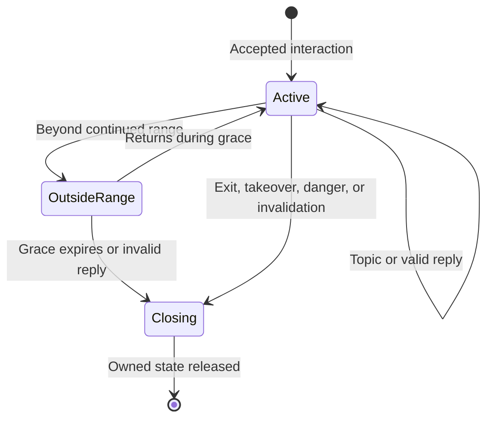

# MCA: Conversations — Conversation Stability and Social Behavior

## Implementation brief

Implement reliable, stationary villager discussions and relationship-aware dialogue throughout MCA: Conversations. A discussion must have an explicit beginning, an identifiable owner, and a complete ending. A villager meeting the player for the first time should sound like a stranger; familiarity, affection, reputation, and conflict must change what that villager says only when the game has evidence for those changes.

This is an implementation specification for a coding agent, grounded in a targeted source review. It is not a claim that the changes have been implemented or tested in Minecraft.

**Repository:** [otectus/MCAConversations](https://github.com/otectus/MCAConversations)  
**Reviewed branch and commit:** `main` at [`ef9259356a7bc3e4f4abe1c63cad15fd88015154`](https://github.com/otectus/MCAConversations/commit/ef9259356a7bc3e4f4abe1c63cad15fd88015154), version **1.7.0**, commit dated September 16, 2026 UTC.  
**Verified platform configuration:** Minecraft 1.20.1, Forge 47.4.10, Java 17, official mappings, choice-channel protocol 3. The development MCA dependency is `7.7.0-beta.2+1.20.1`; the configured binding probes also cover `7.6.20+1.20.1` and `7.7.1-alpha.2+1.20.1`. [S1]

Re-read the working branch and applicable repository instructions before coding. If HEAD has moved, reconcile the findings against that commit. Names explicitly marked **proposed** below are new design elements, not existing APIs. Do not invent MCA methods or assume upstream Yarn names are the Forge runtime descriptors.

## 1. Required player experience

### 1.1 Discussion behavior

1. An accepted discussion stops the villager's voluntary walking, following, wandering, work travel, and ordinary schedule travel. The villager faces the current participant naturally.
2. The hold lasts through reading, topic changes, response delays, the history drawer, and presentation settings. A player reading for several minutes must not lose the villager merely because no answer was clicked.
3. Ending the actual discussion releases the villager promptly and restores ordinary AI decision-making. Returning to the topic list is not ending the discussion.
4. An attack interrupts the discussion, clears every associated UI and pending reply, releases movement immediately, and allows the villager to flee. An expired hurt animation must never revive the old conversation hold.
5. Another player's **accepted direct interaction** can take over. The villager remains in place, turns toward the new player, and the first player's discussion ends cleanly. A stale close or heartbeat from the first player cannot release the new player's hold.
6. Increase the default continued GUI conversation distance from the current eight-block check to **16 blocks**. Keep initial interaction reach governed by a valid server-authorized interaction.
7. Distance, removal, death, disconnection, dimension changes, errors, and lost UI ownership all end through one lifecycle coordinator. The player can immediately interact with another available villager.

**Multiplayer decision:** use one active direct-discussion owner per villager. This satisfies the requested turn-to-the-other-player behavior without allowing two independently actionable menus to alter the same conversation. Passive bystanders and the existing group-dialogue system are not additional owners.

**Meaning of stationary:** suppress self-directed locomotion. Do not make villagers invulnerable, disable gravity, anchor them through damage knockback, or teleport them back to an old coordinate. An externally displaced villager can trigger the ordinary distance or danger closure. This preserves Minecraft physics while preventing the reported walking-away problem.

### 1.2 Social behavior

1. With zero hearts, no relevant history, and no known reputation, a villager uses neutral or politely reserved language.
2. An outgoing personality can be welcoming to a stranger without implying friendship, prior meetings, trust, romance, or heroism.
3. Repeated meaningful interactions establish recognition and familiarity. Affection and trust govern warmth and personal disclosure.
4. Public reputation influences respect and caution. It does not grant private memories or instant friendship.
5. A known benefactor can receive specific gratitude. Praise for a rescue, gift, quest, or public deed requires the appropriate evidence and audience knowledge.
6. Hostility, wariness, estrangement, reconciliation, and established friendship must affect both active discussions and unsolicited remarks.
7. All of this works without MCA: Reputation installed. That integration supplies additional facts, not the basic relationship system.
8. Technical closures never create social penalties. Walking out of range, closing a window, losing a connection, or suffering a failed action is not a snub.

## 2. Findings in the reviewed source

### 2.1 Conversation failure path

| Finding | Evidence | Implementation consequence |
| --- | --- | --- |
| GUI choice validation uses a fixed squared distance of `64.0D`, equivalent to eight blocks. Topic return uses the same constant. | `ChoiceSelectionService.GUI_DISTANCE_SQR`, `resolveVillager`, `returnToTopics`. [S2] | Centralize continued-distance policy; updating a single UI constant is insufficient. |
| `OUT_OF_RANGE` is a nonterminal `ChoiceOutcome`. Rejection sends an explained clear without closing the session. | `ChoiceOutcome`, `ChoiceSelectionService.reject`. [S2][S3] | A failure of the current engagement needs terminal lifecycle handling, distinct from rejecting an obsolete packet. |
| An explained clear removes the offer and leaves a GUI `Lapse`. Range failures offer only Close. | `ClientChoiceState.clear`, `offersReturnToTopics`. [S4] | A lapse is real client state that must be removed on every owning-screen exit. |
| The interaction screen's close hook calls `clearLocal()` only while a GUI offer is active. A lapse has no active offer. Its rendering gate accepts any GUI lapse without a villager identity check. | `InteractScreenChoiceMixin.mcaconversations$onClose` and `$active`. [S5] | The stale lapse can survive closing and take over a later interaction screen. This is a concrete source-level route consistent with the report. |
| The existing villager attention loop is gated by `enableChatMode`; its conversation hold is requested by chat dispatch and expires after a timer. | `VillagerAttention.tick`, `ChatModeDispatcher.attend`. [S6][S7] | GUI discussions need lifecycle-owned holds independent of chat mode and chat idle time. |
| Attention temporarily skips a hurt or panicking villager but retains its hold. | `VillagerAttention.tick`. [S6] | Danger must revoke the discussion permanently, so the hold cannot resume after the hurt/panic state changes. |
| Attention release is keyed only by villager UUID. Closing one player's session releases the villager entry outright. | `AttentionLedger.release`, `ConversationSessions.close`. [S8][S9] | Handoff requires conditional release by session ownership, not unconditional release by villager. |
| GUI offers recorded by the outgoing MCA packet hook initially use a null villager UUID. The current wire offer does not carry a villager/session identity. | `NetworkHandlerMixin`, `ChoiceOfferS2C`. [S10] | Bind GUI offers to the authoritative interaction and put identity on every lifecycle-bearing packet. |
| Pending GUI offers bypass session expiry and the idle sweep. | `ConversationSessions.get`, `peek`, `sweep`. [S9] | Reading must remain supported, but a lost screen needs a separate liveness lease. |
| The existing hurt handler applies an annoyed state for player-caused damage, behind `enableStates`. It is not discussion teardown. | `ConversationsEvents.onLivingHurt`. [S11] | Interruption must run regardless of optional emotional-state settings and regardless of attacker type. |

**Confidence boundary:** these are source findings. No graphical reproduction was performed during this review, and the player's exact mod versions are unknown. Preserve the specific stale-lapse regression as a test even if the reported installation also has another failure path.

### 2.2 Social selection gaps

| Finding | Evidence | Implementation consequence |
| --- | --- | --- |
| Proactive greeting selection distinguishes only negative hearts from all other values. Zero hearts uses the normal hail pool. | `ChatModeDispatcher.hail`. [S7] | Introduce neutral-stranger and recognized-neutral greeting selection. |
| The normal hail pool and personality overlays include familiarity and affection that are not earned at zero hearts. | Base `mca_dialogue` locale and authored personality specials. [S12] | Rewrite and classify the corpus, including source files that regenerate overlays. |
| `RelationshipBand` already has stranger, acquaintance, friend, confidant, partner, family, tense, and hostile. Ordinary thresholds are 0/25/60/80; hostile is at or below -50 hearts. | `RelationshipBand`. [S13] | Extend and consistently use this vocabulary instead of introducing a competing friendship economy. |
| `Relationships.bandOf` currently reads hearts and marriage and passes `false` for both family and unresolved conflict. | `Relationships`. [S14] | Integrate real family and conflict evidence. Its comment about missing family bindings is outdated relative to helpers elsewhere. |
| Family helpers already exist for parents, siblings, children, partner, and names; the context source uses them for family names. | `McaCompat`, `McaContextSource`. [S15] | Verify player UUID semantics and reuse these helpers before adding new reflection. |
| Per-pair history and a nondecaying familiarity axis already exist. History records first-met and last-talked days. | `PairHistory`, disposition classes. [S16][S17] | Add explicit meaningful-contact accounting and route existing familiarity gains through one policy. |
| The Reputation integration exposes standing and capability-gated opinion bias; its check bias affects trust/respect, not personal warmth or familiarity. | `ReputationBridge`, `ConversationsReputationCompat`. [S18] | Reuse the optional bridge; do not reinterpret a bounded check modifier as a complete relationship score. |
| Scene eligibility already performs a hard relationship filter, but direct hails and older/static lines do not all travel through that scene path. | `SceneEligibility` and chat dispatch. [S7][S19] | Cover every delivery surface, not just generated scenes. |

### 2.3 Upstream MCA behavior to account for

The inspected upstream 1.20.1 branch was at [`4d824551b30654e5792e19e84f3933e3e3d90ea2`](https://github.com/Luke100000/minecraft-comes-alive/commit/4d824551b30654e5792e19e84f3933e3d90ea2). Its source is useful integration evidence, but it is **not a substitute for probes against the three supported compiled MCA builds**.

- `EntityCommandHandler.interactAt` opens the screen and assigns an interacting player. `stopInteracting` clears that reference and asks the server player to close their handled screen. [U1]
- MCA's `InteractTask` follows the interacting player with a walk target. Its eligibility includes a five-block distance, no attack target, no current chore, and physical-state checks. It is not a permanent stationary hold. [U2]
- `InteractionCloseRequest.receive` in this source calls `stopInteracting()` without checking that the sender is the current interacting player. That matters when an old participant closes after a handoff. [U3]
- The inspected interaction screen sends that close request from its close method; its tick method does not implement the requested continued-distance lifecycle. [U4]
- Ordinary panic tasks include moving away from a hurt source. Guards have separate combat/panic behavior. Merely waiting for `hurtTime` to end does not meet the requested interruption contract. [U5]

Before implementing hooks, inspect the real jars for these methods, their descriptors, inherited owners, obfuscated vanilla calls, and packet order. Keep all MCA references behind the repository's reflective compatibility boundary.

## 3. Architecture and invariants

### 3.1 Build on the current systems

Retain `ConversationSession`, `ConversationSessions`, `ChoiceSelectionService`, `EngagementPolicy`, existing narrative history, and `ContentOperation`. Add one runtime coordinator around them rather than another competing session store.

Proposed components:

| Component | Responsibility |
| --- | --- |
| `ConversationLifecycle` | Begin, validate, hand off, and terminate runtime engagements; own cleanup ordering. |
| `ConversationHandle` | Immutable identity: server epoch, session UUID, player UUID, villager UUID, dimension, frontend. |
| `ConversationPresence` | GUI liveness and active-chat presence, range tracking, and per-villager ownership index. |
| `ConversationMovementController` | Apply stationary and facing behavior only for the current valid owner; stop immediately on danger. |
| `ConversationDistancePolicy` | Shared begin/continue/close rules used by ticks, packets, returns, and delayed deliveries. |
| `ClientConversationLifecycle` | Associate UI state with one handle and close/reset the correct frontend safely. |
| `SocialContextResolver` | Read authoritative pair facts once and derive familiarity, relationship, attitude, and disclosure permissions. |
| `SocialDialoguePolicy` | Filter semantically eligible line/scene variants and choose safe fallbacks. |
| `SocialContactPolicy` | Credit meaningful contact and familiarity once, with bounded persisted accounting. |

Names may be adapted to project conventions. Keep pure policy decisions independently testable; keep entity access and reflection in thin adapters.

### 3.2 Invariants that must always hold

1. A player has at most one direct conversation handle; a villager has at most one direct owner.
2. A live offer belongs to exactly one handle, villager, frontend, content generation, and revision.
3. Every close, heartbeat, answer, return, and queued response is checked against that identity.
4. Only an accepted interaction acquires a movement hold. Unsolicited greetings do not establish a full discussion.
5. Conversation ownership outranks ambient/typing attention. Renewing a lease does not change ownership.
6. Cleanup is idempotent. An old handle cannot affect a newer one, including a newer conversation between the same player and villager.
7. Terminal closure removes actionable state on the server before the client can submit another action.
8. A GUI reading lease and a social activity timestamp are different things. Heartbeats earn nothing.
9. No runtime handle, movement hold, camera state, or pending reply is persisted into entity NBT.
10. Known, absent, disabled, and failed social inputs remain distinguishable. Missing data never grants intimate disclosure or invented praise.

## 4. Reliable lifecycle and clean closure

### 4.1 Begin at an authoritative interaction boundary

Acquire the handle when the server confirms an actual interaction, before the first owned conversation offer is usable. Prefer a narrow hook at MCA's successful interaction boundary, with a tested adapter for Townstead. A generic right-click event alone is not sufficient: another mod may cancel it, a held item may consume it, or MCA may choose a different action.

At begin:

1. Validate the player, entity type, same dimension, normal interaction eligibility, and current threat state.
2. Resolve the live villager from the server's target. Never accept a client-provided UUID as proof of ownership.
3. If this player owns another engagement, terminate that specific handle as `TARGET_CHANGED`.
4. If another player owns this villager, execute the handoff in section 6.
5. Mint a new session UUID, register both indexes, and attach it to the existing `ConversationSession`.
6. Register the presence lease and movement hold, then acknowledge the handle to the client.
7. Associate root/main menus and subsequent Conversations offers with this handle. Populate the server-side GUI offer's villager UUID rather than leaving it null.

Because MCA packets can be emitted during the native call, verify actual ordering. Either establish the target context before emission with rollback on failed interaction, or defer managed offer publication until the native call succeeds. Do not race a GUI open against a missing server association.

**Recommended boundary:** hold through the open MCA/Townstead interaction, including the main menu and returns from Conversations, until that interaction actually ends. This avoids starting and stopping movement each time the player moves between menus. Preserve native trade, gift, inventory, and command semantics; a new native screen must either remain explicitly owned or receive a documented lifecycle handoff.

### 4.2 Topic completion is not conversation termination

Keep `ConversationSessions.endTopic` for finishing one topic, preserving cross-topic budgets and a legitimately queued closing line. A `conversations_session` directive with `op: end` currently reaches this method; do not mechanically replace it with full teardown.

Terminate the engagement on the actual screen exit, explicit full farewell, target switch, takeover, safety interruption, invalidation, or lost presence. A say-only response that reoffers a valid menu keeps the same handle and gets a fresh offer revision.

### 4.3 GUI presence without a reading timeout

Use a bounded client presence message for a live, acknowledged GUI handle:

- Suggested heartbeat interval: **20 server ticks** of client activity cadence.
- Suggested lease timeout: **100 server ticks** without a valid heartbeat.
- Suggested pending-open expiry: **200 ticks** if the expected UI never attaches.
- Validate the sender, exact handle, villager, dimension, frontend, and server-owned interaction before renewal.
- Only the matching live screen sends heartbeats. A dismissed screen, another screen, or a settings screen outside that owned UI cannot silently renew it.
- Subpanels rendered inside the interaction retain presence. If a separate child screen is necessary, transfer ownership explicitly through a bounded parent/child UI contract.
- Rate-limit redundant heartbeat packets. They cannot open or resurrect sessions, steal focus, extend social cooldowns, or repair expired handles.
- Use simulation/server time for leases. A single-player pause must not expire a lease while the server is paused.

The server checks active engagements each tick or on a short fixed cadence. Do not rely on a player eventually clicking an invalid answer to discover that the engagement is over.

### 4.4 Distinguish obsolete input from an invalid engagement

Do **not** fix the bug by marking every refusal terminal.

| Situation | Correct result |
| --- | --- |
| Duplicate answer or old revision from the current handle | Reject that request; preserve any valid successor offer. |
| Packet from an old handle | Ignore/reject it without changing the current engagement. |
| Malformed index or mismatching client candidate | Reject; do not let a fabricated target terminate a valid current session. |
| Current authoritative target is genuinely out of range, gone, dead, or replaced | Terminate that handle. |
| Requirements changed but the interaction remains viable | Retire the affected offer and offer a freshly validated topic return. |
| Content reloaded | Apply the repository's transaction boundary; safely return to current topics or terminate if recovery is impossible. |
| Answer execution partly ran and then failed | Terminate; invalidate successors from that attempt; never retry or replay its effects. |

Identify the matched session before deciding whether a rejection can close it. Client-supplied state must not manufacture a reason to close somebody else's session.

### 4.5 One idempotent teardown coordinator

Implement `terminate(handle, reason)` as the public full-ending operation. Refactor existing direct clear paths to use it where the actual engagement has ended. Keep internal storage removal separate to prevent recursive `ChatModeSession.clear`/`ConversationSessions.close` calls.

Required order:

1. Compare the full handle against the authoritative player and villager indexes. If it is obsolete, stop without touching a successor.
2. Mark the handle closing, detach it from active indexes, and make every offer and topic-return authorization unusable.
3. Revoke only this handle's presence, movement, facing, and attention ownership.
4. Cancel this handle's delayed dialogue, pending offer publication, and response callbacks. Include the identity in scheduled work; a player-wide queue clear must not erase a successor session's messages.
5. Clear this handle's chat stickiness and relevant DynamicHub state. Preserve durable history and committed outcomes.
6. End the matching MCA/native interaction through a capability-checked adapter, only if that interaction still belongs to this handle's participant. Never call an unconditional native close against a successor owner.
7. Send an explicit terminal packet for the closed handle, with a stable reason code and last relevant revision.
8. Client-side, retire the matching UI and all of its transient state, release camera/input capture, and return control to the game. Show one short translated action-bar message when an explanation helps.

Use independent guarded cleanup stages and `finally` where needed: failure to invoke an optional UI/native hook must not prevent local registry release. Log the failure once with the handle and failed stage.

**Do not require a close acknowledgment to release the villager.** A disconnected or malfunctioning client must not keep an NPC frozen.

Useful new close reasons include `CLIENT_CLOSED`, `TARGET_CHANGED`, `TAKEN_OVER`, `ATTACKED`, `ENTITY_UNLOADED`, and `DANGER`. Keep operational reasons separate from social incidents. Preserve stable wire identifiers rather than relying on enum ordinal order.

### 4.6 Remove the stale-lapse bug across every UI path

The immediate correction is to clear a GUI lapse on screen exit even when no offer remains. The complete implementation must also isolate UI state by handle.

- `ClientChoiceState` must associate both offers and lapses with the owning handle and villager.
- The interaction screen may render or consume input only for its own handle. Matching question text or a global GUI frontend is not enough.
- On normal close **and** screen removal/replacement, reset the owning offer, lapse, lock, focus, page, topic-return request, reading state, outgoing animation, and speaker reference.
- A delayed close for villager A cannot close villager B's screen. The same rule applies when A has already been reopened under a new handle.
- Preserve the connection-level revision watermark. Do not reset it to -1 whenever a screen closes; the current code already uses globally increasing offer revisions.
- A terminal server packet should close the matching host screen automatically. Do not leave a mandatory “Close” shell as the only recovery step.
- A recoverable refusal can keep the current explanatory shell with Back to topics. Escape remains reliable.
- Run the cleanup path for Responsive, Minimal, MCA Original, and Townstead. Presentation settings cannot disable lifecycle correctness.
- Closing a GUI must not accidentally erase a newer independent chat offer or a new screen that has already acquired ownership.

The existing delivered history can remain available according to its established connection-scoped behavior. Do not confuse historical transcript entries with actionable state.

### 4.7 Lifecycle model



All delayed callbacks must check the same lifecycle identity before delivery. Session absence is a cancellation signal, not a reason to silently create another session.

## 5. Holding still, facing, attacks, and distance

### 5.1 Refactor attention ownership

The current single-entry `AttentionLedger` cannot safely represent a direct owner plus unrelated ambient glances. Separate **movement ownership** from **look attention**:

| Source | Can stop movement? | Can replace a direct owner? | Lifetime |
| --- | --- | --- | --- |
| Direct GUI discussion | Yes | Only through accepted handoff | Valid UI presence lease |
| Explicit, reciprocated chat discussion | Yes | Explicit targeting rules only | Existing chat inactivity/farewell policy |
| Passive greeting or nearby typing | No by default | No | Short cosmetic glance |
| Bystander/group contribution | No by default | No | One utterance or bounded glance |
| Attack/danger | Revokes the hold | Ends the discussion | Until danger clears; no automatic reopening |

Give holds a session token and use `releaseIfOwned(villager, handle)` rather than unconditional `release(villager)`. Removing player A's state after B takes over must leave B's hold intact.

Move the direct-discussion tick outside the `enableChatMode` check. Turning off chat should end chat engagements and typing attention, while GUI conversations continue to work.

### 5.2 Suppress locomotion at the right point

The existing end-of-server-tick `navigation.stop()` is useful but does not by itself prove that movement was prevented earlier in the tick. MCA also writes follow-player walk targets from its Brain task.

Implementation steps:

1. Stop current navigation immediately when the discussion is accepted.
2. While the handle is valid, suppress the native interaction follow task's walking component. Keep its ordinary behavior when no managed discussion owns the villager.
3. Prevent routine Brain movement tasks and movement controls from advancing the villager during the held phase. Use a narrow, probed per-entity hook or behavior adapter before movement is applied; do not globally cancel all Brain ticks.
4. Remove/reject ordinary `WALK_TARGET` proposals while held and stop navigation. Verify chores and follow/stay commands cannot reintroduce walking before the movement boundary.
5. Set a look target for the current participant's eye position. Apply bounded head and body turning so the villager faces them without snapping or spinning; update only while this handle still owns attention.
6. Let perception, health, damage, threat sensing, and normal world physics continue.
7. On release, stop writing movement/look targets and let current AI recompute its schedule and route. Remove only look state still owned by the discussion. Do not restore a stale `WALK_TARGET`, position, or old threat target.

Do not use `setNoAi(true)`, persistent speed-zero attributes, repeated position teleportation, or a server tick that zeroes every velocity component. Those approaches interfere with escaping, knockback, gravity, and cleanup across reloads. A vanilla Goal MOVE flag alone is also insufficient for a Brain-driven MCA villager; prove the actual supported MCA task order.

Native follow/stay/chore assignments remain recorded while paused. A command the player explicitly changes during the interaction supersedes the old assignment; cleanup must not restore an obsolete command.

### 5.3 Attack interruption and fleeing

Observe server-side attacks from players, mobs, projectiles, and indirect sources. Handle successful damage and credible blocked attacks without reacting to an interaction canceled before an attack actually occurs.

- On confirmed damage, revoke the managed handle before the movement controller can run again. The current `enableStates` gate must not control this.
- For attacks absorbed by armor/shields or zero-damage mechanics, use the supported loader's attack event or a verified entity hook with cancellation semantics checked. Deduplicate attack and hurt notifications for the same incident.
- Set a short danger lockout so a heartbeat, pending open, or repeated right-click cannot immediately pin the fleeing villager. Suggested minimum: **100 ticks after the most recent confirmed attack**, plus any continuing native threat state.
- Close the UI with a neutral explanation such as “The conversation was interrupted.” Do not blame the talking player unless the incident actually attributes the attack to them.
- Give an ordinary civilian's panic/escape behavior priority. Verify the running MCA build enters a functioning flee behavior; if necessary provide a narrow temporary escape adapter using the actual threat and pathfinding.
- If no attacker entity exists, release movement and let environment-aware survival behavior choose a safe route. Never invent a direction toward a null attacker or teleport to safety.
- No route can be guaranteed in a sealed room. Passing behavior is an unpinned villager attempting native escape, not walking through walls.
- Guards and combat professions: the strict requested behavior should default to a brief initial retreat when a managed discussion is attacked, then return to their normal combat AI. Add an explicit configurable `NATIVE_COMBAT` alternative if preserving immediate guard retaliation is preferred. Do not silently exempt these villagers from interruption or change their permanent profession.
- Reuse native MCA/Reputation/Crime incident handling for consequences. Avoid charging duplicate heart or reputation penalties just because Conversations also saw the attack.

Recommended safety extension: terminate on fire, drowning, an existing panic/raid evacuation, or another immediate survival threat, even before new damage arrives. This extends the attack exception to prevent dialogue from trapping a villager in danger. Ordinary time-of-day changes and routine chores do not break an already accepted discussion.

### 5.4 Shared continued-distance policy

Recommended GUI defaults:

| Setting | Default | Rule |
| --- | --- | --- |
| Initial interaction range | Native/server-validated reach | No new remote-open ability. |
| Continued conversation distance | 16 blocks | Three-dimensional squared distance; equality is allowed. |
| Outside-distance grace | 20 ticks | Passive UI closes after continuously exceeding 16 blocks for one second. |
| Immediate close distance | 24 blocks | Close immediately beyond this distance or after a dimension change. |

During passive grace, the UI may remain readable. **A submitted choice or topic-return request outside 16 blocks must execute no action and close the matched handle immediately.** Grace delays visual interruption; it does not authorize remote effects. Returning within 16 blocks before passive grace expires clears the outside timer.

Use the same policy in numbered submissions, native mouse submissions for owned questions, topic return, presence validation, lifecycle ticks, and queued GUI delivery. Keep the chat frontend's existing ambient/addressed radii explicit and separate; do not accidentally shrink its current 12/24-block behavior.

Respect native reach/security requirements for gifts, trades, inventory actions, and unrelated commands. A longer discussion distance does not authorize every MCA interaction at that range. Verify any native/client auto-close threshold cannot undercut the intended managed discussion radius on each supported frontend.

Never force-load chunks to retain a conversation. A missing or unloaded entity closes the engagement; it is not retained indefinitely in the existing strong entity cache.

## 6. Multiplayer handoff

Perform ownership changes on the server thread as a serialized operation.

1. Validate player B's direct interaction, including ordinary reach and cancellation rules.
2. Record the accepted takeover, detach player A's handle, and invalidate A's offers and scheduled work.
3. Transfer the movement hold to B without a tick in which ordinary navigation resumes. Preserve the villager's current location; change the look target smoothly.
4. Assign the native MCA interaction and the new handle to B in the verified order. Retire A's native interaction before B's assignment where necessary; do not invoke unconditional `stopInteracting()` after B has become the native owner.
5. Close A's matching screen with “This villager is now speaking with someone else.”
6. Open/attach B's UI and fresh offer under B's new handle. B receives no private thread, choices, or history belonging to A.

**Essential native-close guard:** inspect and adapt MCA's tokenless close request. While a managed interaction exists, only the managed close carrying the current handle may terminate it. Suppress the redundant legacy close generated by the managed screen where feasible; defensively reject legacy requests that would close a managed successor. UUID ownership alone is insufficient when the same player closes and immediately reopens the same villager. Keep untouched native behavior outside managed interactions.

A rejected right-click, canceled item action, nearby typing, proximity greeting, or old heartbeat does not count as takeover. An accepted native gift/trade interaction does: bind its retained screen if it has one. For a one-shot action without a retained UI, use a short, capped attention interval covering the accepted action, then release. Do not silently restore A's old actionable menu.

For two accepted opens in one tick, server processing order determines the final owner. Rate-limit repeated open/takeover attempts per player and villager to prevent rapid focus flicker; a normal deliberate second-player interaction must still work. Log accepted ownership transitions, not every rejected spam packet.

## 7. Network contract

Current protocol 3 has revisioned offers but no complete conversation identity. The proposed lifecycle changes require a protocol bump in `gradle.properties`, not hard-coded version strings scattered through classes. Use the next available protocol value when implementing. [S1][S10]

Proposed messages:

| Message | Required contents | Purpose |
| --- | --- | --- |
| `ConversationOpenedS2C` | Handle identity, frontend, effective range/lease values needed by UI | Attaches the client to a server-approved interaction. |
| Updated `ChoiceOfferS2C` | Handle, villager, revision, content generation as appropriate, bounded question/answers | Prevents cross-villager and cross-session offers. |
| Updated choice select/return C2S | Handle, offer revision, index or return operation | Validates ownership before resolving or executing content. |
| `ConversationPresenceC2S` | Current handle only, bounded flags if needed | Renews existing GUI liveness. |
| `ConversationCloseC2S` | Handle and permitted client exit reason | Explicit player/UI closure; server validates its own target. |
| `ConversationClosedS2C` | Handle, stable terminal reason, last relevant revision | Closes only the matching UI. |
| Existing offer-clear packet, updated identity | Handle, revision, nonterminal/consumed reason | Retires one offer without conflating that with ending the engagement. |

The handle can use an opaque session UUID plus server-stored associated fields; duplicating every field in every packet is unnecessary if the association is unambiguous. Never trust a player UUID supplied by a client; derive the sender from the network context.

Enqueue world mutations on the server thread. Keep bounds on strings, answer counts, enums/reason IDs, and payload size. An unknown reason must clear safely without crashing; an invalid session must not create state. Preserve physical-client isolation through `ChoicePacketSink` or an equivalent client-installed interface. Common classes must not import client classes.

Packet ordering tests must include: close before delayed offer, old clear after new offer, old heartbeat after takeover, duplicate answer, old close after same-pair reopen, and native legacy close after transfer. Maintain a bounded record of locally closed handles so a delayed open/offer cannot resurrect an already dismissed UI during the same connection.

## 8. A coherent social model

### 8.1 Separate the facts that dialogue currently conflates

Do not reduce all social behavior to one weighted score. A well-known enemy, an admired stranger, and an ordinary friend need different language.

| Input | Authoritative source | What it can justify | What it cannot justify alone |
| --- | --- | --- | --- |
| Personal affection | MCA hearts for this villager/player pair | Liking, dislike, existing affection progression | Knowledge of a particular deed or conversation |
| Familiarity | Existing `FAMILIARITY` axis plus verified contact history | Recognition, comfort, shared time | Friendship, forgiveness, romance |
| Trust, warmth, respect, tension | Existing disposition vector, adjusted for personality baseline | Nuance in tone and disclosure | Fabricated facts or a second heart economy |
| Personal incidents | Pair history, scars/ruptures, attributable witnessed events | Caution, hurt, specific gratitude, repair | Knowledge of private events elsewhere |
| Public standing | Optional `ReputationBridge`, scoped to the relevant community | Politeness, public respect, guarded treatment | Personal intimacy or automatic friendship |
| Villager-specific opinion | Probed optional Reputation capability | That villager's own reaction to known events | A raw relationship score inferred from a check bias |
| Marriage/family | MCA relationship graph and supported player mappings | Accurate relational address and established role | Immunity to conflict or permission to erase a rupture |
| Personality | Existing personality/voice/identity systems | Diction, sociability, directness, greeting likelihood | Prior acquaintance, attraction, hero status |
| Mood/current activity | MCA and existing state/context providers | Briefness, distraction, emotional coloring | Permanent hostility toward an innocent stranger |

Keep MCA hearts as the visible relationship economy. Keep existing narrative milestones and privacy rules. Add only the missing derived policy and contact accounting.

### 8.2 Proposed immutable social snapshot

Resolve once per decision/utterance, on the server, into a structure such as:

```java
// Proposed shape; use the repository's ContextValue/ContextStatus conventions.
record SocialContext(
    UUID villagerId,
    UUID playerId,
    KnownInt hearts,
    KnownInt familiarity,
    ContactEvidence contact,
    RelationshipRoles roles,
    PersonalDisposition disposition,
    KnownStanding publicStanding,
    KnownOpinion personalOpinion,
    ConflictEvidence conflict,
    RelationshipBand relationshipBand,
    SocialAttitude attitude,
    DisclosurePermissions disclosure
) {}
```

The placeholder types above are not existing classes. Prefer extending `ConversationContextSnapshot`, `ContextKeys`, and source adapters where that avoids duplicated data. Keep one owner for each context field. `McaContextSource` currently declares relationship fields; either make it delegate to the shared resolver or transfer those declarations explicitly to a new social provider. Do not register two providers that both write the same key.

Important details:

- Read both sides of a relationship by UUID, never display name.
- Preserve optional input status. The current score-zero/empty-string convenience defaults are insufficient to distinguish neutral reputation from a failed provider; add a typed availability wrapper where needed.
- Recompute volatile safety/conflict/disclosure eligibility at each answer and before delayed delivery. Keep the scene's named referents pinned as the existing content system requires.
- A new attack, broken obligation, or changed relationship can invalidate a warm/private pending line. Drop it or use an appropriate safe replacement; never deliver stale affection after the event that invalidated it.
- Do not reroll a scene merely because the screen was reopened. Preserve the director's existing continuity guarantees.
- Reads and debug previews must not create contact records, grant familiarity, or mark the pair as introduced.

### 8.3 Relationship roles are independent of current attitude

Correct `Relationships.bandOf` to use real family/conflict evidence. Do not leave `family` and `unresolved` hard-coded false.

Use the existing family-tree helpers only after confirming how player UUIDs map to MCA family nodes across every supported build. Query direct parent/child/sibling relationships and the actual spouse/partner relation; do not infer family from matching names, proximity, or shared village. Keep a capability status if a role cannot be read.

Store/derive role flags separately from the selected dialogue band. A spouse with a serious unresolved incident may have `role.spouse=true` and `relationshipBand=TENSE`; `PLAYER_IS_FAMILY` must not become false solely because the primary band is tense. Likewise, a married villager is not necessarily married to this player.

High hearts alone must never produce PARTNER. Preserve existing adult/romance eligibility checks and confirmed relationship requirements for intimate content. Family language must be appropriate to the actual role rather than using a generic romantic fallback.

### 8.4 Default progression for new relationships

The following are proposed starting balance values. Make the thresholds tunable and validate them as a coherent set. The design intent is gradual recognition and warmth, not a compulsory daily chore.

| State/band | Default evidence | Resulting language and access |
| --- | --- | --- |
| Unmet stranger | No verified contact or legacy relationship evidence | Polite neutral introduction, public facts, ordinary practical topics; no assumed name familiarity. |
| Recognized stranger | At least one meaningful accepted exchange | Acknowledge having met; still neutral. No “old friend,” missed-you, or intimate language. |
| Acquaintance | Familiarity ≥8 and meaningful contact on ≥2 distinct days | Recognizable regular; mild personal detail when comfortable. This can remain emotionally neutral at zero hearts. |
| Friend | Hearts ≥60, familiarity ≥20, ≥4 meaningful-contact days, no active rupture, trust not below its personality baseline | Warm greetings, opinions, relevant callbacks and mutual interest. |
| Confidant | Hearts ≥80, familiarity ≥40, ≥8 meaningful-contact days, trust at least 10 above baseline, no active rupture | Deeper disclosure and carefully gated vulnerabilities. Specific shared memories still require evidence. |
| Partner/family | Confirmed native role | Appropriate established role language; conflict can still restrict warmth and disclosure. |
| Tense | Negative hearts above the hostile boundary, or a relevant unresolved personal rupture | Reserved, guarded, short responses; meaningful repair routes. |
| Hostile | Hearts ≤-50 or separately verified severe personal hostility | Cold refusal of intimacy, firm boundaries, limited practical conversation. No new combat behavior merely from dialogue selection. |

“Recognized stranger” is a presentation distinction within the existing STRANGER band, not another saved friendship currency. A known enemy remains known: hostility changes attitude, not whether the villager remembers meeting the player.

Keep legacy heart thresholds documented. Implement the new band derivation centrally; audit authored numeric heart checks so they cannot unlock intimate lines that bypass the new familiarity/conflict policy. Preserve public/practical subjects so a stranger can still enjoy the mod without first grinding hearts.

If the owner wants faster/slower progression, change configuration/data thresholds rather than scattering new numeric conditions through topic JSON.

### 8.5 Meaningful-contact accounting

Extend `PairHistory` with a small proposed `SocialContactRecord`:

- `introduced` or an equivalent explicit introduction/recognition fact;
- count of distinct meaningful-contact days;
- last credited game-day index;
- bounded count/IDs of credited topics for that day;
- last credited event/session identifier sufficient for duplicate suppression;
- a migration provenance flag where legacy evidence was imported.

Retain existing first-met and last-talked values. Do not invent historical dates while migrating. Use the existing disposition `FAMILIARITY` as the numeric familiarity value; do not add an independently mutable copy to history.

Credit a meaningful contact after an authoritative, successful conversational exchange or a verified direct social event. Examples include a selected response that actually executes and produces a valid reply, a completed relevant dialogue beat, or a confirmed accepted gift interaction. Menu opening, scrolling, selecting a category, passive proximity, typing, heartbeat renewal, an unsolicited hail, rejected packets, and failed actions do not earn familiarity.

Suggested gain policy:

1. First meaningful exchange of a day: +4 familiarity.
2. A later meaningful exchange on a different subject: up to +2 additional familiarity.
3. Total maximum: +6 familiarity per pair per game day, under the existing global gain settings.
4. No extra credit from closing/reopening, switching GUI/chat, relogging, or replaying the same outcome.
5. Negative interactions may establish recognition without granting positive familiarity rewards or hearts. Keep the record of having met distinct from liking the player.

Use monotonic server game time for day buckets; `/time set` must not create extra credit opportunities. Handle loaded timestamps in the future conservatively without subtracting familiarity or awarding catch-up days. Offline time and standing AFK nearby earn nothing.

**Avoid double rewards:** authored content already applies familiarity deltas. Audit all `src/content` and legacy directives, route familiarity changes through the one contact policy, and remove duplicated base gains. Explicit authored bonuses still share the same daily budget and idempotency rules. Do not add a new listener that pays again after the existing action paid.

An exchange counts from successful server behavior, not a client claim to have read it. Do not require a client “I saw the line” message to award progression; such a packet is neither reliable evidence nor a security boundary.

### 8.6 Attitude selection and precedence

Use a clear precedence ladder rather than an opaque blended number:

1. **Immediate danger:** interrupt ordinary conversation and release movement.
2. **Specific unresolved direct harm/rupture:** guarded or hostile appropriate to severity. This outranks public praise and old affection for the relevant moment.
3. **Confirmed personal hostility:** cold boundaries, regardless of fame.
4. **Confirmed family/partner role:** appropriate address, subject to the current conflict restrictions.
5. **Earned friendship/confidant state:** warm or affectionate platonic speech as appropriate; deeper disclosure remains gated.
6. **Known positive public standing:** respectful/courteous language for an unfamiliar player. Do not call them a friend.
7. **Known negative public standing:** cautious/formal language, with claims limited to what this villager can know.
8. **Ordinary acquaintance:** neutral or cordial familiarity depending on affection and disposition.
9. **Unmet player or unavailable context:** neutral stranger-safe fallback.

A modest personality baseline can change courtesy and enthusiasm within a row. Compare earned trust/warmth against the baseline where appropriate: a naturally friendly villager is not born personally attached to every player.

Recommended derived attitudes: `HOSTILE`, `GUARDED`, `NEUTRAL`, `CORDIAL`, `WARM`, and `AFFECTIONATE`. These are rendering/eligibility outcomes, not another persisted reputation score. Formal deference, fear, and gratitude can be specific contextual modifiers; none implies liking or romance.

Use modest hysteresis at friendship warmth thresholds if playtesting reveals constant oscillation. Severe incidents and the hostile boundary take effect immediately. Persist hysteresis state only if necessary, and document exactly how it resets; never postpone a safety or privacy restriction.

### 8.7 Reputation and knowledge

Extend the existing `ReputationBridge` rather than creating hard references in common code. Keep optional implementation classes behind the mod/API capability gate.

- Resolve standing for the villager's relevant community, not an arbitrary nearest village around the player.
- Obtain tier/category semantics through the actual API or a documented adapter. Do not assume numerical thresholds or tier names absent from the supported version.
- The existing opinion-bias capability is useful for supported check modifiers. Do not multiply a ±8 modifier into a fictional personal relationship value.
- If full per-villager knowledge/opinion is needed, inspect the installed Reputation API, add a narrow versioned capability, and probe it. If unavailable, retain neutral personal knowledge rather than pretending all villagers witnessed every public incident.
- Positive standing without a known event can justify courtesy. “You saved us” requires an event this villager knows about and an accurate actor/beneficiary association.
- A generic hero-related effect, title-like text, player claim, or presence during a raid is not sufficient evidence for a specific rescue claim.
- Negative public reputation may cause suspicion; it does not mean this villager was personally assaulted. Allegations and confirmed incidents should use different wording.
- A fulfilled gift or quest creates gratitude scoped to the relevant recipient/event. One gift cannot promote every villager in the community to close friend.
- A private apology may repair a personal rupture without erasing public reputation. A public apology remains subject to the existing Reputation signal/idempotency policy.
- When Reputation is absent, disabled, or unavailable, use MCA hearts, dispositions, and local history. Do not disable neutral progression or conversations.

Keep technical interruption and social consequences separate. If a zombie attacks while the player talks, ending the session must not lower that player's reputation. If the player caused the incident, let the established incident systems account for it once.

### 8.8 Conflict, repair, and absence

Support a complete progression rather than only warm/cold greetings:

- A minor unpleasant exchange can create temporary tension without erasing recognition.
- A meaningful betrayal or unfulfilled verifiable obligation can keep a rupture unresolved beyond ordinary mood decay.
- Provide context-specific acknowledgment, apology, clarification, restitution, or boundary-setting where the existing thread/commitment system can represent and verify it.
- Repeated apology clicks must not farm trust or clear an unrelated incident.
- Gifts do not automatically delete a severe rupture. An explicit repair outcome must name the relevant incident or thread.
- After successful repair, allow a gradual guarded-to-cordial-to-warm return instead of one-click maximum affection.
- Long absence can change greeting wording and willingness to continue an old thread. It must not turn an established family member into a stranger or cause offline punishment.
- Recent-return lines require evidence of an earlier meeting; missed-you lines require suitable affection; “last time you said…” requires the stored actual exchange.
- Preserve reasonable refusal and topic exits. Hostile villagers can still provide public information or necessary quest interactions where existing rules allow; do not blanket-disable the mod at negative hearts.

## 9. Dialogue and content implementation

### 9.1 Select social meaning before selecting voice

Required selection order:

1. Resolve authoritative social context and knowledge.
2. Filter candidates by hard eligibility: relationship, familiarity, age/role, conflict, privacy, and event evidence.
3. Select the eligible intent/scene/line family using existing continuity and repeat-avoidance rules.
4. Apply personality/profession diction within that semantic family.
5. Pin a valid localized pool variant through `LineVoice`/`VariantPools` or the established equivalent.
6. Revalidate volatile eligibility before delayed delivery, then deliver to the correctly classified audience.

A friendly overlay must not substitute an intimate line for an eligible neutral line. A high weighted chance is not a hard gate: an ineligible private/hero/friend line must be absent from the candidate set, not merely assigned a low chance.

The existing `SceneEligibility` relationship check is useful. Extend it for the new social facts, and route direct/static surfaces through the same policy. Validate both the prompt and offered answer branches so a hidden topic cannot still be reached through a fabricated or legacy submission.

### 9.2 Proposed semantic pools and fallback order

Use separate families, for example:

```text
chatmode.hail.stranger
chatmode.hail.recognized_neutral
chatmode.hail.acquaintance
chatmode.hail.friend
chatmode.hail.confidant
chatmode.hail.guarded
chatmode.hail.hostile
chatmode.hail.respected_stranger
chatmode.hail.partner
chatmode.hail.family
```

These are proposed keys, not keys available in 1.7.0. Add equivalent semantic families where category openers, check-ins, farewells, and acknowledgments need them.

Fallback order must preserve permissions:

1. Exact eligible social family with a personality variant.
2. Same social family in the generic voice.
3. A less-specific, equally safe generic line for the current intent.
4. Neutral factual fallback; for optional ambient chatter, silence is acceptable.

Never fall back from stranger/unknown to the old familiar hail pool. Make legacy generic hail keys stranger-safe so an older call site or resource-pack fallback cannot reintroduce the original bug.

Keep formatting arguments and MCA marker handling compatible. Neutral stranger lines should not need the player's name. If later lines use a name, require an introduction, established personal recognition, a confirmed family role, or an explicit known-public-identity rule. MCA providing the username to a formatter does not mean the villager knows it.

### 9.3 Proposed authoring metadata

Add an explicit, validated social contract to authored line families/scenes. This illustrative fragment defines the intent; adapt it to the actual content compiler schema:

```json
{
  "id": "chatmode.hail.stranger",
  "social": {
    "contact": ["unmet"],
    "attitudes": ["neutral", "cordial"],
    "disclosure": "public",
    "claims": [],
    "requires_known_player_name": false
  },
  "fallback": "chatmode.hail.neutral",
  "variants": {
    "en_us": ["Hello. Can I help you?", "Good day. Passing through?"],
    "pt_br": ["Olá. Posso ajudar?", "Bom dia. Está de passagem?"]
  }
}
```

Possible claims include `prior_meeting`, `personal_friendship`, `shared_episode`, `received_gift`, `known_public_deed`, and `romantic_relationship`. Each claim maps to a server-side predicate and any required event reference. Do not evaluate the claim by searching translated prose at runtime.

Unknown/invalid required claim types must fail validation or make the line ineligible with a safe fallback. Do not ignore a misspelled privacy or social requirement. Validate fallback existence and cycles, and include the social metadata in the existing atomic content publication/generation boundary.

Third-party datapacks without metadata retain their existing structural compatibility, but cannot be assumed semantically audited. Apply global disclosure/role gates where the system owns the action, keep generic neutral fallback paths, and provide diagnostics/migration guidance. Do not claim that arbitrary externally authored prose can be proven safe without annotation or review.

### 9.4 Complete surface coverage

Create a checked coverage manifest. For each surface, identify the producer, policy entry, fallback, and verification fixture.

| Surface | Required work |
| --- | --- |
| First interaction/root/main greeting | Inspect actual MCA/Townstead entry wording. Route known greeting hooks/owned overrides through the social policy without replacing unrelated native actions. |
| Conversations hub and category openers | Audit all six hand-authored category starters and hub labels/prompts. |
| Generated topic/profession scenes | Add eligibility/claim metadata to source, compiler output, and hard filters. |
| Older branching/static questions | Replace unsafe generic lines and numeric-only relationship gates; preserve reachable neutral branches. |
| Typed explicit greetings and farewells | Replace the current negative-versus-nonnegative hail split. |
| Walk-by hails | Use the same context, with relationship-sensitive frequency and correct encounter evidence. |
| Initiative planner | Require evidence for promises, changes, ruptures, and public-standing remarks. |
| Gift/quest thanks and remembered favors | Bind to actual accepted/completed events and appropriate recipient knowledge. |
| Gossip and overheard/group replies | Respect audience, knowledge, privacy, and speaker-specific social context. |
| Refusals, failures, repeat lines, small acknowledgments | Keep default refusals neutral, distinguish ignorance from distrust, and avoid unexplained affectionate fallbacks. |
| Personality overlays and special personalities | Keep each variant inside the selected social meaning; review both generic voice families and specials. |
| Native MCA ambient lines and other add-ons | Attribute the actual emitting mod; implement narrow supported MCA greeting adapters where required. Document externally owned surfaces that cannot be changed safely. |

Townstead and Social Expansion should be included in compatibility testing where available. Do not guess their internals or blanket-cancel their messages. Add developer-only line provenance so a reported overly familiar sentence can be traced to a key, source mod, surface, and selected policy.

### 9.5 Edit the correct authoring files

The repository has an established generation pipeline. [S20]

- Edit `src/content/topics`, `src/content/professions`, `src/content/voices`, and `src/content/voices/specials` for content owned by the compilers.
- Regenerate and commit the corresponding runtime dialogues, catalogs, contracts, narrative templates, and voice overlays.
- The six `conversations.cat.*.json` starter files and `conversations.json` are hand-authored and outside that compiler ownership. Update those directly where necessary.
- Inspect the ownership of base `assets/mca_dialogue/lang` keys before changing them. Do not assume every language file is generated or every base key is hand-authored.
- Update **both `en_us` and `pt_br`**, all maintained personality variants, and relevant datapack samples.
- Preserve translation placeholders and pool counts. Test the server-pinned variant against the delivered locale and personality overlay.
- Expand the compiler/linter to report missing neutral variants, invalid claims, mismatched arguments, absent fallbacks, and social variants that leak into the wrong family.

Do not bulk-replace every occurrence of “friend” or “hero.” Those words can be valid when discussing a third party or a real event. Use metadata, route coverage, and human review of the rendered context.

### 9.6 Writing examples and tone boundaries

The following are new illustrative lines, not quotations from current content:

| Context | Suitable line | Boundary |
| --- | --- | --- |
| Unmet, neutral | “Hello. Looking for something in the village?” | Helpful without familiarity. |
| Unmet, outgoing personality | “Hello there! Are you visiting?” | Enthusiastic without prior attachment. |
| Recognized, zero affection | “Hello again. How can I help?” | Requires a real prior meeting. |
| Familiar but neutral | “Good morning. What brings you by today?” | Comfortable, not sentimental. |
| Earned friend | “I'm glad you stopped by. How have things been?” | Requires suitable relationship state. |
| Respected stranger with known public contribution | “I've heard about what you did for the village. Thank you.” | Requires known contribution; does not imply friendship. |
| Low trust after a specific rupture | “We still need to talk about what happened.” | Must bind to a real unresolved incident. |
| Established friend during repair | “I'm willing to try again. Give it some time.” | Repair is not instant restoration. |
| Hostile | “We can discuss what you need. Keep it brief.” | Firm, usable, no arbitrary new attack behavior. |
| Ordinary technical close | “The conversation ended because you moved too far away.” | Informational, no blame or affection loss. |

Retain distinct personalities and natural variety. Neutral must not mean every villager repeats the same sentence. A shy stranger, direct stranger, and cheerful stranger should feel different without claiming different unearned relationships.

For high-frequency greetings, goodbyes, check-ins, and neutral topic openers, target at least three genuinely distinct lines per routinely used social family in each maintained locale. For less common contextual branches, require at least one accurate fallback. Count coverage after generation, and ensure repetition tracking keys include the selected semantic family.

## 10. Ambient behavior and related refinements

These recommended behaviors support the two requested changes without requiring a new simulation subsystem.

### 10.1 Earned greeting frequency

Preserve `GreetOnApproach` edge detection, deterministic per-pair/day selection, and existing initiative/mute rules. Add a familiarity/attitude multiplier to the existing base greeting chance:

| Pair state | Suggested multiplier |
| --- | --- |
| Unmet stranger | 0.35 |
| Recognized/acquaintance | 0.70 |
| Friend or closer | 1.00 |
| Guarded | 0.25 |
| Hostile | 0.10, using a suitable boundary line or silence |

Multiply by the existing personality factor, clamp to [0, 1], and retain the stable daily roll. These are tuning defaults, not social rewards. A stranger can still greet occasionally; known friends are more likely to acknowledge the player.

Add a short **per-player ambient cooldown across villagers**, for example 200 ticks, so crossing a crowded square does not generate one greeting on every scan. Preserve the existing per-pair/day budget. Use one real game-day accounting policy rather than a half-day memory expiry alone; verify that re-entering late in the same day cannot generate another supposedly once-daily hail.

Spend greeting/initiative budget only when a line is actually accepted for valid delivery. A canceled delayed line should not create false social contact or consume a full conversation reward.

### 10.2 Passing greetings are not full discussions

An unsolicited hail may create a short reply-target hint, but it should not immediately freeze a villager for the current 600-tick conversation-attention interval. If the player responds or deliberately opens a discussion, promote that interaction to a real managed engagement.

Likewise, opening the chat box near a market should not stop every nearby villager. Typing awareness can be a short glance with a per-player candidate cap; it must never displace an active participant or override panic.

### 10.3 Interruptions and commitments

- Suppress unrelated ambient remarks from a villager while another player owns its discussion.
- Respect “stop talking” before considering a greeting, a reminder, or a reputation comment.
- Keep promises and task reminders tied to real outstanding obligations and their existing budgets.
- A safety/technical close may preserve a resumable narrative thread. It must not automatically complete a commitment, mark abandonment, or replay the previous reward when resumed.
- Future resumption should acknowledge the interruption only if it was recorded as an appropriate shared event; never pretend the player chose to leave rudely.
- Do not hold villagers indefinitely after a chat farewell or an inactivity timeout merely because a durable narrative thread remains open.

### 10.4 Clear but restrained UI

Keep messages short and operational. Do not add large permanent social-score panels or expose internal relationship arithmetic in normal play. Existing hearts remain the relationship display. An optional compact qualitative description, such as “acquainted” or “guarded,” can be offered in the existing information UI if it accurately explains behavior.

Screen closures should release cursor/camera state before showing feedback. Avoid a modal explanation that prevents the player from reacting to an attack. Keep narration and animation settings respected; movement/facing correctness is independent of UI animation preferences.

## 11. Persistence, migration, and configuration

### 11.1 Persistence rules

Persist only social facts and existing narrative data. Keep handles, holds, leases, queue cancellations, and UI ownership transient.

Extend the history schema with a deliberate versioned migration for social contact metadata. Preserve the existing policy that a future history schema is retained/read-only instead of destructively rewritten. The current history store is schema 1; do not bump its version without a concrete version-1 reader. [S21]

Keep existing disposition serialization order unchanged. The current disposition store treats unknown versions as empty, so adding fields there requires a real migration rather than a version bump that silently discards relationships. Prefer keeping the familiarity value in its existing field and adding contact metadata to history. [S17]

Bound contact data using existing history/store caps. Store IDs/counters, not unlimited transcripts. Reuse entity-death cleanup and save-dirty conventions. Diagnostics and neutral reads must not write a save every tick.

### 11.2 Preserve established relationships

Do not reset everyone to strangers when this update is installed.

Migration policy:

1. Preserve hearts, existing familiarity, marriage/family roles, known first/last contact, threads, milestones, and unresolved incidents exactly.
2. When existing pair history proves prior contact, import a recognition fact without inventing a specific conversation or number of visits.
3. Treat established positive MCA hearts or confirmed family/partner relationships as **legacy relationship evidence** in upgraded worlds. Allow a conservative compatibility band so an existing friend does not need to repeat eight new days of introductions.
4. Mark that exception as migration provenance. Do not falsify `meaningfulContactDays`, fabricate an introduction date, or generate shared-memory claims from a heart total.
5. Negative hearts and unresolved ruptures retain their restrictions. A legacy friend with an active rupture is still guarded.
6. Zero-heart pairs without real evidence remain strangers, even if the player has high public reputation.
7. Make migration idempotent. Do not award hearts or familiarity on every login/load/first read.

Implement a world-level “social model introduced” marker and lazy per-pair initialization so unloaded villagers do not require a world scan. In a new world, legacy import is disabled. In an upgraded world, import existing MCA relationship evidence once before new contact mutations; every observed gift/chat/GUI interaction initializes the record before changing it. Prefer a reliable native historical timestamp if a supported binding provides one, but do not assume such an API exists.

If a legacy-only high-heart pair cannot be distinguished from a newly modified one with the available APIs, document that limited compatibility inference explicitly and bound it to the one-time upgraded-world import. Never silently infer specific incidents or elapsed days.

### 11.3 Independent feature toggles

Define behavior for subsystem combinations rather than returning misleading defaults:

| Configuration | Expected behavior |
| --- | --- |
| Chat mode disabled | GUI hold, range, close, handoff, and social dialogue remain functional. |
| Emotional states disabled | Damage still interrupts; relationship and technical lifecycle remain functional. |
| Dispositions disabled | Use hearts, explicit roles, and contact history; derive familiarity eligibility from meaningful days with a documented fallback curve. Do not pretend earned trust was read. |
| Narrative history disabled | Do not mutate it. Use available hearts/dispositions/roles; no claims of stored meetings or incidents that cannot be read. |
| Both history and dispositions disabled | Neutral strangers and heart/role-based broad warmth still work; disable history-dependent claims and deeper gates that lack evidence. |
| Reputation absent/disabled | Full personal progression remains available; reputation-specific wording is omitted. |
| Optional integration fails | Only its evidence is unavailable; no fabricated zero-score accusations, no startup crash. |
| Movement hold opt-out | Native movement returns, but all clean-close and distance protections remain enabled. |

For the dispositions-disabled fallback, derive a capped **read-only** effective familiarity of `min(100, 4 × meaningfulContactDays)` from verified history. This is a derived eligibility value, not a second persisted axis. Skip the trust-above-baseline requirement when that optional system is intentionally disabled; require the remaining hearts/contact/conflict gates. If the provider failed unexpectedly, use conservative disclosure instead of treating the failure as an intentional configuration choice.

When history is intentionally disabled, use the established heart/role compatibility bands for broad tone, with any available direct conflict restrictions. Do not demand an unreadable meaningful-day counter, and do not fabricate one. Existing disposition familiarity can influence diction, but new history-based contact credit is disabled because its persistent deduplication record is unavailable. History-dependent callbacks, introductions remembered from prior sessions, and event-specific claims remain ineligible. This degraded mode is deliberately less expressive than the fully enabled model.

### 11.4 Suggested configuration surface

Use existing SERVER accessors for server-authoritative per-world tuning, COMMON for appropriate feature/capability switches under current project conventions, and CLIENT only for presentation. The repository's existing server-owned chat radii are the model; comments in orientation files are not permission to put server-only behavior in a client setting.

| Proposed setting | Suggested default | Validation/notes |
| --- | --- | --- |
| `conversation.holdVillagerDuringInteraction` | true | Never disables lifecycle cleanup. |
| `conversation.continueDistance` | 16.0 | Finite, positive, bounded; initial reach remains separately validated. |
| `conversation.immediateCloseDistance` | 24.0 | Must be at least continued distance. |
| `conversation.distanceGraceTicks` | 20 | Bounded nonnegative integer. |
| `conversation.guiHeartbeatTicks` | 20 | May be internal constant if exposing it adds no useful control. |
| `conversation.guiLeaseTicks` | 100 | Several heartbeat intervals; normalize invalid combinations. |
| `conversation.attackReopenDelayTicks` | 100 | Ongoing danger still blocks reopening. |
| `conversation.attackedBehavior` | RETREAT | Optional NATIVE_COMBAT alternative for combat professions. |
| `conversation.interruptOnImmediateDanger` | true | Survival extension described above. |
| `social.enableRelationshipAwareDialogue` | true | Neutral fallback and role/privacy correctness always preserved. |
| `social.familiarityDailyCap` | 6 | Reconciled with existing gain/cap settings. |
| `social.relationshipThresholds` | Section 8.4 | Nondecreasing coherent contact/familiarity gates. |
| `social.legacyRelationshipMigration` | true for upgraded worlds | One-time compatibility inference, no new-world shortcut. |
| `chat.ambientPlayerCooldownTicks` | 200 | Complements per-pair/day greeting limits. |

Avoid a user-facing option for each implementation detail. Internal constants are acceptable for heartbeat cadence and codec bounds. Range, hold behavior, safety behavior, and social pacing are the settings most likely to matter to server owners.

On config changes, safely revalidate active sessions. Disabling holds releases only owned movement state; disabling a frontend closes its sessions. Updating social tuning does not rewrite hearts or corrupt saved familiarity. Restore neutral/factual selection if content reload validation fails, according to the existing last-good bundle policy.

## 12. Implementation work packages

Complete these in order, keeping each change reviewable. Do not publish a release merely because unit tests pass; the runtime checks in section 13 are required for the affected behavior.

### Primary file-change map

Java paths below are relative to `src/main/java/dev/otectus/mcaconversations/`. New components are identified in section 3; the entries here are existing seams to extend.

| Existing files | Intended changes |
| --- | --- |
| `conversation/ConversationSession.java`, `ConversationSessions.java`, `CloseReason.java` | Attach runtime handle identity; separate topic state from engagement lifetime; replace unsafe unconditional release paths. |
| `conversation/ChoiceSelectionService.java`, `EngagementPolicy.java`, `ChoiceOutcome.java` | Central range/ownership policy; identity-first validation; terminal current-engagement failures versus harmless obsolete-input rejection. |
| `network/ChoiceOfferS2C.java`, `ChoiceSelectC2S.java`, `ChoiceReturnC2S.java`, `ChoiceClearS2C.java`, `ConversationsNetwork.java`, `ChoicePacketSink.java` | Carry identity, register lifecycle messages, preserve codec bounds and client/common isolation. |
| `mixin/NetworkHandlerMixin.java`, `InteractionDialogueMessageMixin.java` | Bind initial GUI target; ensure native owned submissions use the authoritative handle; prevent late native packet crossover. |
| `compat/mca/McaBinding.java`, `McaHandles.java`, `compat/McaCompat.java` | Add only verified lifecycle/movement capabilities and package-root probes; expose conditional native ownership operations. |
| `chat/AttentionLedger.java`, `VillagerAttention.java` | Token-aware hold ownership, cosmetic look separation, no chat-only gate on GUI holds, immediate danger release. |
| `event/ConversationsEvents.java` | Drive active presence checks and connect server lifecycle, damage, dimension, removal, and configuration invalidation paths. |
| `chat/ChatModeDispatcher.java`, `ChatModeSession.java`, `ChatModeScheduler.java`, `ChatDelivery.java` | Token-scoped callbacks/queues; real versus ambient engagement; social hail selection and delayed-line revalidation. |
| `client/dialogue/ClientChoiceState.java`, `ClientChoiceMessages.java`, `ClientChoiceController.java`, `DialogueChoiceRenderer.java` | Handle-scoped offer/lapse state, terminal close handling, comprehensive local cleanup, stale-packet protection. |
| `mixin/client/InteractScreenChoiceMixin.java`, `TownsteadRpgDialogueScreenMixin.java`, existing Townstead adapters | Attach/detach owning UI, including removal and handoff; restore native camera/cursor state through supported adapters. |
| `conversation/Relationships.java`, `RelationshipBand.java`, `RelationshipQuery.java` | Central social derivation, real family/conflict inputs, progression and compatibility semantics. |
| `context/McaContextSource.java`, `ContextSources.java`, `ContextKeys.java`, `HistoryContextSource.java` | Integrate the shared social snapshot, preserve availability and one-provider-per-key ownership. |
| `history/PairHistory.java`, `History.java`, `ConversationHistoryStore.java`, `ConversationHistorySavedData.java` | Bounded meaningful-contact metadata, idempotent migration, read-only future-schema behavior. |
| `disposition/Dispositions.java`, `DispositionStore.java`, existing farming guard | Route familiarity gains through one policy without duplicating numeric storage or reward budgets. |
| `compat/ReputationBridge.java`, `compat/reputation/ConversationsReputationCompat.java` | Typed optional evidence/capabilities; no invented interpretation of absent opinion APIs. |
| `scene/SceneEligibility.java`, `ConversationDirector.java`, `ConversationPlanner.java`, `template/ConversationsSay.java` | Hard social eligibility before choices/effects and appropriate delayed delivery; preserve continuity and pinned referents. |
| `chat/GreetOnApproach.java`, `scene/InitiativeGate.java`, `InitiativePlanner.java` | Relationship-sensitive ambient frequency, daily/global budgets, evidence-based initiative. |
| `locale/LineVoice.java`, `VariantPools.java` | Select/pin variants within permitted semantic families and maintain valid fallback/pool behavior. |
| `McaConversationsConfig.java`, repository `gradle.properties` | Server-owned tuning and protocol version; no arbitrary mod-version bump in code. |

Also add narrow mixins/adapters for the verified native begin/close and movement boundaries where the existing files have no suitable hook. Register them in `mcaconversations.mixins.json` with proper client/common separation. The authoring compilers live under `src/test/java/.../authoring/`; update them together with their fixtures, generated output, and the resource ownership rules in section 9.5.

### WP1 — Baseline and reproducible failure

- Record the exact implementation commit and versions.
- Read `CLAUDE.md`, `MODMAP.md`, build configuration, current UI/reload reviews, and applicable instructions.
- Reproduce the out-of-range path in an integrated and dedicated server where possible. Capture the selected frontend, chat toggle, native owner, current offer, lapse, and session state.
- Add the small regression first: create GUI offer → apply `OUT_OF_RANGE` clear → close screen → open another villager. Assert no lapse/lock/old interaction state remains.
- Inspect and probe MCA interaction begin/close/follow behavior in all three configured jars. Record supported hook descriptors.

**Done when:** the report has a verified reproduction or a clearly identified source-level fixture, and the compatibility assumptions are explicit.

### WP2 — Handle identity and lifecycle cleanup

- Add handle identity to the existing session and ownership indexes.
- Introduce the idempotent coordinator and distinguish offer refusal, topic completion, and engagement termination.
- Refactor all actual ending paths, including screen exits, chat farewell, logout/death/dimension changes, content failure, server stop, and entity unload/removal.
- Replace player/villager-wide cleanup that can affect a successor with conditional cleanup.

**Done when:** every ending leaves no owned runtime state and cannot damage a successor session.

### WP3 — Protocol and client ownership

- Add/version lifecycle packets and handle-bearing offers/actions.
- Bind initial GUI offers to the native target.
- Fix lapse cleanup and screen-removal cleanup for every frontend.
- Preserve revision/order protection; make terminal closure automatic and scoped.
- Guard or suppress native tokenless closes while a managed engagement exists.

**Done when:** stale packets cannot reopen a dismissed window, affect a new villager, or release another player.

### WP4 — Presence and continued distance

- Implement the GUI presence lease and active-session range checks.
- Apply the 16/24-block policy consistently, including topic return and delayed delivery.
- Keep reading alive without rewarding it or forcing GUI input.
- Preserve native initial reach and unrelated action constraints.

**Done when:** prolonged reading works, walking/teleporting away closes cleanly, and a lost screen cannot pin an NPC indefinitely.

### WP5 — Stationary AI, facing, and attack escape

- Refactor attention into movement ownership and cosmetic attention.
- Add the validated movement/Brain hooks; make GUI behavior independent of chat mode.
- Interrupt on attack and required safety invalidations, with no hold resumption.
- Verify fleeing, pathing, head/body facing, schedule recovery, and physical displacement.

**Done when:** an active safe discussion holds position; an attacked villager can escape; afterward work/follow behavior recovers.

### WP6 — Multiplayer takeover

- Implement validated serialized ownership transfer.
- Prevent any unheld navigation tick during transfer.
- Handle direct native actions and screen transitions deliberately.
- Add same-player reopen, three-player, old-close, old-heartbeat, and duplicate-interact regressions.

**Done when:** the current participant is unambiguous and no old participant can affect their session.

### WP7 — Shared social context and progression

- Implement the resolver and typed availability/evidence model.
- Correct family/conflict derivation and separate roles from attitude.
- Add meaningful-contact metadata and central familiarity credit.
- Migrate existing records without resetting relationships or manufacturing history.
- Extend debug traces with the actual facts and rules consulted.

**Done when:** deterministic fixtures distinguish stranger, known-neutral, friend, respected stranger, known enemy, spouse, and unresolved rupture.

### WP8 — Social content policy and compilation

- Implement hard line/scene eligibility and safe semantic fallback.
- Integrate source metadata with the content bundle, compiler, locale pool handling, and existing scene filters.
- Prevent raw `say`, legacy routing, and overlay fallbacks from bypassing owned social gates.
- Add source-to-runtime drift and coverage checks.

**Done when:** a forbidden semantic family is unreachable for its excluded context through every owned route.

### WP9 — Corpus and ambient behavior

- Review and update the complete coverage manifest in section 9.4.
- Author neutral/recognition/friend/conflict variants in both locales and maintained voice families.
- Correct hail frequency, cross-villager spam limits, passive attention, and repeated-meeting wording.
- Verify gifts, quests, gossip, and reputation remarks use event evidence and correct audience scope.

**Done when:** a fresh player hears varied neutral content, and progression visibly changes both GUI and walk-by behavior.

### WP10 — Verification and release documentation

- Run the relevant unit/codec/content/probe tests, then build and drift gates.
- Perform the multiplayer and graphical tests below, including Townstead if support is claimed.
- Update README, CONFIG, DATAPACK, changelog, compatibility notes, and the source coverage report.
- Report actual pass/fail/skip status, runtime versions, and remaining limitations.

**Done when:** the definition of done in section 15 is satisfied, with no unverified claim of gameplay coverage.

## 13. Verification plan

### 13.1 Extend meaningful existing tests

Start from the current test suites: `ClientChoiceLapseTest`, `ClientChoiceStateTest`, `SessionCloseReasonTest`, `ConversationSessionTest`, `ChoiceOutcomeTest`, `EngagementPolicyTest`, `AttentionLedgerTest`, `GreetOnApproachTest`, `RelationshipBandLintTest`, the history/disposition tests, `LineVoiceTest`, `McaBindingProbeTest`, and the content compiler/voice tests.

Add integration seams for actual lifecycle boundaries; tests that merely call `ConversationSessions.close` cannot prove that closing a real screen invokes it. Similarly, a ledger unit test cannot prove that MCA's Brain stops walking.

### 13.2 Required automated cases

| Area | Cases and assertions |
| --- | --- |
| Original stale-lapse regression | Range rejection removes the offer; close clears the lapse; the next villager's root and Conversations menus work. |
| Screen lifecycle | Escape, Close button, server close, replacement, disconnect, resize/reinit, and child UI return do not leak or prematurely terminate ownership. |
| Handle isolation | Old A packets cannot mutate B; same-pair reopen has a distinct handle; old clears cannot erase new offers. |
| Answer authority | Invalid index/target/revision causes no effects; a duplicate never executes twice; a stale packet cannot close a valid successor. |
| Terminal invalidation | Death, unload, dimension change, actual out-of-range, attack, and contained execution error close all owned state exactly once. |
| Recoverable refusal | Requirement change or reload can return safely to fresh topics without replaying a reward. |
| Range | Exactly 16 allowed; just outside refused for effects; passive grace recovers on return; >24 closes immediately; no square-root/squared-distance mismatch. |
| Presence | Repeated reading heartbeats keep GUI alive; missing heartbeats expire; stale/spoofed heartbeats do not revive or transfer a handle. |
| Attention | GUI works with chat off; typing cannot steal; ambient hails do not freeze; owner-specific release survives handoff. |
| Damage | Player, mob, projectile, indirect, blocked, canceled, and environmental cases follow documented rules; old holds never resume. |
| Scheduled replies | A queued reply after close/takeover is dropped; a newly queued successor's reply survives old cleanup. |
| Social defaults | Zero hearts + no history + no reputation yields stranger-safe content for every voice family and locale. |
| Familiarity | Passive hails/typing/menu browsing/heartbeats earn zero; repeated same-subject/replayed actions cannot farm; GUI/chat share the daily cap. |
| Progression | Each band threshold boundary, meaningful-day threshold, and intentionally disabled subsystem fallback is deterministic. |
| Public reputation | Admired stranger is courteous, not intimate; neutral missing integration remains neutral; unknown incident does not generate a deed claim. |
| Conflict/roles | High-heart rupture remains guarded; hostile spouse retains spouse identity; family checks use actual graph mapping; one player's history never leaks to another. |
| Repair | Correct incident repair changes the intended state once; unrelated apology/gift does not clear other conflicts. |
| Content | Missing social metadata/fallbacks, malformed claims, fallback cycles, invalid pool sizes/placeholders, and unsafe overlays are detected. |
| Reload | Invalid new social metadata does not mix generations or discard the last usable bundle; queued content cannot bypass revalidation. |
| Migration | Version-1 data survives; legacy import is idempotent; no invented visit dates; future schema remains protected; negative hearts remain negative. |
| Bounds | Pair/day/topic tracking, tombstones, open attempts, messages, and debug output remain bounded under spam and long-running-server fixtures. |

Use deterministic fixtures and policy tests for thresholds and precedence. Do not depend on randomly sampling thousands of greetings to prove that a forbidden line is impossible; assert eligibility exclusion directly, then test weighted selection separately.

### 13.3 Runtime acceptance matrix

| Scenario | Required observable result |
| --- | --- |
| Open a discussion with a walking villager | Navigation stops promptly; villager stays in place and faces the player. |
| Read for at least three minutes without answering | Villager remains held, menu remains actionable, no familiarity gained from waiting. |
| Return to topics, open history/settings, resize window | No walking gap, no stale menu, no accidental full close. |
| Cross a routine work/sleep schedule boundary while talking | Ordinary schedule does not pull the villager away; it resumes appropriately after close. |
| End normally, then talk to a second villager | First villager resumes normal AI; second interaction works immediately. |
| Move/push the player beyond 8 but within 16 blocks | Conversation stays usable within the agreed continued range. |
| Remain beyond 16 blocks, then immediately talk elsewhere | Automatic clean close and no surviving lapse. |
| Teleport/dimension-change/unload while open | Prompt close; no chunk ticket or stuck native ownership. |
| Zombie hits the talking villager | UI closes, villager attempts escape, old hold does not restart. |
| Player or third party attacks | Correct interruption and attribution; no duplicate relationship punishment from this feature. |
| Player B interacts while A talks | Position remains stable, villager turns to B, A closes, B's fresh interaction works. |
| A closes/relogs/sends stale data after B takes over | B remains in control. |
| A closes and rapidly reopens the same villager | Delayed old close does not terminate the new discussion. |
| Disable chat mode | GUI behavior and neutral social selection still work. |
| Encounter a villager as a new player | No invented friendship, prior visit, known name, or heroism in owned/default lines. |
| Build relationship over separate game days | Recognition, cordiality, warmth, and disclosure change according to policy. |
| Enter a famous player's first meeting | Respectful stranger language; no fake shared history. |
| Upgrade an established save | Existing friends/family stay recognized; actual strangers remain strangers. |
| Walk through a busy village | Bounded greetings, no crowd freezing, no unsolicited private dialogue. |

Run the affected matrix in integrated and dedicated server configurations, with at least two real clients for handoff. Test Responsive, Minimal, MCA Original, and the supported Townstead variants. Use no optional add-ons, then Reputation, then representative Quests/Crime/Townstead combinations. Include Social Expansion when available because overlapping interaction/ambient behavior needs attribution, not speculation.

Use actual configured MCA probe builds, including the different package roots. Inspect normal villagers, follow/stay villagers, villagers on chores, child-age villagers, and combat professions. Verify ground collision, water/danger interruption, no persistent attribute changes, and post-close schedule recovery.

### 13.4 Commands and honest validation reporting

Use Java 17 and the repository wrapper for the reviewed Forge branch:

```bash
./gradlew compileJava
./gradlew check
./gradlew generateConversationContent generateVoiceOverlays
./gradlew build verifyGeneratedConversationContent verifyVoiceOverlays --console=plain
```

Generate only after editing the appropriate authored sources, review the generated diff, then run the build/drift gates. The two `verify*` tasks are separate from `check`; do not report a plain `check` as generated-content verification. [S20]

Run the optional real-jar probes when their supported artifacts are available:

```bash
./gradlew townsteadProbeTest \
  -PtownsteadModernJar=/absolute/path/to/modern.jar \
  -PtownsteadLegacyJar=/absolute/path/to/legacy.jar
```

Use the existing Capitals probe if relevant compatibility code changes. Do not fabricate artifact paths or count a skipped probe as a pass. Add targeted binary probes for the new MCA lifecycle/movement hooks; existing reflection tests cover only their existing manifest.

The repository's parity document mentions a separately maintained NeoForge 1.21.1 project. That project was not inspected for this specification. If this change is released on that port, locate its real checkout/ref, port the behavior with its native loader APIs, and run the existing parity workflow with reviewed platform adaptations. Do not claim cross-loader support from identical Java policy files alone. [S22]

## 14. Diagnostics and performance

### 14.1 Useful developer diagnostics

Extend the existing `/conversations` diagnostics with read-only views or trace fields for:

- player/villager IDs, dimension, session handle, frontend, native owner;
- offer revision/generation and whether an offer, lapse, topic return, or delayed reply is outstanding;
- presence deadline, distance, outside-range start, movement owner, look owner, and danger lockout;
- last close reason and each cleanup stage's result;
- hearts, familiarity, meaningful-contact days, family/spouse roles, conflict evidence, and input availability;
- resulting band/attitude, eligible semantic family, rejected social claims, fallback selection, and originating line key/mod.

Keep sensitive/private narrative details out of ordinary logs and public UI. Use operator-gated diagnostics. Rate-limit hook failure logs and keep a capability summary so an absent movement hook does not silently appear successful.

An optional operator recovery command can terminate a selected **current handle** through the same coordinator. It is a troubleshooting tool, not the expected way players recover from this bug.

### 14.2 Performance requirements

- Presence/movement checks scale with active engagements, not all loaded villagers multiplied by all players.
- Keep UUID indexes for active ownership; do not scan all sessions every tick to find one villager's owner.
- Resolve only already-loaded entities in the recorded dimension. Never add chunk tickets for conversation retention.
- Reuse registered reflection handles. Do not discover methods or parse JSON per tick.
- Build social snapshots at meaningful boundaries, not every render frame; invalidate caches on relevant events and content/config generation changes.
- Keep ambient scans on the existing cadence and cap candidates/messages.
- Keep familiarity/day accounting and closed-handle tombstones bounded. Do not retain strong entity references after removal or across server epochs.
- Stress-test a representative multiplayer village and verify that closing all sessions returns active registries and queues to baseline.

## 15. Definition of done

- [ ] The stale out-of-range lapse cannot survive into another villager interaction.
- [ ] An accepted safe discussion holds the villager still and facing its participant for the full UI lifetime, including long reading and topic changes.
- [ ] Attacks revoke the discussion immediately and permit escape; no old hold resumes afterward.
- [ ] Another player's accepted interaction transfers attention and ownership without movement or stale-close interference.
- [ ] Continued GUI distance defaults to 16 blocks, with consistent server enforcement and clean automatic closure beyond it.
- [ ] Normal exit, target switch, attack, death, unload, dimension change, disconnect, timeout, and execution failure all release owned state.
- [ ] All supported presentations and native MCA close paths participate in lifecycle cleanup.
- [ ] New zero-history players receive neutral stranger-safe dialogue and walk-by remarks in both maintained locales and all maintained voice families.
- [ ] Familiarity, affection, public respect, knowledge, and conflict produce distinct and explainable behavior.
- [ ] Friendship and private disclosure cannot be granted solely by personality, public reputation, or a missing-data fallback.
- [ ] Meaningful contact progresses naturally, has no menu/heartbeat/reopen farming route, and does not duplicate existing gains.
- [ ] Existing relationships, family roles, and unresolved incidents survive migration without fabricated memories.
- [ ] All owned line surfaces have a documented policy/fallback and a coverage fixture; externally owned surfaces are accurately identified.
- [ ] Unit, codec, content, binding, and required runtime tests have recorded results. Skips and unsupported integrations are clearly identified.
- [ ] Documentation and configuration describe the actual behavior, including multiplayer takeover and technical closures without social penalties.

## 16. Coding-agent delivery requirements

Deliver the implementation, regenerated content, focused regression tests, and a concise review report containing:

1. The baseline and final commit identifiers.
2. The reproduced failure path and the precise fix.
3. The final lifecycle ownership model and validated MCA hook manifest.
4. The social precedence/threshold rules and content coverage report.
5. Migration behavior, optional-mod capability handling, and configuration changes.
6. Commands actually run, test results, runtime scenarios exercised, and explicit skips.
7. Any remaining external-mod wording or unsupported-version behavior that prevents a complete guarantee.

Do not stop after increasing a distance constant, adding a temporary navigation stop, changing one greeting pool, or resetting a client flag. Those changes alone leave the lifecycle, multiplayer, or social-selection problems unresolved.

## Source references

All `S` references below point to the reviewed MCA: Conversations commit. `U` references point to the separately inspected upstream MCA source commit; compiled compatibility still requires probing as described above.

- **S1:** [gradle.properties](https://github.com/otectus/MCAConversations/blob/ef9259356a7bc3e4f4abe1c63cad15fd88015154/gradle.properties).
- **S2:** [ChoiceSelectionService.java](https://github.com/otectus/MCAConversations/blob/ef9259356a7bc3e4f4abe1c63cad15fd88015154/src/main/java/dev/otectus/mcaconversations/conversation/ChoiceSelectionService.java).
- **S3:** [ChoiceOutcome.java](https://github.com/otectus/MCAConversations/blob/ef9259356a7bc3e4f4abe1c63cad15fd88015154/src/main/java/dev/otectus/mcaconversations/conversation/ChoiceOutcome.java).
- **S4:** [ClientChoiceState.java](https://github.com/otectus/MCAConversations/blob/ef9259356a7bc3e4f4abe1c63cad15fd88015154/src/main/java/dev/otectus/mcaconversations/client/dialogue/ClientChoiceState.java).
- **S5:** [InteractScreenChoiceMixin.java](https://github.com/otectus/MCAConversations/blob/ef9259356a7bc3e4f4abe1c63cad15fd88015154/src/main/java/dev/otectus/mcaconversations/mixin/client/InteractScreenChoiceMixin.java).
- **S6:** [VillagerAttention.java](https://github.com/otectus/MCAConversations/blob/ef9259356a7bc3e4f4abe1c63cad15fd88015154/src/main/java/dev/otectus/mcaconversations/chat/VillagerAttention.java).
- **S7:** [ChatModeDispatcher.java](https://github.com/otectus/MCAConversations/blob/ef9259356a7bc3e4f4abe1c63cad15fd88015154/src/main/java/dev/otectus/mcaconversations/chat/ChatModeDispatcher.java).
- **S8:** [AttentionLedger.java](https://github.com/otectus/MCAConversations/blob/ef9259356a7bc3e4f4abe1c63cad15fd88015154/src/main/java/dev/otectus/mcaconversations/chat/AttentionLedger.java).
- **S9:** [ConversationSessions.java](https://github.com/otectus/MCAConversations/blob/ef9259356a7bc3e4f4abe1c63cad15fd88015154/src/main/java/dev/otectus/mcaconversations/conversation/ConversationSessions.java).
- **S10:** [NetworkHandlerMixin.java](https://github.com/otectus/MCAConversations/blob/ef9259356a7bc3e4f4abe1c63cad15fd88015154/src/main/java/dev/otectus/mcaconversations/mixin/NetworkHandlerMixin.java); [ChoiceOfferS2C.java](https://github.com/otectus/MCAConversations/blob/ef9259356a7bc3e4f4abe1c63cad15fd88015154/src/main/java/dev/otectus/mcaconversations/network/ChoiceOfferS2C.java).
- **S11:** [ConversationsEvents.java](https://github.com/otectus/MCAConversations/blob/ef9259356a7bc3e4f4abe1c63cad15fd88015154/src/main/java/dev/otectus/mcaconversations/event/ConversationsEvents.java).
- **S12:** [en_us.json](https://github.com/otectus/MCAConversations/blob/ef9259356a7bc3e4f4abe1c63cad15fd88015154/src/main/resources/assets/mca_dialogue/lang/en_us.json); [shy.json](https://github.com/otectus/MCAConversations/blob/ef9259356a7bc3e4f4abe1c63cad15fd88015154/src/content/voices/specials/shy.json); [extroverted.json](https://github.com/otectus/MCAConversations/blob/ef9259356a7bc3e4f4abe1c63cad15fd88015154/src/content/voices/specials/extroverted.json).
- **S13:** [RelationshipBand.java](https://github.com/otectus/MCAConversations/blob/ef9259356a7bc3e4f4abe1c63cad15fd88015154/src/main/java/dev/otectus/mcaconversations/conversation/RelationshipBand.java).
- **S14:** [Relationships.java](https://github.com/otectus/MCAConversations/blob/ef9259356a7bc3e4f4abe1c63cad15fd88015154/src/main/java/dev/otectus/mcaconversations/conversation/Relationships.java).
- **S15:** [McaCompat.java](https://github.com/otectus/MCAConversations/blob/ef9259356a7bc3e4f4abe1c63cad15fd88015154/src/main/java/dev/otectus/mcaconversations/compat/McaCompat.java); [McaContextSource.java](https://github.com/otectus/MCAConversations/blob/ef9259356a7bc3e4f4abe1c63cad15fd88015154/src/main/java/dev/otectus/mcaconversations/context/McaContextSource.java).
- **S16:** [PairHistory.java](https://github.com/otectus/MCAConversations/blob/ef9259356a7bc3e4f4abe1c63cad15fd88015154/src/main/java/dev/otectus/mcaconversations/history/PairHistory.java).
- **S17:** [DispositionAxis.java](https://github.com/otectus/MCAConversations/blob/ef9259356a7bc3e4f4abe1c63cad15fd88015154/src/main/java/dev/otectus/mcaconversations/disposition/DispositionAxis.java); [Dispositions.java](https://github.com/otectus/MCAConversations/blob/ef9259356a7bc3e4f4abe1c63cad15fd88015154/src/main/java/dev/otectus/mcaconversations/disposition/Dispositions.java); [DispositionStore.java](https://github.com/otectus/MCAConversations/blob/ef9259356a7bc3e4f4abe1c63cad15fd88015154/src/main/java/dev/otectus/mcaconversations/disposition/DispositionStore.java).
- **S18:** [ReputationBridge.java](https://github.com/otectus/MCAConversations/blob/ef9259356a7bc3e4f4abe1c63cad15fd88015154/src/main/java/dev/otectus/mcaconversations/compat/ReputationBridge.java); [ConversationsReputationCompat.java](https://github.com/otectus/MCAConversations/blob/ef9259356a7bc3e4f4abe1c63cad15fd88015154/src/main/java/dev/otectus/mcaconversations/compat/reputation/ConversationsReputationCompat.java).
- **S19:** [SceneEligibility.java](https://github.com/otectus/MCAConversations/blob/ef9259356a7bc3e4f4abe1c63cad15fd88015154/src/main/java/dev/otectus/mcaconversations/scene/SceneEligibility.java).
- **S20:** [CLAUDE.md](https://github.com/otectus/MCAConversations/blob/ef9259356a7bc3e4f4abe1c63cad15fd88015154/CLAUDE.md); [MODMAP.md](https://github.com/otectus/MCAConversations/blob/ef9259356a7bc3e4f4abe1c63cad15fd88015154/MODMAP.md); [build.gradle](https://github.com/otectus/MCAConversations/blob/ef9259356a7bc3e4f4abe1c63cad15fd88015154/build.gradle).
- **S21:** [ConversationHistoryStore.java](https://github.com/otectus/MCAConversations/blob/ef9259356a7bc3e4f4abe1c63cad15fd88015154/src/main/java/dev/otectus/mcaconversations/history/ConversationHistoryStore.java); [ConversationHistorySavedData.java](https://github.com/otectus/MCAConversations/blob/ef9259356a7bc3e4f4abe1c63cad15fd88015154/src/main/java/dev/otectus/mcaconversations/history/ConversationHistorySavedData.java).
- **S22:** [PARITY-1.7.0.md](https://github.com/otectus/MCAConversations/blob/ef9259356a7bc3e4f4abe1c63cad15fd88015154/docs/PARITY-1.7.0.md).

[S1]: https://github.com/otectus/MCAConversations/blob/ef9259356a7bc3e4f4abe1c63cad15fd88015154/gradle.properties
[S2]: https://github.com/otectus/MCAConversations/blob/ef9259356a7bc3e4f4abe1c63cad15fd88015154/src/main/java/dev/otectus/mcaconversations/conversation/ChoiceSelectionService.java
[S3]: https://github.com/otectus/MCAConversations/blob/ef9259356a7bc3e4f4abe1c63cad15fd88015154/src/main/java/dev/otectus/mcaconversations/conversation/ChoiceOutcome.java
[S4]: https://github.com/otectus/MCAConversations/blob/ef9259356a7bc3e4f4abe1c63cad15fd88015154/src/main/java/dev/otectus/mcaconversations/client/dialogue/ClientChoiceState.java
[S5]: https://github.com/otectus/MCAConversations/blob/ef9259356a7bc3e4f4abe1c63cad15fd88015154/src/main/java/dev/otectus/mcaconversations/mixin/client/InteractScreenChoiceMixin.java
[S6]: https://github.com/otectus/MCAConversations/blob/ef9259356a7bc3e4f4abe1c63cad15fd88015154/src/main/java/dev/otectus/mcaconversations/chat/VillagerAttention.java
[S7]: https://github.com/otectus/MCAConversations/blob/ef9259356a7bc3e4f4abe1c63cad15fd88015154/src/main/java/dev/otectus/mcaconversations/chat/ChatModeDispatcher.java
[S8]: https://github.com/otectus/MCAConversations/blob/ef9259356a7bc3e4f4abe1c63cad15fd88015154/src/main/java/dev/otectus/mcaconversations/chat/AttentionLedger.java
[S9]: https://github.com/otectus/MCAConversations/blob/ef9259356a7bc3e4f4abe1c63cad15fd88015154/src/main/java/dev/otectus/mcaconversations/conversation/ConversationSessions.java
[S10]: https://github.com/otectus/MCAConversations/blob/ef9259356a7bc3e4f4abe1c63cad15fd88015154/src/main/java/dev/otectus/mcaconversations/mixin/NetworkHandlerMixin.java
[S11]: https://github.com/otectus/MCAConversations/blob/ef9259356a7bc3e4f4abe1c63cad15fd88015154/src/main/java/dev/otectus/mcaconversations/event/ConversationsEvents.java
[S12]: https://github.com/otectus/MCAConversations/blob/ef9259356a7bc3e4f4abe1c63cad15fd88015154/src/main/resources/assets/mca_dialogue/lang/en_us.json
[S13]: https://github.com/otectus/MCAConversations/blob/ef9259356a7bc3e4f4abe1c63cad15fd88015154/src/main/java/dev/otectus/mcaconversations/conversation/RelationshipBand.java
[S14]: https://github.com/otectus/MCAConversations/blob/ef9259356a7bc3e4f4abe1c63cad15fd88015154/src/main/java/dev/otectus/mcaconversations/conversation/Relationships.java
[S15]: https://github.com/otectus/MCAConversations/blob/ef9259356a7bc3e4f4abe1c63cad15fd88015154/src/main/java/dev/otectus/mcaconversations/compat/McaCompat.java
[S16]: https://github.com/otectus/MCAConversations/blob/ef9259356a7bc3e4f4abe1c63cad15fd88015154/src/main/java/dev/otectus/mcaconversations/history/PairHistory.java
[S17]: https://github.com/otectus/MCAConversations/blob/ef9259356a7bc3e4f4abe1c63cad15fd88015154/src/main/java/dev/otectus/mcaconversations/disposition/DispositionAxis.java
[S18]: https://github.com/otectus/MCAConversations/blob/ef9259356a7bc3e4f4abe1c63cad15fd88015154/src/main/java/dev/otectus/mcaconversations/compat/ReputationBridge.java
[S19]: https://github.com/otectus/MCAConversations/blob/ef9259356a7bc3e4f4abe1c63cad15fd88015154/src/main/java/dev/otectus/mcaconversations/scene/SceneEligibility.java
[S20]: https://github.com/otectus/MCAConversations/blob/ef9259356a7bc3e4f4abe1c63cad15fd88015154/CLAUDE.md
[S21]: https://github.com/otectus/MCAConversations/blob/ef9259356a7bc3e4f4abe1c63cad15fd88015154/src/main/java/dev/otectus/mcaconversations/history/ConversationHistoryStore.java
[S22]: https://github.com/otectus/MCAConversations/blob/ef9259356a7bc3e4f4abe1c63cad15fd88015154/docs/PARITY-1.7.0.md

- **U1:** [EntityCommandHandler.java](https://github.com/Luke100000/minecraft-comes-alive/blob/4d824551b30654e5792e19e84f3933e3e3d90ea2/common/src/main/java/net/mca/entity/interaction/EntityCommandHandler.java).
- **U2:** [InteractTask.java](https://github.com/Luke100000/minecraft-comes-alive/blob/4d824551b30654e5792e19e84f3933e3e3d90ea2/common/src/main/java/net/mca/entity/ai/brain/tasks/InteractTask.java).
- **U3:** [InteractionCloseRequest.java](https://github.com/Luke100000/minecraft-comes-alive/blob/4d824551b30654e5792e19e84f3933e3e3d90ea2/common/src/main/java/net/mca/network/c2s/InteractionCloseRequest.java).
- **U4:** [InteractScreen.java](https://github.com/Luke100000/minecraft-comes-alive/blob/4d824551b30654e5792e19e84f3933e3e3d90ea2/common/src/main/java/net/mca/client/gui/InteractScreen.java).
- **U5:** [VillagerTasksMCA.java](https://github.com/Luke100000/minecraft-comes-alive/blob/4d824551b30654e5792e19e84f3933e3e3d90ea2/common/src/main/java/net/mca/entity/ai/brain/VillagerTasksMCA.java); [VillagerEntityMCA.java](https://github.com/Luke100000/minecraft-comes-alive/blob/4d824551b30654e5792e19e84f3933e3e3d90ea2/common/src/main/java/net/mca/entity/VillagerEntityMCA.java).

[U1]: https://github.com/Luke100000/minecraft-comes-alive/blob/4d824551b30654e5792e19e84f3933e3e3d90ea2/common/src/main/java/net/mca/entity/interaction/EntityCommandHandler.java
[U2]: https://github.com/Luke100000/minecraft-comes-alive/blob/4d824551b30654e5792e19e84f3933e3e3d90ea2/common/src/main/java/net/mca/entity/ai/brain/tasks/InteractTask.java
[U3]: https://github.com/Luke100000/minecraft-comes-alive/blob/4d824551b30654e5792e19e84f3933e3e3d90ea2/common/src/main/java/net/mca/network/c2s/InteractionCloseRequest.java
[U4]: https://github.com/Luke100000/minecraft-comes-alive/blob/4d824551b30654e5792e19e84f3933e3e3d90ea2/common/src/main/java/net/mca/client/gui/InteractScreen.java
[U5]: https://github.com/Luke100000/minecraft-comes-alive/blob/4d824551b30654e5792e19e84f3933e3e3d90ea2/common/src/main/java/net/mca/entity/ai/brain/VillagerTasksMCA.java
