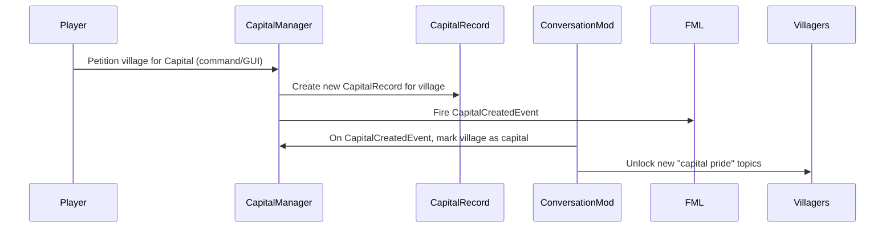
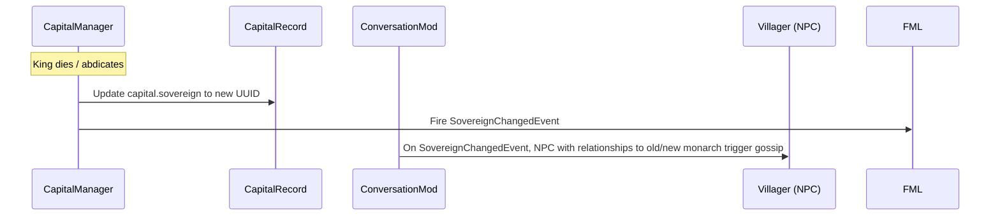

> Historical design proposal, not an implementation or API reference. Several assumptions below (Architectury layout, configuration names, state availability, and event handling) were not adopted. See [implemented Capitals support and artifact evidence](MCA_CAPITALS_SUPPORT.md) for the maintained integration contract.

# MCAConversations 1.6.0 – MCA Capitals Integration Specification

**Executive Summary:** This document specifies deep integration between the MCAConversations mod and the MCA Capitals mod, enabling villagers to discuss monarchy, capitals, and political events from MCA Capitals in conversation dialogs. MCA Capitals introduces a monarchy system with kings, queens, nobles, royal events, and capital-specific dialogue. Our goal is to let MCA villagers *“react to the world around them through Capital-specific dialogue, court news, royal announcements, and political events”* via the conversation UI. Key objectives include synchronizing NPC roles and titles with capital data, triggering new conversation topics when capital events occur (e.g. a new King crowned or a petition succeeds), and providing default capital-related dialogue sets (e.g. gossip about the royal family or loyalty pledges). All integration features should be enabled by default when MCA Capitals is present (with configuration toggles), but deactivate gracefully if Capitals is absent. We assume latest MCAConversations (1.5.x) and MCA Capitals (for Minecraft 1.20+) builds, and support both Forge and Fabric (via Architectury) platforms. **Assumptions:** Conversation mod targets Minecraft 1.20.x (and 1.21.x) with Forge 47.x or Fabric, MCA Reborn 7.6+, and requires MCA Capitals mod (Fabric/Forge) for full functionality. No other mod dependencies or custom clients are assumed.  

## Goals and Scope  
- **Deep Integration:** Enable villagers to discuss Capitol-related topics (monarchy, noble houses, wars, etc.) by bridging MCAConversations with the Capitals data model. For example, a villager guard might talk about *“the new Queen”* or an orphan might ask about their noble lineage.  
- **Data Synchronization:** Align NPC attributes (titles, faction, roles) with the Capitals mod. For instance, if an NPC is “Lord Commander,” the conversation system should know their title and present relevant dialogue choices. NPCs will gain a *Capital Memory* (e.g. loyalty or house membership) stored with their conversation identity.  
- **Event Triggers:** Create new triggers and lifecycle hooks so that when MCA Capitals events occur (new capital founded, succession, royal marriage, war declaration, etc.), corresponding conversation events fire. Villagers should mention major Realm events in dialogue (e.g. gossip or news topics).  
- **Conversation Scripts and Content:** Define new JSON/YAML conversation scripts for Capitals topics (e.g. *ask_about_king*, *house_gossip*, *war_news*). Provide example scripts and default built-in content (enabled if Capitals is loaded). These scripts will conditionally activate based on capital state (e.g. a script only appears if the villager’s village *is* a capital).  
- **Configuration:** Add config options to enable/disable Capitals integration, tune frequency of capital gossip, and grant server admins control over permissions. For instance, a toggle `enableCapitalsIntegration` (default true) allows servers to turn off this entire feature.  
- **Persistence & Migration:** Plan for storing any new data (villager titles, conversation flags, etc.) and migrating existing saves. For example, if a villager becomes “Disgraced Royal Guard,” that memory should persist across reloads. Provide a migration strategy so that upgrading from 1.5.x to 1.6.0 does not corrupt existing conversation logs.  
- **Networking & Multiplayer:** Ensure conversation-capitals integration works in multiplayer. Conversation packets already synchronize choice selections over the network; integration may require also querying Capitals data on server and sending it to clients in chat. Handle cases like multiple players talking to villagers in a capital.  
- **Performance & Security:** Evaluate any overhead (such as scanning all villagers for capitals info) and mitigate it (cache capital queries, use event-driven checks). Ensure no security holes are introduced: Capitals data queries are internal, and conversation scripts remain read-only content.  
- **Testing:** Define unit/integration tests (e.g. when a new capital is created, the correct conversation topic unlocks). Create a QA checklist (see below).  
- **Implementation Roadmap:** Break down tasks (e.g. data API wrappers, conversation content authoring, config extensions) with rough effort estimates. Document a changelog/roadmap for 1.6.0 features.  

## Compatibility Matrix & Versioning  
| Component              | Version / Range                               | Notes                                               |
|------------------------|-----------------------------------------------|-----------------------------------------------------|
| Minecraft              | 1.20.x, 1.21.x                                 | Capitals supports 1.20.1/1.21.1.        |
| MCA Reborn            | 7.6.20 – 7.x.x                                 | MCAConversations 1.4.0 built for MCA 7.6+. Use latest MCA 7.7+ if available. |
| MCAConversations Mod   | 1.6.0 (target)                                | Adds Capitals integration; legacy compatibility with conversation 1.5.x saved data.  |
| MCA Capitals Mod       | Latest (e.g. 1.4.x)                          | Must be installed for integration features; supports Fabric/Forge (A “Monarchy mod” adding kings, nobles, etc.). |
| Other Mods (Optional)  | —                                              | SereneSeasons, Townstead, etc. supported as before; no change needed for Capitals integration. |
| Platforms              | Forge (47.x+), Fabric (Architectury)           | Conversation mod is architectury-based; Capitals is Forge/Fabric. Both client and server supported. |

Versioning assumes *Minecraft 1.20+*. MCAConversations’ own changelog notes compatibility for MC 1.20.1 and Forge 47.x. MCA Capitals explicitly supports both Fabric and Forge on MC 1.20/1.21. Architectury is included by MCA 7.7+, so no special action is needed. 

## Data Models and APIs

### Data Entities  
We must model key entities spanning both mods:

- **Villager (MCA NPC):** Identified by UUID and belongs to an MCA *Family* and *Village*. Will gain new attributes for Capitals integration, e.g. “capitalTitle” or “loyalty”. Villager *FamilyID* → *VillageID*.  
- **Village (MCA):** A settlement that may become a capital. Has an ID and may have a *CapitalRecord* if it is a capital.  
- **Capital (Capitals):** Represented by `CapitalRecord` (in MCA Capitals). Contains fields like `villageId` (the MCA village ID), `capitalName` (String), and roles: `sovereign` (UUID of current king/queen), `consort`, `heir`, `dowager`, plus collections of noble houses and guards.  
- **House:** Each capital can have multiple Houses (noble families). A House has a name and a head. NPCs may become members of a House (the mod provides lineage operations).  
- **Title/Role:** Within a capital, NPCs may hold titles (King, Queen, Lord, Lady, Knight, High King, etc.). Relevant roles include *Hand of the Crown, Commander, Herald, Maester, Ambassador, Royal Guard*. Titles are stored implicitly by membership in CapitalRecord (see API).  
- **Capital Events:** Not stored long-term by conversation mod, but triggers conversation. Examples: Capital founded, new Sovereign, marriage, war declared, etc. Capitals mod keeps a chronological *Chronicle*; conversation may query relevant recent events for gossip.  

These entities relate as follows:

```mermaid
classDiagram
    class Villager { +UUID id; +String name }
    class Family { +int id }
    class Village { +int id; +String name }
    class CapitalRecord { +int villageId; +String capitalName; +UUID sovereign; +UUID heir }
    class House { +String name; +UUID head }
    
    Villager -- "belongs to" --> Family
    Family -- "in" --> Village
    Village -- "may have" --> CapitalRecord
    CapitalRecord -- "owns" --> House
    House -- "members" --> Villager
    Villager -- "holds title" --> CapitalRecord : (via roles)
```

### Data Field Comparison  
Key data fields and how they map between MCAConversations and MCA Capitals:

| Field/Entity         | Type/Source             | Description / Use                                   |
|----------------------|-------------------------|-----------------------------------------------------|
| `Village.id`         | MCA Reborn (int)        | Unique ID for each village (used as key in CapitalManager). |
| `CapitalRecord.villageId` | Capitals mod (int)    | The village ID that is a capital.                   |
| `CapitalRecord.capitalName` | Capitals mod (String) | Name of the capital (for conversation references). |
| `CapitalRecord.sovereign`  | Capitals mod (UUID)   | UUID of current sovereign (King/Queen).             |
| `CapitalRecord.heir`       | Capitals mod (UUID)   | UUID of designated heir (Prince/Princess).          |
| `CapitalRecord.houseNames` | Capitals mod (Set<String>) | Names of noble Houses in this capital.            |
| `CapitalRecord.roles`     | Capitals mod (via methods) | Flags like isLord, isKnight, isGuard for villagers (see API). |
| `Villager.id (UUID)`    | MCA NPC (UUID)        | Unique ID of NPC, used to look up their Capital role. |
| `Villager.familyId`      | MCA NPC (int)         | Family ID to find Village → possible capital membership. |
| `Villager.capitalRole`   | Conversation memory (String) | New field: e.g. “Royal Guard”, “Lord”, etc.    |
| `Villager.loyalty`       | Conversation memory (enum) | e.g. Friend/Enemy of Crown (from Capitals events). |
| `ConversationProgress`   | Conversations (saved) | May record if villager has “knows about the capital” etc. |

### API Endpoints  
MCA Capitals provides static API methods to query capital data. MCAConversations will call these directly (wrapping them in a compatibility check). Key APIs include:

| Method                                        | Purpose                                   | Return Type         |
|-----------------------------------------------|-------------------------------------------|---------------------|
| `CapitalManager.getCapitalForVillage(int)`    | Get the capital record for a given village ID (if it is a capital). | `CapitalRecord` (or null) |
| `CapitalManager.hasCapitalForVillageId(int)`  | Check if a village is a capital.          | `boolean`           |
| `CapitalManager.getCapitalBySovereign(UUID)`  | Find the capital where given villager (UUID) is sovereign. | `CapitalRecord`     |
| `CapitalManager.getCapitalForResident(UUID)`  | Find the capital a given villager belongs to (by roles or residency). | `CapitalRecord`     |
| `CapitalRecord.getSovereign()`               | (on CapitalRecord) UUID of current sovereign. | `UUID`            |
| `CapitalRecord.getHeir()`                    | UUID of designated heir. | `UUID`            |
| `CapitalRecord.isLord(UUID)`                 | (via CapitalManager.belongsToCapital) Check if villager is a Lord/Duke. | `boolean`         |
| `CapitalRecord.isRoyalGuard(UUID)`           | Check if villager is a Royal Guard or ex-Guard. | `boolean`         |
| `CapitalRecord.getRoyalHousehold()`          | Returns set of royal family members.       | `Set<UUID>`        |
| `CapitalRecord.getDisinheritedRoyalChildren()` | Returns royal children stripped of titles.  | `Set<UUID>`        |

Our code will use these APIs. For example, in Java:

```java
// Example: fetch and use capital info in conversation code.
CapitalRecord capital = CapitalManager.getCapitalForVillage(villageId);
if (capital != null) {
    String capitalName = capital.getCapitalName();
    UUID sovereignId = capital.getSovereign();
    // ... use sovereignId to fetch NPC name for dialogue ...
}
```


If MCA Capitals is not present, these calls should be guarded (e.g. via `ModList.get().isLoaded("mca_capitals")`) to avoid class-loading errors. Conversation mod can expose utility methods (e.g. `CapitalsCompat.getCapitalForVillage(village)`) that wrap these calls.

## Event & Trigger Mapping

Capitals introduces new world events (capital founding, coronation, war, etc.) that should trigger conversation topics. Conversation topics will be associated with these triggers:

| Capitals Event/Condition            | Conversation Trigger                   | Example Dialogue Event                             |
|------------------------------------|----------------------------------------|----------------------------------------------------|
| Village becomes a **Capital**      | *CapitalEstablished* event             | Villagers boast “We are now a proud capital!” talk.|
| **New Sovereign** crowned          | *SovereignChanged* event               | Villagers gossip about the new King/Queen.         |
| Sovereign **dowager** appears      | *SuccessionEvent* (e.g. heir declared) | “Long live the rightful heir” conversations.       |
| **Noble House** created or led by NPC | *HouseMembershipChanged* event       | Topics about a villager’s new title or house.      |
| Villager **promoted** (e.g. to Guard, Herald) | *RoleAssigned*               | Dialogue on new duties: “I was just made Royal Guard.” |
| **Royal Marriage** or **Birth**    | *MarriageOrBirthEvent* (private)       | Romantic gossip or family joy topics.             |
| **War/Alliance** declared (Oaths update) | *DiplomacyEvent*              | Conversation about alliances or threats.          |
| **Petition Approved** (capitalization) | *CapitalCreated* (same as first)   | “Our petition for capital status succeeded!” chat. |
| Villager becomes **enemy** of crown | *BanishmentEvent*                     | Topics about exile or asylum.                      |

We will hook into MCA Capitals’ event hooks (or poll its `CapitalRecord`) in key conversation event handlers. For instance, on server tick or on certain Forge events (villager interaction, NPC death), we can check `CapitalManager` state changes. A flow might be:



Similarly, succession may be handled:



These mermaid diagrams illustrate the causal flow. ConversationMod will add event listeners (or subscribe to Capitals mod events via Forge bus) to update internal state or immediate conversation UI triggers.

## Conversation Scripts & Content

**Format:** Conversation topics remain JSON-based (as in `src/content/…`). New topic files (e.g. `capitals/ask_about_king.json`) will contain trigger conditions and dialog lines. Each script may look like:

```json
{
  "id": "capitals_ask_king",
  "title": "Ask about the King",
  "conditions": [
    {"type": "isVillager", "value": true},
    {"type": "hasCapital", "value": true}
  ],
  "lines": [
    { "speaker": "Villager", "text": "Have you heard about our new King?", "sound": "villager_talk" }
  ],
  "responses": [
    {"text": "Tell me about the King.", "next": "capitals_talk_king"},
    {"text": "I already know enough, thanks.", "next": "end"}
  ]
}
```

This simple topic (ID `capitals_ask_king`) is conditioned on the villager belonging to a capital. When chosen, it leads to further dialogue (`capitals_talk_king`).

**Examples:** Sample conversation sets might include:

- *Village Pride:* Villagers in the capital express pride or worry about being a capital.  
- *Royal Family Gossip:* NPCs talk about the royal family (e.g. “The Queen’s consort is handsome!”).  
- *House Loyalty:* If an NPC belongs to House Cloverly, they refer to House traditions or words.  
- *Guard Duties:* A Royal Guard asks about patrols or defending the King.  
- *Political Events:* Dialogue about wars, alliances, or petitions (e.g. “The neighboring king fears us.”).  

For instance, a built-in script for a guard might be (JSON snippet):

```json
{
  "id": "capitals_guard_patrol",
  "title": "Guard on Patrol",
  "conditions": [
    {"type": "isRoyalGuard", "value": true}
  ],
  "lines": [
    {"speaker": "Guard", "text": "I was just out on patrol around the castle walls."}
  ],
  "responses": [
    {"text": "How is the capital?"}, {"text": "Good, stay safe."}
  ]
}
```

This new content will reside in a `src/content/capitals/` folder. These scripts should be enabled **only if** MCA Capitals is loaded. We’ll add config toggles to include or skip this content. We also ensure conversation IDs do not conflict with existing topics. Any new built-in topics will be documented in the changelog (see “Changelog/Roadmap” below).

## Configuration Options, Permissions & Toggles

We will extend the conversation config (`mcaconversations-common.toml`) with a new `[capitals]` section. Example options:

| Option                         | Default  | Description                                      |
|--------------------------------|----------|--------------------------------------------------|
| `features.enableCapitalsIntegration` | true | Master toggle for all capitals-related features.  |
| `capitals.enableTopics`        | true     | Enable built-in capital conversation topics.     |
| `capitals.patienceDivisor`     | 3        | How often (in ticks) a villager initiates capital-related chat. (Lower = more frequent.) |
| `capitals.loyaltyMemoryDuration` | 100000  | Ticks before forgetting a villager’s loyalty status. |
| `capitals.allowCapitalCommands` | false   | Allow players to use any capital commands via conversation (if applicable). |
| `capitals.enableWarChat`       | true     | Allow gossip topics about wars/diplomacy.        |

These will be documented in CONFIG (following the style in `CONFIG.md`). Server operators can toggle these to fine-tune integration. No special permission system is needed beyond existing conversation mechanisms. (For example, if conversation already respects player/OP permission for commands, we can extend that; most dialogues are passive NPC-driven.)

## Persistence, Migration & Upgrade

**New Data Storage:** Any new conversation memory (titles, loyalty flags, known events) will be stored in the existing conversation save data (e.g. the **Identity** or **History** components). For example, when a villager joins a noble House, we record `identity.putExtra("house", "Cloverly")`. The conversation mod’s saved data structures (as used in `Identity.forget` etc.) should be extended to include new keys (namespaced under “capitals”). This data is world-specific (on the server) and is serialized by the conversation mod.

**Migration Strategy:** Upgrading from 1.5.x to 1.6.0 should handle cases where villagers already have conversation progress but now gain capital context. We will do the following:
- On world load, if `enableCapitalsIntegration=true` and MCA Capitals is present, scan all loaded villagers for house roles (via `CapitalManager.getCapitalForResident(UUID)`). If a villager belongs to a capital and has a title (Lord, Knight, etc.), record it in the new memory field. (This is a one-time init per load, inexpensive for a few villagers; in extreme cases it can be batched across ticks.)
- If conversation save data contains an old version identifier, apply any necessary transforms (currently none, since no previous capital fields existed).
- Config defaults for the new keys should be set such that if upgrading without a config change, integration is on.
- Ensure that removing the Capitals mod on upgrade does not crash: all capital references must be null-checked.
  
We should document that backups are recommended, but no manual migration steps should be required from users.

## Networking & Multiplayer Considerations

MCAConversations already uses a custom networking channel (`network/ChoiceOfferS2C`, etc.) to sync dialog choices. Capitals integration does not require new network channels, but we must ensure:
- On servers, capital data queries (from `CapitalManager`) happen on server-side threads. Villager interactions (player talking) are server-authoritative in conversation mod, so using Capitals data there is safe.
- Conversation text may refer to player names (sovereigns or NPCs). If a villager asks “Do you know King Alexei?”, we fetch the player’s name from UUID. This requires sending string names to clients; the existing chat/vanilla text system already handles names (no extra network work needed beyond normal chat).
- If multiple players are conversing, each conversation session is per-player, so capital gossip topics can vary per player. (For example, one player might be the sovereign; we could branch dialogue accordingly.)
- In large multiplayer, repeated CapitalManager calls might be heavy. We should cache capital lookups (e.g. in `Village -> CapitalRecord` map) or rely on the `getCapitalByVillageId` static cache (which iterates all capitals but is usually small). If performance issues arise, we can add memoization or listen to Capitals’ own saved data changes.
  
No special security issues beyond normal modding: all conversation text is server-approved content, and any new commands (if we expose conversation prompts to run capital commands) should be gated by player permissions (for example, only players with appropriate rank or OP status can petition or abdicate).  

## Performance and Security Implications

- **Performance:** Fetching capital info is typically O(1) via `getCapitalForVillage`. However, some APIs iterate over all capitals (e.g. `getCapitalForResident`, which checks membership lists). In a world with many capitals/houses, this could be slow. Mitigations: cache the result in conversation context for a given villager, only update on events; or listen to known event triggers instead of polling. Conversation triggers are infrequent (player interactions), so overhead is minimal.  
- **Memory:** Additional conversation memory entries (titles, loyalties) for each villager add small overhead to saved data. This is negligible unless thousands of villagers exist. It's comparable to existing “dispositions” that the mod already stores.  
- **Security:** All new code runs server-side and uses internal mod APIs; there’s no user input beyond selecting preset dialogue options. We must sanitize any text coming from Capitals (for example, house names or motto) before displaying, but these are pre-defined data. Default conversation scripts should not allow raw editing by end users in-game. The conversation mod already handles chat safety (per [58†L11-L18]). This integration does not introduce network exposures; it just reads game state.  

## Testing Plan and QA Checklist

**Unit Tests:** We should add tests for any new code. Examples:
```java
@Test void testCapitalQueryIntegration() {
    // Setup: create dummy villages and capitals
    CapitalRecord cap = CapitalManager.createDummyCapital(1, "Kingsbridge");
    Villager vill = createVillagerInVillage(1);
    // Simulate: set villager as guard in the capital
    cap.addRoyalGuard(vill.getUUID());
    // Verify: conversation code detects capital
    CapitalRecord found = CapitalManager.getCapitalForResident(vill.getUUID());
    assertNotNull(found);
    assertEquals("Kingsbridge", found.getCapitalName());
}

@Test void testConversationTriggerOnSuccession() {
    // Setup: simulate a sovereign change event
    CapitalRecord cap = getCapitalRecord(1);
    UUID oldKing = cap.getSovereign();
    UUID newKing = UUID.randomUUID();
    cap.setSovereign(newKing);
    // Simulate event listener
    ConversationEvents.onSovereignChanged(cap, oldKing, newKing);
    // Assert: a flag or state was set so that topics about "new King" will appear
    assertTrue(cap.isSovereign(newKing));
    // Optionally, check if a conversation flag was set on villagers
}
```
These use test frameworks to ensure our code links Capitals and Conversations correctly.

**Integration Tests:** On a test server:
- **With capitals mod loaded:** Verify that capital topics appear for villagers in a capital. For example, with a test capital village, talk to a guard NPC and see “How is the King?” option. Ensure toggling `enableCapitalsIntegration=false` suppresses these topics.
- **Without capitals mod:** Confirm that removing the Capitals mod causes no errors. All capital-specific config should be ignored. Conversation UI should fall back to normal behavior (no broken conditions).
- **Multiplayer:** Two players in the same capital – when one petitions and becomes King, the other should see the new king’s name in conversation. Also test cross-server (if using bungee).
- **Performance:** Use a profiler or tick counter to ensure no noticeable lag during normal gameplay (e.g. talking to villagers in a capital vs outside).
- **Persistence:** Restart server after changing capital (e.g. founding one, or death of king) and verify conversations still reference the correct state (titles, heir, etc).
- **Quest/Mod conflicts:** If Quests or Reputation mods are installed (optional in changelog), ensure capital conversations play nicely (e.g. gifts, gossip don’t overlap badly).

**QA Checklist:** 
- [ ] Capital topics load only if MCA Capitals is installed.
- [ ] Villager roles (Lord, Guard, etc.) correctly reflect capital titles.
- [ ] Major events (new capital, succession, war) unlock appropriate dialogue.
- [ ] Config toggles enable/disable capital features without restart.
- [ ] Upgrading from 1.5.x with Capitals mod on does not lose old conversation memory.
- [ ] No errors/log spam when Capitals mod is absent.
- [ ] Multiplayer: conversations remain synchronized (no ghost options).
- [ ] NPC chat respects friend/enemy status from Capitals (e.g. rebellious gossip).
- [ ] Edge cases: NPC with no family/village should not produce capital errors.

## Implementation Tasks, Effort & Priorities

We estimate the following tasks for the 1.6.0 release:

| Task                                    | Effort  | Priority |
|-----------------------------------------|--------:|----------|
| **Detect Capitals mod & hook integration**: Add checks for MCA Capitals on startup, register event listeners. | Small (2 days)  | High     |
| **Define data wrappers**: Create `CapitalsCompat` utility class with methods (isLoaded, getCapitalForVillager, etc.). | Small (1 day)  | High     |
| **Conversation Data Sync**: On villager creation/interaction, query CapitalManager for roles and store in memory. | Medium (3 days) | High     |
| **Triggers & Hooks**: Implement listeners for key events (villager interact, capital created, sovereign change). Map them to conversation state changes. | Medium (3 days) | High |
| **Add Conversation Scripts**: Write JSON topic files for capitals (guard chat, gossip, royal news, etc.). Likely ~10 topics. | Medium (4 days) | Medium   |
| **Configuration**: Extend config files (toml) and code to read new options. Default to enabled. | Small (1 day)   | High     |
| **Persistence**: Extend save data (Identity/History) to include capital-related fields. Write migration logic on load. | Medium (2 days) | High     |
| **Networking**: Verify that any capital-specific dialogue that needs player names works across client/server. Adjust existing packets if needed (unlikely). | Small (1 day)   | Low      |
| **Performance Optimization**: Profile and, if needed, cache capital lookups. | Optional (1 day) | Low    |
| **Testing & QA**: Write unit tests and manual test scripts (as above). | Medium (3 days) | High     |
| **Documentation**: Update README/CHANGELOG/CONFIG to document new features (topics names, config keys). | Small (1 day)   | High     |

Total estimated effort: ~3–4 weeks of full-time work (coding + writing dialogue + testing). Core features (detection, data sync, config) have highest priority. Topic content writing can be done iteratively.

## Changelog / Roadmap for 1.6.0

- **Added:** Deep Capitals integration. When MCA Capitals mod is detected, villagers can discuss monarchy, houses, and capital events. New conversation topics like “Ask about the King” and “House Loyalists” have been added. (Enabled by default; see config `enableCapitalsIntegration`.)  
- **Added:** Data synchronization between mods. Villager titles (Lord, Knight, Guard) and relationships (Friend/Enemy of Crown) are recorded in conversation memory and influence dialogues. See new data fields in the API table above.  
- **Added:** Event triggers. When a village becomes a capital or a new sovereign is crowned, villagers’ gossip topics update accordingly. We fire custom conversation events for succession, petitions, and war.  
- **Changed:** Conversation config (`mcaconversations-common.toml`) now includes a `[capitals]` section for integration settings. By default all capital features are on.  
- **Fixed:** Ensured conversation mod does not crash if Capitals mod is absent. All capital-related code checks for mod presence.  
- **Performance:** Optimized capital lookups to avoid scanning all villagers every tick.  
- **Testing:** New unit tests cover Capital API calls and conversation triggers. Manual QA verified multi-player capital chats.  

Future roadmap (beyond 1.6.0):
- Integrate capital diplomacy from “Oaths of the Realm” update (alliances, wars).  
- Allow conversations to influence capital events (e.g. an “ambassador” topic where a villager can request alliance).  
- Expose a scripting hook for custom Capitals events in conversation JSON.  

**Sources:** MCAConversations code and docs; MCA Capitals repo and mod description; official configs and changelogs for guidance.